# 第三章：Soft-RoCE (RXE) 介绍

接下来的章节，我们准备在实验环境中通过抓包分析RDMA的通信细节，以深入理解RDMA。我没有IB和RoCE的硬件环境，因此需要用软件模拟出一个可以测试RDMA verbs的环境。本章介绍Soft-RoCE以及linux内置的各种RDMA发包工具。

## 3.1 soft-RoCE定位与背景

Soft-RoCE 的正式名称是 RXE（Soft RDMA over Converged Ethernet），是一个纯软件实现的 RoCEv2 协议栈，运行在普通以太网网卡上，无需任何 RDMA 专用硬件支持。

它最早由 Bob Pearson 等人于 2008 年在 SystemFabricWorks 开发，2016 年随 Linux 内核 v4.8 合并进主线，Ubuntu 18.04 及之后的版本均可开箱使用，无需额外安装内核模块。

RXE 的设计目标是为没有 HCA 硬件的开发者提供完整的 RDMA verbs 开发与测试环境，同时也适用于协议研究、教学以及 CI/CD 流水线中的 RDMA 功能验证。

---

## 3.2 相关目录/文件解释



图中展示了 soft-RoCE 在 Linux 系统中运行涉及的两条并行的路径：

- 左侧是数据平面（verbs 操作，create_qp / post_send 等）
- 右侧是管理平面（设备查询、连接管理）

两条路径在内核里汇聚到 rdma_rxe.ko。图中的调用链揭示了 Soft-RoCE 的本质：整条路径没有任何硬件卸载，所有的 RDMA 语义全部由 rdma_rxe.ko 在 CPU 上以软件方式完成，数据包同样要经过完整的内核 IP 栈和 udp_tunnel.ko 封装，才能从普通网卡发出。

这与真实 HCA 的根本差异在于：硬件 RDMA 卡的 DMA 引擎可以直接将数据从远端内存搬运到本地，绕过 CPU 和内核；而 RXE 做不到这一点，每一个 RDMA 操作都会消耗 CPU 周期，吞吐量和延迟也远不及真实硬件。

但这恰恰是 Soft-RoCE 的设计取舍所在：它的目标从来不是性能，而是在没有任何 IB/RoCE 硬件的条件下，提供一个行为完整、接口兼容的 RDMA 开发和测试环境。

### `/usr/lib/x86_64-linux-gnu/libibverbs/` — Provider 插件库

这里每个 `.so` 对应一种 HCA 厂商或软件实现：

| 文件                       | 对应硬件/实现              |
| -------------------------- | -------------------------- |
| `libmlx5-rdmav34.so`       | Mellanox ConnectX-4/5/6/7  |
| `libmlx4-rdmav34.so`       | Mellanox ConnectX-3        |
| `libbnxt_re-rdmav34.so`    | Broadcom NetXtreme         |
| `libefa-rdmav34.so`        | AWS Elastic Fabric Adapter |
| `libhns-rdmav34.so`        | Huawei HiSilicon           |
| `libirdma-rdmav34.so`      | Intel E810 iWARP/RoCE      |
| `libmana-rdmav34.so`       | Microsoft Azure MANA       |
| `libvmw_pvrdma-rdmav34.so` | VMware PVRDMA              |
| `librxe-rdmav34.so`        | Soft-RoCE                  |

**`-rdmav34` 后缀的含义：** 这是 ABI 版本标记，`34` 表示 libibverbs 的第 34 版 provider ABI。libibverbs 升级时如果改了 provider 接口，这个数字就会变，防止新框架加载旧 provider 导致崩溃。

应用代码完全不知道底层是 rxe 还是 mlx5，这层抽象是 libibverbs 最核心的设计。

---

### `/sys/class/infiniband/` — 设备元数据（sysfs）

```
/sys/class/infiniband/rxe0 -> ../../devices/virtual/infiniband/rxe0/
```

`virtual` 路径说明 rxe0 是软件虚拟设备，真实 HCA 会在 `devices/pci0000:xx/` 下。

这个目录是**只读配置和状态信息**：

```bash
# 端口状态
expert@k8s-61:~$ cat /sys/class/infiniband/rxe0/ports/1/state
4: ACTIVE

# GID 表
expert@k8s-61:~$ cat /sys/class/infiniband/rxe0/ports/1/gids/0
fe80:0000:0000:0000:0250:56ff:fea7:129f
expert@k8s-61:~$ cat /sys/class/infiniband/rxe0/ports/1/gids/1
0000:0000:0000:0000:0000:ffff:0a01:103d

```

libibverbs 调用 `ibv_query_device()` 时，实际上就是读这里的 sysfs 文件，不需要进内核。

---

### `/dev/infiniband/` — 实际的字符设备节点

这里是真正的系统调用入口，应用通过 `open()` + `ioctl()` 与内核交互：

- `uverbs0`（主设备）
- `rdma_cm`（连接管理）

---

## 3.3 安装与配置

**依赖包以及工具包（Ubuntu）：**

```bash
sudo apt update
# RDMA 用户态核心库和工具：libibverbs、librdmacm、
# ib_uverbs udev rules、rdma link 命令支持
sudo apt install rdma-core -y

# libibverbs 附带的基础诊断工具：
# ibv_devices、ibv_devinfo、ibv_asyncwatch 等
sudo apt install ibverbs-utils -y

# RDMA 性能测试工具：
# ib_send_bw、ib_read_bw、ib_write_bw、
# ib_send_lat、ib_read_lat、ib_write_lat 等
sudo apt install perftest -y

# Linux 网络配置工具集，包含 rdma 子命令：
# ip、tc、ss、rdma link add/show 等
# 通常系统已预装，这里确保版本够新
sudo apt install iproute2 -y

# InfiniBand 子网诊断工具：
# ibstat、ibstatus、iblinkinfo、ibping、
# ibnetdiscover、ibdiagnet 等
sudo apt install infiniband-diags -y

# librdmacm 附带的连接管理测试工具：
# rping、rdma_bw、udaddy、mckey 等
sudo apt install rdmacm-utils -y
```

**启用步骤：**

````bash
# 1. 加载模块
sudo modprobe rdma_rxe

# 2. 绑定网卡
sudo rdma link add rxe0 type rxe netdev <dev>

**持久化（重启后自动生效）：**

```bash
# /etc/modules-load.d/rxe.conf
echo 'rdma_rxe' | sudo tee /etc/modules-load.d/rxe.conf

# /etc/rdma/rxe.conf
echo 'ens160' | sudo tee /etc/rdma/rxe.conf
````

---

## 3.4 验证以及查看信息

```bash
# 查看物理链路信息
expert@k8s-62:~$ ip link
1: lo: <LOOPBACK,UP,LOWER_UP> mtu 65536 qdisc noqueue state UNKNOWN mode DEFAULT group default qlen 1000
    link/loopback 00:00:00:00:00:00 brd 00:00:00:00:00:00
2: ens160: <BROADCAST,MULTICAST,UP,LOWER_UP> mtu 1500 qdisc mq state UP mode DEFAULT group default qlen 1000
    link/ether 00:50:56:a7:7d:03 brd ff:ff:ff:ff:ff:ff

# 查看本机 RDMA 设备的物理层和链路层状态
expert@k8s-62:~$ ibstat
CA 'rxe0'
        CA type:
        Number of ports: 1
        Firmware version:
        Hardware version:
        Node GUID: 0x025056fffea77d03
        System image GUID: 0x025056fffea77d03
        Port 1:
                State: Active
                Physical state: LinkUp
                Rate: 10 (FDR10)
                Base lid: 0
                LMC: 0
                SM lid: 0
                Capability mask: 0x00010000
                Port GUID: 0x025056fffea77d03
                Link layer: Ethernet

# 查看 rdma 设备简要信息，来自 iproute2 包的工具
expert@k8s-62:~$ rdma link show
link rxe0/1 state ACTIVE physical_state LINK_UP netdev ens160

expert@k8s-62:~$ rdma dev
0: rxe0: node_type ca node_guid 0250:56ff:fea7:7d03 sys_image_guid 0250:56ff:fea7:7d03

# 来自 libibverbs 包的工具
expert@k8s-62:~$ ibv_devices
    device                 node GUID
    ------              ----------------
    rxe0                025056fffea77d03

expert@k8s-62:~$ ibv_devinfo
hca_id: rxe0
        transport:                      InfiniBand (0)
        fw_ver:                         0.0.0
        node_guid:                      0250:56ff:fea7:7d03
        sys_image_guid:                 0250:56ff:fea7:7d03
        vendor_id:                      0xffffff
        vendor_part_id:                 0
        hw_ver:                         0x0
        phys_port_cnt:                  1
                port:   1
                        state:                  PORT_ACTIVE (4)
                        max_mtu:                4096 (5)
                        active_mtu:             1024 (3)
                        sm_lid:                 0
                        port_lid:               0
                        port_lmc:               0x00
                        link_layer:             Ethernet

expert@k8s-62:~$ ibv_devinfo -v
hca_id: rxe0
        transport:                      InfiniBand (0)
        fw_ver:                         0.0.0
        node_guid:                      0250:56ff:fea7:7d03
        sys_image_guid:                 0250:56ff:fea7:7d03
        vendor_id:                      0xffffff
        vendor_part_id:                 0
        hw_ver:                         0x0
        phys_port_cnt:                  1
        max_mr_size:                    0xffffffffffffffff
        page_size_cap:                  0xfffff000
        max_qp:                         1048560
        max_qp_wr:                      1048576
        device_cap_flags:               0x01223c76
                                        BAD_PKEY_CNTR
                                        BAD_QKEY_CNTR
                                        AUTO_PATH_MIG
                                        CHANGE_PHY_PORT
                                        UD_AV_PORT_ENFORCE
                                        PORT_ACTIVE_EVENT
                                        SYS_IMAGE_GUID
                                        RC_RNR_NAK_GEN
                                        SRQ_RESIZE
                                        MEM_WINDOW
                                        MEM_MGT_EXTENSIONS
                                        MEM_WINDOW_TYPE_2B
        max_sge:                        32
        max_sge_rd:                     32
        max_cq:                         1048576
        max_cqe:                        32767
        max_mr:                         524287
        max_pd:                         1048576
        max_qp_rd_atom:                 128
        max_ee_rd_atom:                 0
        max_res_rd_atom:                258048
        max_qp_init_rd_atom:            128
        max_ee_init_rd_atom:            0
        atomic_cap:                     ATOMIC_HCA (1)
        max_ee:                         0
        max_rdd:                        0
        max_mw:                         524287
        max_raw_ipv6_qp:                0
        max_raw_ethy_qp:                0
        max_mcast_grp:                  8192
        max_mcast_qp_attach:            56
        max_total_mcast_qp_attach:      458752
        max_ah:                         32767
        max_fmr:                        0
        max_srq:                        917503
        max_srq_wr:                     1048576
        max_srq_sge:                    27
        max_pkeys:                      64
        local_ca_ack_delay:             15
        general_odp_caps:
        rc_odp_caps:
                                        NO SUPPORT
        uc_odp_caps:
                                        NO SUPPORT
        ud_odp_caps:
                                        NO SUPPORT
        xrc_odp_caps:
                                        NO SUPPORT
        completion_timestamp_mask not supported
        core clock not supported
        device_cap_flags_ex:            0x1C001223C76
                                        Unknown flags: 0x1C000000000
        tso_caps:
                max_tso:                        0
        rss_caps:
                max_rwq_indirection_tables:                     0
                max_rwq_indirection_table_size:                 0
                rx_hash_function:                               0x0
                rx_hash_fields_mask:                            0x0
        max_wq_type_rq:                 0
        packet_pacing_caps:
                qp_rate_limit_min:      0kbps
                qp_rate_limit_max:      0kbps
        tag matching not supported
        num_comp_vectors:               4
                port:   1
                        state:                  PORT_ACTIVE (4)
                        max_mtu:                4096 (5)
                        active_mtu:             1024 (3)
                        sm_lid:                 0
                        port_lid:               0
                        port_lmc:               0x00
                        link_layer:             Ethernet
                        max_msg_sz:             0x80000000
                        port_cap_flags:         0x00010000
                        port_cap_flags2:        0x0000
                        max_vl_num:             1 (1)
                        bad_pkey_cntr:          0x0
                        qkey_viol_cntr:         0x0
                        sm_sl:                  0
                        pkey_tbl_len:           1
                        gid_tbl_len:            1024
                        subnet_timeout:         0
                        init_type_reply:        0
                        active_width:           1X (1)
                        active_speed:           10.0 Gbps (8)
                        phys_state:             LINK_UP (5)
                        GID[  0]:               fe80::250:56ff:fea7:7d03, RoCE v2
                        GID[  1]:               ::ffff:10.1.16.62, RoCE v2

# 可以看到有两个GID生成：
# - GID 0：等同于 link-local IPv6 地址，由网卡 MAC 地址通过 EUI-64 规则生成；
# - GID 1：这是 IPv4-mapped IPv6 地址，格式是 ::ffff:<IPv4>，对应本机网卡配置的 IPv4 地址 10.1.16.62；
```

---

## 3.5 perftest测试

perftest 是业界标准的 RDMA 性能基准测试套件，下个章节我们会使用 perftest 来发起一个完整的 RDMA 通信并对其进行抓包分析，这里暂先做基础介绍。

实验环境中目前共两台 vm，安装了 soft-RoCE，后续的测试，将 `10.1.16.61` 作为服务端，将 `10.1.16.62` 作为客户端。

```bash
# Write 带宽测试  ib_write_bw -d <dev> --report_gbits
# Read 带宽测试   ib_read_bw -d <dev> --report_gbits
# Send 带宽测试   ib_send_bw -d <dev> --report_gbits

# 服务端
expert@k8s-61:~$ ib_write_bw -d rxe0 --report_gbits

************************************
* Waiting for client to connect... *
************************************
---------------------------------------------------------------------------------------
                    RDMA_Write BW Test
 Dual-port       : OFF          Device         : rxe0
 Number of qps   : 1            Transport type : IB
 Connection type : RC           Using SRQ      : OFF
 PCIe relax order: ON
 ibv_wr* API     : OFF
 CQ Moderation   : 1
 Mtu             : 1024[B]
 Link type       : Ethernet
 GID index       : 1
 Max inline data : 0[B]
 rdma_cm QPs     : OFF
 Data ex. method : Ethernet
---------------------------------------------------------------------------------------
 local address: LID 0000 QPN 0x0011 PSN 0x2c7304 RKey 0x00027c VAddr 0x007ce507def000
 GID: 00:00:00:00:00:00:00:00:00:00:255:255:10:01:16:61
 remote address: LID 0000 QPN 0x0011 PSN 0x94c092 RKey 0x0002df VAddr 0x007e2996cd6000
 GID: 00:00:00:00:00:00:00:00:00:00:255:255:10:01:16:62
---------------------------------------------------------------------------------------
 #bytes     #iterations    BW peak[Gb/sec]    BW average[Gb/sec]   MsgRate[Mpps]
 65536      5000             0.74               0.48               0.000920
---------------------------------------------------------------------------------------

# 客户端发起测试
expert@k8s-62:~$ ib_write_bw -d rxe0 --report_gbits 10.1.16.61
---------------------------------------------------------------------------------------
                    RDMA_Write BW Test
 Dual-port       : OFF          Device         : rxe0
 Number of qps   : 1            Transport type : IB
 Connection type : RC           Using SRQ      : OFF
 PCIe relax order: ON
 ibv_wr* API     : OFF
 TX depth        : 128
 CQ Moderation   : 1
 Mtu             : 1024[B]
 Link type       : Ethernet
 GID index       : 1
 Max inline data : 0[B]
 rdma_cm QPs     : OFF
 Data ex. method : Ethernet
---------------------------------------------------------------------------------------
 local address: LID 0000 QPN 0x0011 PSN 0x94c092 RKey 0x0002df VAddr 0x007e2996cd6000
 GID: 00:00:00:00:00:00:00:00:00:00:255:255:10:01:16:62
 remote address: LID 0000 QPN 0x0011 PSN 0x2c7304 RKey 0x00027c VAddr 0x007ce507def000
 GID: 00:00:00:00:00:00:00:00:00:00:255:255:10:01:16:61
---------------------------------------------------------------------------------------
 #bytes     #iterations    BW peak[Gb/sec]    BW average[Gb/sec]   MsgRate[Mpps]
 65536      5000             0.74               0.48               0.000920
---------------------------------------------------------------------------------------

# MTU在这里是 1024，因为以太网的 MTU 默认为 1500，RDMA需要写自己的 infiniband 包头，所以默认给数据分到 1024
# IB 的 MTU 不是任意值，是固定档位：256 / 512 / 1024 / 2048 / 4096，单位字节

# #bytes = 65536（64KB）
# 每次 RDMA Read 操作传输的数据量，这是 ib_read_bw 的默认 message size

# iterations = 1000
# 总共执行了 1000 次 RDMA Read 操作

# avg_bw = (65536 bytes × 1000 次 × 8 bits) / 总耗时

# MsgRate = 0.000920 Mpps = 920 ops/s
# 每秒完成的 RDMA Read 次数

```

---

## 3.6 pingpong 测试

`libibverbs` 自带最简单的 RDMA 连通性验证工具，可以做 Send/Recv pingpong 测试，主要目的是验证 RDMA 链路是否正常，顺带测延迟。

Send/Recv 是**双边操作**，发送方 post Send，接收方必须提前 post Recv 才能收到，两边都要参与。这和 RDMA Write/Read 的单边语义完全不同。`ibv_rc_pingpong` 验证的其实是整个 Send/Recv 路径是否通，包括 QP 状态机、GID 解析、AH（Address Handle）构建是否正确。

```bash
# RC pingpong 延迟  ibv_rc_pingpong -d <dev> -g 1
# UC pingpong 延迟  ibv_uc_pingpong -d <dev> -g 1
# UDP pingpong 延迟 ibv_ud_pingpong -d <dev> -g 1
# `-g 1` 指定 GID index 1（IPv4-mapped GID）

# 服务端
expert@k8s-61:~$ ibv_rc_pingpong -d rxe0 -g 1
  local address:  LID 0x0000, QPN 0x000015, PSN 0x7a34cd, GID ::ffff:10.1.16.61
  remote address: LID 0x0000, QPN 0x000017, PSN 0x1f739d, GID ::ffff:10.1.16.62
8192000 bytes in 0.63 seconds = 103.78 Mbit/sec
1000 iters in 0.63 seconds = 631.48 usec/iter

# 客户端发起
expert@k8s-62:~$ ibv_rc_pingpong -d rxe0 -g 1 10.1.16.61
  local address:  LID 0x0000, QPN 0x000017, PSN 0x1f739d, GID ::ffff:10.1.16.62
  remote address: LID 0x0000, QPN 0x000015, PSN 0x7a34cd, GID ::ffff:10.1.16.61
8192000 bytes in 0.63 seconds = 103.92 Mbit/sec
1000 iters in 0.63 seconds = 630.65 usec/iter
```

---

## 3.7 rping 测试

`rping` 是 `librdmacm-utils` 包里的工具，专门用来测试 rdma_cm 连通性，类似 RDMA 世界的 `ping`，`rping` 流程比较复杂，每一轮用了 RDMA READ 和 RDMA WRITE 两个操作交替完成。

```bash
# 服务端
expert@k8s-61:~$ rping -s -d rxe0 -v
verbose
created cm_id 0x5617d13d2c20
rdma_bind_addr successful

# 服务端用 rdma_cm 监听，客户端发起连接请求（CONNECT_REQUEST）
# 此时双方各自创建 PD、CQ、QP，注册内存缓冲区，然后完成 ESTABLISHED。
# 这部分是控制平面，走的是 rdma_cm 的 SEND/RECV 交换元数据。
rdma_listen
cma_event type RDMA_CM_EVENT_CONNECT_REQUEST cma_id 0x71fc24000ce0 (child)
child cma 0x71fc24000ce0
created pd 0x5617d13c7810
created channel 0x5617d13c77d0
created cq 0x5617d13d2fb0
created qp 0x5617d13d3110
rping_setup_buffers called on cb 0x5617d13c67c0
allocated & registered buffers...
accepting client connection request
cq_thread started.

# --- 服务端收到客户 SEND 的 rkey + addr
recv completion
Received rkey 2095 addr 5b269382e5e0 len 64 from peer
cma_event type RDMA_CM_EVENT_ESTABLISHED cma_id 0x71fc24000ce0 (child)
ESTABLISHED
# 服务端用收到的 rkey/addr 主动发起 RDMA READ，把客户端内存里的数据读过来
server received sink adv
server posted rdma read req
rdma read completion
server received read complete
server ping data: rdma-ping-0: ABCDEFGHIJKLMNOPQRSTUVWXYZ[\]^_`abcdefghijklmnopqr
# 服务端读完后发一个 SEND 通知客户端
server posted go ahead
send completion
recv completion
# 客户端再把自己的另一块缓冲区地址通过 SEND 发给服务端。
Received rkey 1f86 addr 5b2693822500 len 64 from peer
server received sink adv
# 服务端收到后做 **RDMA WRITE**，把数据写回客户端
rdma write from lkey 1ed5 laddr 5617d13c7780 len 64
rdma write completion
server rdma write complete
# 再发 SEND 通知客户端写完了
server posted go ahead
send completion
# --- 至此一轮完成，本例总共循环了 5 次（`-C 5`）

# --- 第二轮开始
recv completion
Received rkey 2095 addr 5b269382e5e0 len 64 from peer
server received sink adv
server posted rdma read req
rdma read completion
server received read complete
server ping data: rdma-ping-1: BCDEFGHIJKLMNOPQRSTUVWXYZ[\]^_`abcdefghijklmnopqrs
server posted go ahead
send completion
recv completion
Received rkey 1f86 addr 5b2693822500 len 64 from peer
server received sink adv
rdma write from lkey 1ed5 laddr 5617d13c7780 len 64
rdma write completion
server rdma write complete
server posted go ahead
send completion

# --- 第三轮开始
recv completion
Received rkey 2095 addr 5b269382e5e0 len 64 from peer
server received sink adv
server posted rdma read req
rdma read completion
server received read complete
server ping data: rdma-ping-2: CDEFGHIJKLMNOPQRSTUVWXYZ[\]^_`abcdefghijklmnopqrst
server posted go ahead
send completion
recv completion
Received rkey 1f86 addr 5b2693822500 len 64 from peer
server received sink adv
rdma write from lkey 1ed5 laddr 5617d13c7780 len 64
rdma write completion
server rdma write complete
server posted go ahead
send completion

# --- 第四轮开始
recv completion
Received rkey 2095 addr 5b269382e5e0 len 64 from peer
server received sink adv
server posted rdma read req
rdma read completion
server received read complete
server ping data: rdma-ping-3: DEFGHIJKLMNOPQRSTUVWXYZ[\]^_`abcdefghijklmnopqrstu
server posted go ahead
send completion
recv completion
Received rkey 1f86 addr 5b2693822500 len 64 from peer
server received sink adv
rdma write from lkey 1ed5 laddr 5617d13c7780 len 64
rdma write completion
server rdma write complete
server posted go ahead
send completion

# --- 第五轮开始
recv completion
Received rkey 2095 addr 5b269382e5e0 len 64 from peer
server received sink adv
server posted rdma read req
rdma read completion
server received read complete
server ping data: rdma-ping-4: EFGHIJKLMNOPQRSTUVWXYZ[\]^_`abcdefghijklmnopqrstuv
server posted go ahead
send completion
recv completion
Received rkey 1f86 addr 5b2693822500 len 64 from peer
server received sink adv
rdma write from lkey 1ed5 laddr 5617d13c7780 len 64
rdma write completion
server rdma write complete
server posted go ahead
send completion

# 客户端五轮跑完主动断开，服务端收到 RDMA_CM_EVENT_DISCONNECTED，释放资源退出
cma_event type RDMA_CM_EVENT_DISCONNECTED cma_id 0x71fc24000ce0 (child)
server DISCONNECT EVENT...
# 服务端在等最后一个状态机转换
wait for RDMA_READ_ADV state 10
rping_free_buffers called on cb 0x5617d13c67c0
destroy cm_id 0x5617d13d2c20


# 客户端
expert@k8s-62:~$ rping -c -a 10.1.16.61 -C 5 -v
# 每轮起始字母往后移一位，是 rping 故意做的，用来验证每次读到的数据确实是新的，不是缓存
ping data: rdma-ping-0: ABCDEFGHIJKLMNOPQRSTUVWXYZ[\]^_`abcdefghijklmnopqr
ping data: rdma-ping-1: BCDEFGHIJKLMNOPQRSTUVWXYZ[\]^_`abcdefghijklmnopqrs
ping data: rdma-ping-2: CDEFGHIJKLMNOPQRSTUVWXYZ[\]^_`abcdefghijklmnopqrst
ping data: rdma-ping-3: DEFGHIJKLMNOPQRSTUVWXYZ[\]^_`abcdefghijklmnopqrstu
ping data: rdma-ping-4: EFGHIJKLMNOPQRSTUVWXYZ[\]^_`abcdefghijklmnopqrstuv
client DISCONNECT EVENT...
```

---

## 3.8 soft-RoCE 能力边界

| Type / Object              | Support |
| -------------------------- | ------- |
| SEND / RECV                | ✓       |
| RDMA READ                  | ✓       |
| RDMA WRITE                 | ✓       |
| Atomic (CAS / FAA)         | ✓       |
| SRQ (Shared Receive Queue) | ✓       |
| Memory Registration (MR)   | ✓       |
| RDMA CM                    | ✓       |
| Raw Packet QP              | No      |
| ODP (On-Demand Paging)     | No      |
