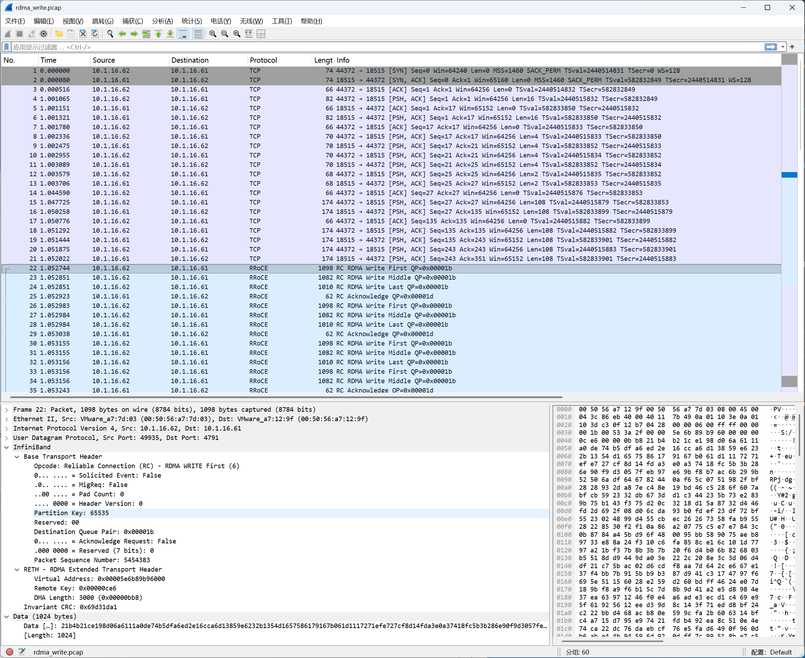
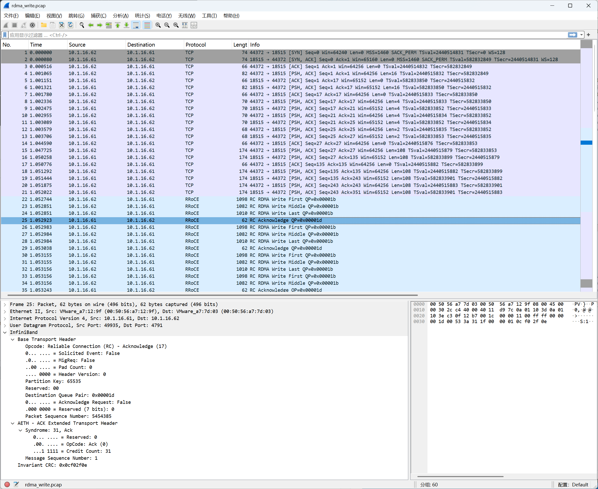
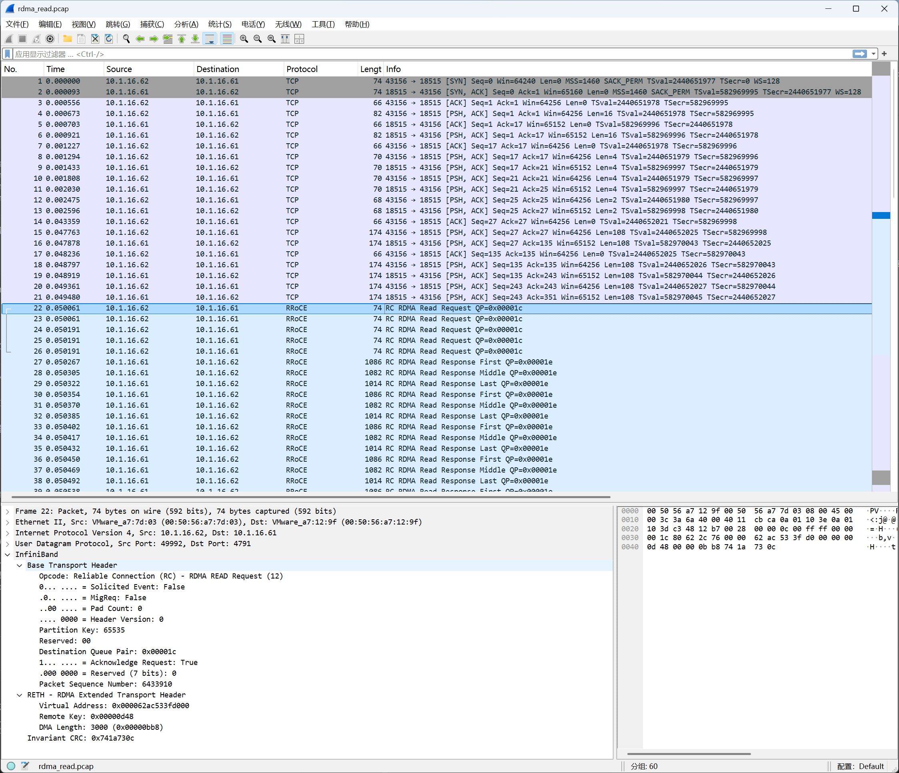
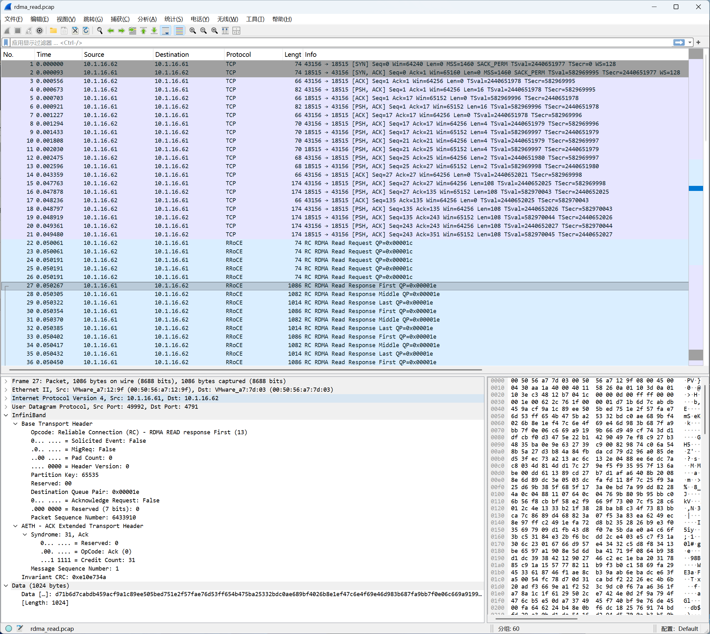
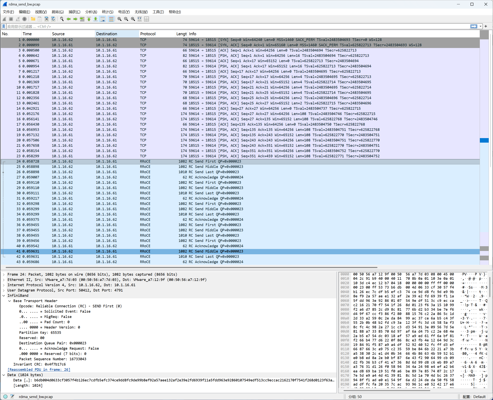
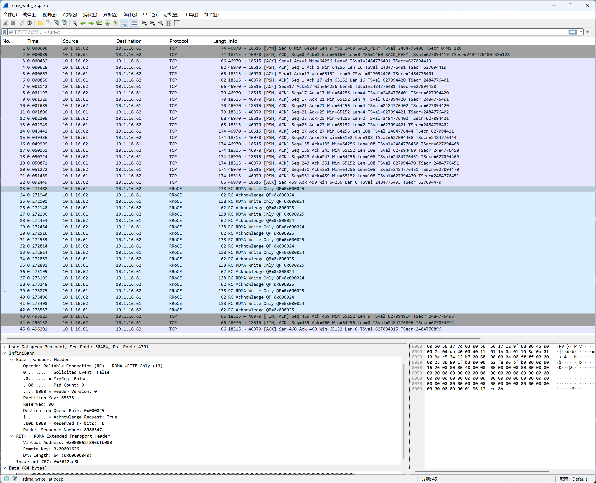
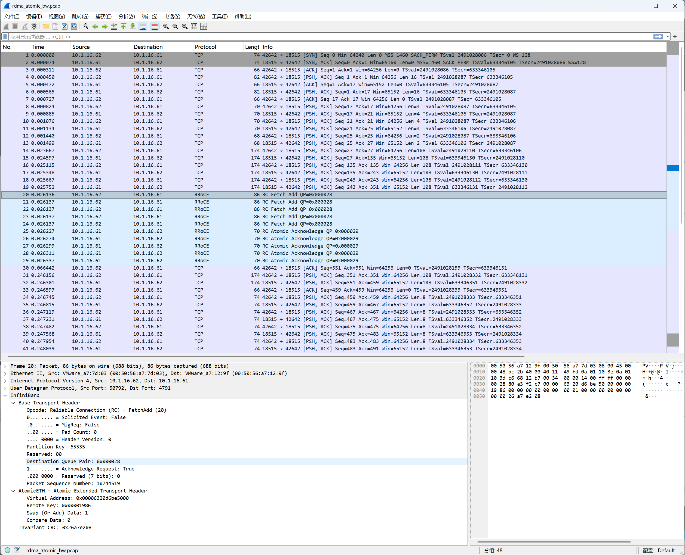

# 第四章: RDMA IB perftest工具 抓包分析

实验环境中目前共两台vm，安装了soft-RoCE，后续的测试，将 `10.1.16.61` 作为服务端，将 `10.1.16.62` 作为客户端。

## 4.1 perftest 工具简介

perftest是专门的性能测试工具，功能完整，是业界标准的 RDMA 性能基准测试套件，网卡厂商（Mellanox/NVIDIA、Intel）的 datasheet 带宽数字基本都是用 perftest 跑出来的。

按操作类型分组：

```
带宽测试（_bw）:
  ib_write_bw      RDMA Write 带宽
  ib_read_bw       RDMA Read 带宽
  ib_send_bw       Send/Recv 带宽
  ib_atomic_bw     Atomic 带宽

延迟测试（_lat）:
  ib_write_lat     RDMA Write 延迟
  ib_read_lat      RDMA Read 延迟
  ib_send_lat      Send/Recv 延迟
  ib_atomic_lat    Atomic 延迟
```

```bash
# 查看版本和完整工具列表
expert@k8s-61:~$ dpkg -L perftest | grep bin
/usr/bin
/usr/bin/ib_atomic_bw
/usr/bin/ib_atomic_lat
/usr/bin/ib_read_bw
/usr/bin/ib_read_lat
/usr/bin/ib_send_bw
/usr/bin/ib_send_lat
/usr/bin/ib_write_bw
/usr/bin/ib_write_lat
/usr/bin/raw_ethernet_burst_lat
/usr/bin/raw_ethernet_bw
/usr/bin/raw_ethernet_fs_rate
/usr/bin/raw_ethernet_lat
/usr/bin/run_perftest_loopback
/usr/bin/run_perftest_multi_devices
```

本章我们将对`ib_write_bw`、`ib_read_bw`、`ib_send_bw`、`ib_write_lat`、`ib_read_lat`、`ib_atomic_bw`进行抓包分析，以深入理解rdma的通信过程。

---

## 4.2 ib_write_bw 抓包分析





[pcap抓包文件](../pcap/rdma_write_bw.pcap)

### 测试环境准备

```bash
# 服务端抓包
sudo tcpdump -i ens160 -w /tmp/rdma_write_bw.pcap 'port 18515 or udp port 4791'

# 服务端
ib_write_bw -d rxe0 --report_gbits -n 5 -s 3000

# 客户端
ib_write_bw -d rxe0 --report_gbits -n 5 -s 3000 10.1.16.61
```

```bash
expert@k8s-61:~$ ib_write_bw -d rxe0 --report_gbits -n 5 -s 3000

************************************
* Waiting for client to connect... *
************************************
---------------------------------------------------------------------------------------
                    RDMA_Write BW Test
 Dual-port       : OFF          Device         : rxe0
 Number of qps   : 1            Transport type : IB
 Connection type : RC           Using SRQ      : OFF
 PCIe relax order: ON
 ibv_wr* API     : OFF
 CQ Moderation   : 5
 Mtu             : 1024[B]
 Link type       : Ethernet
 GID index       : 1
 Max inline data : 0[B]
 rdma_cm QPs     : OFF
 Data ex. method : Ethernet
---------------------------------------------------------------------------------------
 local address: LID 0000 QPN 0x002f PSN 0x16dee RKey 0x00249a VAddr 0x005a00285bf000
 GID: 00:00:00:00:00:00:00:00:00:00:255:255:10:01:16:61
 remote address: LID 0000 QPN 0x0030 PSN 0x45114e RKey 0x002776 VAddr 0x00563d078a8000
 GID: 00:00:00:00:00:00:00:00:00:00:255:255:10:01:16:62
---------------------------------------------------------------------------------------
 #bytes     #iterations    BW peak[Gb/sec]    BW average[Gb/sec]   MsgRate[Mpps]
 3000       5                0.10               0.10               0.004332
---------------------------------------------------------------------------------------


expert@k8s-62:~$ ib_write_bw -d rxe0 --report_gbits -n 5 -s 3000 10.1.16.61
---------------------------------------------------------------------------------------
                    RDMA_Write BW Test
 Dual-port       : OFF          Device         : rxe0
 Number of qps   : 1            Transport type : IB
 Connection type : RC           Using SRQ      : OFF
 PCIe relax order: ON
 ibv_wr* API     : OFF
 TX depth        : 5
 CQ Moderation   : 5
 Mtu             : 1024[B]
 Link type       : Ethernet
 GID index       : 1
 Max inline data : 0[B]
 rdma_cm QPs     : OFF
 Data ex. method : Ethernet
---------------------------------------------------------------------------------------
 local address: LID 0000 QPN 0x0030 PSN 0x45114e RKey 0x002776 VAddr 0x00563d078a8000
 GID: 00:00:00:00:00:00:00:00:00:00:255:255:10:01:16:62
 remote address: LID 0000 QPN 0x002f PSN 0x16dee RKey 0x00249a VAddr 0x005a00285bf000
 GID: 00:00:00:00:00:00:00:00:00:00:255:255:10:01:16:61
---------------------------------------------------------------------------------------
 #bytes     #iterations    BW peak[Gb/sec]    BW average[Gb/sec]   MsgRate[Mpps]
 3000       5                0.10               0.10               0.004332
---------------------------------------------------------------------------------------
```

测试跑完后 Ctrl+C 停止抓包，把 pcap 拷到桌面用 Wireshark 打开。

备注：RRoCE = Routable RoCE，就是 RoCEv2 的另一个叫法。

### BTH 字段解读

```
Base Transport Header (BTH)
  Opcode:                  0x06  RC - RDMA WRITE First
  Solicited Event (SE):    0     ← 不请求对端触发 CQ 事件通知
  MigReq:                  0     ← 当前走主路径，非迁移路径
  Pad Count:               0     ← payload 无需填充字节（已对齐）
  Header Version:          0     ← IB 规范固定为 0
  Partition Key (PKey):    0xFFFF← 默认全局 PKey，表示无限制分区成员
  Destination QP:          0x00001b ← 对端 QP 编号（十进制 27）
  Acknowledge Request (A): 0     ← 不要求对端立即回 ACK
  Packet Sequence Number:  5454383 ← 当前包的序列号，用于排序与丢包检测
```

**逐字段说明：**

**Opcode = RC RDMA WRITE First (6)**：操作码同时编码了 QP 类型（RC）和包在消息中的位置（First）。正是因为带了 First 标记，所以本包携带 RETH；后续的 MIDDLE/LAST 包 opcode 不同，也就不带 RETH。

**Solicited Event = 0**：SE 位置 1 时，对端 RC 层会在接收到该包后向 CQ 投递一个 Solicited 事件，触发等待中的 `ibv_get_cq_event()`。RDMA Write 是单边操作，对端 CPU 感知不到，所以 SE 通常置 0。

**MigReq = 0**：IB 支持 APM（Automatic Path Migration），QP 可预设主/备两条路径，MigReq=1 表示请求对端切换到备用路径。Soft-RoCE 不实现 APM，固定为 0。

**Pad Count = 0**：IB payload 要求 4 字节对齐，若实际数据不足则在 payload 末尾填充 Pad Count 个字节，ICRC 计算时需排除这些填充字节。本包 1024 字节刚好对齐，无需填充。

**PKey = 0xFFFF**：Partition Key 用于 IB 的子网分区隔离（类似 IP 网络里的 ACL 或者 SAN 网络里的 Zone），0xFFFF 是 Full Member 默认值，表示该包属于默认分区，任何也在默认分区的 QP 都可接收。

**Destination QP = 0x1b**：BTH 里只有目标 QPN，没有源 QPN（源 QPN 仅在 UD 类型的 DETH 中出现）。RC 连接建立时双方已互换 QPN，所以 BTH 里单向记录目标即可。

**Acknowledge Request = 0**：A 位置 1 时强制要求对端在收到该包后立即回 ACK。A=0 时对端可以累积多个包后再统一回一个 ACK（累积确认），减少 ACK 报文数量，提升吞吐。

**PSN = 5454383**：发送方维护一个单调递增的 PSN 计数器。接收方用 PSN 检测乱序和丢包——如果收到的 PSN 不连续，就触发 NAK。同一条消息的 FIRST/MIDDLE/LAST 包 PSN 连续递增，与其他消息的包交错时也保持全局单调。

---

### RETH 字段解读及分片原理

由于我们指定了 size 为 3000 字节，而 soft-RoCE 默认的 MTU 为 1024 字节，因此，每次 RDMA Write 会变成 3 个 IB 包：

```
包1  RDMA_WRITE_FIRST   1024字节  带 RETH（VAddr + RKey + DMALen=3000）
包2  RDMA_WRITE_MIDDLE  1024字节  无 RETH
包3  RDMA_WRITE_LAST     952字节  无 RETH（3000 - 1024 - 1024 = 952）
```

```
RETH - RDMA Extended Transport Header
  Virtual Address:  0x00005e6b89b96000  ← 目标端注册内存的起始虚拟地址
  Remote Key:       0x00000ce6           ← 授权令牌，发送方凭此访问对端内存
  DMA Length:       3000 (0x00000bb8)    ← 本次 Write 的总字节数
```

**Virtual Address**：这是 Responder（接收方）MR 的虚拟地址，由 Responder 在建连前通过带外方式（`ibv_reg_mr` 后交换）告知 Initiator。NIC 拿到这个地址后，直接用 RKey 做权限校验，然后将 DMA 写入对应物理页，全程不经过 CPU。

**RKey**：Remote Key 是 `ibv_reg_mr` 返回的访问令牌，绑定了具体的内存范围和访问权限（Read/Write/Atomic）。Responder 的 RDMA 引擎收到包后先验证 RKey 是否合法，再执行 DMA 写入。RKey 可以被 invalidate，一次性使用后失效（用于安全敏感场景）。

**DMA Length = 3000**：RETH 只出现在 FIRST 包，但它携带了整个消息的总长度。这让 Responder 在收到第一个包时就能预分配缓冲区、校验 MR 边界。后续的 MIDDLE/LAST 包不带 RETH，Responder 依靠 PSN 连续性和 DMA Length 推算每个包写入的偏移位置。

---

### ACK AETH 字段解读

```
AETH - ACK Extended Transport Header
  Syndrome: 31, Ack
    Reserved:     0
    OpCode:       Ack (0)      ← 这是正常 ACK，不是 NAK
    Credit Count: 31           ← 还剩31个信用额度
  Message Sequence Number: 1  ← 这是第1条消息的响应
```

**OpCode = Ack** 表示数据正常，如果是 NAK 则会触发重传。

**Credit Count = 31** 表示接收端 QP 上可用的 Receive WR 数量，用于防止 RNR（Receiver Not Ready），它仅对 Send 操作有意义。

rxe 驱动没有完整实现这套流控，返回固定值：31（0x1f，5 bits 全 1） ，表示"接收端 Receive WR 充足"，rxe 用它作为一个占位值，告诉对端不需要担心 RNR，实际上并不动态追踪 WR 消耗情况。

在 RoCEv2 生产环境里，Credit Count 这套 IB 原生流控机制基本不起实质作用，真正的流控靠的是 PFC/ECN/DCQCN。

---

## 4.3 ib_read_bw 抓包分析





[pcap抓包文件](../pcap/rdma_read_bw.pcap)

### 测试环境准备

```bash
# 服务端抓包
sudo tcpdump -i ens160 -w /tmp/rdma_read_bw.pcap 'port 18515 or udp port 4791'

# 服务端
ib_read_bw -d rxe0 --report_gbits -n 5 -s 3000

# 客户端
ib_read_bw -d rxe0 --report_gbits -n 5 -s 3000 10.1.16.61

```

### Read 机制解读

从抓包可以看到 RDMA Read 分两种包：

```
包22-26  RC RDMA Read Request   74字节   62→61   客户端发请求
包27     RC RDMA Read Response First   1086字节  61→62   服务端回数据
包28     RC RDMA Read Response Middle  1082字节
包29     RC RDMA Read Response Last    1014字节
```

**Request 很小（74字节），Response 很大**——这正是 RDMA Read 的特征，请求只是一个"取数据"的指令，数据由被请求方推回来。

```
RDMA Read:
  发起方发 Request（带 RETH：VAddr+RKey+长度）
  被请求方读自己内存 → 推回 Response（带 AETH）
  Response 里的 AETH 承担了两个职责：
    1. 确认这条 Read 请求已完成
    2. 携带流控信用（Credit Count）

包22  Read Request  74字节
      BTH: QPN=0x1c, PSN=6433910
      RETH: VAddr=对端内存地址, RKey=对端密钥, DMALength=3000
      → 客户端说：去帮我把那边地址的 3000 字节取回来
```

然后服务端把3000字节拆成3片（1024 + 1024 + 952）推回来。

```
RDMA Read Response First:   BTH + AETH + Data
RDMA Read Response Middle:  BTH + Data
RDMA Read Response Last:    BTH + AETH + Data
```

Middle 不带 AETH：中间片只是数据搬运，没有新的状态信息需要传递，加 AETH 只会白白浪费 4 字节并增加处理开销。

**对比 RDMA Write 的分片**

```
RDMA Write First:   BTH + RETH + Data   ← RETH 在首包（含VAddr/RKey/总长度）
RDMA Write Middle:  BTH + Data
RDMA Write Last:    BTH + Data          ← 无任何扩展头
```

Write 的 Last 不带任何扩展头，因为单边操作不需要回复。而 Read Response 的 Last 必须带 AETH，因为发起方在等这个完成信号才能释放 Outstanding Read 的槽位。

备注：IB 中的 Outstanding（未完成请求）直译是"悬而未决"，在 IB 语境里指已经发出、但还没有收到最终确认的操作。协议通过 ACK/Credit 机制来收缩这个窗口，防止发送方把接收方淹没。

---

## 4.4 ib_send_bw 抓包分析



[pcap抓包文件](../pcap/rdma_send_bw.pcap)

### 测试环境准备

```bash
# 服务端抓包
sudo tcpdump -i ens160 -w /tmp/rdma_send_bw.pcap 'port 18515 or udp port 4791'

# 服务端
ib_send_bw -d rxe0 --report_gbits -n 5 -s 3000

# 客户端
ib_send_bw -d rxe0 --report_gbits -n 5 -s 3000 10.1.16.61
```

### 头部结构对比分析（Send vs Write）

```
Send First:                      Write First:
  BTH                              BTH
    Opcode: RC SEND First(0)         Opcode: RC WRITE First(6)
    QPN: 0x000023                    QPN: 0x00001b
    PSN: 16733043                    PSN: 5454383
    Ack Request: False               Ack Request: False
  [无扩展头]                         RETH
  Data(1024)                           VAddr: 0x00005e6b89b96000
                                       RKey:  0x00000ce6
                                       DMALen: 3000
                                     Data(1024)
```

**Send 没有 RETH**，这是最本质的差异，因为发送方根本不知道数据要写到对端的哪个地址，这个决定权在接收方，接收方通过 post Recv 时指定的 buffer 来决定数据落在哪里。

网络层面两者几乎一样：都是 RC、都有 ACK、都有 First/Middle/Last 分片、都走 UDP 4791。

真正的差异在主机侧：

```
Write:  接收方 CPU 全程不参与
          发送方指定目标地址(VAddr+RKey)
          数据直接落到对端内存，对端应用不感知

Send:   接收方 CPU 必须提前参与
          必须提前 post Recv，准备好接收 buffer
          数据到了之后 CQ 产生完成事件，应用才知道收到数据
```

这就是为什么 AI 集群里 NCCL 倾向用 Write 而不是 Send，Write 完全绕过对端 CPU，延迟更低，接收方不需要轮询 CQ 来"配合"发送方。

---

## 4.5 ib_write_lat 抓包分析



[pcap抓包文件](../pcap/rdma_write_lat.pcap)

### 测试环境准备

```bash
# 服务端抓包
sudo tcpdump -i ens160 -w /tmp/rdma_write_lat.pcap 'port 18515 or udp port 4791'

# 服务端
ib_write_lat -d rxe0 -n 5 -s 64

# 客户端
ib_write_lat -d rxe0 -n 5 -s 64 10.1.16.61
```

```bash
expert@k8s-61:~$ ib_write_lat -d rxe0 -n 5 -s 64

************************************
* Waiting for client to connect... *
************************************
---------------------------------------------------------------------------------------
                    RDMA_Write Latency Test
 Dual-port       : OFF          Device         : rxe0
 Number of qps   : 1            Transport type : IB
 Connection type : RC           Using SRQ      : OFF
 PCIe relax order: OFF
 ibv_wr* API     : OFF
 Mtu             : 1024[B]
 Link type       : Ethernet
 GID index       : 1
 Max inline data : 0[B]
 rdma_cm QPs     : OFF
 Data ex. method : Ethernet
---------------------------------------------------------------------------------------
 local address: LID 0000 QPN 0x002d PSN 0x6301e RKey 0x002216 VAddr 0x005d43dc924000
 GID: 00:00:00:00:00:00:00:00:00:00:255:255:10:01:16:61
 remote address: LID 0000 QPN 0x002e PSN 0xe5883e RKey 0x00250b VAddr 0x00604c68643000
 GID: 00:00:00:00:00:00:00:00:00:00:255:255:10:01:16:62
---------------------------------------------------------------------------------------
 #bytes #iterations    t_min[usec]    t_max[usec]  t_typical[usec]    t_avg[usec]    t_stdev[usec]   99% percentile[usec]   99.9% percentile[usec]
 64      5          133.68         177.55       138.80                 138.80           5.00            177.55                  177.55
---------------------------------------------------------------------------------------


expert@k8s-62:~$ ib_write_lat -d rxe0 -n 5 -s 64 10.1.16.61
---------------------------------------------------------------------------------------
                    RDMA_Write Latency Test
 Dual-port       : OFF          Device         : rxe0
 Number of qps   : 1            Transport type : IB
 Connection type : RC           Using SRQ      : OFF
 PCIe relax order: OFF
 ibv_wr* API     : OFF
 TX depth        : 1
 Mtu             : 1024[B]
 Link type       : Ethernet
 GID index       : 1
 Max inline data : 0[B]
 rdma_cm QPs     : OFF
 Data ex. method : Ethernet
---------------------------------------------------------------------------------------
 local address: LID 0000 QPN 0x002e PSN 0xe5883e RKey 0x00250b VAddr 0x00604c68643000
 GID: 00:00:00:00:00:00:00:00:00:00:255:255:10:01:16:62
 remote address: LID 0000 QPN 0x002d PSN 0x6301e RKey 0x002216 VAddr 0x005d43dc924000
 GID: 00:00:00:00:00:00:00:00:00:00:255:255:10:01:16:61
---------------------------------------------------------------------------------------
 #bytes #iterations    t_min[usec]    t_max[usec]  t_typical[usec]    t_avg[usec]    t_stdev[usec]   99% percentile[usec]   99.9% percentile[usec]
 64      5          125.87         158.03       140.75                 140.75           14.00           158.03                  158.03
---------------------------------------------------------------------------------------

```

和带宽测试不一样，write 延迟测试是严格的 ping-pong 模式，服务端和客户端都会主动发 Write，一来一回算一个往返延迟。所有数字都是**单程延迟估算值**，perftest 内部用 ping-pong 方式测 RTT，然后除以 2：

```bash
# 以服务端发出第一个write为例：
Server 发出 Write
  → Client 收到（T1 已就绪，开始计时）
  → Client 立刻回写
  → Server 收到后再写
  → Client 收到（T2，停止计时）
RTT = T2 - T1（跨越了 Client回写+Server再写 两段）
单程延迟 = RTT / 2


# 完整序列：
[Server写] → [Client收+回写] → [Server收+再写] → [Client收]
     └──── Server的RTT ────┘
                    └──────── Client的RTT ────────┘
```

**t_min（最小值）**

5 次迭代中耗时最短的那一次。通常代表"最理想状态"——没有 CPU 调度抖动、网络没有排队、缓存都是热的。

**t_max（最大值）**

5 次中耗时最长的那一次。代表"最坏情况"——可能遇到了内核调度延迟、vCPU 被抢占、或网络短暂拥塞。

**t_typical（典型值）**

perftest 的定义是**中位数附近的代表值**，具体取法是排除掉头尾异常值后的中段样本。它比 t_avg 更能反映"大多数请求的真实体感"，因为均值容易被一个极端大值拉偏。

**t_avg（平均值）**

所有迭代的算术平均。样本量越小，越容易被 t_max 这类异常值拉高。这里只有 5 次，所以 t_avg 和 t_typical 的差距能直接暴露是否有异常值存在：

```
Server 端：t_typical=138.80  t_avg=138.80  → 两者相同，说明分布较均匀
Client 端：t_typical=140.75  t_avg=140.75  → 同上
```

两端恰好相等，是因为样本只有 5 个，perftest 在样本极少时 typical 的取法退化成和 avg 一致。

**t_stdev（标准差）**

衡量延迟的**抖动幅度**。stdev 小说明每次延迟都很稳定，stdev 大说明延迟忽高忽低。

```
Server：stdev = 5 μs   → 5次结果比较集中
Client：stdev = 14 μs  → 5次结果离散程度更大，有至少一次明显偏高
```

**99% percentile（P99）**

含义是"**100次里有99次的延迟不超过这个值**"。这是生产环境最常用的 SLA 指标，因为它代表的是"几乎所有请求"的体验上限，而不是偶发最坏情况。

```
Server P99 = 177.55 μs = t_max
Client P99 = 158.03 μs = t_max
```

这里 P99 等于 t_max，是因为样本只有 5 次，百分位数计算没有统计意义，直接退化成最大值。**样本量达到几千次以上，P99 才能和 t_max 真正分离，体现出"偶发尖刺"的分布特征。**

**99.9% percentile（P999）**

含义是"1000次里有999次不超过这个值"，代表极端尾延迟。同样因为样本只有 5 次，这里和 P99 数值相同，无统计意义。

读数据时的优先级建议：

```
功能验证   → 看 t_min，确认链路是通的
日常性能   → 看 t_typical / t_avg，了解正常水位
稳定性     → 看 t_stdev，判断抖动是否可接受
SLA 承诺   → 看 P99 / P999，确认尾延迟是否在可接受范围内
```

---

## 4.6 ib_read_lat 抓包分析

[pcap抓包文件](../pcap/rdma_read_lat.pcap)

### 测试环境准备

```bash
# 服务端抓包
sudo tcpdump -i ens160 -w /tmp/read_lat.pcap 'port 18515 or udp port 4791'

# 服务端
ib_read_lat -d rxe0 -n 5 -s 64

# 客户端
ib_read_lat -d rxe0 -n 5 -s 64 10.1.16.61
```

```bash
expert@k8s-61:~$ ib_read_lat -d rxe0 -n 5 -s 64
---------------------------------------------------------------------------------------
Device not recognized to implement inline feature. Disabling it

************************************
* Waiting for client to connect... *
************************************
---------------------------------------------------------------------------------------
                    RDMA_Read Latency Test
 Dual-port       : OFF          Device         : rxe0
 Number of qps   : 1            Transport type : IB
 Connection type : RC           Using SRQ      : OFF
 PCIe relax order: ON
 ibv_wr* API     : OFF
 Mtu             : 1024[B]
 Link type       : Ethernet
 GID index       : 1
 Outstand reads  : 128
 rdma_cm QPs     : OFF
 Data ex. method : Ethernet
---------------------------------------------------------------------------------------
 local address: LID 0000 QPN 0x002e PSN 0x30d291 OUT 0x80 RKey 0x00235d VAddr 0x005db4238b0000
 GID: 00:00:00:00:00:00:00:00:00:00:255:255:10:01:16:61
 remote address: LID 0000 QPN 0x002f PSN 0x46a844 OUT 0x80 RKey 0x002670 VAddr 0x005f9cee22f000
 GID: 00:00:00:00:00:00:00:00:00:00:255:255:10:01:16:62
---------------------------------------------------------------------------------------

expert@k8s-62:~$ ib_read_lat -d rxe0 -n 5 -s 64 10.1.16.61
---------------------------------------------------------------------------------------
Device not recognized to implement inline feature. Disabling it
---------------------------------------------------------------------------------------
                    RDMA_Read Latency Test
 Dual-port       : OFF          Device         : rxe0
 Number of qps   : 1            Transport type : IB
 Connection type : RC           Using SRQ      : OFF
 PCIe relax order: ON
 ibv_wr* API     : OFF
 TX depth        : 1
 Mtu             : 1024[B]
 Link type       : Ethernet
 GID index       : 1
 Outstand reads  : 128
 rdma_cm QPs     : OFF
 Data ex. method : Ethernet
---------------------------------------------------------------------------------------
 local address: LID 0000 QPN 0x002f PSN 0x46a844 OUT 0x80 RKey 0x002670 VAddr 0x005f9cee22f000
 GID: 00:00:00:00:00:00:00:00:00:00:255:255:10:01:16:62
 remote address: LID 0000 QPN 0x002e PSN 0x30d291 OUT 0x80 RKey 0x00235d VAddr 0x005db4238b0000
 GID: 00:00:00:00:00:00:00:00:00:00:255:255:10:01:16:61
---------------------------------------------------------------------------------------
 #bytes #iterations    t_min[usec]    t_max[usec]  t_typical[usec]    t_avg[usec]    t_stdev[usec]   99% percentile[usec]   99.9% percentile[usec]
 64      5          287.21         379.06       302.23                 302.23           15.00           379.06                  379.06
---------------------------------------------------------------------------------------
```

Read LAT 测试并非 ping-pong 模式，每轮只有 2 个包，客户端发起 read request，服务端响应 read response。

---

## 六、ib_atomic_bw 抓包分析



[pcap抓包文件](../pcap/rdma_atomic_bw.pcap)

### 测试环境准备

```bash
# 服务端抓包
sudo tcpdump -i ens160 -w /tmp/atomic_bw.pcap 'port 18515 or udp port 4791'

# 服务端
ib_atomic_bw -d rxe0 -n 5

# 客户端
ib_atomic_bw -d rxe0 -n 5 10.1.16.61
```

不需要 `-s` 参数，Atomic 操作固定 8 字节，无法指定大小。

```bash
expert@k8s-61:~$ ib_atomic_bw -d rxe0 -n 5
---------------------------------------------------------------------------------------
Device not recognized to implement inline feature. Disabling it

************************************
* Waiting for client to connect... *
************************************
---------------------------------------------------------------------------------------
                    Atomic FETCH_AND_ADD BW Test
 Dual-port       : OFF          Device         : rxe0
 Number of qps   : 1            Transport type : IB
 Connection type : RC           Using SRQ      : OFF
 PCIe relax order: ON
 ibv_wr* API     : OFF
 CQ Moderation   : 5
 Mtu             : 1024[B]
 Link type       : Ethernet
 GID index       : 1
 Outstand reads  : 128
 rdma_cm QPs     : OFF
 Data ex. method : Ethernet
---------------------------------------------------------------------------------------
 local address: LID 0000 QPN 0x0030 PSN 0xad1b0
 GID: 00:00:00:00:00:00:00:00:00:00:255:255:10:01:16:61
 remote address: LID 0000 QPN 0x0031 PSN 0x3660a8
 GID: 00:00:00:00:00:00:00:00:00:00:255:255:10:01:16:62
---------------------------------------------------------------------------------------
 #bytes     #iterations    BW peak[MB/sec]    BW average[MB/sec]   MsgRate[Mpps]
 8          5                0.07               0.07               0.008637
---------------------------------------------------------------------------------------


expert@k8s-62:~$ ib_atomic_bw -d rxe0 -n 5 10.1.16.61
---------------------------------------------------------------------------------------
Device not recognized to implement inline feature. Disabling it
---------------------------------------------------------------------------------------
                    Atomic FETCH_AND_ADD BW Test
 Dual-port       : OFF          Device         : rxe0
 Number of qps   : 1            Transport type : IB
 Connection type : RC           Using SRQ      : OFF
 PCIe relax order: ON
 ibv_wr* API     : OFF
 TX depth        : 5
 CQ Moderation   : 5
 Mtu             : 1024[B]
 Link type       : Ethernet
 GID index       : 1
 Outstand reads  : 128
 rdma_cm QPs     : OFF
 Data ex. method : Ethernet
---------------------------------------------------------------------------------------
 local address: LID 0000 QPN 0x0031 PSN 0x3660a8
 GID: 00:00:00:00:00:00:00:00:00:00:255:255:10:01:16:62
 remote address: LID 0000 QPN 0x0030 PSN 0xad1b0
 GID: 00:00:00:00:00:00:00:00:00:00:255:255:10:01:16:61
---------------------------------------------------------------------------------------
 #bytes     #iterations    BW peak[MB/sec]    BW average[MB/sec]   MsgRate[Mpps]
 8          5                0.07               0.07               0.008637
---------------------------------------------------------------------------------------
```

### 包模式

```
包20-24  5个 RC Fetch Add       86字节   62→61  客户端发操作请求
包25-29  5个 RC Atomic Ack      70字节   61→62  服务端回结果
```

和 Read BW 类似，先把5个请求全部打出去，再收5个响应，是流水线模式不是 ping-pong。

### Fetch Add 请求包解析（包20，86字节）

```
BTH:
  Opcode:  RC FetchAdd (20)
  QPN:     0x000028
  PSN:     10744519
  Acknowledge Request: True        ← 明确要求对端回 ACK

AtomicETH（原子扩展头，28字节）:
  VAddr:   0x00006320d6be5000      ← 目标内存地址
  RKey:    0x00001986              ← 远端访问密钥
  Add Data: 1                      ← 每次加 1
  Compare:  0                      ← Fetch Add 不用这个字段，填0
```

### Compare Data 字段为 0 的含义

AtomicETH 里有两个字段：`Add Data` 和 `Compare Data`，这是因为同一个头部结构同时服务 **Fetch Add** 和 **Compare and Swap** 两种操作：

```
Fetch Add:        Add Data=1, Compare=0（Compare字段忽略）
Compare and Swap: Compare=期望值, Add Data=新值（两个字段都用）
```

`ib_atomic_bw` 默认用 Fetch Add，所以 Compare 填 0。

### Atomic Acknowledge 响应包解析（包25，70字节）

```
BTH:
  Opcode:  RC ATOMIC Acknowledge (18)   ← 专属 opcode，不是普通 ACK

AETH:
  OpCode:     Ack (0)
  Credit Count: 31

ATOMICACKETH（原子 ACK 扩展头，8字节）:
  Original Remote Data: 4179805055496059590  ← 操作前的旧值返回给发起方
```
