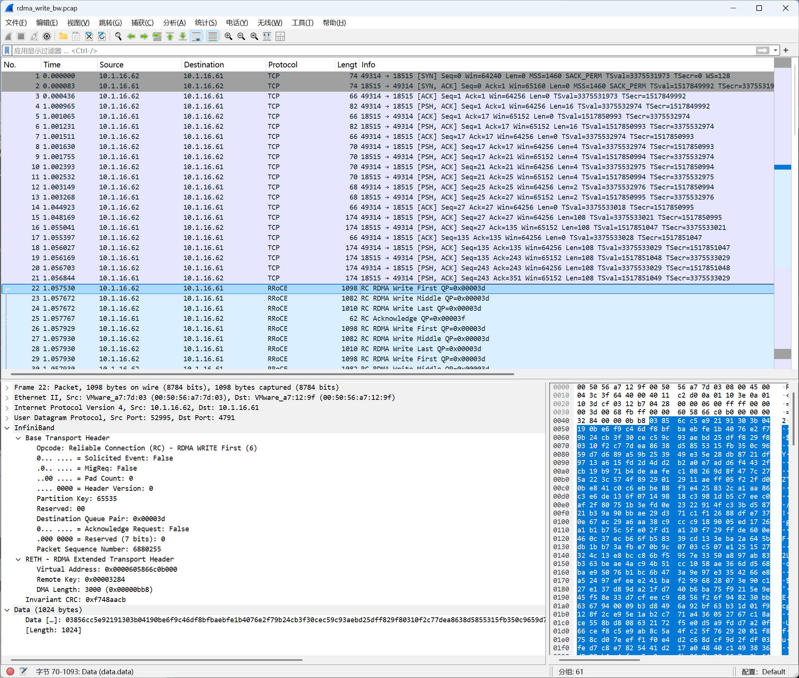
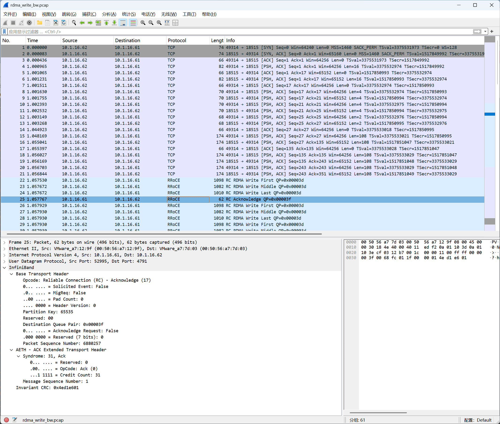
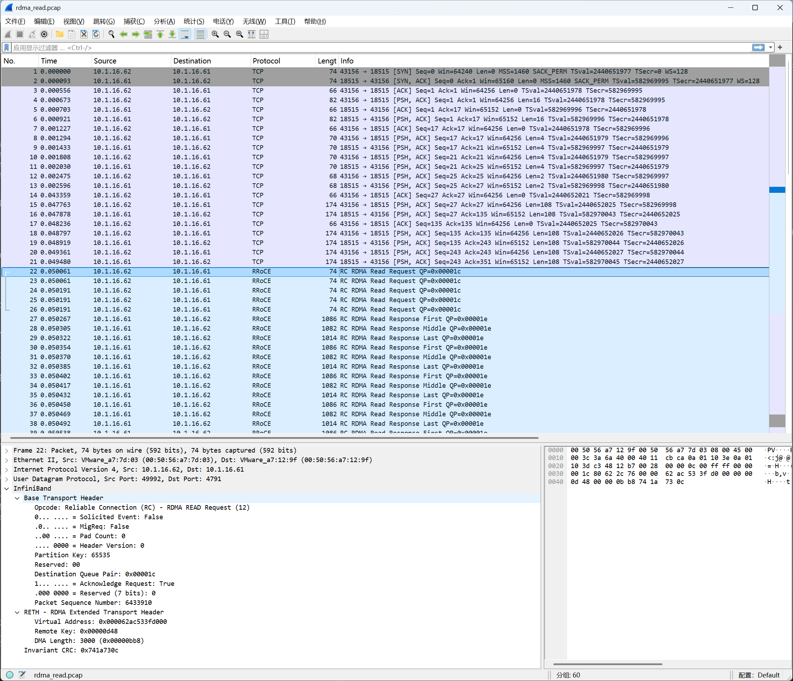
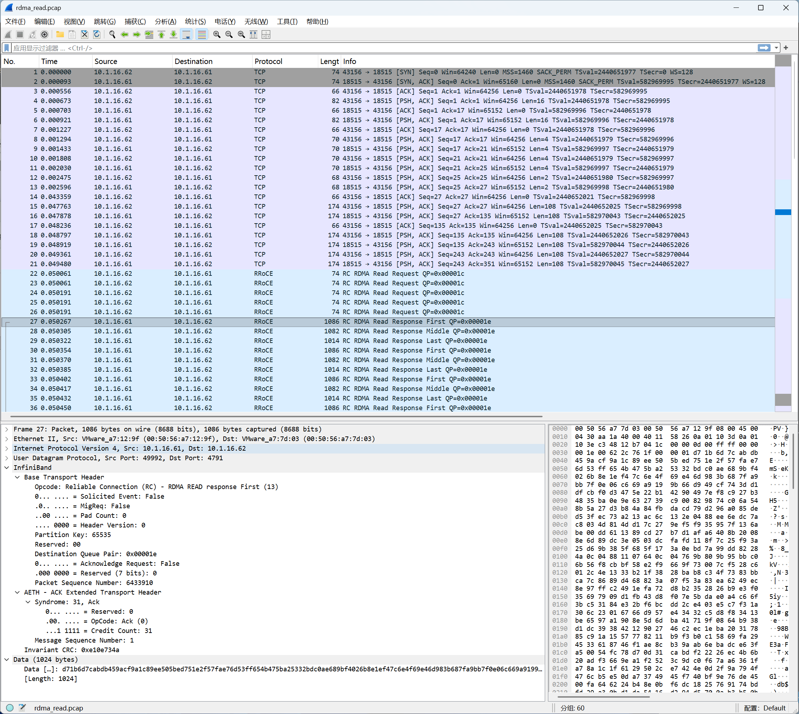
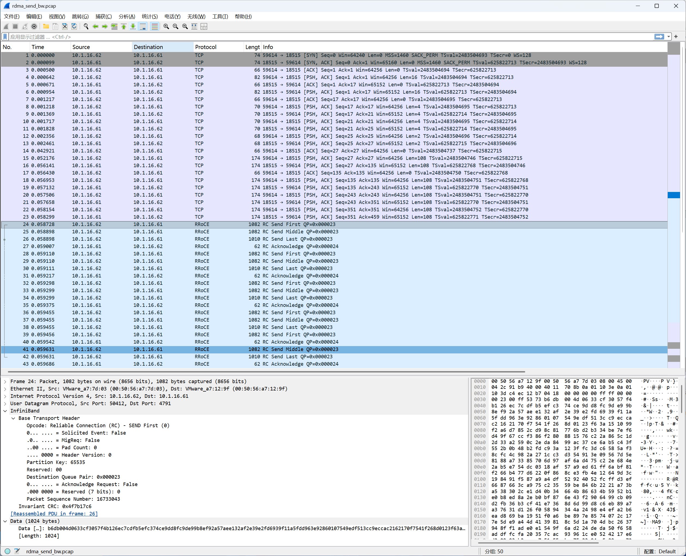
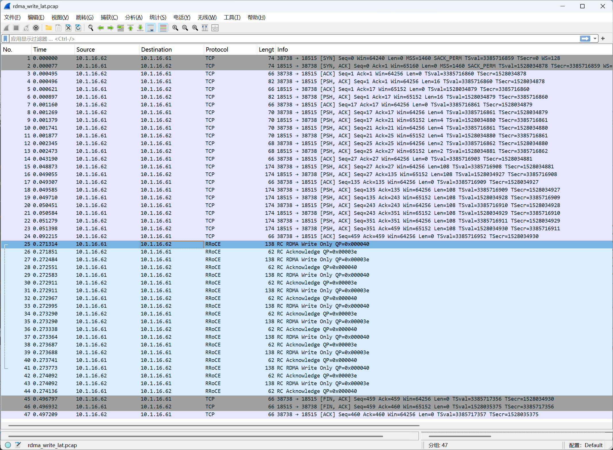
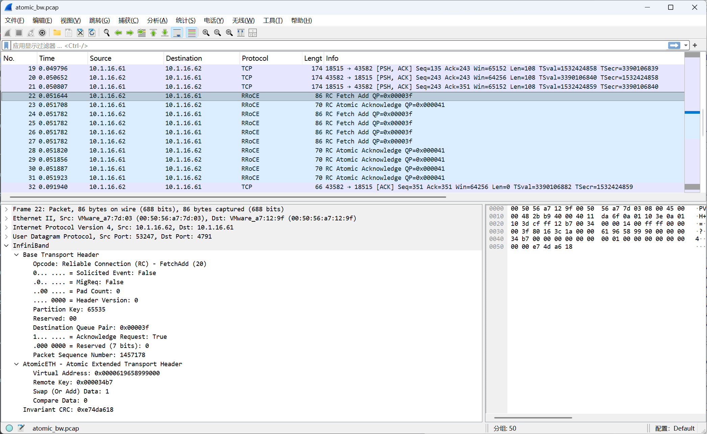
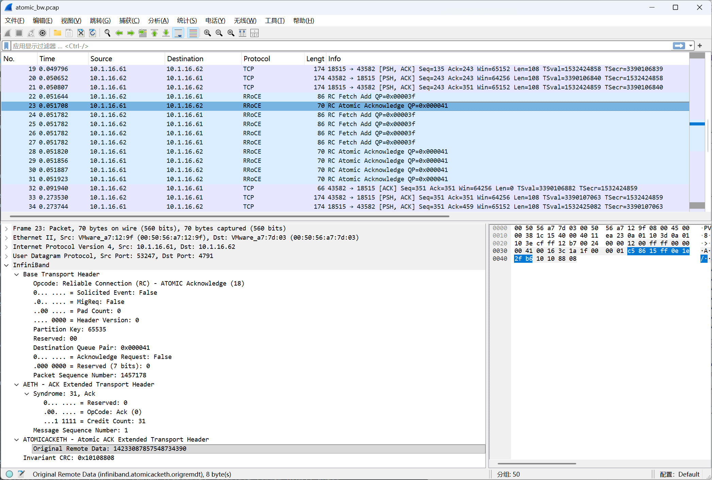

# 第四章: RDMA IB perftest工具 抓包分析

这一章开始，我们采用 RDMA 的标准工具在两台设备之间发起 RDMA 通信，然后抓取数据包进行分析。

实验环境中目前共两台vm，安装了soft-RoCE，后续的测试，将 `10.1.16.61` 作为服务端，将 `10.1.16.62` 作为客户端。

> 由于我手里没有 IB 硬件，因此只能通过 `以太网 + soft-RoCE` 的方式来观测 RDMA。虽然性能指标和现实中的无法对其，但是这样的好处是：任何人都可以用同样的方法，在自己的电脑/服务器上搭建出一模一样的实验环境，对硬件没有任何特殊要求。

## 4.1 perftest 工具简介

perftest是专门的性能测试工具，功能完整，是业界标准的 RDMA 性能基准测试套件，网卡厂商（Mellanox/NVIDIA、Intel）的 datasheet 带宽数字基本都是用 perftest 跑出来的。

按操作类型分组：

```
带宽测试（_bw）:
  ib_write_bw      RDMA Write 带宽
  ib_read_bw       RDMA Read 带宽
  ib_send_bw       RDMA Send/Recv 带宽
  ib_atomic_bw     RDMA Atomic 带宽

延迟测试（_lat）:
  ib_write_lat     RDMA Write 延迟
  ib_read_lat      RDMA Read 延迟
  ib_send_lat      RDMA Send/Recv 延迟
  ib_atomic_lat    RDMA Atomic 延迟
```

```bash
# 查看版本和完整工具列表
expert@k8s-61:~$ dpkg -L perftest | grep bin
/usr/bin
/usr/bin/ib_atomic_bw
/usr/bin/ib_atomic_lat
/usr/bin/ib_read_bw
/usr/bin/ib_read_lat
/usr/bin/ib_send_bw
/usr/bin/ib_send_lat
/usr/bin/ib_write_bw
/usr/bin/ib_write_lat
/usr/bin/raw_ethernet_burst_lat
/usr/bin/raw_ethernet_bw
/usr/bin/raw_ethernet_fs_rate
/usr/bin/raw_ethernet_lat
/usr/bin/run_perftest_loopback
/usr/bin/run_perftest_multi_devices
```

本章我们将对`ib_write_bw`、`ib_read_bw`、`ib_send_bw`、`ib_write_lat`、`ib_read_lat`、`ib_atomic_bw`进行抓包分析，以深入理解rdma的通信过程。

---

## 4.2 ib_write_bw 抓包分析

[pcap抓包文件](../pcap/rdma_write_bw.pcap)

### 测试环境准备

为了方便观察数据，我们在调用命令时，特意指定了每次 write 的 size 为 3000 字节（`-s 3000`），测试共迭代 5 次（`-n 5`）。

```bash
# 服务端抓包
sudo tcpdump -i ens160 -w /tmp/rdma_write_bw.pcap 'port 18515 or udp port 4791'

# 服务端
ib_write_bw -d rxe0 --report_gbits -n 5 -s 3000

# 客户端
ib_write_bw -d rxe0 --report_gbits -n 5 -s 3000 10.1.16.61
```

```bash
expert@k8s-61:~$ ib_write_bw -d rxe0 --report_gbits -n 5 -s 3000

************************************
* Waiting for client to connect... *
************************************
---------------------------------------------------------------------------------------
                    RDMA_Write BW Test
 Dual-port       : OFF          Device         : rxe0
 Number of qps   : 1            Transport type : IB
 Connection type : RC           Using SRQ      : OFF
 PCIe relax order: ON
 ibv_wr* API     : OFF
 CQ Moderation   : 5
 Mtu             : 1024[B]
 Link type       : Ethernet
 GID index       : 1
 Max inline data : 0[B]
 rdma_cm QPs     : OFF
 Data ex. method : Ethernet
---------------------------------------------------------------------------------------
 local address: LID 0000 QPN 0x003d PSN 0xf6cebf RKey 0x003284 VAddr 0x00605866c0b000
 GID: 00:00:00:00:00:00:00:00:00:00:255:255:10:01:16:61
 remote address: LID 0000 QPN 0x003f PSN 0x68fbff RKey 0x00368f VAddr 0x0063f7fb80b000
 GID: 00:00:00:00:00:00:00:00:00:00:255:255:10:01:16:62
---------------------------------------------------------------------------------------
 #bytes     #iterations    BW peak[Gb/sec]    BW average[Gb/sec]   MsgRate[Mpps]
 3000       5           0.084385            0.084385            0.003516
---------------------------------------------------------------------------------------


expert@k8s-62:~$ ib_write_bw -d rxe0 --report_gbits -n 5 -s 3000 10.1.16.61
---------------------------------------------------------------------------------------
                    RDMA_Write BW Test
 Dual-port       : OFF          Device         : rxe0
 Number of qps   : 1            Transport type : IB
 Connection type : RC           Using SRQ      : OFF
 PCIe relax order: ON
 ibv_wr* API     : OFF
 TX depth        : 5
 CQ Moderation   : 5
 Mtu             : 1024[B]
 Link type       : Ethernet
 GID index       : 1
 Max inline data : 0[B]
 rdma_cm QPs     : OFF
 Data ex. method : Ethernet
---------------------------------------------------------------------------------------
 local address: LID 0000 QPN 0x003f PSN 0x68fbff RKey 0x00368f VAddr 0x0063f7fb80b000
 GID: 00:00:00:00:00:00:00:00:00:00:255:255:10:01:16:62
 remote address: LID 0000 QPN 0x003d PSN 0xf6cebf RKey 0x003284 VAddr 0x00605866c0b000
 GID: 00:00:00:00:00:00:00:00:00:00:255:255:10:01:16:61
---------------------------------------------------------------------------------------
 #bytes     #iterations    BW peak[Gb/sec]    BW average[Gb/sec]   MsgRate[Mpps]
 3000       5           0.084385            0.084385            0.003516
---------------------------------------------------------------------------------------
```

测试跑完后 Ctrl+C 停止抓包，把 pcap 拷到桌面用 Wireshark 打开。



从抓包数据中可以看到，`10.1.16.62` 向 `10.1.16.61` 发起连接，数据由 TCP 18515 和 UDP 4791 两部分组成。从整体的行为我们可以大致推断出 perftest ib_write_bw 的工作流程：

- 先用 TCP 18515 完成 bootstrap，两边相互通告 QPN、PSN、Virtual Address、rkey 等信息，为 RDMA 传输做好准备；
- 开始 RDMA write，QP 类型是 RC，端口 UDP 4791；
- 挂断 TCP 连接。

> RRoCE = Routable RoCE，就是 RoCEv2 的另一个叫法。
>
> 由于 bootstrap 阶段用的是 TCP，属于 perftest 工具的私有实现，因此 wireshark 无法对 TCP 中的 payload 内容进行解析，这是正常现象。

接下来，我们将数据中的第一个 RoCE 包的 Infiniband 头部展开，看一看它的 BTH 和 RETH 两个头部的信息。

### BTH 字段解读

```
Base Transport Header (BTH)
  Opcode:                  0x06  RC - RDMA WRITE First
  Solicited Event (SE):    0     ← 不请求对端触发 CQ 事件通知
  MigReq:                  0     ← 当前走主路径，非迁移路径
  Pad Count:               0     ← payload 无需填充字节（已对齐）
  Header Version:          0     ← IB 规范固定为 0
  Partition Key (PKey):    0xFFFF← 十进制 65535，默认全局 PKey，表示无限制分区成员（Infiniband 章节会介绍）
  Destination QP:          0x00003d ← 对端 QP 编号
  Acknowledge Request (A): 0     ← 不要求对端立即回 ACK
  Packet Sequence Number:  6880255 ← 当前包的序列号，用于排序与丢包检测
```

**逐字段说明：**

**Opcode = RC RDMA WRITE First (6)**：操作码同时编码了 QP 类型（RC）和包在消息中的位置（First）。正是因为带了 First 标记，所以本包携带 RETH；后续的 MIDDLE/LAST 包 opcode 不同，也就不带 RETH。

**Solicited Event = 0**：SE 位置 1 时，对端 RC 层会在接收到该包后向 CQ 投递一个 Solicited 事件，触发等待中的 `ibv_get_cq_event()`。RDMA Write 是单边操作，对端 CPU 感知不到，所以 SE 通常置 0。

**MigReq = 0**：IB 支持 APM（Automatic Path Migration），QP 可预设主/备两条路径，MigReq=1 表示请求对端切换到备用路径。Soft-RoCE 不实现 APM，固定为 0。

**Pad Count = 0**：IB payload 要求 4 字节对齐，若实际数据不足则在 payload 末尾填充 Pad Count 个字节，ICRC 计算时需排除这些填充字节。本包 1024 字节刚好对齐，无需填充。

**PKey = 0xFFFF**：Partition Key 用于 IB 的子网分区隔离（类似 IP 网络里的 ACL 或者 SAN 网络里的 Zone），0xFFFF 是 Full Member 默认值，表示该包属于默认分区，任何也在默认分区的 QP 都可接收。

**Destination QP**：BTH 里只有目标 QPN，没有源 QPN（源 QPN 仅在 UD 类型的 DETH 中出现）。RC 连接建立时双方已互换 QPN，所以 BTH 里单向记录目标即可。

**Acknowledge Request = 0**：A 位置 1 时强制要求对端在收到该包后立即回 ACK。A=0 时对端可以累积多个包后再统一回一个 ACK（累积确认），减少 ACK 报文数量，提升吞吐。

**PSN**：发送方维护一个单调递增的 PSN 计数器。接收方用 PSN 检测乱序和丢包——如果收到的 PSN 不连续，就触发 NAK。同一条消息的 FIRST/MIDDLE/LAST 包 PSN 连续递增，与其他消息的包交错时也保持全局单调。

---

### RETH 字段解读及分片原理

由于本次测试指定了 size 为 3000 字节，而 soft-RoCE 默认的 MTU 为 1024 字节，因此，每次 RDMA Write 会变成 3 个 IB 包：

```
包1  RDMA_WRITE_FIRST   1024字节  带 RETH（VAddr + RKey + DMALen=3000）
包2  RDMA_WRITE_MIDDLE  1024字节  无 RETH
包3  RDMA_WRITE_LAST     952字节  无 RETH（3000 - 1024 - 1024 = 952）
```

```
RETH - RDMA Extended Transport Header
  Virtual Address:  0x0000605866c0b000  ← 目标端注册内存的起始虚拟地址
  Remote Key:       0x00003284          ← 授权令牌，发送方凭此访问对端内存
  DMA Length:       3000 (0x00000bb8)   ← 本次 Write 的总字节数
```

**Virtual Address**：这是 Responder（接收方）MR 的虚拟地址，由 Responder 在建连前通过带外方式（`ibv_reg_mr` 后交换）告知 Initiator。NIC 拿到这个地址后，直接用 RKey 做权限校验，然后将 DMA 写入对应物理页。

**RKey**：Remote Key 是 `ibv_reg_mr` 返回的访问令牌，绑定了具体的内存范围和访问权限（Read/Write/Atomic）。Responder 的 RDMA 引擎收到包后先验证 RKey 是否合法，再执行 DMA 写入。RKey 可以被 invalidate，一次性使用后失效（用于安全敏感场景）。

**DMA Length = 3000**：RETH 只出现在 FIRST 包，但它携带了整个消息的总长度。这让 Responder 在收到第一个包时就能预分配缓冲区、校验 MR 边界。后续的 MIDDLE/LAST 包不带 RETH，Responder 依靠 PSN 连续性和 DMA Length 推算每个包写入的偏移位置。

---

再来看看 RDMA acl 包。这是一个 RC 类型的 QP，因此每当 `10.1.16.62` 向 `10.1.16.61` 完成一次整体的 write， `10.1.16.61` 要回应一个 ack 给 `10.1.16.62`。



### ACK AETH 字段解读

```
AETH - ACK Extended Transport Header
  Syndrome: 31, Ack
    Reserved:     0
    OpCode:       Ack (0)      ← 这是正常 ACK，不是 NAK
    Credit Count: 31           ← 还剩31个信用额度
  Message Sequence Number: 1  ← 这是第1条消息的响应
```

**OpCode = Ack** 表示数据正常，如果是 NAK 则会触发重传。

**Credit Count** 是 RC 传输层的一种端到端接收信用提示（End-to-End Receive Credit Hint），用于告知对端当前还能接受多少个需要 Receive Queue 资源的请求，从而减少 RNR NAK（Receiver Not Ready Negative Acknowledgement）的发生。。

> AETH Credit 对 RDMA Read 和 RDMA Write 的数据传输没有任何流控意义。它的设计目的就是为需要消耗 Receive Queue 资源的操作（主要是 Send 类操作）提供一个端到端的接收信用提示。
>
> rxe 驱动没有完整实现这套流控，该字段通常固定返回 31，仅作为协议占位符，不反映真实的 Receive Queue 状态。
>
> 这里的 Credit 和 InfiniBand 链路层的 Credit-Based Flow Control 是两回事情，两者完全没有关系。

---

## 4.3 ib_read_bw 抓包分析

[pcap抓包文件](../pcap/rdma_read_bw.pcap)

### 测试环境准备

```bash
# 服务端抓包
sudo tcpdump -i ens160 -w /tmp/rdma_read_bw.pcap 'port 18515 or udp port 4791'

# 服务端
ib_read_bw -d rxe0 --report_gbits -n 5 -s 3000

# 客户端
ib_read_bw -d rxe0 --report_gbits -n 5 -s 3000 10.1.16.61

```

### Read 机制解读





从抓包可以看到 RDMA Read 分两种包，其中**Request 长度很小，Response 很大**。这是 RDMA Read 的特征，请求只是一个"取数据"的指令，数据由被请求方推回来。：

```bash

包22  Read Request
      BTH: QPN=0x1c, PSN=6433910
      RETH: VAddr=对端内存地址, RKey=对端密钥, DMALength=3000
      → 客户端说：去帮我把那边地址的 3000 字节取回来

# 然后服务端把3000字节拆成3片（1024 + 1024 + 952）推回来。

包27  Read Response First:   BTH + AETH + Data
包28  Read Response Middle:  BTH + Data
包29  Read Response Last:    BTH + AETH + Data
```

Read Response Middle 不带 AETH，因为中间片只是数据搬运，没有新的状态信息需要传递。

Read Response Last 必须带 AETH，因为发起方在等这个完成信号才能释放 Outstanding Read 的槽位。

> 备注：IB 中的 Outstanding（未完成请求）直译是"悬而未决"，在 IB 语境里指已经发出、但还没有收到最终确认的操作。

---

## 4.4 ib_send_bw 抓包分析



[pcap抓包文件](../pcap/rdma_send_bw.pcap)

### 测试环境准备

```bash
# 服务端抓包
sudo tcpdump -i ens160 -w /tmp/rdma_send_bw.pcap 'port 18515 or udp port 4791'

# 服务端
ib_send_bw -d rxe0 --report_gbits -n 5 -s 3000

# 客户端
ib_send_bw -d rxe0 --report_gbits -n 5 -s 3000 10.1.16.61
```

### 头部结构对比分析（Send vs Write）

值得提醒一句的是：RDMA Send 是双边操作，而 Write 是单边操作；双边操作需要远端 CPU 介入。

下面是 Send 和 Write 的头部信息对比：

```
Send First:                      Write First:
  BTH                              BTH
    Opcode: RC SEND First(0)         Opcode: RC WRITE First(6)
    QPN: 0x000023                    QPN: 0x00001b
    PSN: 16733043                    PSN: 5454383
    Ack Request: False               Ack Request: False
  [无扩展头]                         RETH
  Data(1024)                           VAddr: 0x00005e6b89b96000
                                       RKey:  0x00000ce6
                                       DMALen: 3000
                                     Data(1024)
```

**Send 没有 RETH**，这是最本质的差异，因为发送方根本不知道数据要写到对端的哪个地址，这个决定权在接收方，接收方通过 post Recv 时指定的 buffer 来决定数据落在哪里。

网络层面两者几乎一样：都是 RC、都有 ACK、都有 First/Middle/Last 分片、都走 UDP 4791。

真正的差异在主机侧：

```
Write:  接收方 CPU 全程不参与
          发送方指定目标地址(VAddr+RKey)
          数据直接落到对端内存，对端应用不感知

Send:   接收方 CPU 必须提前参与
          必须提前 post Recv，准备好接收 buffer
          数据到了之后 CQ 产生完成事件，应用才知道收到数据
```

AI 集群里的 NCCL 倾向用 Write 而不是 Send。因为 Write 完全绕过对端 CPU，延迟更低，接收方不需要轮询 CQ 来配合发送方。

---

## 4.5 ib_write_lat 抓包分析

[pcap抓包文件](../pcap/rdma_write_lat.pcap)

### 测试环境准备

```bash
# 服务端抓包
sudo tcpdump -i ens160 -w /tmp/rdma_write_lat.pcap 'port 18515 or udp port 4791'

# 服务端
ib_write_lat -d rxe0 -n 5 -s 64

# 客户端
ib_write_lat -d rxe0 -n 5 -s 64 10.1.16.61
```

测试结果输出如下：

```bash
expert@k8s-61:~$ ib_write_lat -d rxe0 -n 5 -s 64

************************************
* Waiting for client to connect... *
************************************
---------------------------------------------------------------------------------------
                    RDMA_Write Latency Test
 Dual-port       : OFF          Device         : rxe0
 Number of qps   : 1            Transport type : IB
 Connection type : RC           Using SRQ      : OFF
 PCIe relax order: OFF
 ibv_wr* API     : OFF
 Mtu             : 1024[B]
 Link type       : Ethernet
 GID index       : 1
 Max inline data : 0[B]
 rdma_cm QPs     : OFF
 Data ex. method : Ethernet
---------------------------------------------------------------------------------------
 local address: LID 0000 QPN 0x003e PSN 0x521172 RKey 0x0033d2 VAddr 0x0063b7da32d000
 GID: 00:00:00:00:00:00:00:00:00:00:255:255:10:01:16:61
 remote address: LID 0000 QPN 0x0040 PSN 0x1200a RKey 0x00371a VAddr 0x005fd8d3289000
 GID: 00:00:00:00:00:00:00:00:00:00:255:255:10:01:16:62
---------------------------------------------------------------------------------------
 #bytes #iterations    t_min[usec]    t_max[usec]  t_typical[usec]    t_avg[usec]    t_stdev[usec]   99% percentile[usec]   99.9% percentile[usec]
 64      5          185.81         219.13       193.75                 193.75           7.00            219.13                  219.13
---------------------------------------------------------------------------------------


expert@k8s-62:~$ ib_write_lat -d rxe0 -n 5 -s 64 10.1.16.61
---------------------------------------------------------------------------------------
                    RDMA_Write Latency Test
 Dual-port       : OFF          Device         : rxe0
 Number of qps   : 1            Transport type : IB
 Connection type : RC           Using SRQ      : OFF
 PCIe relax order: OFF
 ibv_wr* API     : OFF
 TX depth        : 1
 Mtu             : 1024[B]
 Link type       : Ethernet
 GID index       : 1
 Max inline data : 0[B]
 rdma_cm QPs     : OFF
 Data ex. method : Ethernet
---------------------------------------------------------------------------------------
 local address: LID 0000 QPN 0x0040 PSN 0x1200a RKey 0x00371a VAddr 0x005fd8d3289000
 GID: 00:00:00:00:00:00:00:00:00:00:255:255:10:01:16:62
 remote address: LID 0000 QPN 0x003e PSN 0x521172 RKey 0x0033d2 VAddr 0x0063b7da32d000
 GID: 00:00:00:00:00:00:00:00:00:00:255:255:10:01:16:61
---------------------------------------------------------------------------------------
 #bytes #iterations    t_min[usec]    t_max[usec]  t_typical[usec]    t_avg[usec]    t_stdev[usec]   99% percentile[usec]   99.9% percentile[usec]
 64      5          175.75         210.59       191.96                 191.96           16.00           210.59                  210.59
---------------------------------------------------------------------------------------

```



和带宽测试不一样，write 延迟测试是严格的 ping-pong 模式，服务端和客户端都会主动发 Write，一来一回算一个往返延迟：

```bash
Server                Client
   | ---- Write ----> |
   | <--- Ack   ----- |
   |                  |
   | <--- Write ----- |
   | ---- Ack   ----> |
```

结果参数解释以及实际使用场景：

| 指标                      | 含义                                               | 典型使用场景 | 关注的问题                                                    |
| ------------------------- | -------------------------------------------------- | ------------ | ------------------------------------------------------------- |
| `t_min`                   | 所有迭代中耗时最短的一次，代表系统的理论最佳延迟。 | 功能验证     | 链路是否正常？是否存在明显的配置问题或额外开销？              |
| `t_typical`               | 接近中位数的典型值，会尽量排除异常样本的影响。     | 性能基线     | 大多数请求的真实延迟水平是多少？                              |
| `t_avg`                   | 所有样本的算术平均值。                             | 性能基线     | 系统整体的平均性能水平如何？                                  |
| `t_stdev`                 | 延迟的标准差，用于衡量样本的离散程度。             | 稳定性评估   | 延迟波动是否过大？系统是否存在明显抖动？                      |
| `t_max`                   | 所有迭代中耗时最长的一次，代表最坏情况。           | 异常分析     | 是否存在偶发异常，例如 CPU 抢占、内核调度延迟或瞬时网络拥塞？ |
| `99% percentile (P99)`    | 100 次请求中，有 99 次的延迟不超过该值。           | 生产 SLA     | 几乎所有请求的体验上限是否满足业务要求？                      |
| `99.9% percentile (P999)` | 1000 次请求中，有 999 次的延迟不超过该值。         | 生产 SLA     | 极端尾延迟是否满足实时业务和 SLA 要求？                       |

> **备注：当样本数量较少时（例如本例仅运行 5 次迭代），P99 和 P999 不具备统计意义，其数值通常会退化为样本中的最大值。**

---

## 4.6 ib_read_lat 抓包分析

[pcap抓包文件](../pcap/rdma_read_lat.pcap)

### 测试环境准备

```bash
# 服务端抓包
sudo tcpdump -i ens160 -w /tmp/read_lat.pcap 'port 18515 or udp port 4791'

# 服务端
ib_read_lat -d rxe0 -n 5 -s 64

# 客户端
ib_read_lat -d rxe0 -n 5 -s 64 10.1.16.61
```

从抓包看，Read LAT 测试并非 ping-pong 模式，每轮只有 2 个包，客户端发起 read request，服务端响应 read response。这个比较简单，就不做详细分析了。

---

## 六、ib_atomic_bw 抓包分析

[pcap抓包文件](../pcap/rdma_atomic_bw.pcap)

### 测试环境准备

```bash
# 服务端抓包
sudo tcpdump -i ens160 -w /tmp/atomic_bw.pcap 'port 18515 or udp port 4791'

# 服务端
ib_atomic_bw -d rxe0 -n 5

# 客户端
ib_atomic_bw -d rxe0 -n 5 10.1.16.61

# 不需要 `-s` 参数，Atomic 操作固定 8 字节，无法指定大小。
```

测试结果如下：

```bash
expert@k8s-61:~$ ib_atomic_bw -d rxe0 -n 5
---------------------------------------------------------------------------------------
Device not recognized to implement inline feature. Disabling it

************************************
* Waiting for client to connect... *
************************************
---------------------------------------------------------------------------------------
                    Atomic FETCH_AND_ADD BW Test
 Dual-port       : OFF          Device         : rxe0
 Number of qps   : 1            Transport type : IB
 Connection type : RC           Using SRQ      : OFF
 PCIe relax order: ON
 ibv_wr* API     : OFF
 CQ Moderation   : 5
 Mtu             : 1024[B]
 Link type       : Ethernet
 GID index       : 1
 Outstand reads  : 128
 rdma_cm QPs     : OFF
 Data ex. method : Ethernet
---------------------------------------------------------------------------------------
 local address: LID 0000 QPN 0x003f PSN 0x440996
 GID: 00:00:00:00:00:00:00:00:00:00:255:255:10:01:16:61
 remote address: LID 0000 QPN 0x0041 PSN 0x163c1a
 GID: 00:00:00:00:00:00:00:00:00:00:255:255:10:01:16:62
---------------------------------------------------------------------------------------
 #bytes     #iterations    BW peak[MB/sec]    BW average[MB/sec]   MsgRate[Mpps]
 8          5                0.06               0.06               0.008390
---------------------------------------------------------------------------------------


expert@k8s-62:~$ ib_atomic_bw -d rxe0 -n 5 10.1.16.61
---------------------------------------------------------------------------------------
Device not recognized to implement inline feature. Disabling it
---------------------------------------------------------------------------------------
                    Atomic FETCH_AND_ADD BW Test
 Dual-port       : OFF          Device         : rxe0
 Number of qps   : 1            Transport type : IB
 Connection type : RC           Using SRQ      : OFF
 PCIe relax order: ON
 ibv_wr* API     : OFF
 TX depth        : 5
 CQ Moderation   : 5
 Mtu             : 1024[B]
 Link type       : Ethernet
 GID index       : 1
 Outstand reads  : 128
 rdma_cm QPs     : OFF
 Data ex. method : Ethernet
---------------------------------------------------------------------------------------
 local address: LID 0000 QPN 0x0041 PSN 0x163c1a
 GID: 00:00:00:00:00:00:00:00:00:00:255:255:10:01:16:62
 remote address: LID 0000 QPN 0x003f PSN 0x440996
 GID: 00:00:00:00:00:00:00:00:00:00:255:255:10:01:16:61
---------------------------------------------------------------------------------------
 #bytes     #iterations    BW peak[MB/sec]    BW average[MB/sec]   MsgRate[Mpps]
 8          5                0.06               0.06               0.008390
---------------------------------------------------------------------------------------
```

### Fetch Add 请求包解析（包22）



```
BTH:
  Opcode:  RC FetchAdd (22)
  QPN:     0x00003f
  PSN:     0x163c1a
  Acknowledge Request: True        ← 明确要求对端回 ACK

AtomicETH（原子扩展头，28字节）:
  VAddr:   0x0000619658999000      ← 目标内存地址
  RKey:    0x000034b7              ← 远端访问密钥
  Add Data: 1                      ← 每次加 1
  Compare:  0                      ← Fetch Add 不用这个字段，填0
```

### Compare Data 字段

AtomicETH 里有两个字段：`Add Data` 和 `Compare Data`，这是因为同一个头部结构同时服务 **Fetch Add** 和 **Compare and Swap** 两种操作。

`ib_atomic_bw` 默认用 Fetch Add，所以 Compare 填 0。

### Atomic Acknowledge 响应包解析（包23）



```
BTH:
  Opcode:  RC ATOMIC Acknowledge (18)   ← 专属 opcode，不是普通 ACK

AETH:
  OpCode:     Ack (0)
  Credit Count: 31

ATOMICACKETH（原子 ACK 扩展头，8字节）:
  Original Remote Data: 14233087857548734390  ← 操作前的旧值返回给发起方
```
