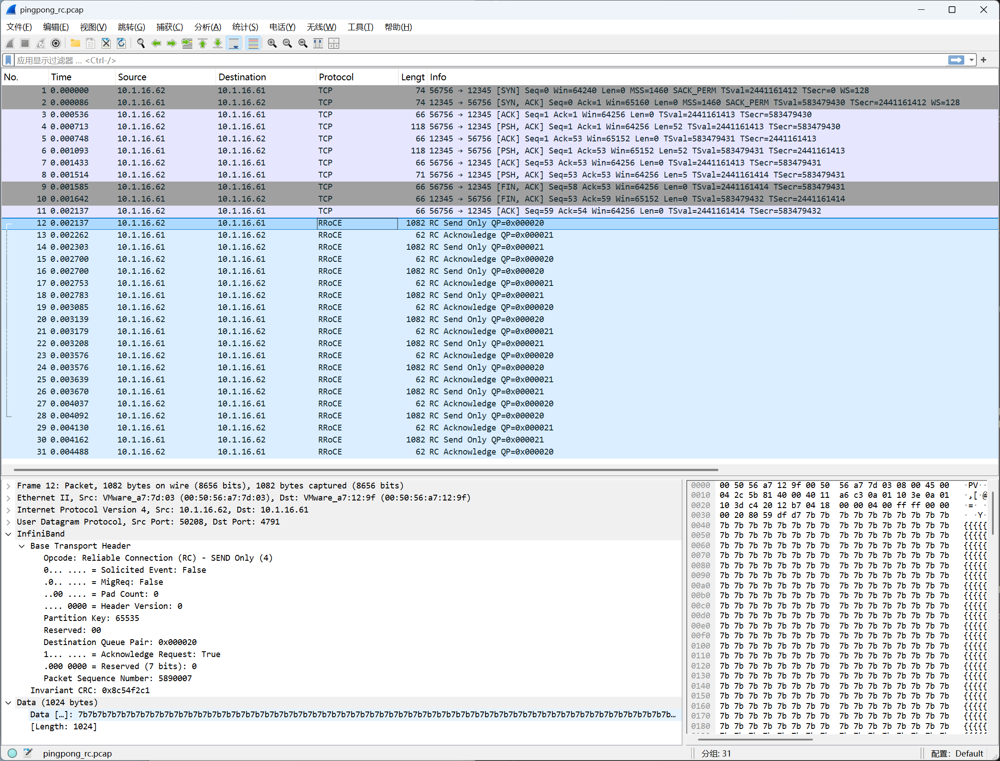
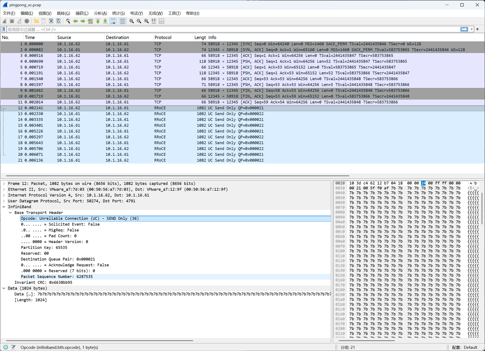
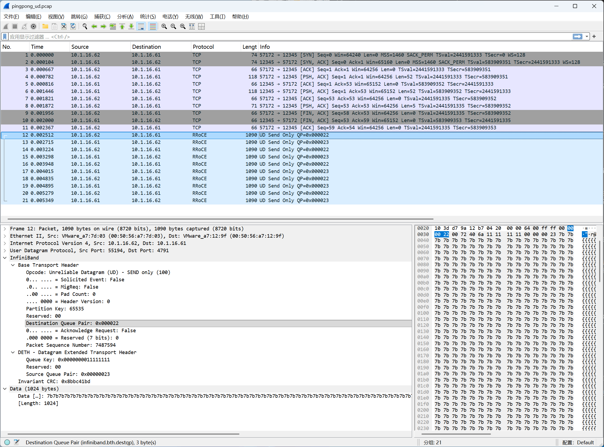

# 第五章: RDMA IB pingpong 抓包分析

实验环境中目前共两台 vm，安装了 soft-RoCE，后续的测试，将 `10.1.16.61` 作为服务端，将 `10.1.16.62` 作为客户端。

## 5.1 libibverbs-utils 简介

`libibverbs-utils`提供了一些测试工具：

```
libibverbs-utils:
  ibv_rc_pingpong
  ibv_uc_pingpong
  ibv_ud_pingpong
  ibv_devinfo        查看设备信息
  ibv_asyncwatch     监听异步事件

```

这些是 libibverbs 库自带的简单示例程序，代码量少，目的是给开发者学习 RDMA 编程的基本流程：

https://github.com/linux-rdma/rdma-core/tree/master/libibverbs/examples

本章我们将对`ibv_rc_pingpong`、`ibv_uc_pingpong`、`ibv_ud_pingpong`进行抓包分析，以深入理解 rdma 的通信过程。

---

## 5.2 ibv_rc_pingpong 抓包分析



[pcap抓包文件](../pcap/pingpong_rc.pcap)

`ibv_rc_pingpong` 用的是 Send/Recv 操作，和 `ib_write_bw` 有两个不同：

- 握手端口不是 18515，是随机端口，但是可以通过 -p 参数指定
- 数据操作是 Send/Recv，不是 RDMA Write，IB opcode 不同

### 测试环境准备

```bash
# 服务端抓包
sudo tcpdump -i ens160 -w /tmp/pingpong.pcap 'port 12345 or udp port 4791'

# 服务端，用 -p 指定 tcp 端口为 12345
ibv_rc_pingpong -d rxe0 -g 1 -n 5 -s 1024 -p 12345

# 客户端
ibv_rc_pingpong -d rxe0 -g 1 -n 5 -s 1024 -p 12345 10.1.16.61
```

```bash
expert@k8s-61:~$ ibv_rc_pingpong -d rxe0 -g 1 -n 5 -s 1024 -p 12345
  local address:  LID 0x0000, QPN 0x000031, PSN 0x3b10ed, GID ::ffff:10.1.16.61
  remote address: LID 0x0000, QPN 0x000033, PSN 0x0ac342, GID ::ffff:10.1.16.62
10240 bytes in 0.00 seconds = 33.02 Mbit/sec
5 iters in 0.00 seconds = 496.20 usec/iter

expert@k8s-62:~$ ibv_rc_pingpong -d rxe0 -g 1 -n 5 -s 1024 -p 12345 10.1.16.61
  local address:  LID 0x0000, QPN 0x000033, PSN 0x0ac342, GID ::ffff:10.1.16.62
  remote address: LID 0x0000, QPN 0x000031, PSN 0x3b10ed, GID ::ffff:10.1.16.61
10240 bytes in 0.00 seconds = 38.00 Mbit/sec
5 iters in 0.00 seconds = 431.20 usec/iter
```

### 从抓包看时序

```
包 1-3    TCP 三次握手         建连
包 4-8    TCP 数据交换         握手：交换 QPN/PSN/GID（Len=52 和 Len=5 的小包）
包 9-11   TCP 四次挥手         连接关闭  ← t=0.0015s 就断了
包 12起   RRoCE 数据           RC Send Only + RC Acknowledge 交替出现
```

TCP 在 `t=0.0015s` 就完全关闭，之后全是 RRoCE 包。

**`ib_write_bw` 保持 TCP 连接：**

RDMA Write 是单边操作，服务端 CPU 不感知数据何时写完，需要 TCP 连接在整个测试期间保活，用来同步"测试结束"信号和统计数据。

**`ibv_rc_pingpong` 提前关闭 TCP：**

Send/Recv 是双边操作，每次发送对方都会收到并回复 ACK，双方通过 RDMA 本身就能感知通信状态，不需要 TCP 继续保活。握手完成、QP 建好之后 TCP 就没用了，直接关掉。

```
ib_write_bw:      RDMA_WRITE_ONLY   opcode=0x0a  单向，只有客户端发
ibv_rc_pingpong:  RC_SEND_ONLY      opcode=0x04  双向来回，能看到双方都在发包
```

可以看到非常清晰的 pingpong 模式，严格的 **ping→ack→pong→ack** 四步一轮，和 `ib_write_bw` 单向狂发完全不同：

```
#12  62 → 61  RC Send Only   1082字节   客户端发送数据
#13  61 → 62  RC Acknowledge   62字节   服务端 ACK
#14  61 → 62  RC Send Only   1082字节   服务端回发数据（pong）
#15  62 → 61  RC Acknowledge   62字节   客户端 ACK
#16  62 → 61  RC Send Only   1082字节   下一轮 ping
...
```

---

## 5.3 ibv_uc_pingpong 抓包分析



[pcap抓包文件](../pcap/pingpong_uc.pcap)

UC 的行为和 RC 基本一样，但有一个关键区别：**没有 ACK**。

### 测试环境准备

```bash
# 服务端抓包
sudo tcpdump -i ens160 -w /tmp/uc_pingpong.pcap 'port 12345 or udp port 4791'

# 服务端，用 -p 指定 tcp 端口为 12345
ibv_uc_pingpong -d rxe0 -g 1 -n 5 -s 1024 -p 12345

# 客户端
ibv_uc_pingpong -d rxe0 -g 1 -n 5 -s 1024 -p 12345 10.1.16.61
```

```bash
expert@k8s-61:~$ ibv_uc_pingpong -d rxe0 -g 1 -n 5 -s 1024 -p 12345
  local address:  LID 0x0000, QPN 0x000032, PSN 0xc14dd8, GID ::ffff:10.1.16.61
  remote address: LID 0x0000, QPN 0x000034, PSN 0xdaa970, GID ::ffff:10.1.16.62
10240 bytes in 0.00 seconds = 23.46 Mbit/sec
5 iters in 0.00 seconds = 698.40 usec/iter

expert@k8s-62:~$ ibv_uc_pingpong -d rxe0 -g 1 -n 5 -s 1024 -p 12345 10.1.16.61
  local address:  LID 0x0000, QPN 0x000034, PSN 0xdaa970, GID ::ffff:10.1.16.62
  remote address: LID 0x0000, QPN 0x000032, PSN 0xc14dd8, GID ::ffff:10.1.16.61
10240 bytes in 0.00 seconds = 24.53 Mbit/sec
5 iters in 0.00 seconds = 667.80 usec/iter
```

### UC 和 RC 的差异

```
RC pingpong:
  62 → 61  RC Send Only      数据
  61 → 62  RC Acknowledge    ACK   ← 硬件自动回
  61 → 62  RC Send Only      数据
  62 → 61  RC Acknowledge    ACK   ← 硬件自动回

UC pingpong:
  62 → 61  UC Send Only      数据
  61 → 62  UC Send Only      数据  ← 没有 ACK，直接回数据
  62 → 61  UC Send Only      数据
  61 → 62  UC Send Only      数据
```

**注意**：pingpong 工具的 RC/UC 的连接生命周期完全由 **QP 状态机**管理，和 TCP 无关。

```
RC:  对端消失 → 重传超时 → QP 自动进入 ERROR → CQ 报错 → 应用感知
UC:  对端消失 → 包发出去就丢了 → 没有任何反馈 → 应用永远不知道
```

这也是为什么实际生产中 RC 更常用：至少能感知到连接断了。UC 断连就是静默失败，应用层必须自己实现心跳或超时检测。

`ibv_rc_pingpong` / `ibv_uc_pingpong` 跑完 `-n` 次之后直接调 `ibv_destroy_qp()` 收工，没有任何挥手，对端 QP 也同时销毁，所以不会有遗留的 ERROR 状态。这是测试工具的简化处理，生产代码里通常会有更完善的清理逻辑。

---

## 5.4 ibv_ud_pingpong 抓包分析



[pcap抓包文件](../pcap/pingpong_ud.pcap)

### 测试环境准备

```bash
# 服务端抓包：
sudo tcpdump -i ens160 -w /tmp/pingpong_ud.pcap 'port 12345 or udp port 4791'

# 服务端
ibv_ud_pingpong -d rxe0 -g 1 -n 5 -s 1024 -p 12345

# 客户端
ibv_ud_pingpong -d rxe0 -g 1 -n 5 -s 1024 -p 12345 10.1.16.61
```

```bash
expert@k8s-61:~$ ibv_ud_pingpong -d rxe0 -g 1 -n 5 -s 1024 -p 12345
  local address:  LID 0x0000, QPN 0x000033, PSN 0x4898ea: GID ::ffff:10.1.16.61
  remote address: LID 0x0000, QPN 0x000035, PSN 0x947b54, GID ::ffff:10.1.16.62
10240 bytes in 0.01 seconds = 15.44 Mbit/sec
5 iters in 0.01 seconds = 1060.80 usec/iter

expert@k8s-62:~$ ibv_ud_pingpong -d rxe0 -g 1 -n 5 -s 1024 -p 12345 10.1.16.61
  local address:  LID 0x0000, QPN 0x000035, PSN 0x947b54: GID ::ffff:10.1.16.62
  remote address: LID 0x0000, QPN 0x000033, PSN 0x4898ea, GID ::ffff:10.1.16.61
10240 bytes in 0.01 seconds = 15.99 Mbit/sec
5 iters in 0.01 seconds = 1024.40 usec/iter
```

### UD 的 MTU 限制

UD 不支持分片，单包不能超过 MTU（当前测试环境是 1024 字节），所以 `-s 1024` 刚好在边界，可以试试 `-s 1025` 会直接报错：

```bash
expert@k8s-61:~$ ibv_ud_pingpong -d rxe0 -g 1 -n 5 -s 1025 -p 12345
Requested size larger than port MTU (1024)
```

### DETH

Datagram Extended Transport Header，UD 专属，RC/UC 没有，包含：

```
Queue Key:        0x0000000011111111   访问控制，接收方验证发送方是否有权限
Source QPN:       0x00000022           发送方的 QPN（UD 无连接，接收方需要知道对端是谁）
```

**Source QPN** 解决的是无连接的身份识别问题。RC/UC 建连时双方 QPN 已经绑定，收到包就知道从哪来。UD 没有连接状态，接收方的 QP 可能同时收到来自几十个不同发送方的包，没有 Src QPN 就无法区分。

**Queue Key** 是访问控制机制。UD QP 创建时会设置一个 qkey，收到包时硬件会对比包里的 Queue Key 和本地 QP 的 qkey，不匹配就丢弃。抓包里是 `0x11111111`，这是 `ibv_ud_pingpong` 的默认值，双方都用同一个值所以能通。

### 和 RC/UC 的对比

RC/UC 不需要 DETH，因为：

```
RC/UC 建连时:  本地 QPN ←→ 远端 QPN  已经在 QP 状态机里绑定
收到包时:      硬件直接查 BTH 里的 Dst QPN，找到对应 QP
               发送方是谁？不需要知道，连接已经固定了
```

UD 的接收方 QP 是一个"公共收件箱"，DETH 里的 Src QPN 相当于信封上的寄件人地址，应用层 `ibv_wc`（完成队列条目）会把这个 Src QPN 和 Queue Key 一起返回给上层，应用自己决定怎么处理。

### 为什么 UD 依旧需要 TCP 握手？

UD 本身无连接，但 `ibv_ud_pingpong` 在发 UD 包之前，两端还是需要交换一些信息：

```
本端 QPN    → 对端需要知道，填到 AH（Address Handle）里
本端 GID    → 对端需要知道，用于构建目标地址
Queue Key   → 双方要对齐，否则硬件会丢包
```

这些信息没有办法凭空知道，必须通过某种带外机制交换，`ibv_ud_pingpong` 用的就是 TCP，和 `ibv_rc_pingpong` 用同一套握手逻辑。

```bash
RC 握手交换的信息:
  QPN / PSN / GID → 用于建立 QP 连接状态（modify_qp RTR/RTS）
  握手完成后 QP 进入 RTS，连接固化在状态机里

UD 握手交换的信息:
  QPN / GID / QKey → 用于构建 AH（Address Handle）
  握手完成后 QP 不建连接，每次发包临时指定 AH
```

RC 的 TCP 握手结果写进了 QP 状态机，连接是持久的。UD 的 TCP 握手结果只是让双方知道对端地址，UD QP 本身没有连接状态，发包时把对端信息塞进 `ibv_send_wr.wr.ud` 里：

```c
wr.wr.ud.ah      = 用对端GID构建的AH   ← TCP握手拿到的
wr.wr.ud.remote_qpn  = 对端QPN        ← TCP握手拿到的
wr.wr.ud.remote_qkey = 对端QKey       ← TCP握手拿到的
```

每次 post_send 都要带这三个字段，这就是"无连接"的体现。
