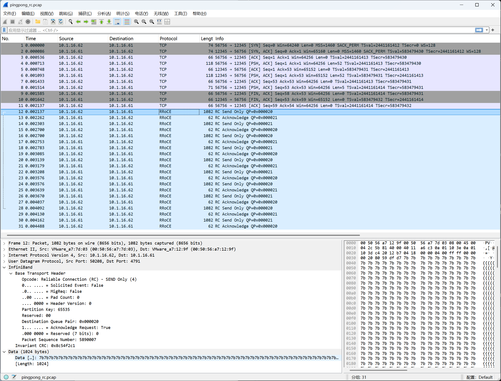
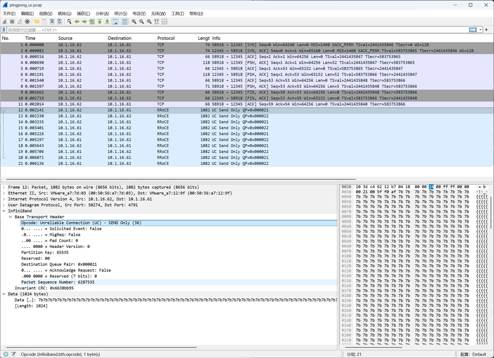
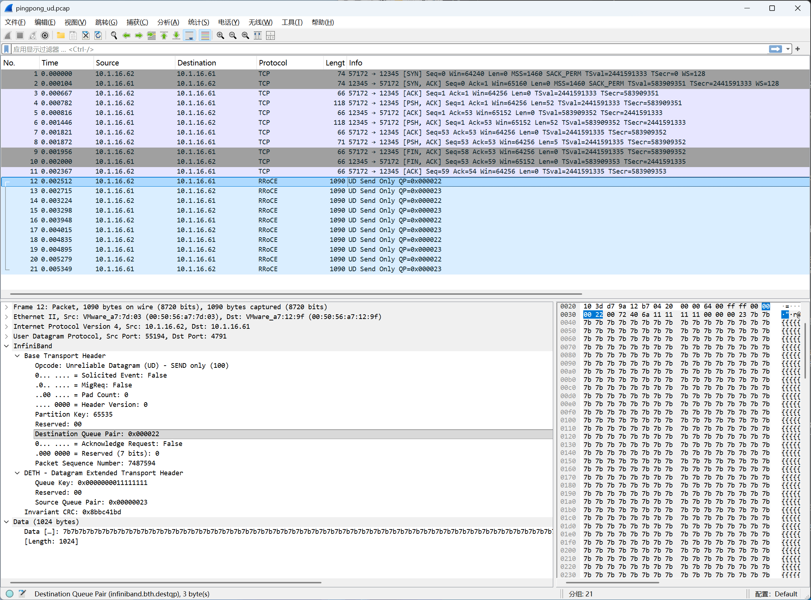

# 第五章: RDMA IB pingpong 抓包分析

继续上一章的测试，实验环境依旧不变，将 `10.1.16.61` 作为服务端，将 `10.1.16.62` 作为客户端。

## 5.1 libibverbs-utils 简介

libibverbs 库自带了一些简单的示例程序，代码量少，原本目的是给开发者学习 RDMA 编程的基本流程。这一章，我们就使用这些内置的测试工具来发起 RDMA通信，主要是三个 pingpong 小程序。

> https://github.com/linux-rdma/rdma-core/tree/master/libibverbs/examples

`libibverbs` 和 `perftest` 有两个不同：

- 握手端口不是 18515，是随机端口，但是可以通过 -p 参数指定
- 数据操作是 Send，不是 RDMA Write/Read

我们将对`ibv_rc_pingpong`、`ibv_uc_pingpong`、`ibv_ud_pingpong`进行抓包分析，以深入理解 rdma 的通信过程。

---

## 5.2 ibv_rc_pingpong 抓包分析

[pcap抓包文件](../pcap/pingpong_rc.pcap)

### 测试环境准备

```bash
# 服务端抓包
sudo tcpdump -i ens160 -w /tmp/pingpong_rc.pcap 'port 12345 or udp port 4791'

# 服务端，用 -p 指定 tcp 端口为 12345
ibv_rc_pingpong -d rxe0 -g 1 -n 5 -s 1024 -p 12345

# 客户端
ibv_rc_pingpong -d rxe0 -g 1 -n 5 -s 1024 -p 12345 10.1.16.61
```

测试输出如下：

```bash
expert@k8s-61:~$ ibv_rc_pingpong -d rxe0 -g 1 -n 5 -s 1024 -p 12345
  local address:  LID 0x0000, QPN 0x000020, PSN 0x83be68, GID ::ffff:10.1.16.61
  remote address: LID 0x0000, QPN 0x000021, PSN 0x59dfd7, GID ::ffff:10.1.16.62
10240 bytes in 0.00 seconds = 33.02 Mbit/sec
5 iters in 0.00 seconds = 496.20 usec/iter

expert@k8s-62:~$ ibv_rc_pingpong -d rxe0 -g 1 -n 5 -s 1024 -p 12345 10.1.16.61
  local address:  LID 0x0000, QPN 0x000021, PSN 0x59dfd7, GID ::ffff:10.1.16.62
  remote address: LID 0x0000, QPN 0x000020, PSN 0x83be68, GID ::ffff:10.1.16.61
10240 bytes in 0.00 seconds = 38.00 Mbit/sec
5 iters in 0.00 seconds = 431.20 usec/iter
```

### 从抓包看时序



```bash
包 1-3    TCP 三次握手         建连
包 4-8    TCP 数据交换         握手：交换 QPN/PSN/GID
包 9-11   TCP 四次挥手         连接关闭
包 12+    RRoCE 数据          RC Send Only + RC Acknowledge 交替出现
```

`ibv_rc_pingpong` 在交换完 QPN、PSN、GID 等信息后立即关闭 TCP，后续完全依赖 RDMA 通信完成数据交换。与这个形成鲜明对比的是上一章的 `ib_write_bw` 等工具，它们选择了保留 TCP 连接，将其作为测试控制通道，用于实现测试开始、结束等状态同步。这两种实现都完全合理，本质上只是开发者在工程实现上的不同选择而已。

另外，这个抓包中也可以看到非常清晰的 pingpong 模式，严格的 **ping→ack→pong→ack** 四步一轮：

```bash
包 12  62 → 61  RC Send Only   1082字节   客户端发送数据（ping）
包 13  61 → 62  RC Acknowledge   62字节   服务端 ACK
包 14  61 → 62  RC Send Only   1082字节   服务端回发数据（pong）
包 15  62 → 61  RC Acknowledge   62字节   客户端 ACK
包 16  62 → 61  RC Send Only   1082字节   下一轮 ping
...
```

---

## 5.3 ibv_uc_pingpong 抓包分析

[pcap抓包文件](../pcap/pingpong_uc.pcap)

### 测试环境准备

```bash
# 服务端抓包
sudo tcpdump -i ens160 -w /tmp/pingpong_uc.pcap 'port 12345 or udp port 4791'

# 服务端，用 -p 指定 tcp 端口为 12345
ibv_uc_pingpong -d rxe0 -g 1 -n 5 -s 1024 -p 12345

# 客户端
ibv_uc_pingpong -d rxe0 -g 1 -n 5 -s 1024 -p 12345 10.1.16.61
```



UC 的行为和 RC 基本一样，只有一个关键区别：**没有 ACK**。

```bash
RC pingpong:
  62 → 61  RC Send Only      数据
  61 → 62  RC Acknowledge    ACK   ← 硬件自动回
  61 → 62  RC Send Only      数据
  62 → 61  RC Acknowledge    ACK   ← 硬件自动回

UC pingpong:
  62 → 61  UC Send Only      数据
  61 → 62  UC Send Only      数据  ← 没有 ACK，直接回数据
  62 → 61  UC Send Only      数据
  61 → 62  UC Send Only      数据
```

---

## 5.4 ibv_ud_pingpong 抓包分析

[pcap抓包文件](../pcap/pingpong_ud.pcap)

### 测试环境准备

```bash
# 服务端抓包：
sudo tcpdump -i ens160 -w /tmp/pingpong_ud.pcap 'port 12345 or udp port 4791'

# 服务端
ibv_ud_pingpong -d rxe0 -g 1 -n 5 -s 1024 -p 12345

# 客户端
ibv_ud_pingpong -d rxe0 -g 1 -n 5 -s 1024 -p 12345 10.1.16.61
```

### UD 的 MTU 限制

UD 不支持分片，单包不能超过 MTU（当前测试环境是 1024 字节），所以 `-s 1024` 刚好在边界，可以试试 `-s 1025` 会直接报错：

```bash
expert@k8s-61:~$ ibv_ud_pingpong -d rxe0 -g 1 -n 5 -s 1025 -p 12345
Requested size larger than port MTU (1024)
```

### DETH 包头结构分析



Datagram Extended Transport Header，这是 UD 专属的，RC/UC 没有。以包 12 为例：

```bash
Queue Key:        0x0000000011111111
Source QPN:       0x00000023
```

**Source QPN** 是标识源端的 QPN。RC/UC 建连时双方 QPN 已经绑定，收到包就知道从哪来。UD 没有连接状态，接收方的 QP 可能同时收到来自几十个不同发送方的包，没有 Src QPN 就无法区分。

**Queue Key** 是访问控制机制。UD QP 创建时会设置一个 qkey，收到包时硬件会对比包里的 Queue Key 和本地 QP 的 qkey，不匹配就丢弃。抓包里是 `0x11111111`，这是 `ibv_ud_pingpong` 的默认值，双方都用同一个值所以能通。

> 做个类比：UD 接收方的 QP 是一个"公共收件箱"，DETH 里的 Src QPN 相当于信封上的寄件人地址，应用层 `ibv_wc`（完成队列条目）会把这个 Src QPN 和 qKey 一起返回给上层，应用自己决定怎么处理。
