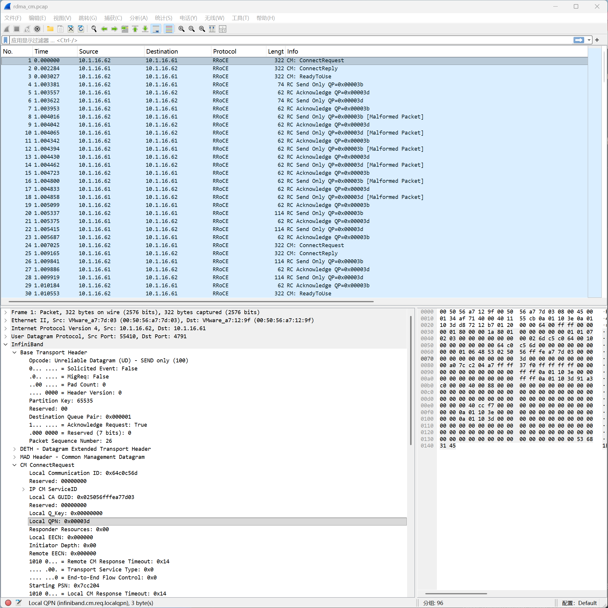

# 第六章: RDMA CM 抓包分析

rdma_cm（RDMA Connection Manager）是一个标准化的连接管理库，提供类似 socket 的 API 来建立 RDMA 连接，屏蔽底层细节。

perftest 工具默认使用 tcp 进行连接管理，可以通过 `--rdma_cm` 参数切换到 CM 模式。

实验环境中目前共两台 vm，安装了 soft-RoCE，后续的测试，将 `10.1.16.61` 作为服务端，将 `10.1.16.62` 作为客户端。



[pcap抓包文件](../pcap/rdma_cm.pcap)

## 6.1 带内CM和带外tcp建连的区别

```
TCP 方式（perftest默认）:
  TCP(18515) 交换 QPN/PSN/RKey/GID
  → 应用自己调 ibv_modify_qp() 推状态机
  → RESET → INIT → RTR → RTS
  → 完全手动，私有实现
  QPN/PSN 明文文本交换
  TCP 连接在测试期间一直保持

rdma_cm 方式:
  走标准 CM 协议（CM over UDP 或 IB CM）
  → 库自己管理 QP 状态机
  → 应用只需要 connect/listen/accept
  → 标准协议，所有 RDMA 应用互通（NVMe-oF、NCCL、MPI）
  结构化字段，包含 GUID/ServiceID 等丰富元数据
  断连有标准的 DREQ/DREP 挥手
```

rdma_cm 在 RoCEv2 环境下走的是 **RDMA CM over UDP**，端口 **4791**，和 RDMA 数据包用同一个端口。

---

## 6.2 测试环境准备

perftest 工具支持 `--rdma_cm` 参数，直接复用之前的测试框架：

```bash
# 服务端抓包（只抓 4791，不需要 18515）
sudo tcpdump -i ens160 -w /tmp/rdma_cm.pcap 'udp port 4791'

# 服务端
ib_write_bw -d rxe0 --report_gbits -n 5 -s 3000 --rdma_cm

# 客户端
ib_write_bw -d rxe0 --report_gbits -n 5 -s 3000 --rdma_cm 10.1.16.61
```

## 6.3 perftest CM 案例时序全貌

```
01  62→61 [UD CM] ConnectRequest  Local QPN=0x3d    ← 建控制通道
02  62←61 [UD CM] ConnectReply    Local QPN=0x3b
03  62→61 [UD CM] ReadyToUse

04  62→61 [RC] RC Send × N                          ← 控制通道交换测试参数 (VAddr, RKey...)

24  62→61 [UD CM] ConnectRequest  Local QPN=0x3e    ← 建数据通道
25  62←61 [UD CM] ConnectReply    Local QPN=0x3c
30  62→61 [UD CM] ReadyToUse

43  62→61 [RC] RDMA Write × N                       ← 正式测试开始

91  62→61 [CM] DisconnectRequest  Remote QPN=0x3c   ← 测试结束，先拆数据通道
92  62←61 [CM] DisconnectRequest  Remote QPN=0x3e   ← 拆数据通道
95  62←61 [CM] DisconnectRequest  Remote QPN=0x3d   ← 再拆控制通道
```

---

从抓包中，我们可以看到两次 ConnectRequest，它们是两条**独立的连接请求**，建的是两个不同的 QP。

```
                   包 1 (ConnectRequest)     包 24 (ConnectRequest)
Local Comm ID         0x64c0c56d               0x65c0c56d       ← 不同，各自独立的会话ID
Local QPN             0x00003d                 0x00003e         ← 不同！两个不同的 QP
IP CM Source Port     0xccf7                   0xc6be           ← 不同，两个独立的 CM 端口
```

```
                  k8s-62 (Client)        k8s-61 (Server)
第一条连接:         QP 0x00003d  ←────────→  QP 0x00003b   (Send/Recv 控制通道)
第二条连接:         QP 0x00003e  ←────────→  QP 0x00003c   (实际数据通道)
```

**第一条连接（QP 0x3d ↔ 0x3b）：参数协商通道**

在正式测试开始前，perftest 需要在两端之间交换测试参数，包括 MR 的 VAddr、RKey、消息大小、迭代次数等。这些元数据通过 RC Send 消息传递，走的就是第一条连接。

**第二条连接（QP 0x3e ↔ 0x3c）：测试数据通道**

参数协商完成后，perftest 再建第二条连接，用于跑实际的 RDMA Write 测试流量。

## 6.4 CM 协议解析

通过上面的协议分析可以发现：CM 是传输层协议，不是应用层协议，并且 CM 协议本身是完全无状态的，它不知道也不关心上层应用建了几个连接：

```
CM 的职责：
  ✓ 协商 QPN（对端是谁）
  ✓ 协商 PSN（从哪个序列号开始）
  ✓ 协商路径参数（GID、SL、TC、Hop Limit）
  ✓ 协商 QP 能力（Responder Resources、Initiator Depth）
  ✗ 不管应用要传什么数据
  ✗ 不管内存注册在哪里
  ✗ 不管测试参数是什么

VAddr / RKey 的职责归属：
  这是应用层的事："我把哪块内存开放给你写"
  不同应用有不同的内存管理方式，CM 无权也无法标准化
```

perftest 把“参数协商”和“测试数据”放在两个 QP 里物理隔离，是最简单的工程取舍。这并不是说单 QP 无法区分控制消息和数据消息，下一章的 rping 就是一个反例：它同样没有定义任何 PDU 格式，VAddr 和 RKey 直接裸放在 Send 的 payload 里，靠交互顺序的隐式约定来区分语义，一个 QP 就完成了参数协商和数据传输的全部工作。

perftest 选择两个 QP 的真正原因在于它的测试模式：数据通道上会连续灌入大量 RDMA Write/Read，没有停顿；如果参数协商的 Send 消息和测试数据包混在同一个发送队列里排队，计时窗口的起止点就会变得模糊，测量结果的纯净性无法保证。用第二个 QP 把数据通道完全隔离出来，计时器只需要关注这一个 QP 上的流量，实现最简单，干扰最少。

而像 NVMe-oF、iSER 这样的生产协议，则走了另一条路：定义完整的 PDU 格式，每个消息头部都有 opcode 字段，接收方看 opcode 就能区分这是 NVMe 命令还是块数据，因此命令和数据可以复用同一对 QP，不需要物理隔离。

本质上，"如何让接收方确定性地识别消息语义"有三种做法：靠 PDU（Protocol Data Unit协议数据单元）头部的 opcode、靠交互顺序的隐式约定、靠物理隔离到不同 QP。三种都是合法的设计，选哪种取决于应用的复杂度和目标，perftest 作为一个测量工具，选的是对计时影响最小的那种。

**ConnectRequest 字段解析（包1）**

```
CM ConnectRequest:
  Local Communication ID: 0x64c0c56d   会话唯一标识，类似TCP的端口对
  IP CM ServiceID:
    Protocol: 0x06                     标识这是 TCP-style 服务
    Destination Port: 0x4853           perftest 的 CM 端口
  Local CA GUID: 0x025056fffea77d03    本端网卡唯一标识
  Local QPN:     0x00003d              客户端的 QPN（直接在CM里交换）
  Starting PSN:  0x7cc204              初始序列号
  Primary Local GID:  10.1.16.62       源地址
  Primary Remote GID: 10.1.16.61       目标地址
  Path MTU:      0x3 = 1024            协商 MTU
```

对比之前 TCP 18515 的握手：同样的信息（QPN/PSN/GID），但这里是标准化的结构化字段，不是 perftest 私有的文本格式。

**ConnectReply 字段解析（包2）**

```
CM ConnectReply:
  Remote Communication ID: 0x8988f456  回应客户端的会话ID
  Local QPN:    0x00003b               服务端的 QPN
  Starting PSN: 0x727d6d               服务端的初始PSN
  Local CA GUID: 0x025056fffea7129f    服务端网卡GUID
```

一个来回，双方就完成了 QPN 和 PSN 的交换，QP 状态机可以推到 RTS(Ready To Send) 了。
