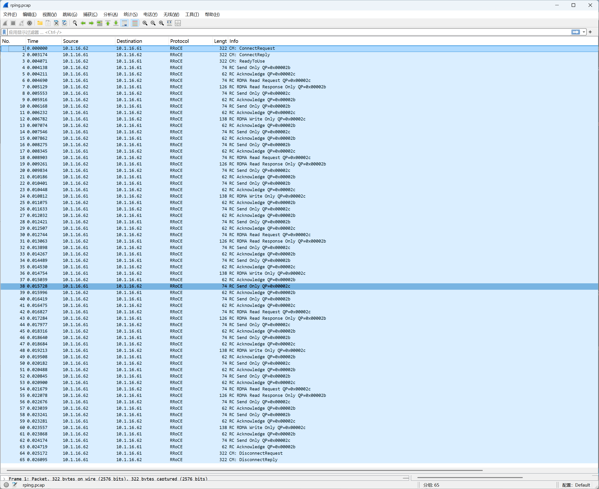

# 第七章: RDMA IB rping 抓包分析

rping 是 `librdmacm-utils` 包里的工具，专门用来测试 rdma_cm 连通性，类似 RDMA 世界的 ping。

实验环境中目前共两台 vm，安装了 soft-RoCE，后续的测试，将 `10.1.16.61` 作为服务端，将 `10.1.16.62` 作为客户端。



[pcap抓包文件](../pcap/rping.pcap)

## 7.1 测试环境准备

```bash
# 服务端抓包
sudo tcpdump -i ens160 -w /tmp/rping.pcap 'udp port 4791'

# 服务端 k8s-61
rping -s -d rxe0 -v

# 客户端 k8s-62
rping -c -a 10.1.16.61 -C 5 -v

# `-C 5` 是 5 次，`-v` 打印每次 ping 的结果，`-d rxe0` 指定设备。
```

```bash
# 测试结果
expert@k8s-61:~$ rping -s -d rxe0 -v
verbose
created cm_id 0x5617d13d2c20
rdma_bind_addr successful
rdma_listen
cma_event type RDMA_CM_EVENT_CONNECT_REQUEST cma_id 0x71fc24000ce0 (child)
child cma 0x71fc24000ce0
created pd 0x5617d13c7810
created channel 0x5617d13c77d0
created cq 0x5617d13d2fb0
created qp 0x5617d13d3110
rping_setup_buffers called on cb 0x5617d13c67c0
allocated & registered buffers...
accepting client connection request
cq_thread started.
recv completion
Received rkey 2095 addr 5b269382e5e0 len 64 from peer
cma_event type RDMA_CM_EVENT_ESTABLISHED cma_id 0x71fc24000ce0 (child)
ESTABLISHED
server received sink adv
server posted rdma read req
rdma read completion
server received read complete
server ping data: rdma-ping-0: ABCDEFGHIJKLMNOPQRSTUVWXYZ[\]^_`abcdefghijklmnopqr
server posted go ahead
send completion
recv completion
Received rkey 1f86 addr 5b2693822500 len 64 from peer
server received sink adv
rdma write from lkey 1ed5 laddr 5617d13c7780 len 64
rdma write completion
server rdma write complete
server posted go ahead
send completion
recv completion
Received rkey 2095 addr 5b269382e5e0 len 64 from peer
server received sink adv
server posted rdma read req
rdma read completion
server received read complete
server ping data: rdma-ping-1: BCDEFGHIJKLMNOPQRSTUVWXYZ[\]^_`abcdefghijklmnopqrs
server posted go ahead
send completion
recv completion
Received rkey 1f86 addr 5b2693822500 len 64 from peer
server received sink adv
rdma write from lkey 1ed5 laddr 5617d13c7780 len 64
rdma write completion
server rdma write complete
server posted go ahead
send completion
recv completion
Received rkey 2095 addr 5b269382e5e0 len 64 from peer
server received sink adv
server posted rdma read req
rdma read completion
server received read complete
server ping data: rdma-ping-2: CDEFGHIJKLMNOPQRSTUVWXYZ[\]^_`abcdefghijklmnopqrst
server posted go ahead
send completion
recv completion
Received rkey 1f86 addr 5b2693822500 len 64 from peer
server received sink adv
rdma write from lkey 1ed5 laddr 5617d13c7780 len 64
rdma write completion
server rdma write complete
server posted go ahead
send completion
recv completion
Received rkey 2095 addr 5b269382e5e0 len 64 from peer
server received sink adv
server posted rdma read req
rdma read completion
server received read complete
server ping data: rdma-ping-3: DEFGHIJKLMNOPQRSTUVWXYZ[\]^_`abcdefghijklmnopqrstu
server posted go ahead
send completion
recv completion
Received rkey 1f86 addr 5b2693822500 len 64 from peer
server received sink adv
rdma write from lkey 1ed5 laddr 5617d13c7780 len 64
rdma write completion
server rdma write complete
server posted go ahead
send completion
recv completion
Received rkey 2095 addr 5b269382e5e0 len 64 from peer
server received sink adv
server posted rdma read req
rdma read completion
server received read complete
server ping data: rdma-ping-4: EFGHIJKLMNOPQRSTUVWXYZ[\]^_`abcdefghijklmnopqrstuv
server posted go ahead
send completion
recv completion
Received rkey 1f86 addr 5b2693822500 len 64 from peer
server received sink adv
rdma write from lkey 1ed5 laddr 5617d13c7780 len 64
rdma write completion
server rdma write complete
server posted go ahead
send completion
cma_event type RDMA_CM_EVENT_DISCONNECTED cma_id 0x71fc24000ce0 (child)
server DISCONNECT EVENT...
wait for RDMA_READ_ADV state 10
rping_free_buffers called on cb 0x5617d13c67c0
destroy cm_id 0x5617d13d2c20


expert@k8s-62:~$ rping -c -a 10.1.16.61 -C 5 -v
ping data: rdma-ping-0: ABCDEFGHIJKLMNOPQRSTUVWXYZ[\]^_`abcdefghijklmnopqr
ping data: rdma-ping-1: BCDEFGHIJKLMNOPQRSTUVWXYZ[\]^_`abcdefghijklmnopqrs
ping data: rdma-ping-2: CDEFGHIJKLMNOPQRSTUVWXYZ[\]^_`abcdefghijklmnopqrst
ping data: rdma-ping-3: DEFGHIJKLMNOPQRSTUVWXYZ[\]^_`abcdefghijklmnopqrstu
ping data: rdma-ping-4: EFGHIJKLMNOPQRSTUVWXYZ[\]^_`abcdefghijklmnopqrstuv
client DISCONNECT EVENT...
```

---

## 7.2 解读pcap

```
包1-3    CM 建连          REQ → REP → RTU
包4-63   5轮 ping-pong    每轮12个包
包64-65  CM 断连          DREQ → DREP（客户端主动发起，服务端回复，单向挥手）
```

---

## 7.3 一轮 ping 的完整流程（以第 ping-0 轮为例，包 4-15）

这是 rping 最精妙的地方，**每轮用了三种不同的 RDMA 操作**：

```
包4   Send Only   62→61  74字节   客户端通告自己的 RKey/VAddr（sink advertisement）
包5   ACK         61→62  62字节
包6   Read Req    61→62  74字节   服务端主动 Read 客户端内存，取 ping 数据
包7   Read Resp   62→61  126字节  客户端内存数据返回（含 ping-0 的ASCII数据）
包8   Send Only   61→62  74字节   服务端通知客户端"Read完了，可以继续"（go ahead）
包9   ACK         62→61  62字节
包10  Send Only   62→61  74字节   客户端通告服务端新的 sink 地址
包11  ACK         61→62  62字节
包12  Write Only  61→62  138字节  服务端写数据到客户端内存
包13  ACK         62→61  62字节
包14  Send Only   61→62  74字节   服务端通知"写完了"（go ahead）
包15  ACK         62→61  62字节
```

备注：这里 Sink 的字面意思是"数据汇入点"，在 rping 里就是客户端提前注册好的一块内存区域。

---

**对照服务端日志理解每一步**

```
日志: "recv completion"
日志: "Received rkey 2095 addr 5b269382e5e0 len 64 from peer"
→ 对应包4，客户端用 Send 把自己的 RKey/VAddr 发给服务端

日志: "server posted rdma read req"
日志: "rdma read completion"
日志: "server ping data: rdma-ping-0: ABCDEF..."
→ 对应包6-7，服务端用收到的 RKey/VAddr 发起 RDMA Read，拿到 ping 数据

日志: "server posted go ahead"
日志: "send completion"
→ 对应包8，服务端用 Send 通知客户端"读完了，你可以继续"

日志: "Received rkey 1f86 addr 5b2693822500 len 64 from peer"
→ 对应包10，客户端发来新的 sink 地址，准备接收服务端写入

日志: "rdma write from lkey 1ed5 laddr ... len 64"
日志: "rdma write completion"
→ 对应包12，服务端用 Write 把数据写到客户端指定地址

日志: "server posted go ahead"
→ 对应包14，服务端通知客户端"写完了"
```

总结：rping 里 Send 不传 ping 数据，专门用来**传递控制信息**（RKey/VAddr/通知信号），这是 Send 在 RDMA 编程里的典型用法：Send 触发对端 CPU 感知，适合传小块控制信息；Write/Read 传大块数据，对端 CPU 不感知。
