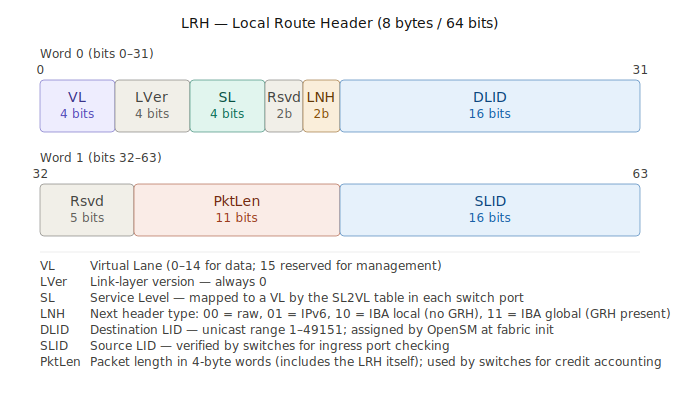
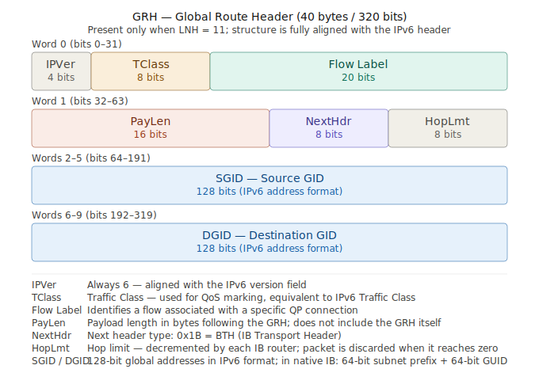
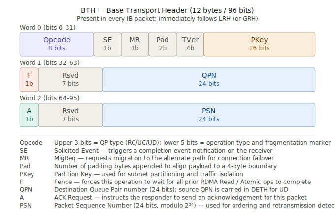

# 第十章：InfiniBand 协议栈

InfiniBand 把网络的职责划分成若干层，每一层负责一类特定的工作，并在数据包里添加属于自己的头部字段。

理解 IB 网络架构，最有效的方式就是逐层走一遍：每一层干什么活、往包里加了哪个头、由谁来处理。

这一章我们将走过链路层、网络层、传输层和上层这四层。

---

## 10.1 分层全景

先建立一张地图。InfiniBand 自下而上的分层，以及每一层对应的包头字段和处理者，大致如下：

| 层                  | 职责                          | 包头字段         | 主要处理者      |
| ------------------- | ----------------------------- | ---------------- | --------------- |
| 上层（Upper Layer） | 应用接口、上层协议、管理服务  | （Payload 内容） | 应用 / 管理实体 |
| 传输层（Transport） | 端到端通信、分段重组、QP 语义 | BTH              | 网卡硬件        |
| 网络层（Network）   | 跨子网路由                    | GRH              | 路由器          |
| 链路层（Link）      | 子网内转发、流控、QoS         | LRH、VCRC        | 交换机          |
| 物理层（Physical）  | 电/光信号传输                 | —                | 线缆 / 收发器   |

一个完整的 IB 数据包，字段平铺拼接如下：

```
┌─────────┬──────────┬──────────┬──────────────────┬───────────────┬─────────────┬─────────────┐
│   LRH   │   GRH    │   BTH    │       ETH        │    Payload    │    ICRC     │    VCRC     │
├─────────┼──────────┼──────────┼──────────────────┼───────────────┼─────────────┼─────────────┤
│  Link   │ Network  │Transport │Extended transport│  Upper-layer  │ end-to-end  │ link-level  │
│  layer  │  layer   │  layer   │    header(s)     │     data      │     CRC     │     CRC     │
└─────────┴──────────┴──────────┴──────────────────┴───────────────┴─────────────┴─────────────┘
```

备注：GRH 和 ETH 是可选的，其中 ETH（Extended Transport Headers）还可以叠加，具体是哪些 ETH 取决于操作类型：

- RETH（RDMA Extended Transport Header）：RDMA Write / Read Request 携带，包含 va、rkey、dma_len
- AETH（ACK Extended Transport Header）：Send/Write 的 ACK、Read Response 携带，包含 syndrome 和 MSN
- DETH（Datagram Extended Transport Header）：UD 类型 QP 携带，包含 Q_Key 和 SQPN
- AtomicETH：Atomic 操作携带，包含 va、rkey、swap/compare 数据

需要强调的一点是：IB 的分层是**职责的划分**，而不是像 TCP/IP 协议栈那样把上层整个包嵌套进下层的 payload、再逐层向上软件交付（洋葱式）。IB 包的各个头是并排拼在一起的，由网卡硬件并行解析、各设备各取所需：交换机只读 LRH，路由器关心 GRH，目标网卡解析 BTH。带着这张地图，我们逐层展开。

---

## 10.2 链路层：子网内的转发、流控与服务质量

链路层负责在一个 IB 子网内部把数据从一个节点送到另一个节点。它是 IB 区别于以太网最集中的地方。



LRH 是每个 IB 数据包必须携带的链路层包头，固定 8 字节（64 bits），分两个 32-bit word。

几个关键字段值得特别说明：

- VL / SL 是 IB QoS 的核心入口。SL 由发送端设置，交换机按 SL→VL 映射表决定实际走哪条 Virtual Lane，从而实现流量隔离和死锁规避。
- LNH（2 bits）决定 LRH 之后紧跟什么：值为 10 表示下一个是 GRH（即需要全局路由），值为 00 表示直接是 BTH（纯 LID 本地路由）。这一字段是解析 IB 包时判断有无 GRH 的唯一依据。
- DLID / SLID 各 16 bits，范围 1–49151 为单播 LID，由 OpenSM 在 fabric 初始化时分配。SLID 在交换机做入口过滤（source-port check）时会被核验。
- PktLen 以 4 字节（即一个 flit）为单位计量，包含 LRH 本身，因此最小值为 2（LRH + BTH 共 8 字节）。交换机用这个字段做信用计数（flow control credit）。

### LID 与包转发

子网内的每个端口都有一个 LID，由子网管理器在初始化和拓扑变化时分配。链路层的转发就靠它：每个数据包的 LRH（本地路由头）里带着目的 LID（DLID），交换机看这个 DLID 决定把包从哪个端口转出去。

交换机用来做这个决定的转发表，叫做 **LFT（Linear Forwarding Table，线性转发表）**。它的结构很简单，一张 DLID 到出端口的映射表：交换机收到包，取出 DLID，查 LFT，得到对应的出端口，转发出去。

把它和以太网对照一下就清楚了：以太网交换机靠 MAC 地址表转发，而那张表是交换机自己通过"学习"源 MAC 动态建立的；IB 的 LFT 不是交换机自学的，而是由 SM 统一计算好、下发到每台交换机的。这正是 IB 集中管理的体现，交换机不自己做转发决策，它只是忠实执行 SM 下发的转发表。

### 流控：无损的实现机制

IB 链路层最重要的特性是无损，正常运行时不会因为拥塞而丢包。它靠的是一种**基于信用的流量控制**（credit-based flow control）来实现。

机制本身很直观：链路的接收端会持续告诉发送端"我还有多少缓冲区空间可以接收"，这个空间额度就是"信用"（credit）。发送端只在对方有足够信用时才发数据；如果接收端缓冲区快满了、信用不足，发送端就停下来等，而不是把包发出去然后被丢掉。

这套 credit 机制是**逐跳**的，每段链路独立维护，与端到端的传输层状态无关。当物理链路 UP 之后，双方通过相互告知各自每条 VL（Virtual Lane） 的接收缓冲大小，单位是 64 字节的 block。这个过程纯粹发生在链路两端之间，不经过 SM。运行时的 credit 更新通过专用的 **Flow Control Packet（FCP）** 完成，这是一种独立于数据包之外的链路层控制帧。

FCP 是一种独立于数据包之外的链路层控制帧，不携带任何 IB 传输层头部，对上层完全透明。因此在 Wireshark 这类工具里永远看不到这些 credit 帧；它们在以太网承载的 RoCEv2 中也不存在，RoCEv2 把链路层换成了以太网，无损能力改由 PFC 来承担。

这与以太网的"尽力而为"形成鲜明对比。以太网交换机缓冲区满了就直接丢包，靠上层协议去发现和重传。IB 则在链路层就杜绝了拥塞丢包的可能，可靠性不需要上层来补。这种无损特性带来了高效的带宽利用和极低的端到端延迟波动，是 IB 适合高性能计算的根本原因之一。

### QoS：Service Level 与 Virtual Lane

谈到 IB 的 QoS，先来说说它要解决的问题是什么？

一条物理链路上往往承载着多种流量：有延迟敏感的（比如 MPI 的小消息同步），有吞吐密集的（比如大块数据传输），还有管理流量。如果它们全挤在同一个队列里，就会出现**队头阻塞**（head-of-line blocking）：前面一个大块传输堵在那里，后面紧急的小消息只能干等。更糟的是，在复杂拓扑里，多条流量互相等待对方释放缓冲区，还可能形成**死锁**。

IB 的解法是 **Virtual Lane（VL，虚拟通道）**：在一条物理链路上，划分出多条相互独立的虚拟通道，每条 VL 有自己独立的缓冲区和独立的流控 credit。物理上是一根线，逻辑上是多条互不干扰的通道。一条 VL 上的流量被堵住，不影响其他 VL，队头阻塞就被限制在单条通道内，而通过合理规划 VL 的使用，还能打破循环等待、避免死锁。

那 **Service Level（SL，服务等级）** 是什么？它是打在数据包上的一个优先级标签，写在 LRH 里。应用或上层在发送时给流量标注一个 SL（表示"这是哪一类、什么优先级的流量"），然后在每一跳，交换机根据一张 **SL-to-VL 映射表**，把这个 SL 的流量放进对应的 VL 里传输。

为什么要把 SL 和 VL 分开，而不直接用一个编号？因为不同的链路可能支持不同数量的 VL（有的链路支持 8 条，有的只支持 2 条）。SL 是端到端一致的"我想要什么待遇"的抽象表达，VL 是每条链路上"具体用哪条物理通道实现"的落地。中间靠 SL-to-VL 映射表解耦——同一个 SL，在 VL 多的链路上可能映射到独占通道，在 VL 少的链路上可能和别的 SL 共享通道。这张映射表同样由子网管理器统一配置。

回到那个视角：对一个写 RDMA 程序的开发者来说，他提交一个 Write 请求，数据到了对端内存，整个过程他不会感知到 SL 和 VL 的存在。但对管理 IB 网络的人来说，SL/VL 正是他用来隔离流量、保证关键业务延迟、避免死锁的核心工具。所以这里的 QoS 是网络的服务质量机制，而非上层应用的编程接口。

### VCRC 与两类包

链路层给每个包附加一个 **VCRC（Variant CRC，可变循环冗余校验）**，16 位，覆盖整个包的所有字段。"Variant"意味着它在每一跳都会被重新计算——因为包在转发过程中某些字段会变化（比如逐跳更新的内容），所以每一段链路都用 VCRC 重新校验一次，保证这一跳的传输没有出错。它提供的是**链路级**（相邻两个直连节点之间）的数据完整性。

链路层处理的包分两类：**链路管理包**用于链路的配置和维护，**数据包**承载实际的事务负载。前者是网络自己的管理流量，后者才是应用数据。

---

## 10.3 网络层：跨子网路由

链路层只管一个子网内部的事。当数据需要跨越子网边界，从一个 IB 子网到达另一个 IB 子网时，就轮到网络层登场。

不过这里我想说，绝大多数 IB 部署都是单子网，跨子网路由在实际中相当罕见。一个子网约 4.8 万端口的容量，足以覆盖绝大多数集群——哪怕是万卡规模的 AI 训练集群，通常也是单子网、单 SM 管理。真正的规模扩展，业界更多依靠在单个子网内采用 Fat-Tree 等拓扑来实现，而非用 IB 路由器连接多个子网。IB 路由器属于相对小众的设备，主要用于互联原本独立的 IB 集群等特殊场景。因此网络层的内容理解即可，日常打交道的几乎都是链路层的子网内转发。



### GID 与 IB 路由器

网络层用 **GID（全局标识符）** 寻址，这是一个 128 位、格式与 IPv6 相同的全局地址，写在数据包的 **GRH（Global Routing Header，全局路由头）** 里，全局唯一。负责跨子网转发的设备是 **IB 路由器**。

### LRH 重写，GRH 不变

跨子网转发有一个关键机制，理解了它就理解了链路层和网络层的分工。

LID 是子网本地的概念，离开了本子网就没有意义。所以当一个包从源子网经 IB 路由器进入目标子网时，**路由器会重写 LRH**——把源子网里的 LID 换成目标子网里有效的新 LID，让包能在新子网内继续靠链路层转发。而 **GRH 里的 GID 端到端保持不变**，它始终标识着最终的目的端口。

这个机制和 IP 网络里的规律完全同构：在 IP 网络中，MAC 地址逐跳改变（每经过一个路由器就换一对新的源/目的 MAC），而 IP 地址端到端不变。IB 这里，**LID 类比 MAC（逐跳/逐子网改变），GID 类比 IP（端到端不变）**。

同子网内通信时根本不需要 GRH，包里只有 LRH；只有跨子网才会带上 GRH。

### ICRC：端到端校验

网络层（及以上）的字段完整性由 **ICRC（Invariant CRC，不变循环冗余校验）** 保护，32 位。与逐跳重算的 VCRC 不同，ICRC 覆盖的是包从源到目的**端到端不会改变**的那些字段，并且全程不重新计算。

VCRC 和 ICRC 的分工到这里就完整了：

- **VCRC**：16 位，覆盖全包，逐跳重算，保证**每一段链路**的传输正确（链路级完整性）。
- **ICRC**：32 位，覆盖端到端不变的字段，全程不变，保证核心数据**从源到目的**没被破坏（端到端完整性）。

---

## 10.4 传输层：端到端的通道与语义

如果说链路层和网络层解决的是"包怎么从一个端口到另一个端口"，那么传输层解决的是"两个分处不同地址空间的应用，怎么建立起端到端的通信"。它对应包里的 **BTH（Base Transport Header，基础传输头）和 ETH（Extended Transport Header，扩展传输头）**，由网卡硬件处理。



先回顾一下传输层的几个基本概念，然后再详细介绍 BTH 和 ETH：

### QP：通道的端点

传输层的通信端点是 **QP（Queue Pair，队列对）**。一个 QP 代表通道的一端，包含两条工作队列：发送队列和接收队列。两个分处不同机器、不同地址空间的应用，各自持有一个 QP，配对起来就形成一条端到端的通道。

QP 的关键之处在于：数据传输时它让应用**绕过内核**，由网卡硬件直接处理收发，并在硬件层面保证可靠性。应用把要做的操作放进队列，剩下的交给硬件。

### 分段（也叫分片）与重组

应用要发送的消息可能很大，超过网络单个包能承载的大小（MTU）。传输层负责把一条大消息**切分**成多个包发送，并在接收端按序**重组**还原成完整消息。这个分段/重组的过程对应用透明，由传输层（硬件）完成。

早期 IB 严格要求 in-order，因此，传统上 IB 的可靠传输就是建立在有序到达的假设上的。

但现代大规模场景出现了变化，例如：万卡 AI 集群里，为了用满多路径带宽，引入了自适应路由(adaptive routing)：同一个流的包可能走不同路径，这就会引入乱序。为此较新的 IB 硬件和协议加入了对乱序的支持能力(比如支持 out-of-order 数据放置、由硬件处理重排)。

### 传输服务类型

传输层提供不同的服务类型，由两个维度组合而成：

一个维度是**Connectd vs Datagram**。Connected 服务把一个 QP 专门绑定到单一的对端连接上，一对一通信；Datagram 服务允许一个 QP 同时与多个对端通信，一对多灵活，但不支持消息分段（因此单次传输受限于 MTU 大小）。

另一个维度是**Reliable vs Unreliable**。可靠（reliable）服务保证数据按序、无丢失地到达，硬件负责确认和必要的重传；不可靠（unreliable）服务不提供这些保证。

这两个维度组合，就得到了 IB 的几种传输服务，例如：RC、UC、UD等。选哪一种，取决于应用对可靠性和连接模型的需求。

### BTH（Basic Transport Header）如何承载这些语义

这些语义最终都落在 BTH 这个头的字段上。BTH 里包含：**目的 QPN**（这个包要交给对端哪个 QP）、**操作类型**（这是一次 Send、RDMA Write 还是 Read）、以及 **PSN（Packet Sequence Number，包序列号）**（用于接收端校验包的顺序、检测丢失、支持可靠服务的重传）。目标网卡解析 BTH，就知道该把这个包交给哪个 QP、做什么操作，以及它在序列中的位置。

### ETH（Extended Transport Header）扩展传输头

BTH 只是传输层头的"基础部分"，它本身不携带操作的具体参数。真正让 RDMA 操作落地的，是跟在 BTH 后面的 **ETH（Extended Transport Header，扩展传输头）**，它是一组根据操作类型按需附加的头部字段。

不同操作对应不同的 ETH：

- **RETH（RDMA Extended Transport Header）**：用于 RDMA Write 和 RDMA Read 请求。携带目标虚拟地址（VA）、R_Key（远端内存授权令牌）和数据长度（DMALen）——网卡拿到这三个字段，才知道往哪块远端内存写、有没有权限写、要写多少。
- **AETH（ACK Extended Transport Header）**：用于 ACK 和 RDMA Read 响应。携带序列号和信用量（Credit），是可靠传输确认机制的载体。
- **DETH（Datagram Extended Transport Header）**：用于 UD（Unreliable Datagram）服务，携带Source QPN 和 Q_Key（安全校验），因为 UD 模式下接收方无法从连接上下文里推断来源。

这些 ETH 扩展头字段在前面的抓包分析中已经又充分的展示，在此就不再对其结构内容做赘述了。

小结：BTH 告诉网卡"这是什么操作、交给哪个 QP"；而 ETH 告诉网卡"这个操作的具体参数是什么"。两者合在一起，构成了完整的传输层指令。

---

## 10.5 上层：Verbs 与协议生态

最上面一层是应用与 IB fabric 真正打交道的地方。它包含三部分内容：应用的软件接口、构建于其上的各种上层协议，以及管理服务。

### Verbs：应用的软件接口

应用不直接操作硬件，而是通过 **Verbs** 来请求服务。Verbs 描述的是"应用想让消息服务做什么动作"：打开/查询/关闭 HCA（主机通道适配器，即 IB 网卡）、创建 QP、查询完成队列、提交发送请求、提交接收请求等等。它是应用调用 IB 能力的框架，最常用的一套 Verbs API 由 OpenFabrics 联盟定义和提供。

简单说，Verbs 就是 IB 世界里应用编程的"系统调用"，我们用到的所有 RDMA 编程动作，都是通过 Verbs 表达的。

### 上层协议生态

在 Verbs 之上，IB 长出了一个协议生态，让不同类型的应用都能用上 IB。几个有代表性的：

- **并行计算库**：为分布式/并行计算（典型如 HPC 里的 MPI）提供的库接口，让计算节点之间高效通信。这是 IB 在超算和 AI 训练里的主战场。
- **IPoIB（IP over InfiniBand）**：在 IB 之上跑 TCP/IP。它让那些"不懂 IB"的传统 socket 应用，不加改动就能运行在 IB 网络上。不过，代价是绕回了 TCP/IP 那套，享受不到 RDMA 的全部好处，但胜在兼容。
- **远程存储协议（SRP / iSER）**：让一台计算机通过 RDMA 访问另一台计算机上挂载的 SCSI 存储设备，把 IB 的低延迟用在存储网络上。

这个生态的意义在于：IB 既能让追求极致性能的应用直接用原生 Verbs，也能让大量现成的、不感知 IB 的应用通过 IPoIB 这类协议平滑接入。

### 管理服务

IB 架构在上层定义了一套管理消息和协议，分成两类，它们各自走一个特殊的 QP，这一点很能体现 IB 的设计精巧。

**子网管理（Subnet Management）**：用于子网管理器发现拓扑、分配 LID、配置端口等核心管理任务。它使用一种特殊的管理数据报——**SMP（Subnet Management Packet，子网管理包）**，走专门的 **QP0**，并且**不受流控约束**。为什么不受流控？因为子网管理是网络得以运转的前提，在网络刚上电、流控信用都还没协商好的时候，管理包就必须能够通行。

**通用服务（General Services）**：用于子网管理之外的其他管理任务（性能监控、设备信息查询等）。它使用 **GMP（General Management Packet，通用管理包）**，走另一个特殊的 QP——**QP1**，也叫 **GSI（General Service Interface，通用服务接口）**，并且**受流控约束**（因为这类流量不像子网管理那样具有"先有鸡还是先有蛋"的紧迫性，可以正常排队）。

QP0 和 QP1 是每个端口都预留的两个特殊 QP，专门承载管理流量，和应用用的普通 QP 分开。这样管理面和数据面在通道层面就是隔离的。

---

## 小结

我们逐层走完了 InfiniBand 的网络架构。现在回到那个完整的 IB 数据包，每个字段的归属和作用应该都清晰了：

```
┌─────────┬──────────┬──────────┬───────────────┬─────────────┬─────────────┐
│   LRH   │   GRH    │   BTH    │    Payload    │    ICRC     │    VCRC     │
├─────────┼──────────┼──────────┼───────────────┼─────────────┼─────────────┤
│  Link   │ Network  │Transport │  Upper-layer  │ end-to-end  │ link-level  │
│  layer  │  layer   │  layer   │     data      │     CRC     │     CRC     │
│         │          │          │               │             │             │
│ src/dst │ src/dst  │ dst QPN, │  app data or  │ covers      │ covers the  │
│ LID, SL │ GID;     │ opcode,  │  ULP payload  │ invariant   │ whole       │
│         │ inter-   │ PSN      │               │ fields      │ packet,     │
│         │ subnet   │          │               │ end-to-end  │ per-hop     │
│         │ only     │          │               │             │             │
├─────────┼──────────┼──────────┼───────────────┼─────────────┼─────────────┤
│ Switch: │ Router:  │ Dest HCA:│  Application/ │ Receiver    │ Each hop    │
│ look up │ route    │ parse,   │  ULP          │ verifies    │ recomputes  │
│ LFT,    │ across   │ deliver  │               │             │             │
│ forward │ subnets  │ to QP    │               │             │             │
└─────────┴──────────┴──────────┴───────────────┴─────────────┴─────────────┘
```

把四层串起来看：链路层用 LID 在子网内转发、用 SL/VL 提供服务质量、用基于信用的流控做到无损；网络层用 GID 跨子网路由，跨子网时重写 LRH 而保持 GRH 不变；传输层用 QP 建立端到端通道，通过 BTH 承载 Send 与 RDMA Read/Write 的语义；上层用 Verbs 暴露给应用，并在其上生长出 IPoIB、MPI、远程存储等协议生态，同时用 QP0/QP1 把管理流量与数据流量隔离开。
