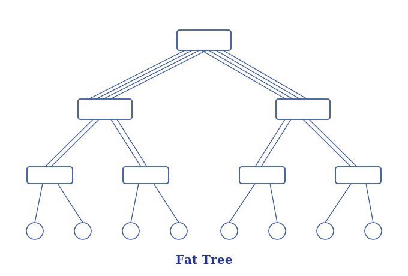
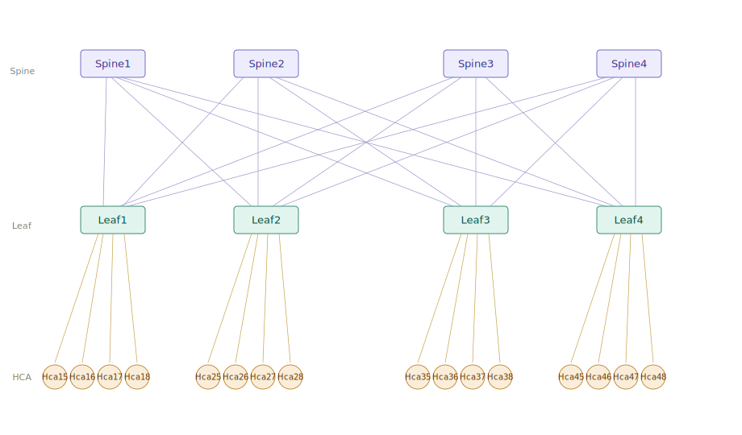

# 第十三章：Infiniband Fabric 路由引擎（继续）

本章我们继续介绍 IB 路由引擎，在开始之前，先让我引入一个新概念：Fat-Tree。

通常，在 IB 中提到 Fat-Tree，说的一种拓扑结构，它是高性能计算（HPC）和 AI 训练集群中最主流的网络架构，其核心设计目标是提供无阻塞或低阻塞的全互联能力。

Fat-Tree 得名于"越靠近核心链路越粗"的设计直觉，但在现代实现中通常指 Clos 网络的一种变体。

其核心目标是：在用多级普通交换机构建大规模互联网络时，仍能为任意端节点对提供无阻塞（non-blocking）的通信路径，即无论有多少 HCA 同时发起通信，都不会因为上行链路带宽不足而产生收敛瓶颈。



标准的两层 Fat-Tree 由三类节点组成：

- Spine 层是核心交换层，负责在不同 Leaf 域之间转发流量。每台 Spine 交换机连接到所有 Leaf 交换机，形成全互联的上行网格。
- Leaf 层是接入层，每台 Leaf 交换机一半端口上连 Spine（上行链路），另一半端口下连主机 HCA（下行链路）。
- HCA（Host Channel Adapter）是服务器侧的 IB 网卡，负责 RDMA 操作的硬件卸载。



以图示拓扑为例：4 台 Spine × 4 台 Leaf × 4 HCA/Leaf = 16 节点，Spine 与 Leaf 之间共 16 条上行链路，任意两台 HCA 之间都存在 4 条等价路径（经由 Spine1/2/3/4），无阻塞设计。

更大规模的集群会扩展为三层结构，增加一层 Super-Spine（或称 Core），支撑数千乃至上万节点的规模，典型部署见于各大云厂商的 GPU 集群。

OpenSM 为 Fat-Tree 拓扑专门设计了一套路由算法，名为 ftree。与 updn 不同，ftree 显式感知 Fat-Tree 的层次结构，将 switch 区分为 Spine（根节点）和 Leaf（叶节点）两个角色，并以每个目标 HCA 为起点向上递归构建路径。在选择上行链路时，对于等价路径，ftree 始终优先选择当前承载路由数最少的 Spine 方向，确保所有目标 LID 的路径在各 Spine 之间尽量均匀分布。在对称拓扑下，这一机制使得去往同一目标 HCA 的流量，无论从哪个 Leaf 出发，都会经过同一个 Spine。

接下来我们会借用上面的 spine-leaf 拓扑图，写一个 ibsim 拓扑文件，让 OpenSM 分别用 updn 和 ftree 两套路由引擎各跑一遍，通过对比它们各自的本地转发表（LFT）来看看 ftree 的工作机制。

## 13.1 ibsim 拓扑文件

ibsim 拓扑文件如下：

```bash
#
Switch  8 "Spine1"
[1]     "Leaf1"[1]
[2]     "Leaf2"[1]
[3]     "Leaf3"[1]
[4]     "Leaf4"[1]

Switch  8 "Spine2"
[1]     "Leaf1"[2]
[2]     "Leaf2"[2]
[3]     "Leaf3"[2]
[4]     "Leaf4"[2]

Switch  8 "Spine3"
[1]     "Leaf1"[3]
[2]     "Leaf2"[3]
[3]     "Leaf3"[3]
[4]     "Leaf4"[3]

Switch  8 "Spine4"
[1]     "Leaf1"[4]
[2]     "Leaf2"[4]
[3]     "Leaf3"[4]
[4]     "Leaf4"[4]

Switch  8 "Leaf1"
[1]     "Spine1"[1]
[2]     "Spine2"[1]
[3]     "Spine3"[1]
[4]     "Spine4"[1]
[5]     "Hca15"[1]
[6]     "Hca16"[1]
[7]     "Hca17"[1]
[8]     "Hca18"[1]

Switch  8 "Leaf2"
[1]     "Spine1"[2]
[2]     "Spine2"[2]
[3]     "Spine3"[2]
[4]     "Spine4"[2]
[5]     "Hca25"[1]
[6]     "Hca26"[1]
[7]     "Hca27"[1]
[8]     "Hca28"[1]

Switch  8 "Leaf3"
[1]     "Spine1"[3]
[2]     "Spine2"[3]
[3]     "Spine3"[3]
[4]     "Spine4"[3]
[5]     "Hca35"[1]
[6]     "Hca36"[1]
[7]     "Hca37"[1]
[8]     "Hca38"[1]

Switch  8 "Leaf4"
[1]     "Spine1"[4]
[2]     "Spine2"[4]
[3]     "Spine3"[4]
[4]     "Spine4"[4]
[5]     "Hca45"[1]
[6]     "Hca46"[1]
[7]     "Hca47"[1]
[8]     "Hca48"[1]

# leaf1
Hca     2 "Hca15"
[1]     "Leaf1"[5]

Hca     2 "Hca16"
[1]     "Leaf1"[6]

Hca     2 "Hca17"
[1]     "Leaf1"[7]

Hca     2 "Hca18"
[1]     "Leaf1"[8]

# leaf2
Hca     2 "Hca25"
[1]     "Leaf2"[5]

Hca     2 "Hca26"
[1]     "Leaf2"[6]

Hca     2 "Hca27"
[1]     "Leaf2"[7]

Hca     2 "Hca28"
[1]     "Leaf2"[8]

# leaf3
Hca     2 "Hca35"
[1]     "Leaf3"[5]

Hca     2 "Hca36"
[1]     "Leaf3"[6]

Hca     2 "Hca37"
[1]     "Leaf3"[7]

Hca     2 "Hca38"
[1]     "Leaf3"[8]

# leaf4
Hca     2 "Hca45"
[1]     "Leaf4"[5]

Hca     2 "Hca46"
[1]     "Leaf4"[6]

Hca     2 "Hca47"
[1]     "Leaf4"[7]

Hca     2 "Hca48"
[1]     "Leaf4"[8]
```

## 13.2 使用 updn 算法

```bash
# terminal 1:
expert@net21:~$ rlwrap ibsim -s ./ib3.net

# terminal 2:
# 手动编写 root 列表，把所有 spine 交换机作为 root
expert@net21:~$ echo "0x200000" > updn-root.guids
expert@net21:~$ echo "0x200001" >> updn-root.guids
expert@net21:~$ echo "0x200002" >> updn-root.guids
expert@net21:~$ echo "0x200003" >> updn-root.guids
# root 列表
expert@net21:~$ cat updn-root.guids
0x200000
0x200001
0x200002
0x200003
# 启动openSM
expert@net21:~$ sudo bash -c 'LD_PRELOAD=/usr/lib/umad2sim/libumad2sim.so rlwrap opensm -q local -R updn -a ./updn-root.guids -f -'
```

ibsim dump 如下：

这里的输出内容比较多，本节仅作展示，后面会和 ftree 的输出做对比分析。

```bash

sim> dump
# Net status - Sun Jun 21 09:33:11 2026

Switch 8 "Spine1"       nodeguid 200000 sysimgguid 200000
#       linearcap 49152 FDBtop 28 portchange 0
#       Forwarding table 0-15: [0]FF [1]0 [2]1 [3]1 [4]FF [5]1 [6]1 [7]1 [8]1 [9]1 [10]FF [11]1 [12]2 [13]FF [14]FF [15]3
#       Forwarding table 16-28: [16]4 [17]2 [18]2 [19]2 [20]2 [21]3 [22]3 [23]3 [24]3 [25]4 [26]4 [27]4 [28]4
200000  [0]     "Sma Port"[0]    lid 1 lmc 0 smlid 1  4x  2.5G Active/LinkUp
200000  [1]     "Leaf1"[1]        4x  2.5G Active/LinkUp
200000  [2]     "Leaf2"[1]        4x  2.5G Active/LinkUp
200000  [3]     "Leaf3"[1]        4x  2.5G Active/LinkUp
200000  [4]     "Leaf4"[1]        4x  2.5G Active/LinkUp
200000  [5]                       4x  2.5G Down/Polling
200000  [6]                       4x  2.5G Down/Polling
200000  [7]                       4x  2.5G Down/Polling
200000  [8]                       4x  2.5G Down/Polling

Switch 8 "Spine2"       nodeguid 200001 sysimgguid 200001
#       linearcap 49152 FDBtop 28 portchange 0
#       Forwarding table 0-15: [0]FF [1]1 [2]1 [3]0 [4]FF [5]1 [6]1 [7]1 [8]1 [9]1 [10]FF [11]1 [12]2 [13]FF [14]FF [15]3
#       Forwarding table 16-28: [16]4 [17]2 [18]2 [19]2 [20]2 [21]3 [22]3 [23]3 [24]3 [25]4 [26]4 [27]4 [28]4
200001  [0]     "Sma Port"[0]    lid 3 lmc 0 smlid 1  4x  2.5G Active/LinkUp
200001  [1]     "Leaf1"[2]        4x  2.5G Active/LinkUp
200001  [2]     "Leaf2"[2]        4x  2.5G Active/LinkUp
200001  [3]     "Leaf3"[2]        4x  2.5G Active/LinkUp
200001  [4]     "Leaf4"[2]        4x  2.5G Active/LinkUp
200001  [5]                       4x  2.5G Down/Polling
200001  [6]                       4x  2.5G Down/Polling
200001  [7]                       4x  2.5G Down/Polling
200001  [8]                       4x  2.5G Down/Polling

Switch 8 "Spine3"       nodeguid 200002 sysimgguid 200002
#       linearcap 49152 FDBtop 28 portchange 0
#       Forwarding table 0-15: [0]FF [1]1 [2]1 [3]1 [4]FF [5]1 [6]0 [7]1 [8]1 [9]1 [10]FF [11]1 [12]2 [13]FF [14]FF [15]3
#       Forwarding table 16-28: [16]4 [17]2 [18]2 [19]2 [20]2 [21]3 [22]3 [23]3 [24]3 [25]4 [26]4 [27]4 [28]4
200002  [0]     "Sma Port"[0]    lid 6 lmc 0 smlid 1  4x  2.5G Active/LinkUp
200002  [1]     "Leaf1"[3]        4x  2.5G Active/LinkUp
200002  [2]     "Leaf2"[3]        4x  2.5G Active/LinkUp
200002  [3]     "Leaf3"[3]        4x  2.5G Active/LinkUp
200002  [4]     "Leaf4"[3]        4x  2.5G Active/LinkUp
200002  [5]                       4x  2.5G Down/Polling
200002  [6]                       4x  2.5G Down/Polling
200002  [7]                       4x  2.5G Down/Polling
200002  [8]                       4x  2.5G Down/Polling

Switch 8 "Spine4"       nodeguid 200003 sysimgguid 200003
#       linearcap 49152 FDBtop 28 portchange 0
#       Forwarding table 0-15: [0]FF [1]1 [2]1 [3]1 [4]FF [5]1 [6]1 [7]0 [8]1 [9]1 [10]FF [11]1 [12]2 [13]FF [14]FF [15]3
#       Forwarding table 16-28: [16]4 [17]2 [18]2 [19]2 [20]2 [21]3 [22]3 [23]3 [24]3 [25]4 [26]4 [27]4 [28]4
200003  [0]     "Sma Port"[0]    lid 7 lmc 0 smlid 1  4x  2.5G Active/LinkUp
200003  [1]     "Leaf1"[4]        4x  2.5G Active/LinkUp
200003  [2]     "Leaf2"[4]        4x  2.5G Active/LinkUp
200003  [3]     "Leaf3"[4]        4x  2.5G Active/LinkUp
200003  [4]     "Leaf4"[4]        4x  2.5G Active/LinkUp
200003  [5]                       4x  2.5G Down/Polling
200003  [6]                       4x  2.5G Down/Polling
200003  [7]                       4x  2.5G Down/Polling
200003  [8]                       4x  2.5G Down/Polling

Switch 8 "Leaf1"        nodeguid 200004 sysimgguid 200004
#       linearcap 49152 FDBtop 28 portchange 0
#       Forwarding table 0-15: [0]FF [1]1 [2]5 [3]2 [4]FF [5]6 [6]3 [7]4 [8]7 [9]8 [10]FF [11]0 [12]1 [13]FF [14]FF [15]1
#       Forwarding table 16-28: [16]1 [17]1 [18]3 [19]4 [20]2 [21]2 [22]3 [23]4 [24]1 [25]1 [26]2 [27]3 [28]4
200004  [0]     "Sma Port"[0]    lid 11 lmc 0 smlid 1  4x  2.5G Active/LinkUp
200004  [1]     "Spine1"[1]       4x  2.5G Active/LinkUp
200004  [2]     "Spine2"[1]       4x  2.5G Active/LinkUp
200004  [3]     "Spine3"[1]       4x  2.5G Active/LinkUp
200004  [4]     "Spine4"[1]       4x  2.5G Active/LinkUp
200004  [5]     "Hca15"[1]        4x  2.5G Active/LinkUp
200004  [6]     "Hca16"[1]        4x  2.5G Active/LinkUp
200004  [7]     "Hca17"[1]        4x  2.5G Active/LinkUp
200004  [8]     "Hca18"[1]        4x  2.5G Active/LinkUp

Switch 8 "Leaf2"        nodeguid 200005 sysimgguid 200005
#       linearcap 49152 FDBtop 28 portchange 0
#       Forwarding table 0-15: [0]FF [1]1 [2]2 [3]2 [4]FF [5]1 [6]3 [7]4 [8]3 [9]4 [10]FF [11]1 [12]0 [13]FF [14]FF [15]1
#       Forwarding table 16-28: [16]1 [17]5 [18]6 [19]7 [20]8 [21]2 [22]4 [23]3 [24]1 [25]4 [26]3 [27]1 [28]2
200005  [0]     "Sma Port"[0]    lid 12 lmc 0 smlid 1  4x  2.5G Active/LinkUp
200005  [1]     "Spine1"[2]       4x  2.5G Active/LinkUp
200005  [2]     "Spine2"[2]       4x  2.5G Active/LinkUp
200005  [3]     "Spine3"[2]       4x  2.5G Active/LinkUp
200005  [4]     "Spine4"[2]       4x  2.5G Active/LinkUp
200005  [5]     "Hca25"[1]        4x  2.5G Active/LinkUp
200005  [6]     "Hca26"[1]        4x  2.5G Active/LinkUp
200005  [7]     "Hca27"[1]        4x  2.5G Active/LinkUp
200005  [8]     "Hca28"[1]        4x  2.5G Active/LinkUp

Switch 8 "Leaf3"        nodeguid 200006 sysimgguid 200006
#       linearcap 49152 FDBtop 28 portchange 0
#       Forwarding table 0-15: [0]FF [1]1 [2]1 [3]2 [4]FF [5]3 [6]3 [7]4 [8]4 [9]2 [10]FF [11]1 [12]1 [13]FF [14]FF [15]0
#       Forwarding table 16-28: [16]1 [17]1 [18]3 [19]4 [20]2 [21]5 [22]6 [23]7 [24]8 [25]3 [26]4 [27]1 [28]2
200006  [0]     "Sma Port"[0]    lid 15 lmc 0 smlid 1  4x  2.5G Active/LinkUp
200006  [1]     "Spine1"[3]       4x  2.5G Active/LinkUp
200006  [2]     "Spine2"[3]       4x  2.5G Active/LinkUp
200006  [3]     "Spine3"[3]       4x  2.5G Active/LinkUp
200006  [4]     "Spine4"[3]       4x  2.5G Active/LinkUp
200006  [5]     "Hca35"[1]        4x  2.5G Active/LinkUp
200006  [6]     "Hca36"[1]        4x  2.5G Active/LinkUp
200006  [7]     "Hca37"[1]        4x  2.5G Active/LinkUp
200006  [8]     "Hca38"[1]        4x  2.5G Active/LinkUp

Switch 8 "Leaf4"        nodeguid 200007 sysimgguid 200007
#       linearcap 49152 FDBtop 28 portchange 0
#       Forwarding table 0-15: [0]FF [1]1 [2]2 [3]2 [4]FF [5]4 [6]3 [7]4 [8]3 [9]1 [10]FF [11]1 [12]1 [13]FF [14]FF [15]1
#       Forwarding table 16-28: [16]0 [17]4 [18]2 [19]3 [20]1 [21]4 [22]3 [23]1 [24]2 [25]5 [26]6 [27]7 [28]8
200007  [0]     "Sma Port"[0]    lid 16 lmc 0 smlid 1  4x  2.5G Active/LinkUp
200007  [1]     "Spine1"[4]       4x  2.5G Active/LinkUp
200007  [2]     "Spine2"[4]       4x  2.5G Active/LinkUp
200007  [3]     "Spine3"[4]       4x  2.5G Active/LinkUp
200007  [4]     "Spine4"[4]       4x  2.5G Active/LinkUp
200007  [5]     "Hca45"[1]        4x  2.5G Active/LinkUp
200007  [6]     "Hca46"[1]        4x  2.5G Active/LinkUp
200007  [7]     "Hca47"[1]        4x  2.5G Active/LinkUp
200007  [8]     "Hca48"[1]        4x  2.5G Active/LinkUp

Ca 2 "Hca15"    nodeguid 100000 sysimgguid 100000
100001  [1]     "Leaf1"[5]       lid 2 lmc 0 smlid 1  4x  2.5G Active/LinkUp
100002  [2]                      lid 0 lmc 0 smlid 0  4x  2.5G Down/Polling

Ca 2 "Hca16"    nodeguid 100003 sysimgguid 100003
100004  [1]     "Leaf1"[6]       lid 5 lmc 0 smlid 1  4x  2.5G Active/LinkUp
100005  [2]                      lid 0 lmc 0 smlid 0  4x  2.5G Down/Polling

Ca 2 "Hca17"    nodeguid 100006 sysimgguid 100006
100007  [1]     "Leaf1"[7]       lid 8 lmc 0 smlid 1  4x  2.5G Active/LinkUp
100008  [2]                      lid 0 lmc 0 smlid 0  4x  2.5G Down/Polling

Ca 2 "Hca18"    nodeguid 100009 sysimgguid 100009
10000a  [1]     "Leaf1"[8]       lid 9 lmc 0 smlid 1  4x  2.5G Active/LinkUp
10000b  [2]                      lid 0 lmc 0 smlid 0  4x  2.5G Down/Polling

Ca 2 "Hca25"    nodeguid 10000c sysimgguid 10000c
10000d  [1]     "Leaf2"[5]       lid 17 lmc 0 smlid 1  4x  2.5G Active/LinkUp
10000e  [2]                      lid 0 lmc 0 smlid 0  4x  2.5G Down/Polling

Ca 2 "Hca26"    nodeguid 10000f sysimgguid 10000f
100010  [1]     "Leaf2"[6]       lid 18 lmc 0 smlid 1  4x  2.5G Active/LinkUp
100011  [2]                      lid 0 lmc 0 smlid 0  4x  2.5G Down/Polling

Ca 2 "Hca27"    nodeguid 100012 sysimgguid 100012
100013  [1]     "Leaf2"[7]       lid 19 lmc 0 smlid 1  4x  2.5G Active/LinkUp
100014  [2]                      lid 0 lmc 0 smlid 0  4x  2.5G Down/Polling

Ca 2 "Hca28"    nodeguid 100015 sysimgguid 100015
100016  [1]     "Leaf2"[8]       lid 20 lmc 0 smlid 1  4x  2.5G Active/LinkUp
100017  [2]                      lid 0 lmc 0 smlid 0  4x  2.5G Down/Polling

Ca 2 "Hca35"    nodeguid 100018 sysimgguid 100018
100019  [1]     "Leaf3"[5]       lid 21 lmc 0 smlid 1  4x  2.5G Active/LinkUp
10001a  [2]                      lid 0 lmc 0 smlid 0  4x  2.5G Down/Polling

Ca 2 "Hca36"    nodeguid 10001b sysimgguid 10001b
10001c  [1]     "Leaf3"[6]       lid 22 lmc 0 smlid 1  4x  2.5G Active/LinkUp
10001d  [2]                      lid 0 lmc 0 smlid 0  4x  2.5G Down/Polling

Ca 2 "Hca37"    nodeguid 10001e sysimgguid 10001e
10001f  [1]     "Leaf3"[7]       lid 23 lmc 0 smlid 1  4x  2.5G Active/LinkUp
100020  [2]                      lid 0 lmc 0 smlid 0  4x  2.5G Down/Polling

Ca 2 "Hca38"    nodeguid 100021 sysimgguid 100021
100022  [1]     "Leaf3"[8]       lid 24 lmc 0 smlid 1  4x  2.5G Active/LinkUp
100023  [2]                      lid 0 lmc 0 smlid 0  4x  2.5G Down/Polling

Ca 2 "Hca45"    nodeguid 100024 sysimgguid 100024
100025  [1]     "Leaf4"[5]       lid 25 lmc 0 smlid 1  4x  2.5G Active/LinkUp
100026  [2]                      lid 0 lmc 0 smlid 0  4x  2.5G Down/Polling

Ca 2 "Hca46"    nodeguid 100027 sysimgguid 100027
100028  [1]     "Leaf4"[6]       lid 26 lmc 0 smlid 1  4x  2.5G Active/LinkUp
100029  [2]                      lid 0 lmc 0 smlid 0  4x  2.5G Down/Polling

Ca 2 "Hca47"    nodeguid 10002a sysimgguid 10002a
10002b  [1]     "Leaf4"[7]       lid 27 lmc 0 smlid 1  4x  2.5G Active/LinkUp
10002c  [2]                      lid 0 lmc 0 smlid 0  4x  2.5G Down/Polling

Ca 2 "Hca48"    nodeguid 10002d sysimgguid 10002d
10002e  [1]     "Leaf4"[8]       lid 28 lmc 0 smlid 1  4x  2.5G Active/LinkUp
10002f  [2]                      lid 0 lmc 0 smlid 0  4x  2.5G Down/Polling
#  dumped 24 nodes
```

## 13.3 使用 ftree 算法

```bash
# terminal 1:
expert@net21:~$ rlwrap ibsim -s ./ib3.net

# terminal 2:
# 启动openSM
expert@net21:~$ sudo bash -c 'LD_PRELOAD=/usr/lib/umad2sim/libumad2sim.so rlwrap opensm -q local -R ftree -f -'
-------------------------------------------------
OpenSM 5.21.12.MLNX20250617.f74e01b8
Command Line Arguments:
 Activate 'ftree' routing engine(s)
 Log File: -
-------------------------------------------------
Jun 21 09:37:44 183855 [67AFF740] 0x03 -> OpenSM 5.21.12.MLNX20250617.f74e01b8
Jun 21 09:37:44 184100 [67AFF740] 0x80 -> OpenSM 5.21.12.MLNX20250617.f74e01b8
ibwarn: [10494] sim_connect: attached as client 0 at node "Spine1"
Jun 21 09:37:44 202127 [67AFF740] 0x02 -> osm_vendor_init: 1000 pending umads specified
Jun 21 09:37:44 202525 [67AFF740] 0x02 -> osm_vendor_init: 1000 pending umads specified
Jun 21 09:37:44 202875 [67AFF740] 0x02 -> osm_vendor_init: 1000 pending umads specified
Using default GUID 0x200000
Jun 21 09:37:44 216993 [67AFF740] 0x02 -> osm_tenant_mgr_init: tenant mgr is disabled
Jun 21 09:37:44 217837 [67AFF740] 0x02 -> osm_issu_mgr_init: issu_mgr is initialized
Jun 21 09:37:44 218023 [67AFF740] 0x80 -> Entering DISCOVERING state
Jun 21 09:37:44 219887 [67AFF740] 0x02 -> osm_vendor_rebind: Mgmt class 0x81 binding to port GUID 0x200000
Jun 21 09:37:44 232382 [67AFF740] 0x02 -> osm_sm_bind: Bind to port guid 0x200000, port index 0 as main SM port
Jun 21 09:37:44 232506 [67AFF740] 0x02 -> osm_vendor_rebind: Mgmt class 0x03 binding to port GUID 0x200000
Jun 21 09:37:44 242408 [67AFF740] 0x02 -> osm_vendor_rebind: Mgmt class 0x04 binding to port GUID 0x200000
Jun 21 09:37:44 242512 [67AFF740] 0x02 -> osm_vendor_rebind: Mgmt class 0x21 binding to port GUID 0x200000
Jun 21 09:37:44 242589 [67AFF740] 0x02 -> osm_vendor_rebind: Mgmt class 0x0a binding to port GUID 0x200000
Jun 21 09:37:44 242755 [67AFF740] 0x02 -> osm_vendor_rebind: Mgmt class 0x0c binding to port GUID 0x200000
Jun 21 09:37:44 242890 [67AFF740] 0x02 -> osm_opensm_bind: Setting IS_SM on port 0x0000000000200000
OpenSM $ Jun 21 09:37:44 243429 [577FE6C0] 0x02 -> do_sweep:


******************************************************************
*********************** HEAVY SWEEP START ************************
******************************************************************


Jun 21 09:37:44 243554 [577FE6C0] 0x02 -> do_sweep: Entering heavy sweep with flags: force_heavy_sweep 0, coming out of standby 0, subnet initialization error 0, sm port change 0
Jun 21 09:37:44 272294 [577FE6C0] 0x80 -> Entering MASTER state
Jun 21 09:37:44 280294 [577FE6C0] 0x02 -> fabric_dump_general_info: General fabric topology info
Jun 21 09:37:44 280425 [577FE6C0] 0x02 -> fabric_dump_general_info: ============================
Jun 21 09:37:44 280527 [577FE6C0] 0x02 -> fabric_dump_general_info:   - FatTree rank (roots to leaf switches): 2
Jun 21 09:37:44 280618 [577FE6C0] 0x02 -> fabric_dump_general_info:   - FatTree max switch rank: 1
Jun 21 09:37:44 280746 [577FE6C0] 0x02 -> fabric_dump_general_info:   - Fabric has 0 Routers which are considered as IO nodes
Jun 21 09:37:44 280840 [577FE6C0] 0x02 -> fabric_dump_general_info:   - Fabric has 16 CAs, 16 CA ports (16 of them CNs), 8 switches
Jun 21 09:37:44 280941 [577FE6C0] 0x02 -> fabric_dump_general_info:   - Fabric has 4 switches at rank 0 (roots)
Jun 21 09:37:44 281044 [577FE6C0] 0x02 -> fabric_dump_general_info:   - Fabric has 4 switches at rank 1 (4 of them leafs)
Jun 21 09:37:44 283581 [577FE6C0] 0x02 -> osm_ucast_mgr_process: ftree tables configured on all switches
Jun 21 09:37:44 356901 [577FE6C0] 0x02 -> SUBNET UP

OpenSM $
OpenSM $
```

从 SM 的启动日志可以看到，**ftree 成功识别了两层结构**，知道 Spine 是 rank0（root），Leaf 是 rank1。而 updn 需要手工指定 root 列表，并且只做 BFS 层级标记，不识别 fat-tree 的树结构。

ibsim dump 如下：

这里的输出内容比较多，本节仅作展示，后面会和 updn 的输出做对比分析。

```bash
sim> dump
# Net status - Sun Jun 21 09:26:08 2026

Switch 8 "Spine1"       nodeguid 200000 sysimgguid 200000
#       linearcap 49152 FDBtop 28 portchange 0
#       Forwarding table 0-15: [0]FF [1]0 [2]1 [3]1 [4]FF [5]1 [6]1 [7]1 [8]1 [9]1 [10]FF [11]1 [12]2 [13]FF [14]FF [15]3
#       Forwarding table 16-28: [16]4 [17]2 [18]2 [19]2 [20]2 [21]3 [22]3 [23]3 [24]3 [25]4 [26]4 [27]4 [28]4
200000  [0]     "Sma Port"[0]    lid 1 lmc 0 smlid 1  4x  2.5G Active/LinkUp
200000  [1]     "Leaf1"[1]        4x  2.5G Active/LinkUp
200000  [2]     "Leaf2"[1]        4x  2.5G Active/LinkUp
200000  [3]     "Leaf3"[1]        4x  2.5G Active/LinkUp
200000  [4]     "Leaf4"[1]        4x  2.5G Active/LinkUp
200000  [5]                       4x  2.5G Down/Polling
200000  [6]                       4x  2.5G Down/Polling
200000  [7]                       4x  2.5G Down/Polling
200000  [8]                       4x  2.5G Down/Polling

Switch 8 "Spine2"       nodeguid 200001 sysimgguid 200001
#       linearcap 49152 FDBtop 28 portchange 0
#       Forwarding table 0-15: [0]FF [1]1 [2]1 [3]0 [4]FF [5]1 [6]1 [7]1 [8]1 [9]1 [10]FF [11]1 [12]2 [13]FF [14]FF [15]3
#       Forwarding table 16-28: [16]4 [17]2 [18]2 [19]2 [20]2 [21]3 [22]3 [23]3 [24]3 [25]4 [26]4 [27]4 [28]4
200001  [0]     "Sma Port"[0]    lid 3 lmc 0 smlid 1  4x  2.5G Active/LinkUp
200001  [1]     "Leaf1"[2]        4x  2.5G Active/LinkUp
200001  [2]     "Leaf2"[2]        4x  2.5G Active/LinkUp
200001  [3]     "Leaf3"[2]        4x  2.5G Active/LinkUp
200001  [4]     "Leaf4"[2]        4x  2.5G Active/LinkUp
200001  [5]                       4x  2.5G Down/Polling
200001  [6]                       4x  2.5G Down/Polling
200001  [7]                       4x  2.5G Down/Polling
200001  [8]                       4x  2.5G Down/Polling

Switch 8 "Spine3"       nodeguid 200002 sysimgguid 200002
#       linearcap 49152 FDBtop 28 portchange 0
#       Forwarding table 0-15: [0]FF [1]1 [2]1 [3]1 [4]FF [5]1 [6]0 [7]1 [8]1 [9]1 [10]FF [11]1 [12]2 [13]FF [14]FF [15]3
#       Forwarding table 16-28: [16]4 [17]2 [18]2 [19]2 [20]2 [21]3 [22]3 [23]3 [24]3 [25]4 [26]4 [27]4 [28]4
200002  [0]     "Sma Port"[0]    lid 6 lmc 0 smlid 1  4x  2.5G Active/LinkUp
200002  [1]     "Leaf1"[3]        4x  2.5G Active/LinkUp
200002  [2]     "Leaf2"[3]        4x  2.5G Active/LinkUp
200002  [3]     "Leaf3"[3]        4x  2.5G Active/LinkUp
200002  [4]     "Leaf4"[3]        4x  2.5G Active/LinkUp
200002  [5]                       4x  2.5G Down/Polling
200002  [6]                       4x  2.5G Down/Polling
200002  [7]                       4x  2.5G Down/Polling
200002  [8]                       4x  2.5G Down/Polling

Switch 8 "Spine4"       nodeguid 200003 sysimgguid 200003
#       linearcap 49152 FDBtop 28 portchange 0
#       Forwarding table 0-15: [0]FF [1]1 [2]1 [3]1 [4]FF [5]1 [6]1 [7]0 [8]1 [9]1 [10]FF [11]1 [12]2 [13]FF [14]FF [15]3
#       Forwarding table 16-28: [16]4 [17]2 [18]2 [19]2 [20]2 [21]3 [22]3 [23]3 [24]3 [25]4 [26]4 [27]4 [28]4
200003  [0]     "Sma Port"[0]    lid 7 lmc 0 smlid 1  4x  2.5G Active/LinkUp
200003  [1]     "Leaf1"[4]        4x  2.5G Active/LinkUp
200003  [2]     "Leaf2"[4]        4x  2.5G Active/LinkUp
200003  [3]     "Leaf3"[4]        4x  2.5G Active/LinkUp
200003  [4]     "Leaf4"[4]        4x  2.5G Active/LinkUp
200003  [5]                       4x  2.5G Down/Polling
200003  [6]                       4x  2.5G Down/Polling
200003  [7]                       4x  2.5G Down/Polling
200003  [8]                       4x  2.5G Down/Polling

Switch 8 "Leaf1"        nodeguid 200004 sysimgguid 200004
#       linearcap 49152 FDBtop 28 portchange 0
#       Forwarding table 0-15: [0]FF [1]1 [2]5 [3]2 [4]FF [5]6 [6]3 [7]4 [8]7 [9]8 [10]FF [11]0 [12]1 [13]FF [14]FF [15]1
#       Forwarding table 16-28: [16]1 [17]1 [18]2 [19]3 [20]4 [21]1 [22]2 [23]3 [24]4 [25]1 [26]2 [27]3 [28]4
200004  [0]     "Sma Port"[0]    lid 11 lmc 0 smlid 1  4x  2.5G Active/LinkUp
200004  [1]     "Spine1"[1]       4x  2.5G Active/LinkUp
200004  [2]     "Spine2"[1]       4x  2.5G Active/LinkUp
200004  [3]     "Spine3"[1]       4x  2.5G Active/LinkUp
200004  [4]     "Spine4"[1]       4x  2.5G Active/LinkUp
200004  [5]     "Hca15"[1]        4x  2.5G Active/LinkUp
200004  [6]     "Hca16"[1]        4x  2.5G Active/LinkUp
200004  [7]     "Hca17"[1]        4x  2.5G Active/LinkUp
200004  [8]     "Hca18"[1]        4x  2.5G Active/LinkUp

Switch 8 "Leaf2"        nodeguid 200005 sysimgguid 200005
#       linearcap 49152 FDBtop 28 portchange 0
#       Forwarding table 0-15: [0]FF [1]1 [2]1 [3]2 [4]FF [5]2 [6]3 [7]4 [8]3 [9]4 [10]FF [11]1 [12]0 [13]FF [14]FF [15]1
#       Forwarding table 16-28: [16]1 [17]5 [18]6 [19]7 [20]8 [21]1 [22]2 [23]3 [24]4 [25]1 [26]2 [27]3 [28]4
200005  [0]     "Sma Port"[0]    lid 12 lmc 0 smlid 1  4x  2.5G Active/LinkUp
200005  [1]     "Spine1"[2]       4x  2.5G Active/LinkUp
200005  [2]     "Spine2"[2]       4x  2.5G Active/LinkUp
200005  [3]     "Spine3"[2]       4x  2.5G Active/LinkUp
200005  [4]     "Spine4"[2]       4x  2.5G Active/LinkUp
200005  [5]     "Hca25"[1]        4x  2.5G Active/LinkUp
200005  [6]     "Hca26"[1]        4x  2.5G Active/LinkUp
200005  [7]     "Hca27"[1]        4x  2.5G Active/LinkUp
200005  [8]     "Hca28"[1]        4x  2.5G Active/LinkUp

Switch 8 "Leaf3"        nodeguid 200006 sysimgguid 200006
#       linearcap 49152 FDBtop 28 portchange 0
#       Forwarding table 0-15: [0]FF [1]1 [2]1 [3]2 [4]FF [5]2 [6]3 [7]4 [8]3 [9]4 [10]FF [11]1 [12]1 [13]FF [14]FF [15]0
#       Forwarding table 16-28: [16]1 [17]1 [18]2 [19]3 [20]4 [21]5 [22]6 [23]7 [24]8 [25]1 [26]2 [27]3 [28]4
200006  [0]     "Sma Port"[0]    lid 15 lmc 0 smlid 1  4x  2.5G Active/LinkUp
200006  [1]     "Spine1"[3]       4x  2.5G Active/LinkUp
200006  [2]     "Spine2"[3]       4x  2.5G Active/LinkUp
200006  [3]     "Spine3"[3]       4x  2.5G Active/LinkUp
200006  [4]     "Spine4"[3]       4x  2.5G Active/LinkUp
200006  [5]     "Hca35"[1]        4x  2.5G Active/LinkUp
200006  [6]     "Hca36"[1]        4x  2.5G Active/LinkUp
200006  [7]     "Hca37"[1]        4x  2.5G Active/LinkUp
200006  [8]     "Hca38"[1]        4x  2.5G Active/LinkUp

Switch 8 "Leaf4"        nodeguid 200007 sysimgguid 200007
#       linearcap 49152 FDBtop 28 portchange 0
#       Forwarding table 0-15: [0]FF [1]1 [2]1 [3]2 [4]FF [5]2 [6]3 [7]4 [8]3 [9]4 [10]FF [11]1 [12]1 [13]FF [14]FF [15]1
#       Forwarding table 16-28: [16]0 [17]1 [18]2 [19]3 [20]4 [21]1 [22]2 [23]3 [24]4 [25]5 [26]6 [27]7 [28]8
200007  [0]     "Sma Port"[0]    lid 16 lmc 0 smlid 1  4x  2.5G Active/LinkUp
200007  [1]     "Spine1"[4]       4x  2.5G Active/LinkUp
200007  [2]     "Spine2"[4]       4x  2.5G Active/LinkUp
200007  [3]     "Spine3"[4]       4x  2.5G Active/LinkUp
200007  [4]     "Spine4"[4]       4x  2.5G Active/LinkUp
200007  [5]     "Hca45"[1]        4x  2.5G Active/LinkUp
200007  [6]     "Hca46"[1]        4x  2.5G Active/LinkUp
200007  [7]     "Hca47"[1]        4x  2.5G Active/LinkUp
200007  [8]     "Hca48"[1]        4x  2.5G Active/LinkUp

Ca 2 "Hca15"    nodeguid 100000 sysimgguid 100000
100001  [1]     "Leaf1"[5]       lid 2 lmc 0 smlid 1  4x  2.5G Active/LinkUp
100002  [2]                      lid 0 lmc 0 smlid 0  4x  2.5G Down/Polling

Ca 2 "Hca16"    nodeguid 100003 sysimgguid 100003
100004  [1]     "Leaf1"[6]       lid 5 lmc 0 smlid 1  4x  2.5G Active/LinkUp
100005  [2]                      lid 0 lmc 0 smlid 0  4x  2.5G Down/Polling

Ca 2 "Hca17"    nodeguid 100006 sysimgguid 100006
100007  [1]     "Leaf1"[7]       lid 8 lmc 0 smlid 1  4x  2.5G Active/LinkUp
100008  [2]                      lid 0 lmc 0 smlid 0  4x  2.5G Down/Polling

Ca 2 "Hca18"    nodeguid 100009 sysimgguid 100009
10000a  [1]     "Leaf1"[8]       lid 9 lmc 0 smlid 1  4x  2.5G Active/LinkUp
10000b  [2]                      lid 0 lmc 0 smlid 0  4x  2.5G Down/Polling

Ca 2 "Hca25"    nodeguid 10000c sysimgguid 10000c
10000d  [1]     "Leaf2"[5]       lid 17 lmc 0 smlid 1  4x  2.5G Active/LinkUp
10000e  [2]                      lid 0 lmc 0 smlid 0  4x  2.5G Down/Polling

Ca 2 "Hca26"    nodeguid 10000f sysimgguid 10000f
100010  [1]     "Leaf2"[6]       lid 18 lmc 0 smlid 1  4x  2.5G Active/LinkUp
100011  [2]                      lid 0 lmc 0 smlid 0  4x  2.5G Down/Polling

Ca 2 "Hca27"    nodeguid 100012 sysimgguid 100012
100013  [1]     "Leaf2"[7]       lid 19 lmc 0 smlid 1  4x  2.5G Active/LinkUp
100014  [2]                      lid 0 lmc 0 smlid 0  4x  2.5G Down/Polling

Ca 2 "Hca28"    nodeguid 100015 sysimgguid 100015
100016  [1]     "Leaf2"[8]       lid 20 lmc 0 smlid 1  4x  2.5G Active/LinkUp
100017  [2]                      lid 0 lmc 0 smlid 0  4x  2.5G Down/Polling

Ca 2 "Hca35"    nodeguid 100018 sysimgguid 100018
100019  [1]     "Leaf3"[5]       lid 21 lmc 0 smlid 1  4x  2.5G Active/LinkUp
10001a  [2]                      lid 0 lmc 0 smlid 0  4x  2.5G Down/Polling

Ca 2 "Hca36"    nodeguid 10001b sysimgguid 10001b
10001c  [1]     "Leaf3"[6]       lid 22 lmc 0 smlid 1  4x  2.5G Active/LinkUp
10001d  [2]                      lid 0 lmc 0 smlid 0  4x  2.5G Down/Polling

Ca 2 "Hca37"    nodeguid 10001e sysimgguid 10001e
10001f  [1]     "Leaf3"[7]       lid 23 lmc 0 smlid 1  4x  2.5G Active/LinkUp
100020  [2]                      lid 0 lmc 0 smlid 0  4x  2.5G Down/Polling

Ca 2 "Hca38"    nodeguid 100021 sysimgguid 100021
100022  [1]     "Leaf3"[8]       lid 24 lmc 0 smlid 1  4x  2.5G Active/LinkUp
100023  [2]                      lid 0 lmc 0 smlid 0  4x  2.5G Down/Polling

Ca 2 "Hca45"    nodeguid 100024 sysimgguid 100024
100025  [1]     "Leaf4"[5]       lid 25 lmc 0 smlid 1  4x  2.5G Active/LinkUp
100026  [2]                      lid 0 lmc 0 smlid 0  4x  2.5G Down/Polling

Ca 2 "Hca46"    nodeguid 100027 sysimgguid 100027
100028  [1]     "Leaf4"[6]       lid 26 lmc 0 smlid 1  4x  2.5G Active/LinkUp
100029  [2]                      lid 0 lmc 0 smlid 0  4x  2.5G Down/Polling

Ca 2 "Hca47"    nodeguid 10002a sysimgguid 10002a
10002b  [1]     "Leaf4"[7]       lid 27 lmc 0 smlid 1  4x  2.5G Active/LinkUp
10002c  [2]                      lid 0 lmc 0 smlid 0  4x  2.5G Down/Polling

Ca 2 "Hca48"    nodeguid 10002d sysimgguid 10002d
10002e  [1]     "Leaf4"[8]       lid 28 lmc 0 smlid 1  4x  2.5G Active/LinkUp
10002f  [2]                      lid 0 lmc 0 smlid 0  4x  2.5G Down/Polling
#  dumped 24 nodes
```

## 13.3 对比分析

首先，针对两套路由算法的输出，我们先总结一致的部分：

两套算法，LID 分配结果都是相同的，因为 LID 分配是发现阶段的工作，总结如下：

```
Leaf1下： Hca15=lid2,  Hca16=lid5,  Hca17=lid8,  Hca18=lid9
Leaf2下： Hca25=lid17, Hca26=lid18, Hca27=lid19, Hca28=lid20
Leaf3下： Hca35=lid21, Hca36=lid22, Hca37=lid23, Hca38=lid24
Leaf4下： Hca45=lid25, Hca46=lid26, Hca47=lid27, Hca48=lid28
```

所有 Leaf 与 Spine 相连的端口映射：port1=Spine1, port2=Spine2, port3=Spine3, port4=Spine4

---

### updn LFT

**Leaf1 LFT (updn)：**

```
[Hca25]Sp1 [Hca26]Sp3 [Hca27]Sp4 [Hca28]Sp2    ← 去Leaf2
[Hca35]Sp2 [Hca36]Sp3 [Hca37]Sp4 [Hca38]Sp1    ← 去Leaf3
[Hca45]Sp1 [Hca46]Sp2 [Hca47]Sp3 [Hca48]Sp4    ← 去Leaf4
```

**Leaf2 LFT (updn)：**

```
[Hca15]Sp2 [Hca16]Sp1 [Hca17]Sp3 [Hca18]Sp4    ← 去Leaf1
[Hca35]Sp2 [Hca36]Sp4 [Hca37]Sp3 [Hca38]Sp1    ← 去Leaf3
[Hca45]Sp4 [Hca46]Sp3 [Hca47]Sp1 [Hca48]Sp2    ← 去Leaf4
```

**Leaf3 LFT (updn)：**

```
[Hca15]Sp1 [Hca16]Sp3 [Hca17]Sp4 [Hca18]Sp2    ← 去Leaf1
[Hca25]Sp1 [Hca26]Sp3 [Hca27]Sp4 [Hca28]Sp2    ← 去Leaf2
[Hca45]Sp3 [Hca46]Sp4 [Hca47]Sp1 [Hca48]Sp2    ← 去Leaf4
```

**Leaf4 LFT (updn)：**

```
[Hca15]Sp2 [Hca16]Sp4 [Hca17]Sp3 [Hca18]Sp1    ← 去Leaf1
[Hca25]Sp4 [Hca26]Sp2 [Hca27]Sp3 [Hca28]Sp1    ← 去Leaf2
[Hca35]Sp4 [Hca36]Sp3 [Hca37]Sp1 [Hca38]Sp2    ← 去Leaf3
```

### ftree LFT

**Leaf1 LFT (ftree)：**

```
[Hca25]Sp1 [Hca26]Sp2 [Hca27]Sp3 [Hca28]Sp4    ← 去Leaf2
[Hca35]Sp1 [Hca36]Sp2 [Hca37]Sp3 [Hca38]Sp4    ← 去Leaf3
[Hca45]Sp1 [Hca46]Sp2 [Hca47]Sp3 [Hca48]Sp4    ← 去Leaf4
```

**Leaf2 LFT (ftree)：**

```
[Hca15]Sp1 [Hca16]Sp2 [Hca17]Sp3 [Hca18]Sp4    ← 去Leaf1
[Hca35]Sp1 [Hca36]Sp2 [Hca37]Sp3 [Hca38]Sp4    ← 去Leaf3
[Hca45]Sp1 [Hca46]Sp2 [Hca47]Sp3 [Hca48]Sp4    ← 去Leaf4
```

**Leaf3 LFT (ftree)：**

```
[Hca15]Sp1 [Hca16]Sp2 [Hca17]Sp3 [Hca18]Sp4    ← 去Leaf1
[Hca25]Sp1 [Hca26]Sp2 [Hca27]Sp3 [Hca28]Sp4    ← 去Leaf2
[Hca45]Sp1 [Hca46]Sp2 [Hca47]Sp3 [Hca48]Sp4    ← 去Leaf4
```

**Leaf4 LFT (ftree)：**

```
[Hca15]Sp1 [Hca16]Sp2 [Hca17]Sp3 [Hca18]Sp4    ← 去Leaf1
[Hca25]Sp1 [Hca26]Sp2 [Hca27]Sp3 [Hca28]Sp4    ← 去Leaf2
[Hca35]Sp1 [Hca36]Sp2 [Hca37]Sp3 [Hca38]Sp4    ← 去Leaf3
```

通过对比，可以从两个维度来理解两种算法的差异：

**从单个 Leaf 的视角看**，两种算法都实现了均衡：去往同一目标 Leaf 的4个 HCA，被分散到了4个不同的 Spine，每个 Spine 各承担一条路径。这一点 updn 和 ftree 并无本质区别。

**跨 Leaf 横向对比时，差异就出现了。** 以去往 Hca25 为例：

```
updn：Leaf1→Sp1，Leaf3→Sp1，Leaf4→Sp4   （不一致）
ftree：Leaf1→Sp1，Leaf3→Sp1，Leaf4→Sp1  （完全一致）
```

造成这种差异的根本原因在于两种算法的 LFT 写入机制不同。

updn 的 LFT 由 OpenSM 通用路由管理器写入，当存在等价路径时，选 port 的依据是"当前哪个 port 上分配的路径数最少"，处理 LID 的顺序则由各节点的 GUID 数值大小决定。由于不同 Leaf 下的 HCA 有不同的 GUID，处理顺序不同，导致各 Leaf 在面对同一目标时，可用 port 的负载状态已经不同，最终选出的 Spine 也就各异。

ftree 则有自己独立的 LFT 写入逻辑，以每个目标 HCA 为起点向上递归，当存在等价路径时，选择当前承载下行路由数最少的 Spine 方向。在我们这个完全对称的拓扑中，处理每个目标 HCA 时各 Spine 的负载状态完全相同，所以每次都选了同一个 Spine，呈现出全局一致的映射关系。需要指出的是，这种一致性是**对称拓扑与均衡算法共同作用的结果**，而非 ftree 的硬编码规则，如果拓扑不对称，ftree 的结果同样会因 Leaf 而异。

不过，本章中涉及的两种算法有一个共同的**根本局限：路由表在子网初始化时由 SM 静态计算写入，此后不再改变**。当实际流量出现不均衡时，无论哪种算法都无法在运行时做出调整。这正是下一章的自适应路由（adaptive routing）需要解决的问题。
