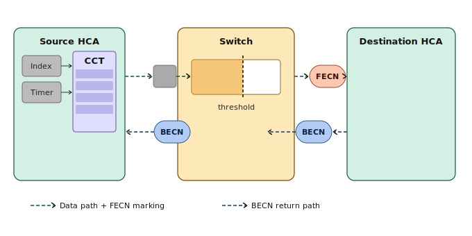

# 第十七章：Infiniband Fabric 的拥塞控制

## 17.1 为什么"无损"还需要拥塞控制

到这里，我们要触碰一个很多同行一开始会觉得矛盾的问题：**IB 不是天生无损吗？链路层的 credit 流控不是已经保证不丢包了吗？那还要"拥塞控制（Congestion Control，CC）"干什么？**

如果你接触过 SAN 网络，就不会感到奇怪：SAN 网络运维中，最头疼的问题，就是拥塞（Slow drain）。所以“拥塞”是无损网络的共性问题。

要搞明白“拥塞控制”是什么，那就有必要先澄清一个概念上误区：流控 ≠ 拥塞控制。

**链路层流控（flow control）解决的是"不丢包"。** 我们在介绍 IB 交换机原理时说过：IB 交换机要往下一跳发包，必须先拿到对方的 credit（确认有空闲缓冲）。没有 credit 就不发。于是，IB 包永远不会因为缓冲溢出而被丢弃。这是**逐跳（hop-by-hop）、链路级**的机制。

但"不丢包"不等于"不拥塞"。设想一个经典的 **incast（多打一）** 场景：成百上千个 GPU 在 AllReduce 的某个阶段同时往一个节点发梯度。目的端的那条链路带宽是有限的，吃不下这么多流量，于是：

1. 目的端口的缓冲迅速被填满，它停止给上游发 credit；
2. 上游交换机的缓冲也开始堆积，于是它也停止给**它的**上游发 credit；
3. 这个"缓冲填满 → 收回 credit"的背压（backpressure）沿着路径**一跳一跳往源头方向蔓延**...

结果就是无损网络里臭名昭著的 **拥塞扩散（congestion spreading）/ 拥塞树（congestion tree）**。更糟的是它会殃及无辜：**那些根本不发往热点、只是恰好共享了沿途某个缓冲的"过路流量"，也会被一起堵死**，这就是所谓的**受害者流量（victim flow）**。

**链路层流控对拥塞无能为力**：它只会忠实地把背压一级级传回去，反而成了拥塞扩散的"帮凶"。要从根上解决，必须做一件流控做不到的事：**让真正制造拥塞的那些源头主动慢下来。**

这件事，就是**拥塞控制（Congestion Control，CC）** 。它是**端到端**的、闭环的、面向**源端注入速率**的控制。

> 总结：**流控管"链路上不丢包"，拥塞控制管"源头别灌太猛"。两者正交，缺一不可。**

---

## 17.2 IB CC 的闭环：检测—通知—反应

IB 的拥塞控制是一个标准的闭环反馈系统，由三个角色接力完成。先看全貌：


如图所示：整个机制由三个角色协作完成：交换机负责检测并标记拥塞，目的端 HCA 负责转发通知，源端 HCA 负责降速响应。

**第一步：拥塞检测与标记**

当某个交换机端口的虚拟通道（VL，Virtual Lane）队列深度超过阈值时，交换机对经过的数据包打上 FECN（Forward Explicit Congestion Notification）标记，数据包继续向目的端正常转发。阈值由 CCM（Congestion Control Manager）统一配置。

IB CC 会努力区分"真正的拥塞根源端口（root）"和"只是被背压波及的受害端口（victim）"，尽量只对制造拥塞的流量标记，避免误伤过路流量。

**第二步：拥塞信号反向传递**

目的端 HCA 收到带有 FECN 标记的数据包后，向源端回送一个带有 BECN（Backward Explicit Congestion Notification）标记的通知包，将拥塞信息反向传回数据的发送方。

**第三步：源端降速**

源端 HCA 收到 BECN 后，查询本地的 CCT（Congestion Control Table）—— 这张表由 CCM 预先写入，表中每一项对应一个包间延迟值。每收到一次 BECN，HCA 就将 CCT 的索引向后增加一步（增量为 CCTI_Increase，同样由 CCM 设定），从而取到更大的包间延迟，实际效果是降低注入速率。

**第四步：自动恢复**

源端 HCA 内有一个定时器（Timer）。计时器每次到期，CCT 索引就向前回退一步，对应的包间延迟随之减小，注入速率逐步恢复。如果在恢复过程中再次收到 BECN，索引重新后移，速率再次降低。如果一直没有新的 BECN 到来，索引最终归零，额外的包间延迟消除，链路恢复全速。

**整体闭环逻辑**

```
拥塞发生 → 交换机打 FECN → 目的端回 BECN
    → 源端查 CCT 加延迟降速
        → 拥塞缓解 → Timer 触发索引回退恢复速率
            → 若再次拥塞，重新循环
```

CCM 作为全局管理者，负责向所有 HCA 写入 CCT 内容、配置交换机阈值以及设定各项速率参数，整个闭环在无需上层应用感知的情况下自动运行。

源端的注入速率，成了一个**随拥塞反馈连续涨落的闭环量**：堵得越狠，BECN 越密，CCTI 越大，发包间隔越大，速率越低；一旦缓解，又平滑地涨回来。

---

## 17.3 CCM（Congestion Control Manager）

在 IB 架构中，OpenSM 里负责 CC 的是 **CCM（拥塞控制管理器）**，它有些特殊，走的是一套独立的管理类：

- **管理类 0x21（Congestion Control class）**：CC 的配置不走前几章一直用的 SMP（子网管理包，类 0x01），而是走专门的拥塞控制管理类。

## 17.4 CCM 配置选项

这里要特别说明一点：OpenSM 的拥塞控制其实有两套实现：一套是上游社区的通用版，另一套是 **NVIDIA 私有的 PPCC（Programmable Congestion Control，可编程拥塞控制）**。因为我们最初安装 OpenSM 时，用的是 NVIDIA 的 apt 源，所以下面摘录的这段配置是来自 MLNX/NVIDIA 版 OpenSM，即 PPCC 这一套。注意它的标题里明确写着 **EXPERIMENTAL**，说明这还是个比较新、仍在演进中的特性。

PPCC 依赖 NVIDIA 较新硬件（ConnectX-6 Dx 及以后的网卡、Quantum 系列交换机）里的可编程拥塞控制引擎，ibsim 的虚拟设备并不具备这个能力。因此本章只能对 CCM 部分的配置摘录和官方注释做一次浏览，帮助大家对"这套东西长什么样、由哪些部分构成"建立一个概念即可。

CCM 部分的主要配置摘录如下：

```bash
#
# Congestion Control OPTIONS (EXPERIMENTAL)
#

# Enable Congestion Control Configuration
# 0: Ignore congestion control
# 1: Disable congestion control
# 2: Enable congestion control
mlnx_congestion_control 0

# The file holding the congestion control policy
congestion_control_policy_file (null)

# The directory holding the PPCC algorithm profiles
ppcc_algo_dir /etc/opensm/ppcc_algo_dir

# CCKey to use when configuring congestion control
# note that this does not configure a new CCkey, only the CCkey to use
# This parameter is deprecated.
# Use the parameters below in order to configure CC key per device.
cc_key 0x0000000000000000

# Congestion Control Max outstanding MAD
cc_max_outstanding_mads 500

# Enable Congestion Control Key Configuration. If enabled, CC keys are
# configured using a seed indicated by key_mgr_seed.
# Supported values:
#    0: Ignore CCKey
#    1: Disable CCKey
#    2: Enable CCKey
cc_key_enable 0

# The lease period used for CC Keys in [sec]
cc_key_lease_period 60

# The protection level used for CC Keys. Supported values:
#    0: Protection is provided. However, CC managers are allowed
#	 to read the key by KeyInfo GET.
#    1: Protect subnet ports with CC key.
cc_key_protect_bit 1
```

把核心的几项串起来看，NVIDIA PPCC 的配置是一个**三层结构**：

```
opensm.conf
  ├─ mlnx_congestion_control 2          # 总开关（0 忽略 / 1 禁用 / 2 启用）
  ├─ congestion_control_policy_file ──► 策略文件（指向一个独立文件）
  │                                         └─ 用 ca_algo_import / algo 块，把每个算法关联到一个 profile，
  │                                            再用 port-group 圈定它作用于哪些端口
  └─ ppcc_algo_dir /etc/opensm/ppcc_algo_dir
                                            └─ 算法 profile 文件，内含具体的 PPCC 参数，
                                               如 (BW_G,400)、(ALPHA,3932)、(AI,36)、
                                               (HAI,1200) 等“降速/恢复曲线”系数
```

- **第一层（开关）**：`mlnx_congestion_control` 决定开不开，`ppcc_algo_dir` 指向算法库目录；
- **第二层（策略）**：`congestion_control_policy_file` 指向的策略文件，负责"把哪种算法、用什么参数，应用到哪些端口"；
- **第三层（算法）**：放在 `ppcc_algo_dir` 里的 profile，定义某个算法的具体行为参数。

---

## 17.5 一面镜子：FC SAN 的拥塞管理 vs IB CC

本章开头就说过：SAN 里最头疼的 slow drain，和 IB 的拥塞扩散，本质是同一个病：无损 + credit 背压带来的拥塞蔓延与 victim 受害。

IB 公开的资料中，关于 CC 的内容比较分散，没有成体系的介绍。这里我想借 Cisco MDS SAN 交换机在这方面公开的信息来做个对比。

```bash
https://www.cisco.com/c/en/us/td/docs/dcn/mds9000/sw/9x/configuration/interfaces/cisco-mds-9000-nx-os-interfaces-configuration-guide-9x/congestion_avoidance_isolation.html
```

Cisco 的 CC 体系可以从 **"根因 — 检测 — 响应"** 三层来理解：

### 根因：先把"为什么堵"分清楚

Cisco 把 SAN 拥塞的根因明确分成三类，分而治之：

- **Slow-drain device**：对端不及时归还 BB_credit，耗尽 ISL 上的 credit，连累无辜流量，这是最经典的 slow drain；
- **Tx Overutilization**：某设备持续超额占用带宽（不是慢，是太能吃）；
- **Credit Loss**：credit 信令损坏导致两端计数不一致（信令层面的故障）。

### 检测：Port Monitor（PMON）盯计数器

检测由 **Port Monitor（PMON，新版整合进 SMA -- Smart Monitoring and Alerting）** 承担。它持续统计几个关键计数器（包括`tx-wait`、`credit-not-available`、`slowport-delay`、`tx-overutilization`等）每个计数器可设 **warning / alarm 两档阈值**。阈值一旦触发，就执行 **portguard action**，这是"检测驱动响应"的接口点。

### 响应：四类手段、三条路线

- **Avoidance（丢帧止血）**：帧积压或 credit 归零超时后直接丢弃。比较激进，但能立刻阻止拥塞扩散（FCoE 上对应 PFC pause 超时丢帧）。
- **Isolation（隔离保护）**：不丢帧，把慢设备"关进笼子"。把一条 ISL(Inter Switch Link) 切成 4 条独立 VL(Virtual Lane)，各有独立 credit 池；PMON 触发后由 FPM(Fabric Performance Monitor) 把该设备的流量移进低优先级 VL，正常设备不受影响，满足条件后自动恢复。(有些 IB 的 virtual lane 的味道了)
- **Notification + Rate Limiting**：
  - **Fabric Performance Impact Notifications(FPIN)**：交换机向 HBA 发 ELS(Extended Link Services) 通知帧，告知其对端拥塞，HBA 驱动自行调整（**端点协同**）；
  - **Dynamic Ingress Rate Limiting(DIRL)**：交换机直接在 ingress 端口动态限速，按比例降、再逐步恢复，**不依赖 HBA 配合**（**网络强制**）；
  - **Static Ingress Port Rate Limiting**：预防性的静态配置限速。

这几条可组合使用，全部由 FPM/SMA 统一管理，粒度可以细到 **pwwn + VSAN**。

### FC vs IB 拥塞管理

来个对比分析。不过，我想说两者本质都是无损网络，可以相互借鉴，因此随着时间的推移，两者最终可能会趋同。

| 层次            | Cisco MDS（FC SAN）                                 | InfiniBand CC                                                                           |
| --------------- | --------------------------------------------------- | --------------------------------------------------------------------------------------- |
| **根因认知**    | 显式分三类，分而治之                                | 主要针对 incast / 超额型热点；而 credit 一致性交给链路层自身的 credit recovery；        |
| **检测**        | PMON 多计数器 + 双阈值 + portguard 钩子             | 交换机队列深度超阈值 → 打 FECN                                                          |
| **丢帧止血**    | 有（Avoidance 主动丢）                              | 不在 CC 体系内；但 IB 有 HoQ Lifetime / VLStallCount 这类端口级"实在走不动就丢"的安全阀 |
| **动态隔离**    | 有（多个 Virtual Lane + FPM 移入低优 VL，自动恢复） | 用 SL/VL 做隔离，但偏**静态事前规划**                                                   |
| **通知 + 限速** | FPIN（端点协同）+ DIRL（网络强制）+ 静态限速        | FECN/BECN + CCT（端点协同）；公开资料没有看到用网络做 enforcement；                     |
| **谁踩刹车**    | 网络可强制（DIRL），也可端点配合（FPIN）            | 只有源端点（HCA 自降速）                                                                |
| **端点依赖**    | DIRL 零依赖；FPIN 需 HBA 配合                       | 须 HCA 实现 CCT/CCTI                                                                    |
| **管理粒度**    | pwwn + VSAN，白/黑名单，跨交换机                    | per-QP / per-SL，由 CCM 集中下发                                                        |

---

## 17.6 小结

**拥塞控制和流控是两回事。** 链路层 credit 流控保证"不丢包"，却会让拥塞沿背压一跳跳扩散、殃及过路的 victim flow。要从根上解决，必须让制造拥塞的**源头降速**，这就是端到端、闭环的拥塞控制（CC）。

**IB CC 是一个三角闭环**：交换机检测到拥塞，给过路包置 **FECN**；目的端把它反射成 **BECN**（或专门的 CNP）回送源端；源端据 **CCT/CCTI** 加大发包间隔、降低注入速率，拥塞缓解后再由定时器平滑恢复。整套参数由 OpenSM 的 CC Manager 经独立的管理类 0x21 集中下发。

至此，IB 控制平面的"隔离（P_Key）— 分级（SL/VL）— 控拥（CC）"三件套就走完了。它们共同的特征是：**机制由网络垂直整合、由子网管理器集中标定下发**，这与以太网世界里逐台设备、分布式拼装的做法形成了鲜明对照。
