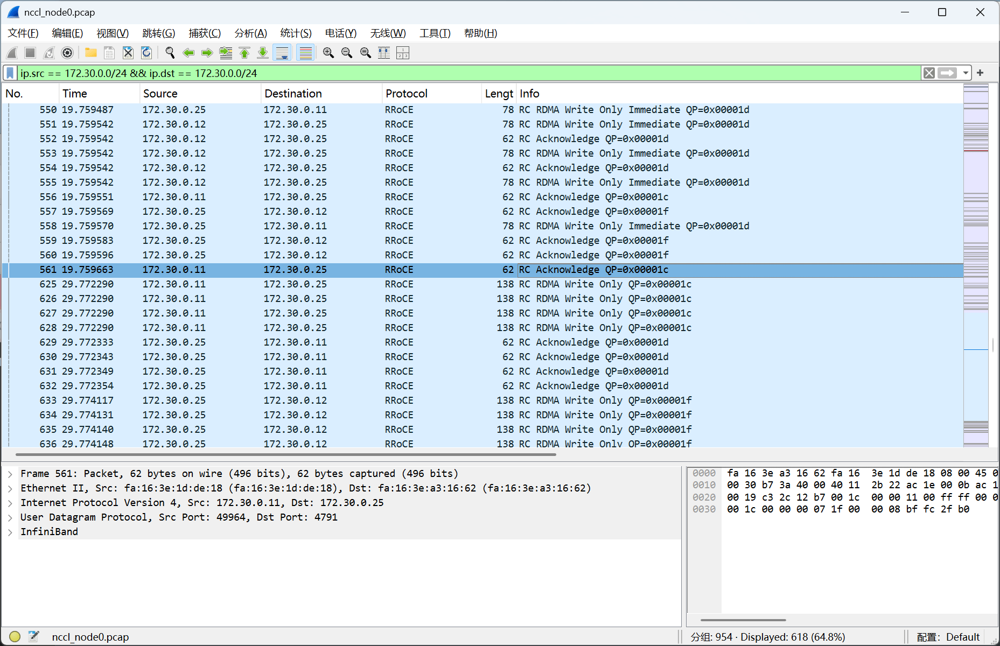
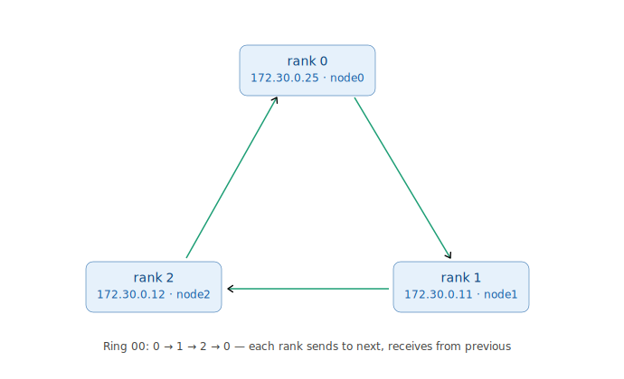
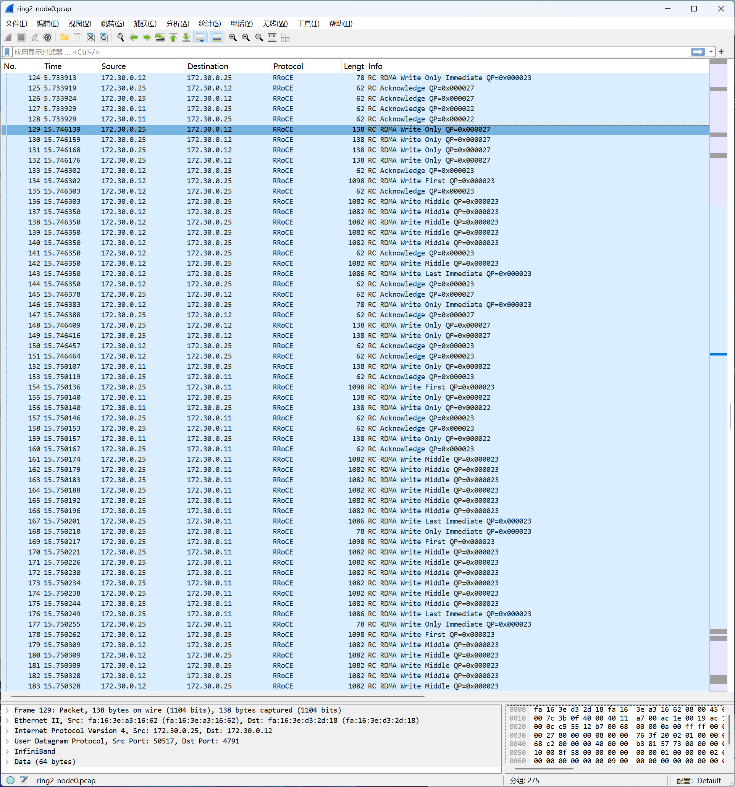
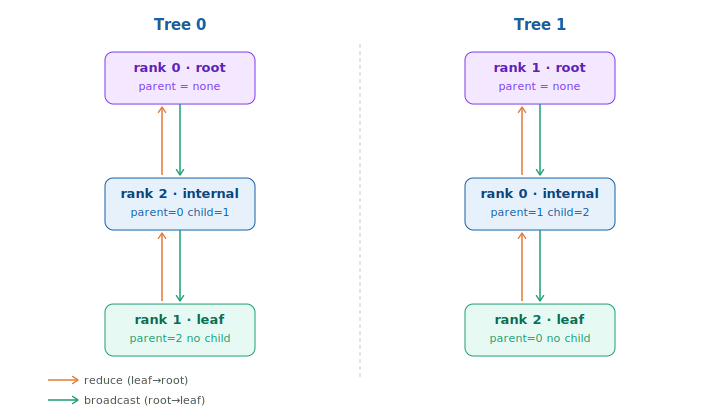

# 第 19 章　从抓包看 NCCL 如何使用 RDMA

我们把 RDMA 和 InfiniBand 拆解成了一个个基础零件：QP、MR、rkey、Send/Write/Read、带外建连、SL/VL、路由、拥塞控制，以及在网计算。到了这里，是时候把这些零件重新组装回一台真实的机器，看看 AI 训练中最常见的集合通信操作 AllReduce，在三台 GPU 服务器之间究竟是如何发生的。

需要说明的是，这一章并不是 NCCL 教程。关于 NCCL API 的资料已经非常丰富，相信在掌握了前面 RDMA 和 InfiniBand 的基础知识之后，再去阅读那些资料会轻松许多。因此，本章依然把重心放在网络本身：我们将在一个三节点 GPU 集群上，通过 PyTorch 发起一次 all_reduce 操作，并从网络视角观察节点之间产生的 NCCL 流量。

实验环境使用了我在京东云临时租赁的三台 GPU 服务器，并通过 Soft-RoCE 运行 RDMA 通信。

---

## 19.1　实验环境与脚本

实验用三台单卡 GPU 服务器，放在同一个子网里，互相直接可达：

| 角色   | 主机  | IP          |
| ------ | ----- | ----------- |
| rank 0 | node0 | 172.30.0.25 |
| rank 1 | node1 | 172.30.0.11 |
| rank 2 | node2 | 172.30.0.12 |

每台的软件栈一致：

- GPU：Tesla P40 ×1
- RDMA：Soft-RoCE，`rxe0` 绑在 `eth0` 上，GID index 1（IPv4 的 RoCE v2），MTU 1024
- 框架：PyTorch 2.4.1，NCCL 2.20.5

### 驱动及基础环境准备

```bash
# 装驱动（P40 属于 Pascal，用 580）
apt update
apt install -y build-essential dkms linux-headers-$(uname -r)
apt install -y nvidia-driver-580
reboot

# 重连后验证：
nvidia-smi          # 应看到 1 张 P40

# python 环境准备
apt install -y python3-venv python3-pip
python3 -m venv ~/venv && source ~/venv/bin/activate

# 装 PyTorch 2.4.1（支持 Pascal 平台的版本）
pip install numpy "torch==2.4.1" -i https://mirrors.cloud.tencent.com/pypi/simple/

# 验证 GPU kernel 能跑：
python -c "import torch; print(torch.ones(10,device='cuda').sum().item())"   # 应输出 10.0

# 起 Soft-RoCE
apt install -y rdma-core ibverbs-utils perftest tcpdump
modprobe rdma_rxe
rdma link add rxe0 type rxe netdev eth0

# 确认 rxe0 出现
ibv_devinfo
```

### 测试脚本

测试脚本 `test.py` 只做一件事：三个进程各占一卡，做一次 AllReduce。但它在时间上被刻意"撑开"了，方便抓包时把各阶段分清楚：

```python
import os, time, torch, torch.distributed as dist

# 初始化进程组，后端 NCCL；自动读取 torchrun 注入的环境变量并建立 TCP 连接
dist.init_process_group("nccl")
dev = int(os.environ["LOCAL_RANK"])      # 读取本地 GPU 编号
torch.cuda.set_device(dev)
ws = dist.get_world_size()               # 获取总进程数

dist.barrier()                           # 同步点：三进程都到齐再继续
time.sleep(10)                           # 静默 10 秒，方便观察抓包

x = torch.ones(6 * 1024, device=f"cuda:{dev}")   # 6144 个 float32 = 24KB
dist.all_reduce(x)                       # 求和，结果广播回所有 GPU
torch.cuda.synchronize()

print(f"rank {dist.get_rank()}/{ws} ok val={x[0].item()} (expect {ws})")
time.sleep(20)                           # 再静默 20 秒，方便观察抓包
dist.destroy_process_group()             # 主动拆连
```

## 19.2 测试一：查看一次 AllReduce 的完整生命周期

### 启动测试

先开三个 terminal，在三台机器上分别启动 tcpdump：

```bash
# 抓接口上除了 SSH 以外的所有报文
tcpdump -i eth0 '(udp port 4791) or (tcp and not port 22)' -w ~/nccl_$(hostname).pcap
```

然后再开三个 terminal 启动测试：

```bash
# node0
source ~/venv/bin/activate

NCCL_IB_HCA=rxe0 NCCL_IB_GID_INDEX=1 NCCL_SOCKET_IFNAME=eth0 \
NCCL_ALGO=Ring NCCL_PROTO=Simple NCCL_MAX_NCHANNELS=1 NCCL_DEBUG=INFO \
torchrun --nnodes=3 --node_rank=0 --nproc_per_node=1 \
  --master_addr=172.30.0.25 --master_port=29500 ~/test.py 2>&1 | tee ~/nccl_$(hostname).log


# node1
source ~/venv/bin/activate

NCCL_IB_HCA=rxe0 NCCL_IB_GID_INDEX=1 NCCL_SOCKET_IFNAME=eth0 \
NCCL_ALGO=Ring NCCL_PROTO=Simple NCCL_MAX_NCHANNELS=1 NCCL_DEBUG=INFO \
torchrun --nnodes=3 --node_rank=1 --nproc_per_node=1 \
  --master_addr=172.30.0.25 --master_port=29500 ~/test.py 2>&1 | tee ~/nccl_$(hostname).log


# node2
source ~/venv/bin/activate

NCCL_IB_HCA=rxe0 NCCL_IB_GID_INDEX=1 NCCL_SOCKET_IFNAME=eth0 \
NCCL_ALGO=Ring NCCL_PROTO=Simple NCCL_MAX_NCHANNELS=1 NCCL_DEBUG=INFO \
torchrun --nnodes=3 --node_rank=2 --nproc_per_node=1 \
  --master_addr=172.30.0.25 --master_port=29500 ~/test.py 2>&1 | tee ~/nccl_$(hostname).log
```

命令由三部分组成：环境变量(NCCL 调优)、`torchrun` 启动参数、以及输出重定向。下面分组说明。

- NCCL 环境变量(控制集合通信底层行为)

| 参数                 | 取值     | 含义                                                                                                           |
| -------------------- | -------- | -------------------------------------------------------------------------------------------------------------- |
| `NCCL_IB_HCA`        | `rxe0`   | 指定使用的 RDMA 设备(HCA)。这里是 Soft-RoCE 的虚拟设备 `rxe0`,告诉 NCCL 走 IB verbs 路径而非纯 TCP             |
| `NCCL_IB_GID_INDEX`  | `1`      | 指定 RoCE 的 GID (IPv4 over UDP 的那条 GID)                                                                    |
| `NCCL_SOCKET_IFNAME` | `eth0`   | NCCL 带外通信(bootstrap、rendezvous、握手)走的网卡。这只用于控制面交换信息，真正的数据走 `rxe0`                |
| `NCCL_ALGO`          | `Ring`   | 强制使用 Ring 算法做集合通信，关闭 Tree/CollNet 等自动选择                                                     |
| `NCCL_PROTO`         | `Simple` | 强制使用 Simple 协议，关闭 LL/LL128 低延迟协议。Simple 数据路径最直白，利于抓包分析                            |
| `NCCL_MAX_NCHANNELS` | `1`      | 限制只用 1 个 channel。默认 NCCL 会开多个并行环榨干带宽；设为 1 后流量集中在单条路径，抓包和验证拓扑时干扰最小 |
| `NCCL_DEBUG`         | `INFO`   | 打开 INFO 级日志                                                                                               |

- torchrun 启动参数(分布式进程编排)

| 参数               | 取值          | 含义                                                                           |
| ------------------ | ------------- | ------------------------------------------------------------------------------ |
| `--nnodes`         | `3`           | 集群总节点数。                                                                 |
| `--node_rank`      | `0`/`1`/`2`   | 本节点在集群中的编号，决定 global rank 偏移。rank 0 同时承担 master 角色       |
| `--nproc_per_node` | `1`           | 每节点启动 1 个进程(1 张"卡")。于是 `world_size = nnodes × nproc_per_node = 3` |
| `--master_addr`    | `172.30.0.25` | rendezvous 协调地址，即 node0 的 IP。所有节点连此地址完成初始握手              |
| `--master_port`    | `29500`       | rendezvous 端口                                                                |
| `~/test.py`        | —             | 实际运行的训练/测试脚本                                                        |

- 输出重定向

| 片段                    | 含义                     |
| ----------------------- | ------------------------ |
| `2>&1`                  | 把 stderr 合并进 stdout  |
| `tee ~/nccl_debugN.log` | 同时输出到终端和日志文件 |

---

### 测试结果

[node 0 log](../pcap/nccl/nccl_node0.log)

[node 1 log](../pcap/nccl/nccl_node1.log)

[node 2 log](../pcap/nccl/nccl_node1.log)

[node 0 pcap](../pcap/nccl/nccl_node0.pcap)

[node 1 pcap](../pcap/nccl/nccl_node1.pcap)

[node 2 pcap](../pcap/nccl/nccl_node2.pcap)

这一组数据抓下了全部 TCP，能把 NCCL 从"互相找到对方"到"开始发 RDMA"的整条链路看全。

###　全流程时序总览

用 wireshark 打开 `nccl_node0.pcap`，输入过滤条件 `ip.src == 172.30.0.0/24 && ip.dst == 172.30.0.0/24`。按时间铺开，整个生命周期可以分成界限分明的几段：

```
[1] TCP : rendezvous (端口 tcp 29500)
[2] TCP : NCCL bootstrap (一批临时 tcp 端口)
[3] RDMA: 一小簇 udp 4791                         （barrier 触发）

        …… sleep(10) 静默 ……

[4] RDMA: 一大簇 udp 4791                          ← AllReduce 的真正数据

        …… sleep(20) 静默 ……

[5] TCP : FIN/挥手                             ← destroy_process_group 拆连
```

下面三节就沿这条时间线，把建连的三步逐个看清。

### 建连第一步：PyTorch rendezvous（TCP 29500）

最先出现的是到端口 **29500** 的 TCP 连接。这是 PyTorch 的 **rendezvous（汇合）**机制，底层是一个叫 **TCPStore** 的小型键值服务：

- `--master_addr=172.30.0.25 --master_port=29500` 指定了汇合点，rank 0 在这个端口上起一个 TCPStore 服务端；
- rank 1、rank 2 连上来，三方在这里对齐基本信息。

这一步解决的是"**进程互相找到对方**"。它还纯粹是 PyTorch/TCP 的世界，和 RDMA 无关。

这一步的目的是要拿到一个 **NCCL unique ID**，它是后续 NCCL 自己建连的"接头暗号"。NCCL 真正的建连发生在下一步。

###　建连第二步：NCCL bootstrap（一批临时端口 TCP）

拿到 unique ID 之后，**NCCL**在三节点之间又建了一圈 TCP 连接，源端口是一批随机的临时端口（如 55259、56325、54989...）。这就是 **NCCL bootstrap**。

它干的事，正是第二章讲的**带外参数交换**：把每个 rank 建 RDMA QP 所需的信息（**QPN、GID、rkey** 等）通过这些 TCP 连接 all-gather 给所有人。换句话说，**RDMA 连接的所有"接线参数"，是在这里用 TCP 谈好的**。

NCCL 用"**TCP 带外**"建立连接，和 perftest/pingpong 是同一种思路。所以在 Wireshark 里，这些 bootstrap 连接的 payload 是一团不透明的二进制，我们能看到连接的建立、来回和时序，但解不了内容。与第六章的 RDMA CM 抓包相比，可以明显看到区别：

|                    | 载体                                   | 标准化            | Wireshark 能否解码 |
| ------------------ | -------------------------------------- | ----------------- | ------------------ |
| **RDMA CM**        | RDMA 网络自带（MAD，UDP 4791 上的 CM） | 是，IBTA 标准     | 能逐字段解码       |
| **NCCL bootstrap** | 自定义 TCP，带外                       | 否，NCCL 私有格式 | 看不到字段含义     |

###　建连第三步：QP 起来，RDMA 开始

bootstrap 谈完之后，4791 的 RDMA 报文才开始出现。

为了能够观测到准确的通信流程，我们在测试代码中设计了一个 `barrier + sleep`：

```python
# ...
dist.barrier()
time.sleep(10)
x = torch.ones(6*1024, device=f"cuda:{dev}")
dist.all_reduce(x)
# ...
```

从抓包的 RDMA 数据中可以看到一个明显的时间分界线，19 秒到第 29 秒之间停顿了 10 秒：



dist.barrier() 是一个同步栅栏，所有进程必须都执行到这一行，每个进程才会被放行继续往下走。barrier 本身也是一次集合操作。NCCL 把它实现成一个极小的、类似 all-reduce 的通信,所以它会产生一小簇 4791 的 RDMA 流量。

换句话说：先到的进程会阻塞等待，直到最后一个进程也到达 barrier，三方才一起放行。它本身不传输任何用户数据，唯一的作用就是"对齐进度"。

为什么这个测试里要加 barrier 这个动作呢？

三个 torchrun 是三个终端里手动、先后敲下去的，相差几秒很正常。没有 barrier 的话，可能 node0 早就开始 sleep 甚至 all_reduce 了，而 node2 还在做 init_process_group（建连）。这会把抓包搞乱。barrier 保证三个进程都完成了建连、在同一个点上集合，然后才一起进入后面的 sleep(10) 和 all_reduce；于是 AllReduce 的数据前后都干净，能和前面的建连流量清清楚楚分开，便于我们观察。

---

## 19.3 测试二：NCCL 的 RDMA 深入分析

这个测试，我们来更仔细的看看 NCCL 的 RDMA，观察和对比 NCCL 在采用不同的算法时的网络行为。

在上一节的测试中，有个NCCL的配置项 `NCCL_ALGO=Ring`,这是控制 NCCL 算法的选项，正常情况下 NCCL 会根据消息大小和规模自动挑合适的算法。一般来说，Ring 带宽利用率高、适合大消息；Tree 跳数少、延迟低、适合小消息和大规模。这一节，我们来观察和对比两种算法在网络行为上的差异。

### 启动测试

- **RING 部分**

先开三个 terminal，在三台机器上分别启动 tcpdump：

```bash
# 仅关注 TCP 29500 和 UDP 4791
tcpdump -i eth0 '(udp port 4791) or (tcp port 29500)' -w ~/ring2_$(hostname).pcap
```

然后再开三个 terminal 启动测试：

```bash
# NCCL 日志开了更详细的子系统，打印出了 QP 号和 rkey，方便把报文和 QP 对应起来
# node0
source ~/venv/bin/activate

NCCL_IB_HCA=rxe0 NCCL_IB_GID_INDEX=1 NCCL_SOCKET_IFNAME=eth0 \
NCCL_ALGO=Ring NCCL_PROTO=Simple NCCL_MAX_NCHANNELS=1 NCCL_DEBUG=INFO NCCL_DEBUG_SUBSYS=INIT,NET,GRAPH \
torchrun --nnodes=3 --node_rank=0 --nproc_per_node=1 \
  --master_addr=172.30.0.25 --master_port=29500 ~/test.py 2>&1 | tee ~/ring2_$(hostname).log


# node1
source ~/venv/bin/activate

NCCL_IB_HCA=rxe0 NCCL_IB_GID_INDEX=1 NCCL_SOCKET_IFNAME=eth0 \
NCCL_ALGO=Ring NCCL_PROTO=Simple NCCL_MAX_NCHANNELS=1 NCCL_DEBUG=INFO NCCL_DEBUG_SUBSYS=INIT,NET,GRAPH \
torchrun --nnodes=3 --node_rank=1 --nproc_per_node=1 \
  --master_addr=172.30.0.25 --master_port=29500 ~/test.py 2>&1 | tee ~/ring2_$(hostname).log


# node2
source ~/venv/bin/activate

NCCL_IB_HCA=rxe0 NCCL_IB_GID_INDEX=1 NCCL_SOCKET_IFNAME=eth0 \
NCCL_ALGO=Ring NCCL_PROTO=Simple NCCL_MAX_NCHANNELS=1 NCCL_DEBUG=INFO NCCL_DEBUG_SUBSYS=INIT,NET,GRAPH \
torchrun --nnodes=3 --node_rank=2 --nproc_per_node=1 \
  --master_addr=172.30.0.25 --master_port=29500 ~/test.py 2>&1 | tee ~/ring2_$(hostname).log
```

- **TREE 部分**

先开三个 terminal，在三台机器上分别启动 tcpdump：

```bash
# 仅关注 TCP 29500 和 UDP 4791
tcpdump -i eth0 '(udp port 4791) or (tcp port 29500)' -w ~/tree2_$(hostname).pcap
```

然后再开三个 terminal 启动测试：

```bash
# NCCL 日志开了更详细的子系统，打印出了 QP 号和 rkey，方便把报文和 QP 对应起来
# node0
source ~/venv/bin/activate

NCCL_IB_HCA=rxe0 NCCL_IB_GID_INDEX=1 NCCL_SOCKET_IFNAME=eth0 \
NCCL_ALGO=Ring NCCL_PROTO=Simple NCCL_MAX_NCHANNELS=1 NCCL_DEBUG=INFO NCCL_DEBUG_SUBSYS=INIT,NET,GRAPH \
torchrun --nnodes=3 --node_rank=0 --nproc_per_node=1 \
  --master_addr=172.30.0.25 --master_port=29500 ~/test.py 2>&1 | tee ~/tree2_$(hostname).log


# node1
source ~/venv/bin/activate

NCCL_IB_HCA=rxe0 NCCL_IB_GID_INDEX=1 NCCL_SOCKET_IFNAME=eth0 \
NCCL_ALGO=Ring NCCL_PROTO=Simple NCCL_MAX_NCHANNELS=1 NCCL_DEBUG=INFO NCCL_DEBUG_SUBSYS=INIT,NET,GRAPH \
torchrun --nnodes=3 --node_rank=1 --nproc_per_node=1 \
  --master_addr=172.30.0.25 --master_port=29500 ~/test.py 2>&1 | tee ~/tree2_$(hostname).log


# node2
source ~/venv/bin/activate

NCCL_IB_HCA=rxe0 NCCL_IB_GID_INDEX=1 NCCL_SOCKET_IFNAME=eth0 \
NCCL_ALGO=Ring NCCL_PROTO=Simple NCCL_MAX_NCHANNELS=1 NCCL_DEBUG=INFO NCCL_DEBUG_SUBSYS=INIT,NET,GRAPH \
torchrun --nnodes=3 --node_rank=2 --nproc_per_node=1 \
  --master_addr=172.30.0.25 --master_port=29500 ~/test.py 2>&1 | tee ~/tree2_$(hostname).log
```

结果如下：

[nccl result](../pcap/nccl/)

###　NCCL 用的是 RDMA Write

先看一个总体问题：本次捕获到的 NCCL 的数据搬运，靠的是单边的 **RDMA Write**。

为什么是 Write 不是 Read？因为 Write 是"推"：发送方算完一块数据，直接写进对端早已注册好的接收缓冲区，一次单程、不需要等对端响应再回来。而 Read 是"拉"，要多一个网络往返。在 AllReduce 这种"我算完就尽快推给下家"的流水线里，Write 的单程语义天然契合。

###　通过日志看初始化过程

以下是摘录的 node0 在 RING 测试部分的关键日志：

```bash
# 阶段1：Bootstrap，纯 TCP 控制面
node0:4744:4744 [0] NCCL INFO NCCL_SOCKET_IFNAME set to eth0
node0:4744:4744 [0] NCCL INFO Bootstrap : Using eth0:172.30.0.25<0>

# 阶段2：选网卡
node0:4744:4763 [0] NCCL INFO NCCL_IB_HCA set to rxe0
node0:4744:4763 [0] NCCL INFO NET/IB : Using [0]rxe0:1/RoCE [RO]; OOB eth0:172.30.0.25<0>
node0:4744:4763 [0] NCCL INFO Using non-device net plugin version 0
node0:4744:4763 [0] NCCL INFO Using network IB

# 阶段3：拓扑探测
node0:4744:4763 [0] NCCL INFO comm 0x43dc13b0 rank 0 nranks 3 cudaDev 0 nvmlDev 0 busId 80 commId 0x1f82f8f6b7863cd3 - Init START
# rxe 不支持 GDR，所以数据要走 GPU→主机内存→NIC,GPU 和 NET 之间标 PHB（穿过 PCI host bridge）
node0:4744:4763 [0] NCCL INFO NET/IB : GPU Direct RDMA Disabled for HCA 0 'rxe0'
# NET 链路被估成 ≈0.3125 GB/s（≈2.5 Gbps，Soft-RoCE 软件路径的速度）
node0:4744:4763 [0] NCCL INFO === System : maxBw 0.3 totalBw 12.0 ===
node0:4744:4763 [0] NCCL INFO CPU/FFFFFFFFFFFFFFFF (1/1/1)
node0:4744:4763 [0] NCCL INFO + PCI[5000.0] - NIC/0
node0:4744:4763 [0] NCCL INFO                 + NET[0.3] - NET/0 (6216a3feff3e16f8/1/0.312500)
node0:4744:4763 [0] NCCL INFO + PCI[12.0] - GPU/80 (0)
node0:4744:4763 [0] NCCL INFO ==========================================
node0:4744:4763 [0] NCCL INFO GPU/80 :GPU/80 (0/5000.000000/LOC) CPU/FFFFFFFFFFFFFFFF (1/12.000000/PHB) NET/0 (3/0.312500/PHB)
node0:4744:4763 [0] NCCL INFO NET/0 :GPU/80 (3/0.312500/PHB) CPU/FFFFFFFFFFFFFFFF (2/0.312500/PHB) NET/0 (0/5000.000000/LOC)

# 阶段4：计算逻辑拓扑
# Pattern 4 是 ring 搜索、Pattern 3 是 tree 搜索；ring 和 tree 都会算一遍，虽然本次实际只用到 ring
node0:4744:4763 [0] NCCL INFO Pattern 4, crossNic 0, nChannels 1, bw 0.240000/0.240000, type LOC/PHB, sameChannels 1
# 节点内: 网进→GPU算→网出
node0:4744:4763 [0] NCCL INFO  0 : NET/0 GPU/0 NET/0
node0:4744:4763 [0] NCCL INFO Pattern 3, crossNic 0, nChannels 1, bw 1.200000/0.240000, type LOC/PHB, sameChannels 1
node0:4744:4763 [0] NCCL INFO  0 : NET/0 GPU/0 NET/0
node0:4744:4763 [0] NCCL INFO comm 0x43dc13b0 rank 0 nRanks 3 nNodes 3 localRanks 1 localRank 0 MNNVL 0
node0:4744:4763 [0] NCCL INFO Tree 0 : -1 -> 0 -> 2/-1/-1
node0:4744:4763 [0] NCCL INFO Tree 1 : 1 -> 0 -> 2/-1/-1
node0:4744:4763 [0] NCCL INFO Channel 00/01 :    0   1   2
node0:4744:4763 [0] NCCL INFO Ring 00 : 2 -> 0 -> 1
node0:4744:4763 [0] NCCL INFO Trees [0] 2/-1/-1->0->-1
node0:4744:4763 [0] NCCL INFO P2P Chunksize set to 131072

# 阶段5：建连接 (proxy + RC QP)
# Transport 类型: 0 = P2P (intra-node, direct NVLink / PCIe peer-to-peer),
# 1 = SHM (intra-node, shared memory),
# 2 = NET (inter-node, over the NIC)
# Ring 00 : 2 -> 0 -> 1
node0:4744:4765 [0] NCCL INFO New proxy recv connection 0 from local rank 0, transport 2
node0:4744:4763 [0] NCCL INFO Connected to proxy localRank 0 -> connection 0x73576c004fb0
node0:4744:4763 [0] NCCL INFO Channel 00/0 : 2[0] -> 0[0] [receive] via NET/IB/0
node0:4744:4765 [0] NCCL INFO New proxy send connection 1 from local rank 0, transport 2
node0:4744:4763 [0] NCCL INFO Connected to proxy localRank 0 -> connection 0x73576c005028
node0:4744:4763 [0] NCCL INFO Channel 00/0 : 0[0] -> 1[0] [send] via NET/IB/0
node0:4744:4765 [0] NCCL INFO NET/IB: NCCL Dev 0 IbDev 0 Port 1 qpn 34 mtu 3 query_ece={supported=0, vendor_id=0x0, options=0x0, comp_mask=0x0} GID 1 (0/19001EACFFFF0000) fifoRkey=0x4fd5 fifoLkey=0x4fd5
node0:4744:4765 [0] NCCL INFO NET/IB: IbDev 0 Port 1 qpn 35 set_ece={supported=0, vendor_id=0x76ce, options=0x0, comp_mask=0x0}
node0:4744:4763 [0] NCCL INFO Connected all rings   # ring 连接就绪
node0:4744:4765 [0] NCCL INFO New proxy send connection 2 from local rank 0, transport 2
node0:4744:4763 [0] NCCL INFO Connected to proxy localRank 0 -> connection 0x73576c0050a0
node0:4744:4763 [0] NCCL INFO Channel 00/0 : 0[0] -> 2[0] [send] via NET/IB/0
node0:4744:4765 [0] NCCL INFO NET/IB: NCCL Dev 0 IbDev 0 Port 1 qpn 36 mtu 3 query_ece={supported=0, vendor_id=0x0, options=0x0, comp_mask=0x0} GID 1 (0/19001EACFFFF0000) fifoRkey=0x59b1 fifoLkey=0x59b1
node0:4744:4765 [0] NCCL INFO Call to ibv_set_ece failed with error Operation not supported errno 95
node0:4744:4765 [0] NCCL INFO NET/IB: IbDev 0 Port 1 qpn 42 set_ece={supported=0, vendor_id=0x763f, options=0x20046360, comp_mask=0x763f}
node0:4744:4763 [0] NCCL INFO Connected all trees   # tree 连接就绪
# 算法 - 协议 组合的线程阈值，是 kernel 启动时的调优常数
# Tree(LL/LL128/Simple) | Ring(LL/LL128/Simple) | CollNet | NVLS
#      8 / 8 / 64       |      24 / 8 / 64      |  512    |  512
node0:4744:4763 [0] NCCL INFO threadThresholds 8/8/64 | 24/8/64 | 512 | 512
# 1 coll channels: NCCL_MAX_NCHANNELS=1
node0:4744:4763 [0] NCCL INFO 1 coll channels, 0 collnet channels, 0 nvls channels, 1 p2p channels, 1 p2p channels per peer
node0:4744:4765 [0] NCCL INFO New proxy send connection 3 from local rank 0, transport 2
node0:4744:4763 [0] NCCL INFO Connected to proxy localRank 0 -> connection 0x73576c005118
node0:4744:4763 [0] NCCL INFO comm 0x43dc13b0 rank 0 nranks 3 cudaDev 0 nvmlDev 0 busId 80 commId 0x1f82f8f6b7863cd3 - Init COMPLETE
# 总结：
# conn 0 — recv ← rank2，环的前驱收(receive from the previous rank)；
#          同时被树复用(树里 rank0 是根，要"收自子节点 rank2"做 reduce，跟环收自 rank2 是同一个对端，共用一条)
# conn 1 — send → rank1，环的后继发(send to the next rank)
# conn 2 — send → rank2，树的"根→子"发(广播阶段)
# conn 3 — send，p2p channel，点对点预留


# 阶段6：完成 → 跑测试 → 退出
rank 0/3 ok val=3.0 (expect 3)

node0:4744:4765 [0] NCCL INFO [Service thread] Connection closed by localRank 0
node0:4744:4770 [0] NCCL INFO comm 0x43dc13b0 rank 0 nranks 3 cudaDev 0 busId 80 - Abort COMPLETE
```

###　Ring AllReduce 在网络层面长什么样

我们用 `NCCL_ALGO=Ring` 固定了环算法，日志确认了环的形状：



以 `ring2_node0.pcap` 为例，用 Wireshark 打开，可以看到，从 15 秒开始的 RDMA Write包似乎与我们想象中的不太一样（node 0 向 node 1 和 2 都有 write 动作，按预想应该 node 0 只向 node 1 write）：



这是因为：除了真正的 AllReduce 数据流之外，NCCL 还会产生少量逆向的小型 RDMA Write。这些报文通常只有几十字节，并不承载 tensor 数据，而是用于更新 FIFO 状态、FIFO credit、同步 step 等控制信息。过滤掉这些控制报文之后，整个 AllReduce 的数据路径便呈现出一个非常干净的单向 Ring。

为了看清楚这个 RING，就必须把 tensor 数据报文和控制报文分开，我们直接用命令行版的 tshark 进行过滤。

> NCCL 的数据 chunk 是 KB 量级，而 RDMA 的控制报文和 Ack 报文都非常小，因此，直接按帧长 200 切，留下的就是真正的数据 Write。

```bash
ib_tutorial\pcap\nccl
❯ tshark -r ring2_node0.pcap -Y "udp.port==4791 && frame.len > 200" -T fields -e ip.src -e ip.dst -e frame.len | sort | uniq -c
     24 172.30.0.12     172.30.0.25     1082
      4 172.30.0.12     172.30.0.25     1086
      4 172.30.0.12     172.30.0.25     1098
     24 172.30.0.25     172.30.0.11     1082
      4 172.30.0.25     172.30.0.11     1086
      4 172.30.0.25     172.30.0.11     1098

ib_tutorial\pcap\nccl
❯ tshark -r ring2_node1.pcap -Y "udp.port==4791 && frame.len > 200" -T fields -e ip.src -e ip.dst -e frame.len | sort | uniq -c
     24 172.30.0.11     172.30.0.12     1082
      4 172.30.0.11     172.30.0.12     1086
      4 172.30.0.11     172.30.0.12     1098
     24 172.30.0.25     172.30.0.11     1082
      4 172.30.0.25     172.30.0.11     1086
      4 172.30.0.25     172.30.0.11     1098

ib_tutorial\pcap\nccl
❯ tshark -r ring2_node2.pcap -Y "udp.port==4791 && frame.len > 200" -T fields -e ip.src -e ip.dst -e frame.len | sort | uniq -c
     24 172.30.0.11     172.30.0.12     1082
      4 172.30.0.11     172.30.0.12     1086
      4 172.30.0.11     172.30.0.12     1098
     24 172.30.0.12     172.30.0.25     1082
      4 172.30.0.12     172.30.0.25     1086
      4 172.30.0.12     172.30.0.25     1098
```

这样得到的结果就是一个干净的**单向环**：

| 链路          | src → dst                 | 方向   |
| ------------- | ------------------------- | ------ |
| rank0 → rank1 | 172.30.0.25 → 172.30.0.11 | 顺时针 |
| rank1 → rank2 | 172.30.0.11 → 172.30.0.12 | 顺时针 |
| rank2 → rank0 | 172.30.0.12 → 172.30.0.25 | 顺时针 |

每个节点**只往下一个邻居发、只从上一个邻居收**，首尾相接成环。这就是 ring AllReduce 的精髓：通信量是 O(N)、每个节点只跟两个邻居打交道，而不是 all-to-all。

环是"摊平"的：没有中心、没有谁更忙，每个节点的负载一样。

### NCCL 的 Credit

上一节提到了一个词：NCCL FIFO Credit。看到这里，也许你会感到奇怪：IB 的 credit 机制不是在链路层吗，为什么 NCCL 还要管 Credit？

### NCCL 的 Credit

上一节提到了一个词：NCCL FIFO Credit。看到这里，也许你会感到奇怪：IB 的 credit 机制不是在链路层吗，为什么 NCCL 还要管 Credit？

答案是：IB 的 Credit 和 NCCL 的 FIFO Credit 虽然名字相同，但解决的是两个完全不同的问题。

IB 的 Credit 工作在链路层，它保护的是交换机和 HCA 的接收 Buffer。发送端只有在确认对端仍然有空闲 Buffer 时，才能继续发送新的数据。因此，IB Credit 回答的问题其实是：**网络里还有没有地方放包。** 它的存在保证了 InfiniBand Fabric 可以实现无损传输，即使网络出现拥塞，也不会因为 Buffer 被写满而直接丢包。

但是，对于一次 AllReduce 来说，网络不丢包还远远不够。

当一个节点执行 RDMA Write 时，数据最终会被直接写入对端 GPU 内存中的接收 FIFO。这个 FIFO 的大小是有限的，可以把它理解成一个环形缓冲区：发送方不断向里面写入新的 chunk，而接收方则不断从里面取出数据交给 GPU Kernel 进行 reduce 计算。如果接收方处理得比较慢，所有 FIFO entry 都可能被占满。此时，网络可能仍然非常空闲，IB 的 Credit 也仍然充足，但发送方已经不能再继续发送了，因为继续执行 RDMA Write 会覆盖尚未被消费的数据。

因此，NCCL 在应用层又实现了一套自己的流控机制：FIFO Credit。

每当接收方消费完一个 FIFO entry，就会通过一个很小的 RDMA Write，把最新的 FIFO 状态回写给发送方，告诉它有多少 entry 已经被释放，可以继续发送新的 chunk。这些回写报文通常只有几十字节，正是我们在抓包中看到的那些逆向小包。它们不承载任何 tensor 数据，只负责同步 FIFO 的状态，因此经常会和真正的数据流混在一起，给人一种 Ring 出现了“逆流”的错觉。

从思想上看，NCCL 的 FIFO Credit 与 TCP 的滑动窗口非常相似。TCP 的窗口告诉发送方：我的 Socket Buffer 还能接收多少字节；而 NCCL 的 Credit 则是在告诉发送方：我的 GPU 接收 FIFO 还剩多少空闲 entry。两者都是一种生产者—消费者模型中的流控机制，只不过保护的对象不同。

因此，可以把这三种 Credit 看成三个层次的流控：IB Credit 保证网络不会丢包，TCP Window 保证接收端的 Socket 不会被写爆，而 NCCL FIFO Credit 则保证 GPU 的接收 FIFO 不会被写爆。它们各自工作在不同的层次，共同保证了一次 AllReduce 能够稳定、高效地运行。

###　对照：Tree AllReduce

最后，我们来看一下 Tree AllReduce 的数据。先从三份日志把每个 rank 在两棵树里的位置提取出来:

| rank | Tree 0             | Tree 1             |
| ---- | ------------------ | ------------------ |
| 0    | `-1 → 0 → 2/-1/-1` | `1 → 0 → 2/-1/-1`  |
| 1    | `2 → 1 → -1/-1/-1` | `-1 → 1 → 0/-1/-1` |
| 2    | `0 → 2 → 1/-1/-1`  | `0 → 2 → -1/-1/-1` |

> **备注**：NCCL 的树日志格式 - Tree N : <parent> -> <self> -> <child0>/<child1>/<child2>
>
> -1 表示"无对应 rank"，出现在 parent 位是"我是根"，出现在 children 位是"这个子节点槽位空着"

**两棵树都是退化的链。** 3 个 rank 撑不起真正的二叉树，只能退化成一条线:Tree 0 是 `0→2→1`,Tree 1 是 `1→0→2`。

**根和叶在两棵树里互换。** 这是double binary tree(双二叉树)。单棵树的问题是叶子节点只承担一半通信(只收不发或只发不收)，链路利用不充分；NCCL 同时构造两棵“角色互补”的树，让每个 rank 在一棵里当内部节点、在另一棵里当叶子(理想情况)，两棵树各跑一半数据，带宽就摊平了。

翻译成拓扑图就是：



在我们的测试代码中，因为仅做了一次 allreduce，并且设置了 `NCCL_MAX_NCHANNELS=1`，测试数据量也比较小，因此从抓包看，数据被完全压到了 tree 0。这是正常现象，正常生产环境，流量会在两棵树上并行。

tshark 使用同样的方法进行过滤，数据 Write 的统计如下：

```bash
ib_tutorial\pcap\nccl
❯ tshark -r tree2_node0.pcap -Y "udp.port==4791 && frame.len > 200" -T fields -e ip.src -e ip.dst -e frame.len | sort | uniq -c
     22 172.30.0.12     172.30.0.25     1082
      1 172.30.0.12     172.30.0.25     1086
      1 172.30.0.12     172.30.0.25     1098
     22 172.30.0.25     172.30.0.12     1082
      1 172.30.0.25     172.30.0.12     1086
      1 172.30.0.25     172.30.0.12     1098

ib_tutorial\pcap\nccl
❯ tshark -r tree2_node1.pcap -Y "udp.port==4791 && frame.len > 200" -T fields -e ip.src -e ip.dst -e frame.len | sort | uniq -c
     22 172.30.0.11     172.30.0.12     1082
      1 172.30.0.11     172.30.0.12     1086
      1 172.30.0.11     172.30.0.12     1098
     22 172.30.0.12     172.30.0.11     1082
      1 172.30.0.12     172.30.0.11     1086
      1 172.30.0.12     172.30.0.11     1098

ib_tutorial\pcap\nccl
❯ tshark -r tree2_node2.pcap -Y "udp.port==4791 && frame.len > 200" -T fields -e ip.src -e ip.dst -e frame.len | sort | uniq -c
     22 172.30.0.11     172.30.0.12     1082
      1 172.30.0.11     172.30.0.12     1086
      1 172.30.0.11     172.30.0.12     1098
     22 172.30.0.12     172.30.0.11     1082
      1 172.30.0.12     172.30.0.11     1086
      1 172.30.0.12     172.30.0.11     1098
     22 172.30.0.12     172.30.0.25     1082
      1 172.30.0.12     172.30.0.25     1086
      1 172.30.0.12     172.30.0.25     1098
     22 172.30.0.25     172.30.0.12     1082
      1 172.30.0.25     172.30.0.12     1086
      1 172.30.0.25     172.30.0.12     1098
```

上面的分析得到的图景和 RING **完全不同**：

| 链路          | 方向           |
| ------------- | -------------- |
| rank0 ↔ rank2 | 双向           |
| rank1 ↔ rank2 | 双向           |
| rank0 ↔ rank1 | **无直接通信** |

在 Tree 0 中，**rank2 是中心枢纽**：它和 rank0、rank1 各自双向通信（上行做 reduce 把数据汇聚到树根、下行把结果发回去），而 rank0 和 rank1 之间根本不直接说话。

## 19.4　GDR(GPU Direct RDMA)

最后看一个本实验环境的固有属性。三份日志都有这一行：

```bash
NET/IB : GPU Direct RDMA Disabled for HCA 0 'rxe0'
```

要理解它，先看网卡拿到 GPU 显存里数据的两条路径：

- **没有 GDR**：数据先从 **GPU 显存拷到主机内存**，网卡再从主机内存发出去。多一次拷贝、过 CPU/PCIe。
- **有 GDR**：网卡经 PCIe **点对点直接读写 GPU 显存**，完全不经过主机内存。这才是真实 AI 训练追求的"绕过 CPU、直达显存"。

为什么我们没有 GDR？因为我们用的是 **Soft-RoCE（rxe）**，跑在内核里、在主机内存中拼包，根本不存在"网卡硬件 DMA 引擎直连 GPU"那条物理通路。所以日志里的 `Disabled` 是必然的，NCCL 自动退回了 CPU 中转。

---

## 19.5 这是显微镜，不是真实流量

回头看我们做了什么：把测试数据缩到 24KB、把算法固定成单 RING/TREE、把操作减到一次、还在前后撑出 10/20 秒静默，然后才得到这样一份能逐包数清的抓包。

在这里，我必须强调：**真实 AI 训练的流量，根本没法这样看**。

- 张量是 GB 级，不是 24KB；
- 多 channel 并行、多 QP、甚至多网卡多轨；
- 计算和通信持续重叠，AllReduce 一轮接一轮不停；
- 报文是百万、千万级，Wireshark 打开就卡死。

真实环境只能看聚合指标（带宽、计数器、时延），看不了单包。而我们这套刻意缩到最小的实验，本质是一台**显微镜加慢放**：把真实训练里那个一闪而过、又被并行掩盖的通信结构，单独拎出来、放慢、放大，让你看清它的骨架。

关键在于：**骨架是不变的**。真实训练不过是把这里看到的同一套东西（QP 建连、RDMA Write、RING 或 TREE）**放大、并行、不停重复**而已。看懂了这个干净的小版本，你就理解了大版本的机理。

这大抵就是 RDMA 与 InfiniBand 这套技术，最终在 AI 训练里被使用的样子。
