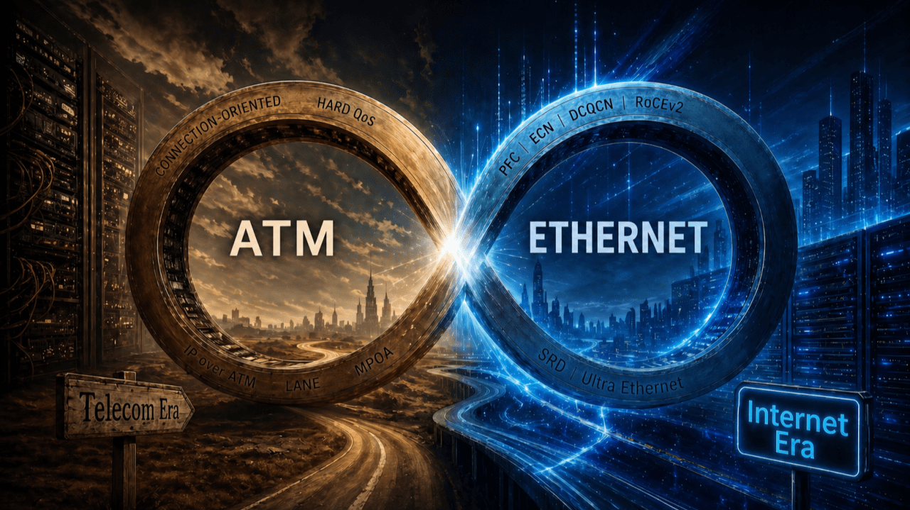
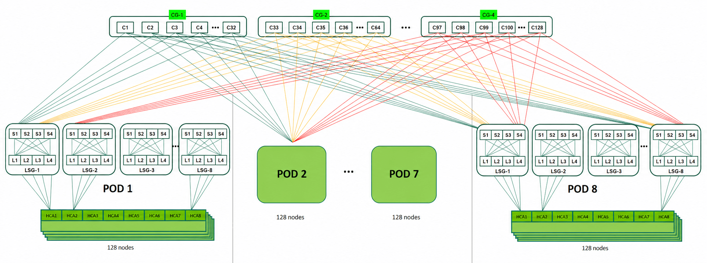

This is an article I wrote while preparing for the NCP-AIN exam, which I am including here as an appendix for your reference.

# The Historical Cycle of AI Networking: The Battle of Semantics and ATM's Unfinished Business

## A Forgotten Technical Soul

In the 1990s, the telecommunications industry had a grand vision: use ATM (Asynchronous Transfer Mode) as a single unified network to carry all traffic: voice, video, and data, under one connection-oriented, hard-QoS framework. That dream was ultimately crushed by the "best-effort" philosophy of Ethernet + IP.

Thirty years later, as we examine today's AI networking battlefield, an intriguing question emerges: History is repeating itself, only this time, the protagonists are GPUs, accelerators, and the network that connects them.

The evolution of AI networking unfolds along two parallel story lines: Scale-up (intra-node) and Scale-out (inter-node). Let's start with Scale-up.

## NVLink's Vertical Integration: Connecting GPUs with a Switch Fabric

NVIDIA's strategy in Scale-up is not to invent a new networking paradigm, it is to take the most mature architecture from the networking world, the switch fabric, and apply it to GPU interconnect. NVSwitch is not a single chip; it is a switch fabric formed by multiple ASICs working together, providing all-to-all connectivity among every GPU in the rack.

NVLink's evolution clearly illustrates this strategy:

- NVLink 1.0 (2016): 8 GPUs intra-node, 160 GB/s
- NVLink 4.0 (2022): intra-node, 900 GB/s
- NVSwitch: full-mesh switching, rack-scale
- NVL72 (2024): 72 GPUs as one accelerator, 130 TB/s
- Rubin NVL144 (2026): 144 GPUs, 260 TB/s

With each generation, the boundary of "intra-node" expands outward. By the NVL72 generation, NVIDIA has effectively redefined the entire rack as a large modular switch chassis: 18 Compute Trays act as line cards, 9 NVSwitch Trays act as switch fabric cards, and the 5,000+ copper wires inside 4 Cable Cartridges on the rear backplane are the chassis backplane. The rack as a whole is presented to the outside world as "one supercomputer-class GPU" , and the traditional concepts of "server" and "inter-node networking" both dissolve in the process.

This is NVIDIA's answer to Scale-up interconnect: borrow the design paradigm of large modular switches, and package a GPU cluster as a rack-scale device. The path is both pragmatic and powerful: switch fabrics have been refined by networking vendors for decades, and reusing that work is far safer than designing a new architecture from scratch.

NVL72's success cemented NVIDIA's dominance in the AI training market. But it is also closed, it serves only NVIDIA's own GPUs. This left the rest of the industry with a hard question: what about everyone else? And the companies that have spent decades building switch fabrics are precisely the ones equipped to answer it.

## UALink: A Direct Challenge to NVLink

In April 2025, the UALink (Ultra Accelerator Link) 1.0 specification was officially published, backed by more than 85 organizations including AMD, Intel, Google, Microsoft, Cisco, Meta, AWS, and Apple. It's worth noting that UALink uses "accelerator" rather than "GPU" as its core term, because it targets not only GPUs but also AI accelerator silicon like Google TPU and AWS Trainium. The choice of word itself signals an open posture.

UALink's design goals point directly at NVLink:

- Massive scale: a single switching domain supports up to 1,024 accelerators in a unified memory space
- Ultra-low latency: round-trip latency under one microsecond (within 4-meter cable distance), approaching memory-access semantics
- Memory semantics: native load/store and atomic operations, allowing accelerators to communicate with each other as if accessing local memory
- Open specification: an ASIC specification multiple vendors can independently implement, breaking single-vendor dependency

The core difference from NVLink comes down to one word: open.

That said, NVLink currently still leads on raw performance. UALink trades that for scale and openness. For hyperscalers unwilling to be fully locked into NVIDIA, UALink offers not just a technical alternative but strategic leverage.

Whether UALink can truly threaten NVLink depends on two things: hardware arriving on schedule, and software stacks like ROCm closing the gap on years of CUDA ecosystem investment. Both hurdles must be cleared.

## From InfiniBand to RoCEv2: The Open Path of Scale-out

So much for Scale-up. But however large a GPU cluster grows, traffic eventually crosses out of the rack, that's the Scale-out front. The story on this front is more complex, and more dramatic, than Scale-up.

Scale-out's starting point is InfiniBand. The star of the HPC era: deterministic low latency, native losslessness, RDMA built into its DNA. But IB came at a price: it was closed. After NVIDIA acquired Mellanox in 2019, IB's most important hardware supplier became part of the leading GPU vendor. AMD, Cisco, Arista, and others had to find another path.

That path was RoCEv2, an attempt to graft InfiniBand-style RDMA onto Ethernet. It unlocks an open ecosystem and works well at smaller/medium scales, where a 1:1 fabric is still affordable and congestion control remains mostly dormant.

But at hyperscale, tens of thousands of GPUs, the economics break down. A non-oversubscribed network is no longer viable, oversubscription creeps in, and suddenly PFC, ECN, and DCQCN are no longer optional, they become the system’s lifeline. And with that, you’re no longer operating a network, you’re trapped in a never-ending exercise in parameter tuning.

RoCEv2 isn't wrong; it just runs into Ethernet's "best-effort" genetic bottleneck once you push it to scale. AI training, however, is precisely the workload that keeps pushing against the upper bound of physical scale. The era of patches had begun.

## Ethernet's Patch Dilemma

To carry lossless traffic in a best-effort environment, Ethernet has been patched extensively over the past decade:

- PFC (Priority-based Flow Control): when a downstream device approaches congestion, it sends PAUSE frames upstream to halt transmission, forcibly simulating a lossless network
- ECN (Explicit Congestion Notification): switches mark packets during congestion, the receiver feeds the marks back to the sender — simulating congestion awareness
- DCQCN (Data Center Quantized Congestion Notification): built on ECN marks, the sender ramps down and ramps up based on an algorithm, simulating end-to-end rate control
- RoCEv2 (RDMA over Converged Ethernet v2): encapsulates IB's RDMA protocol inside Ethernet/UDP packets, letting Ethernet carry IB traffic

Each patch silently declares the same thing: Ethernet's DNA is not suited for this use case, but we don't want to abandon its ecosystem.

This mirrors ATM's patching logic exactly:

- IP over ATM — forcing a connectionless protocol into a connection-oriented pipe
- LANE — simulating Ethernet broadcast over ATM
- MPOA — attempting to bypass IP's hop-by-hop routing entirely, replacing it with direct end-to-end ATM virtual circuits

ATM ultimately failed not due to technical inferiority, but due to genetic mismatch. It was designed for predictable telecom traffic, but forced to adapt to the unpredictable internet. Today's RoCEv2 appears to be walking the same road as ATM: a series of patches stacked to preserve an ecosystem choice, rather than a technically optimal solution.

## AWS SRD: An Alien Inside Ethernet's Shell

Beyond the patching path, AWS took a different route.

AWS's SRD (Scalable Reliable Datagram) protocol is an interesting outlier. It runs on Ethernet on the surface, but in reality:

- Discards TCP's congestion control
- Introduces a redesigned multipath mechanism (Packet Spraying)
- Natively supports out-of-order delivery
- Re-implements the entire transport logic at the NIC level

What SRD retains is only Ethernet's physical layer and basic frame format. This is no longer "patching Ethernet", it's using Ethernet's shell to build something entirely new.

This approach mirrors what NVIDIA does with BlueField-3: pushing congestion control, packet reordering, and other transport logic down to the NIC, leaving the switch to only forward packets. Both essentially acknowledge the same truth: the network itself can't solve this problem,so we have to push the intelligence to the endpoints.

SRD was never open-standardized, but it pointed to a direction: Ethernet can be transformed, as long as you're willing to fundamentally replace its transport semantics.

## Ultra Ethernet: AI-Native Reconstruction of Ethernet

In July 2023, the Ultra Ethernet Consortium (UEC) was officially launched under the Linux Foundation, bringing together founding members that represent the core of the data center ecosystem:

- Silicon: AMD, Intel, Broadcom
- Networking: Arista, Cisco
- Systems: HPE, Eviden (Atos)
- Hyperscalers: Microsoft, Meta

The consortium quickly expanded to more than 100 members, including Juniper Networks, Dell Technologies, IBM, Marvell Technology, Alibaba Group, ByteDance, Baidu, and Tencent. One name, however, stands out: NVIDIA quietly joined as well. Holding the keys to the InfiniBand ecosystem, NVIDIA chose participation over confrontation, but whether this is a move to hedge its bets or simply to observe a potential rival up close remains an open question.

The fundamental difference between Ultra Ethernet and traditional Ethernet lies not in the physical layer, but in the transport layer. Looking at UE's layered specification, the physical layer, link layer, and network layer are almost entirely unchanged: same cables, transceivers, and switches, no replacement needed.

Based on the specification currently published at ultraethernet.org. what UE primarily requires to be newly implemented is the transport layer: Message Semantics, Packet Delivery, Congestion Management, and Security, all redefined from scratch, running on the NIC.

Beyond that, UE defines two optional extensions at the link layer: Credit-based Flow Control and Link Layer Retry, both requiring coordination between NICs and switches at each end of the link, delivering finer-grained flow control and faster retransmission; Packet Trimming at the network layer is similarly an optional switch-side feature. These optional capabilities are not required to run UE, but they represent exactly the differentiation space where networking vendors will compete within the UE ecosystem.

It is worth noting that Credit-based Flow Control is not a new invention: Fibre Channel and InfiniBand have long used this mechanism to achieve native lossless transmission. By bringing it into the Ethernet link layer, UE signals something significant: at the genetic level, this network is no longer the "best-effort" Ethernet we once knew.

Comparing this with RoCEv2 makes the contrast clear: RoCEv2 relied on PFC and ECN to force the network to be lossless, pushing complexity into switches and network configuration. Ultra Ethernet keeps the network simple, concentrates the core complexity in the NIC, and introduces native lossless capability through optional link-layer extensions.

In essence, Ultra Ethernet fuses SRD’s transport semantics, BlueField’s offload-centric design, and the native lossless fabric principles of InfiniBand and Fibre Channel, recasting them as an open standard for the broader industry.

## The Cycle of Technology: The Echo of ATM’s Soul

Looking back across the scale-out frontier, a familiar pattern keeps resurfacing.

SRD abandons TCP congestion control and IP path semantics, rebuilding transport in the NIC. It natively tolerates out-of-order delivery, redefines congestion control, and sidesteps the best-effort assumptions of TCP/IP.

Ultra Ethernet goes further. It not only rewrites the transport layer and pushes intelligence into the NIC, but also introduces native lossless capabilities through link-layer extensions. More importantly, it shifts from “reliable byte streams” to communication primitives for collective operations. This is no longer patching Ethernet, but rebuilding an AI-native semantic model on top of it.

Both converge on the same goal: a predictable, connection-oriented, deterministic fabric.

This is exactly what Asynchronous Transfer Mode once set out to deliver.

ATM didn’t lose on technology. It lost on timing. It emerged in an era shaped by a best-effort Internet, where determinism was treated as overhead.

Today, AI training workloads, with predictable communication patterns and strict latency requirements, are turning those once-dismissed traits into core requirements again.

What’s coming back is not ATM itself, but the problem it was designed to solve. The “good enough” that once made Ethernet dominant has become its biggest constraint. Ethernet’s answer is to evolve—reintroducing determinism, connection-oriented semantics, and losslessness within its own framework.

ATM lost the battle. But the problem it addressed is being solved again—this time by the network of our era.

## Ethernet Is Rewriting Its Own "Semantic Layer"

Looking across the full trajectory of this evolution,, a layered structure is taking shape:

- Scale-up (intra-node): UALink / NVLink (GPU vendors, dedicated interconnect)
- Scale-out (inter-node): Ultra Ethernet (Ethernet's AI-native evolution)
- Storage / Management: Standard Ethernet (still the dominant foundation)

The layering may look well-defined today, but it is by no means set in stone. With Ultra Ethernet's rewritten transport layer, supporting load/store and atomic operations at the protocol level , it already has the semantic capabilities required for Scale-up workloads. Network vendors like Arista are actively exploring extending Ethernet into the Scale-up layer. The boundary between UALink and UE may prove more fluid than it appears today.

But what matters about this layering is not "who replaces whom" — it's that communication semantics are undergoing a discontinuous shift.

UALink and NVLink are fundamentally a compute-oriented interconnect semantics: deterministic, low-latency, memory-coherent. The problem is that once traffic crosses a node boundary, these semantics cannot naturally extend. And traditional Ethernet's TCP/IP stack is not equipped to carry them either.

For years, the industry's answer was RoCEv2: patch Ethernet, use PFC, ECN, and DCQCN to approximate RDMA semantics. The approach works well enough in performance terms, but the complexity and tuning cost are enormous. The fundamental problem: it tries to simulate one set of semantics on top of another.

Ultra Ethernet represents a different path: preserve Ethernet's physical and link foundation, but discard the TCP/IP transport semantics entirely, and build a new semantic layer designed specifically for AI. No longer organized around "reliable byte streams", instead, oriented toward collective communication primitives, with scheduling, congestion control, and bandwidth guarantees implemented directly at the NIC. This is not optimization. It is semantic replacement.

So the evolution of AI networking is not "Ethernet being replaced by dedicated interconnects," nor "RoCEv2 being replaced by Ultra Ethernet." It is: Ethernet transforming from a general-purpose network into a network infrastructure capable of carrying compute semantics. Networks used to serve applications. Now they are beginning to participate in computation itself.

This parallels what happened in storage. FC SAN was not defeated by a better protocol , it was marginalized by a redefinition of how storage is consumed. RoCEv2 is now in a similar position: not wrong, but belonging to a previous generation of semantics.

This also explains why Cisco and Broadcom are hedging across both UALink and Ultra Ethernet, while Arista goes all-in on Ultra Ethernet. The competition ahead is no longer just about switch performance and port bandwidth, it is about who can define and implement "network semantics." That requires vendors to extend simultaneously into silicon, NICs, and protocols.

## Conclusion

Technology evolution is never linear, it moves in spirals: every apparent return is a departure from a higher vantage point.

Ethernet defeated ATM through the minimalism of "good enough." But the AI era has brought a real challenge to that logic — not that Ethernet itself is insufficient, but that the transport semantics running on top of it are.

Whether UALink will successfully displace NVLink is too early to judge. But one thing is already clear: trying to unify AI networking with Ethernet while leaving its semantics unchanged is one of the most expensive misconceptions of this era. RoCEv2 walked exactly that path, and the cost has been plain to see.

The real question was never "use Ethernet or not." It is: are we willing to acknowledge that the language above the physical layer must be rewritten from scratch?
