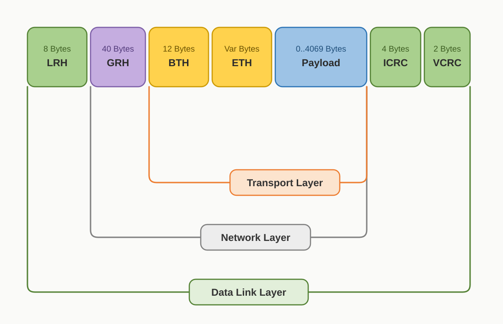
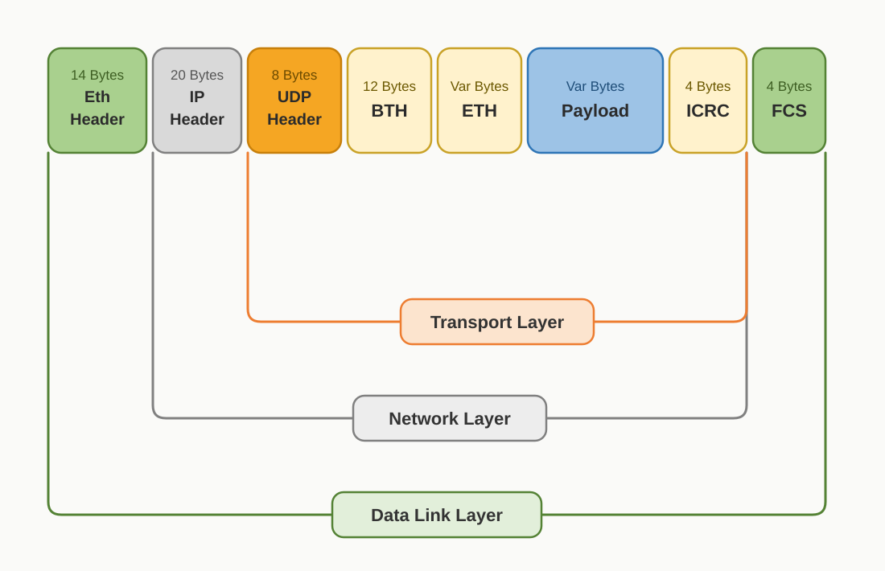

# Chapter 1: RDMA Fundamentals

The purpose of this chapter is to lay out the background knowledge you need before diving into RDMA. It assumes you already have a basic grasp of networking and some software development experience. If anything here leaves you confused, I recommend chatting with an AI or consulting the relevant books to get these fundamentals straight before moving on to the later chapters.

## 1.1. Two Basic Concepts: Kernel Space and User Space

Modern operating systems divide the CPU's execution state into two layers.

**Kernel space** is the mode in which the operating system kernel runs. It has the highest privilege and can directly operate hardware, manage memory, and schedule processes.

**User space** is the mode in which ordinary applications run. Its privileges are restricted: it cannot touch hardware directly and must request the kernel to act on its behalf through "system calls."

This design exists for safety and stability: a misbehaving application won't crash the whole system. But it comes at a cost: every system call forces the CPU to switch from user space into kernel space, complete the operation, and then switch back. That round trip itself has overhead.

---

## 1.2. What a Plain Socket Send/Receive Actually Goes Through

Let's take a single TCP send as an example and trace how data travels from your application to the network card.

In your application you call `write()`, which is a system call. The CPU switches from user space into kernel space, the kernel's Socket layer copies the data from your user-space memory buffer into the kernel's send buffer, hands it to the TCP/IP stack for encapsulation, and finally submits it to the NIC.

Once the NIC receives the task, it doesn't need the CPU to move the data for it. Through a hardware mechanism called DMA (Direct Memory Access), it reads the data out of the kernel buffer by itself and completes the send. DMA is a fundamental capability of modern NICs: a peripheral transfers data directly to and from memory without involving the CPU at all.

The receive direction is the reverse: the NIC receives the data, likewise uses DMA to write it into the kernel buffer, then raises an interrupt to notify the CPU. The kernel stack processes and decapsulates it, then copies the data once more from the kernel buffer to a user-space buffer, and only when the application calls `read()` can it read the data.

Throughout this whole process, every packet undergoes at least two switches between kernel and user space, plus two memory copies. The transfer between the NIC and the kernel buffer is handled by DMA and doesn't bother the CPU; but that copy between the kernel buffer and user-space memory still has to be performed by the CPU itself. In ordinary business scenarios, this overhead is completely imperceptible. But when you're facing a high-speed network pushing millions of packets per second, this overhead consumes a great deal of CPU and becomes a performance bottleneck.

---

## 1.3. DPDK: Kicking the Kernel Off the Data Path

Since the problem lies in the kernel's involvement, one direct idea is to let the application bypass the kernel and talk to the NIC directly. This is precisely the core idea of DPDK (Data Plane Development Kit).

DPDK is a NIC driver framework that runs in user space. It takes control of the NIC away from the kernel driver, allowing a user-space program to read and write the NIC's send/receive queues directly: no kernel, no system calls, no interrupts, and no copying data into the kernel and back out.

DPDK's effect is striking: on a single machine, it compresses the latency and CPU overhead of packet processing to extremely low levels, making it standard equipment in scenarios extremely sensitive to network performance, such as telecom and high-frequency trading.

But DPDK only solves the problem of **kernel involvement on a single machine**. The data still flows within this machine's memory, and the CPU is still the entity that actually performs the send and receive actions, it just no longer has to make that detour through the kernel.

---

## 1.4. The Dilemma of Parallel Computing: The Network Becomes the New Bottleneck

Now let's switch the scene to a different dimension: large-scale parallel computing.

Deep learning training uses dozens or even hundreds of GPUs, distributed across multiple machines. During training, the nodes need to exchange gradient data frequently: at regular intervals, all nodes aggregate and synchronize the gradients they have computed, then continue to the next round of computation. This communication pattern is called AllReduce.

Here's the question: if the nodes communicate using ordinary Sockets, what happens?

The sender's CPU has to first move the data from GPU memory into CPU memory, call `write()` to trap into the kernel, pass through the protocol stack, and send it out; the receiver's CPU is jolted awake by an interrupt, the data is moved from the NIC into the kernel buffer, then copied to user-space memory, then moved back into GPU memory. Across the entire path, the CPU is deeply involved at both ends.

This creates a fundamental contradiction: the value of a GPU lies in parallel computation, yet during the communication phase the CPU becomes the factor that constrains speed. The GPU finishes computing and waits to synchronize while the CPU is busy moving data, leaving a great deal of compute power idle. The efficiency of network communication directly determines how fast the entire cluster can run.

---

## 1.5. RDMA: Letting the NIC Directly Read and Write Remote Memory

Solving this problem requires a new line of thinking: **can communication be done without going through the CPU at all?**

RDMA, Remote Direct Memory Access, is the realization of this idea.

Its core notion is to bypass the operating system kernel and let one machine's NIC write data directly into another machine's memory. Throughout the process the CPU is not involved in moving data; it only needs to do a tiny amount of work when initiating and completing an operation.

Specifically, the application registers a region of memory with the system in advance, telling the NIC "you may operate on this memory directly." The sender's NIC reads data from local memory via DMA and sends it out over the network; the receiver's NIC writes the data directly into the memory region the peer has registered ahead of time, again via DMA. The CPUs at both ends are essentially bystanders during this process.

For parallel computing scenarios, this means the communication phase of AllReduce can be completed independently by the NIC, freeing the CPU and GPU to continue computing, so that communication and computation can truly overlap. This is what allows the compute power of large-scale clusters to be fully utilized.

---

## 1.6. The RDMA Communication Model and Basic Concepts

Now that we understand the motivation behind RDMA, we still need to build up a conceptual framework before we can actually use it. RDMA's programming model differs greatly from traditional Sockets and has its own system of terminology, but the logic isn't complicated.

---

### 1.6.1 Verbs: The RDMA Programming Interface

The RDMA programming interface is collectively called **Verbs**. You can think of it as the "Socket API" of the RDMA world: regardless of whether the underlying transport is InfiniBand or RoCE, upper-layer applications all operate through Verbs. Verbs revolve around several core objects.

**Memory Registration (MR)**

As mentioned earlier, RDMA requires the NIC to be able to access the application's memory directly. But the NIC cannot access just any arbitrary piece of memory; the application must first "register" a memory region with the system. This makes the operating system lock the memory (preventing it from being swapped out to disk) and tells the NIC its physical address. Once registration succeeds, this memory can serve as the source or target of an RDMA operation. Registration has a cost, so in practice a large memory pool is usually registered in advance and reused repeatedly.

**Queue Pair (QP)**

RDMA send/receive does not go through the kernel's Socket but is done through QPs. A QP contains two queues: a Send Queue (SQ) and a Receive Queue (RQ). When you want to send data, you submit a descriptor into the SQ; when the peer wants to receive data, it places receive buffers into its RQ in advance. In RC mode, each end has a QP, and a connection must be established before communication, pairing and binding the two QPs together.

**Work Queue Element (WQE)**

Each "task description" submitted into a queue is a WQE. It tells the NIC: what operation to perform, which memory block the data is in, how long it is, and where to send it. The CPU writes the WQE into the queue and then rings the NIC's "doorbell" register, after which the NIC starts working on its own, no longer needing the CPU's participation.

**Completion Queue (CQ) and CQE**

After the NIC finishes a WQE, it needs to notify the application. The way it does this is by writing a **CQE (Completion Queue Element)** into the **CQ (Completion Queue)**, recording the result of this operation: success or failure, and how many bytes were transferred. The application polls or waits on the CQ, and only by obtaining a CQE does it learn that a particular operation has finished.

**WR and WC: The User's Perspective Naming**

In the user-space programming interface, the structure corresponding to a WQE is called a **WR (Work Request)**, and the structure corresponding to a CQE is called a **WC (Work Completion)**. The names differ, but they refer to the same mechanism as it manifests at the user layer: you submit a WR, and afterward you receive a WC.

---

### 1.6.2 Two-Sided and One-Sided Communication

RDMA operations fall into two categories, and the core difference is whether the remote CPU needs to participate.

**Two-sided communication** means both ends need to actively cooperate. The sender submits a Send operation, and the receiver must have a receive buffer prepared in its RQ in advance for the data to land. The CPUs at both ends must get involved, responsible for preparing the WQE on the receive side ahead of time.

**One-sided communication** is RDMA's most distinctive capability. The sender can read and write the peer's memory directly, while the peer's CPU is entirely unaware and uninvolved. This requires the peer to have registered its memory ahead of time and to have informed the sender of the access credentials (the memory's address and permission key); after that, the sender can bypass the peer's CPU and let the NIC operate that memory directly.

---

### 1.6.3 Information Needed to Establish a Connection

Before RDMA formally transfers data, the two parties must first complete a "parameter exchange," which mainly includes the following:

- **QPN (Queue Pair Number)**: Each QP has a number on the local RDMA NIC (RNIC). An outgoing packet must specify "which QP on the peer to deliver to" so that when the peer's RNIC receives it, it knows which QP should handle this request. Without a QPN, a packet that arrives at the peer has no idea where to be delivered.
- **PSN (Packet Sequence Number)**: The initial sequence number. In reliable transport mode, the two parties use the PSN to detect packet loss, reordering, and duplicate packets. When the connection is established, each side randomly generates an initial PSN and tells the peer; thereafter the PSN increments with each packet sent, and the peer uses it to judge whether packets are complete and in order.
- **Virtual Address**: The target of one-sided operations (Write / Read / Atomic). The initiator needs to know "which address in the peer's memory to write to" or "which address in the peer's memory to read from." This address is the virtual address from when the peer registered its MR, and the peer must proactively communicate it.
- **rkey (Remote Key)**: The access authorization token, used together with the memory address. Neither can be missing: the address specifies "where," and the rkey specifies "whether you're entitled."

---

### 1.6.4 Transport Types: RC, UC, and UD

RDMA supports three Queue Pair transport types, differing in their reliability guarantees and connection methods.

**RC (Reliable Connection)** is the most widely used type. It requires establishing a QP connection in advance, with the two parties exchanging information such as QPN, PSN, and GID / LID, guaranteeing that data arrives in order and without loss. The vast majority of RDMA applications (including the communication libraries of AI training clusters) run on RC.

**UC (Unreliable Connection)**, like RC, is also a point-to-point connection that requires establishing a QP connection in advance, with the two parties exchanging information such as QPN, PSN, and GID / LID; but UC provides no retransmission guarantee, and data may be lost. It is rarely used in practice.

**UD (Unreliable Datagram)** requires no prior connection setup: a single endpoint can send data to any peer, specifying the target on the fly at send time and describing the peer's address through an **AH (Address Handle)**. UD has no reliability guarantee but is flexible, suitable for broadcast, multicast, and similar scenarios.

#### Differences in Concrete Behavior

**RC (Reliable Connection)**

```
Sender:    Post Send
           ↓
           Hardware auto-fragments (fragments if larger than MTU)
           Hardware maintains PSN, automatically retransmits lost packets
           Hardware waits for ACK
Receiver:  Hardware automatically sends ACK upon receipt
           The application layer sees complete data, with no need to worry about fragmentation
```

- Supports RDMA Write / RDMA Read / Send / Atomic (the next section will introduce these specific operations in detail)
- Each connection exclusively owns a pair of QPs, so **number of QPs = number of connections**
- Reliability resides in the RDMA hardware/driver layer; the application is entirely unaware of packet loss and retransmission, reordering and reassembly, or flow control

**UC (Unreliable Connection)**

```
Sender:    Post Send
           ↓
           Hardware fragments and sends
           No ACK, no retransmission
           A lost packet is just lost; the peer doesn't know
Receiver:  Takes whatever it receives
```

- Supports only RDMA Write / Send; does not support RDMA Read
- Each connection exclusively owns a pair of QPs, so **number of QPs = number of connections**
- No reliability; the application handles it itself or ignores it outright

**UD (Unreliable Datagram)**

```
Sender:    Post Send + specify AH (target address)
           ↓
           Single-packet send, cannot exceed MTU (4096B)
           No fragmentation, no retransmission, no ACK
Receiver:  Each Recv buffer must be 40 bytes larger than the actual data
           (the header carries a GRH, Global Routing Header)
```

- Supports only Send; **does not support any RDMA one-sided operations**
- A single QP can communicate with any number of peers
- No reliability, and a single packet cannot exceed the MTU; the application handles fragmentation/retransmission itself

#### Practical Use Cases

| Scenario                            | Which to use            |
| ----------------------------------- | ----------------------- |
| NCCL point-to-point (GPU-to-GPU)    | RC (mainstream)         |
| MPI collective communication        | RC or UD                |
| Storage protocols (NVMe-oF, iSER)   | RC                      |
| Multicast / one-to-many needed      | UD (RC/UC can't do it)  |
| Low connection count, extreme latency | RC                    |
| Very high connection count (tens of thousands of nodes) | UD (avoids QP explosion) |

---

### 1.6.5 The Four Basic Operations

RDMA's four operations are essentially combinations along two dimensions: **who initiates** (the initiator vs. the peer's CPU) × **who decides where the data lands** (local vs. remote).

#### Send (Two-Sided Operation)

The most basic operation, closest to the traditional Socket `send()`. The sender pushes data toward the peer, but which memory block the data ultimately lands in is decided by the **receiver**. The receiver must have a WQE posted on its Receive Queue in advance, designating the receive buffer; the sender knows nothing about this, it just sends.

This is what "two-sided" means: **the CPUs of both parties must participate**: the sender's CPU submits a Send WQE, and the receiver's CPU prepares a Recv WQE in advance. No CPU is needed to move data on the data path, but both parties must act on the control path.

The typical uses of Send are passing metadata and control messages, or for the connection-setup phase: for example, the two ends informing each other of their memory addresses and rkeys so that subsequent one-sided operations can be performed.

---

#### RDMA Write (One-Sided Operation)

The sender writes data directly into a **memory address specified by the peer**. The peer's CPU is entirely uninvolved; it doesn't need to post a Recv WQE in advance, and the data quietly appears in that memory.

But there's a key question here: how does the sender know which address in the peer's memory to write to?

The answer is: **the peer must tell the initiator in advance**. Through an out-of-band channel or an in-band channel (usually a single Send operation), the peer sends the initiator three things: the target virtual address, the length of this memory region, and a token called the **rkey (Remote Key)**.

**The rkey is the core concept here.** RDMA's one-sided operations bypass the peer's CPU, but they cannot bypass the peer's security check, otherwise any node could read and write remote memory at will. The rkey is the credential by which RDMA hardware performs access authorization: the initiator carries the rkey in its Write request, and when the peer's NIC (RNIC) receives the request, it consults its own memory protection table to verify whether this rkey corresponds to the target address, whether it has write permission, and whether it has expired. Only when verification passes does the DMA write actually occur.

You can think of the rkey as a temporarily authorized "safe-deposit-box key": only once the peer hands you the key can you open that particular compartment, and the key can be revoked at any time (by deregistering the MR).

RDMA Write is very well suited to high-throughput data-push scenarios: a storage system writing data blocks, or a parameter server distributing gradients during AI training, are both typical use cases.

---

#### RDMA Read (One-Sided Operation)

The initiator actively pulls data out of **the peer's memory** and brings it back locally. Likewise, the peer's CPU does not participate; the peer's RNIC reads the data directly from memory and returns it.

RDMA Read also requires an rkey: the initiator needs to tell the peer's NIC "I want to read this address, this length, and here is the rkey you gave me," and the peer's NIC performs the read only after verifying the permission.

Compared with Write, Read involves one extra network round trip: the initiator sends out the Read request, the peer's NIC packs up the data and sends it back, and only when the initiator receives it is the operation complete.

RDMA Read suits scenarios where remote data is pulled on demand: for example, the GET operation of a distributed key-value store, or a compute node pulling a particular layer's weights from a parameter server on demand.

---

#### Atomic (Atomic Operations)

RDMA Atomic is a **one-sided operation**. Like Write/Read, it doesn't require the peer's CPU to participate, but what makes it special is that it is an **atomic read-modify-write**, with the hardware guaranteeing the operation is indivisible.

Here's a real-world example: a pot of beef soup, your and your roommate's favorite, is simmering on the stove. You taste it and find it bland, so you go next door to get salt; meanwhile your roommate also tastes it and goes looking for salt too. You come back and add salt, and the flavor is just right; your roommate comes back unaware and adds salt again, and now the soup is far too salty. The problem is that "taste" and "add" are two steps, and there's a gap in between into which another action can be inserted. An atomic operation binds these two steps into a single hardware-level primitive, so that between these two actions, no other operation can possibly be inserted.

When multiple nodes concurrently access the same region of remote memory, this guarantee is crucial. Distributed locks, sequence number generators, reference counts, any scenario requiring "only one winner" can be implemented with Atomic.

It performs an **indivisible read-modify-write** on the peer's memory. There are two kinds:

- **Fetch-and-Add**: reads the current value, adds a number, writes it back, and returns the old value.
- **Compare-and-Swap**: reads the current value, and if it equals the expected value, replaces it with the new value, returning the old value.

**Limitations of Atomic operations:**

- Only RC supports them; UC/UD do not
- The operand data width is fixed at 8 bytes (64-bit) and cannot be larger
- The target address must be 8-byte aligned

Atomic also requires an rkey and has strict requirements on memory alignment (typically requiring 8-byte alignment), because the underlying implementation relies on the atomic-access capability of the PCIe bus and the memory controller.

---

### 1.6.6 Summary

RDMA's three transport types: RC, UC, and UD.

RDMA's four operations: Send, Write, Read, Atomic. A comparison of the four operations follows:

| Operation  | One/Two-sided | Peer CPU involved | Needs rkey | Peer must post Recv WQE in advance | Supported QP types |
| ---------- | ------------- | ----------------- | ---------- | ---------------------------------- | ------------------ |
| Send       | Two-sided     | Yes               | No         | Yes                                | RC, UC, UD         |
| RDMA Write | One-sided     | No                | Yes        | No                                 | RC, UC             |
| RDMA Read  | One-sided     | No                | Yes        | No                                 | RC                 |
| Atomic     | One-sided     | No                | Yes        | No                                 | RC                 |

---

The above is the basic conceptual framework needed to understand RDMA. If you want to dig deeper into the details of the Verbs programming interface, the kernel driver implementation, and the complete RDMA technology stack, I recommend reading the RDMA portion of [*Linux High-Performance Networking Explained: From DPDK, RDMA to XDP* by Liu Wei](https://www.epubit.com/bookDetails?id=UBd16b63c7abb7), where there is a more systematic treatment.

---

## 1.7. The Networks That Carry RDMA Communication

Everything above has been about what RDMA "does": bypassing the kernel and letting the NIC directly read and write remote memory. But one question remains unanswered: what kind of network do these packets actually run on?

We need to distinguish two layers first. RDMA is a set of **programming models and semantics** (Verbs, QP, one-sided/two-sided operations, etc.); it does not itself dictate what link is used underneath to transport data. What actually carries a packet from one NIC to another is the underlying **physical transport channel**. The same set of RDMA semantics can run over different transport channels.

There are currently two mainstream ways of carrying it:

### InfiniBand (IB)

InfiniBand is **a network technology designed specifically for RDMA, complete and self-contained from the physical layer to the transport layer**. It has its own dedicated InfiniBand switch hardware, an independent protocol stack, and matching network cards (HCAs) and cabling.



The figure above breaks down a complete IB protocol stack from layer 2 to layer 4. You can see that IB carries its own layered structure paralleling Ethernet:

- The LRH (Local Routing Header) is the link layer, responsible for addressing within a subnet;
- The GRH (Global Routing Header) is equivalent to the network layer, used for cross-subnet routing;
- The BTH and ETH (Base/Extended Transport Headers) form the transport layer, carrying RDMA semantics such as Opcode, QPN, and PSN;
- At the tail, the ICRC is an end-to-end invariant checksum, while the VCRC is a link-level checksum recomputed at every hop.

Because it is tailor-made for RDMA, IB guarantees lossless transport, low latency, and high bandwidth from the hardware level up, and the reliable transport, flow control, and congestion control mechanisms RDMA needs are all built into the protocol. The price is that it forms its own self-contained ecosystem, requiring dedicated IB switches and management software (such as a Subnet Manager), and is not interoperable with traditional Ethernet equipment.

In high-performance computing (HPC) and large-scale AI training clusters, InfiniBand has long been the mainstream choice.

### RoCE (RDMA over Converged Ethernet)

RoCE's idea is to **make RDMA run over Ethernet**, thereby reusing the existing Ethernet ecosystem (switches, cabling, operations infrastructure). It encapsulates InfiniBand's transport-layer semantics into Ethernet packets.

RoCE has two versions:

- **RoCEv1**: encapsulates the IB transport layer directly on top of the Ethernet link layer. It can only communicate within the same layer-2 broadcast domain and cannot be routed across subnets, so it is rarely deployed in practice.
- **RoCEv2**: encapsulates the IB transport layer on top of UDP/IP (UDP destination port 4791), so it can be routed like an ordinary IP packet and deployed across layer-3 networks. This is the version actually used today; when people say RoCE, they usually mean RoCEv2 by default.



Comparing the figure above with the IB packet, the essence of RoCEv2 becomes clear:

- The original transport layer's BTH, ETH, Payload, and ICRC are carried over from IB almost unchanged, with identical transport-layer semantics;
- IB's transport layer is wrapped inside UDP;
- Ethernet + TCP/IP replaces IB's entire transport channel.

RoCE's benefit is that it can leverage existing Ethernet infrastructure and is friendlier in terms of cost and compatibility; but the price is that Ethernet itself is "best-effort" and tolerates packet loss, whereas RDMA is highly sensitive to packet loss. To make RoCE perform well, you must additionally build a **lossless network** mechanism on top of Ethernet (such as PFC flow control and ECN/DCQCN congestion control), and tuning this part is often the trickiest stage of a RoCE deployment.

Here, we only need to establish an initial impression: **RDMA is the upper-layer semantics, and InfiniBand and RoCE are two different routes for carrying it**. The subsequent chapters of this book will unfold with InfiniBand as the main thread, going deep into its link layer, network layer, routing, QoS, congestion control, and other mechanisms.
