# Chapter 3: Introduction to Soft-RoCE (RXE)

In the chapters that follow, we will analyze the details of RDMA communication through packet captures in a lab environment, in order to understand RDMA in depth. I don't have IB or RoCE hardware, so I need to use software to simulate an environment in which RDMA verbs can be tested. This chapter introduces Soft-RoCE as well as the various RDMA packet-generating tools built into Linux.

## 3.1 The Role and Background of Soft-RoCE

The formal name of Soft-RoCE is RXE (Soft RDMA over Converged Ethernet). It is a pure-software implementation of the RoCEv2 protocol stack that runs on ordinary Ethernet NICs, requiring no RDMA-specific hardware support whatsoever.

It was first developed by Bob Pearson and others at SystemFabricWorks in 2008, and was merged into the mainline in 2016 with Linux kernel v4.8. Ubuntu 18.04 and later versions can use it out of the box, with no need to install an additional kernel module.

The design goal of RXE is to provide developers without HCA hardware with a complete RDMA verbs development and testing environment, while also being suitable for protocol research, teaching, and RDMA functional verification in CI/CD pipelines.

---

## 3.2 Explanation of the Relevant Directories/Files



The figure shows the two parallel paths involved when Soft-RoCE runs in a Linux system:

- The left side is the data plane (verbs operations: create_qp / post_send, etc.)
- The right side is the management plane (device queries, connection management)

The two paths converge in the kernel at rdma_rxe.ko. The call chain in the figure reveals the essence of Soft-RoCE: there is no hardware offload anywhere along the path. All RDMA semantics are performed entirely by rdma_rxe.ko in software on the CPU, and packets must also pass through the complete kernel IP stack and udp_tunnel.ko encapsulation before they can be sent out from an ordinary NIC.

The fundamental difference from a real HCA is this: the DMA engine of a hardware RDMA card can move data directly from remote memory to the local side, bypassing the CPU and the kernel; whereas RXE cannot do this, every RDMA operation consumes CPU cycles, and its throughput and latency fall far short of real hardware.

But this is precisely where Soft-RoCE makes its design trade-off: its goal was never performance, but rather to provide a behaviorally complete, interface-compatible RDMA development and testing environment in the absence of any IB/RoCE hardware.

### `/usr/lib/x86_64-linux-gnu/libibverbs/` — Provider Plugin Libraries

Each `.so` here corresponds to an HCA vendor or software implementation:

| File                       | Corresponding hardware/implementation |
| -------------------------- | ------------------------------------- |
| `libmlx5-rdmav34.so`       | Mellanox ConnectX-4/5/6/7             |
| `libmlx4-rdmav34.so`       | Mellanox ConnectX-3                   |
| `libbnxt_re-rdmav34.so`    | Broadcom NetXtreme                    |
| `libefa-rdmav34.so`        | AWS Elastic Fabric Adapter            |
| `libhns-rdmav34.so`        | Huawei HiSilicon                      |
| `libirdma-rdmav34.so`      | Intel E810 iWARP/RoCE                 |
| `libmana-rdmav34.so`       | Microsoft Azure MANA                  |
| `libvmw_pvrdma-rdmav34.so` | VMware PVRDMA                         |
| `librxe-rdmav34.so`        | Soft-RoCE                             |

**The meaning of the `-rdmav34` suffix:** this is the ABI version marker, where `34` indicates version 34 of the libibverbs provider ABI. When libibverbs is upgraded and changes the provider interface, this number changes, preventing a new framework from loading an old provider and crashing.

The application code has no idea whether the underlying layer is rxe or mlx5; this layer of abstraction is the most core design of libibverbs.

---

### `/sys/class/infiniband/` — Device Metadata (sysfs)

```
/sys/class/infiniband/rxe0 -> ../../devices/virtual/infiniband/rxe0/
```

The `virtual` path indicates that rxe0 is a software virtual device; a real HCA would be under `devices/pci0000:xx/`.

This directory holds **read-only configuration and status information**:

```bash
# Port state
expert@k8s-61:~$ cat /sys/class/infiniband/rxe0/ports/1/state
4: ACTIVE

# GID table
expert@k8s-61:~$ cat /sys/class/infiniband/rxe0/ports/1/gids/0
fe80:0000:0000:0000:0250:56ff:fea7:129f
expert@k8s-61:~$ cat /sys/class/infiniband/rxe0/ports/1/gids/1
0000:0000:0000:0000:0000:ffff:0a01:103d

```

When libibverbs calls `ibv_query_device()`, it actually just reads these sysfs files here, with no need to enter the kernel.

---

### `/dev/infiniband/` — The Actual Character Device Nodes

This is the real system-call entry point; the application interacts with the kernel through `open()` + `ioctl()`:

- `uverbs0` (the main device)
- `rdma_cm` (connection management)

---

## 3.3 Installation and Configuration

**Dependencies and tool packages (Ubuntu):**

```bash
sudo apt update
# RDMA user-space core libraries and tools: libibverbs, librdmacm,
# ib_uverbs udev rules, rdma link command support
sudo apt install rdma-core -y

# Basic diagnostic tools bundled with libibverbs:
# ibv_devices, ibv_devinfo, ibv_asyncwatch, etc.
sudo apt install ibverbs-utils -y

# RDMA performance testing tools:
# ib_send_bw, ib_read_bw, ib_write_bw,
# ib_send_lat, ib_read_lat, ib_write_lat, etc.
sudo apt install perftest -y

# The Linux network configuration toolset, including the rdma subcommand:
# ip, tc, ss, rdma link add/show, etc.
# Usually pre-installed; here we ensure the version is new enough
sudo apt install iproute2 -y

# InfiniBand subnet diagnostic tools:
# ibstat, ibstatus, iblinkinfo, ibping,
# ibnetdiscover, ibdiagnet, etc.
sudo apt install infiniband-diags -y

# Connection management testing tools bundled with librdmacm:
# rping, rdma_bw, udaddy, mckey, etc.
sudo apt install rdmacm-utils -y
```

**Enabling steps:**

````bash
# 1. Load the module
sudo modprobe rdma_rxe

# 2. Bind the NIC
sudo rdma link add rxe0 type rxe netdev <dev>

**Persistence (automatically takes effect after reboot):**

```bash
# /etc/modules-load.d/rxe.conf
echo 'rdma_rxe' | sudo tee /etc/modules-load.d/rxe.conf

# /etc/rdma/rxe.conf
echo 'ens160' | sudo tee /etc/rdma/rxe.conf
````

---

## 3.4 Verification and Inspecting Information

```bash
# View physical link information
expert@k8s-62:~$ ip link
1: lo: <LOOPBACK,UP,LOWER_UP> mtu 65536 qdisc noqueue state UNKNOWN mode DEFAULT group default qlen 1000
    link/loopback 00:00:00:00:00:00 brd 00:00:00:00:00:00
2: ens160: <BROADCAST,MULTICAST,UP,LOWER_UP> mtu 1500 qdisc mq state UP mode DEFAULT group default qlen 1000
    link/ether 00:50:56:a7:7d:03 brd ff:ff:ff:ff:ff:ff

# View the physical-layer and link-layer state of the local RDMA device
expert@k8s-62:~$ ibstat
CA 'rxe0'
        CA type:
        Number of ports: 1
        Firmware version:
        Hardware version:
        Node GUID: 0x025056fffea77d03
        System image GUID: 0x025056fffea77d03
        Port 1:
                State: Active
                Physical state: LinkUp
                Rate: 10 (FDR10)
                Base lid: 0
                LMC: 0
                SM lid: 0
                Capability mask: 0x00010000
                Port GUID: 0x025056fffea77d03
                Link layer: Ethernet

# View brief info on the rdma device, a tool from the iproute2 package
expert@k8s-62:~$ rdma link show
link rxe0/1 state ACTIVE physical_state LINK_UP netdev ens160

expert@k8s-62:~$ rdma dev
0: rxe0: node_type ca node_guid 0250:56ff:fea7:7d03 sys_image_guid 0250:56ff:fea7:7d03

# A tool from the libibverbs package
expert@k8s-62:~$ ibv_devices
    device                 node GUID
    ------              ----------------
    rxe0                025056fffea77d03

expert@k8s-62:~$ ibv_devinfo
hca_id: rxe0
        transport:                      InfiniBand (0)
        fw_ver:                         0.0.0
        node_guid:                      0250:56ff:fea7:7d03
        sys_image_guid:                 0250:56ff:fea7:7d03
        vendor_id:                      0xffffff
        vendor_part_id:                 0
        hw_ver:                         0x0
        phys_port_cnt:                  1
                port:   1
                        state:                  PORT_ACTIVE (4)
                        max_mtu:                4096 (5)
                        active_mtu:             1024 (3)
                        sm_lid:                 0
                        port_lid:               0
                        port_lmc:               0x00
                        link_layer:             Ethernet

expert@k8s-62:~$ ibv_devinfo -v
hca_id: rxe0
        transport:                      InfiniBand (0)
        fw_ver:                         0.0.0
        node_guid:                      0250:56ff:fea7:7d03
        sys_image_guid:                 0250:56ff:fea7:7d03
        vendor_id:                      0xffffff
        vendor_part_id:                 0
        hw_ver:                         0x0
        phys_port_cnt:                  1
        max_mr_size:                    0xffffffffffffffff
        page_size_cap:                  0xfffff000
        max_qp:                         1048560
        max_qp_wr:                      1048576
        device_cap_flags:               0x01223c76
                                        BAD_PKEY_CNTR
                                        BAD_QKEY_CNTR
                                        AUTO_PATH_MIG
                                        CHANGE_PHY_PORT
                                        UD_AV_PORT_ENFORCE
                                        PORT_ACTIVE_EVENT
                                        SYS_IMAGE_GUID
                                        RC_RNR_NAK_GEN
                                        SRQ_RESIZE
                                        MEM_WINDOW
                                        MEM_MGT_EXTENSIONS
                                        MEM_WINDOW_TYPE_2B
        max_sge:                        32
        max_sge_rd:                     32
        max_cq:                         1048576
        max_cqe:                        32767
        max_mr:                         524287
        max_pd:                         1048576
        max_qp_rd_atom:                 128
        max_ee_rd_atom:                 0
        max_res_rd_atom:                258048
        max_qp_init_rd_atom:            128
        max_ee_init_rd_atom:            0
        atomic_cap:                     ATOMIC_HCA (1)
        max_ee:                         0
        max_rdd:                        0
        max_mw:                         524287
        max_raw_ipv6_qp:                0
        max_raw_ethy_qp:                0
        max_mcast_grp:                  8192
        max_mcast_qp_attach:            56
        max_total_mcast_qp_attach:      458752
        max_ah:                         32767
        max_fmr:                        0
        max_srq:                        917503
        max_srq_wr:                     1048576
        max_srq_sge:                    27
        max_pkeys:                      64
        local_ca_ack_delay:             15
        general_odp_caps:
        rc_odp_caps:
                                        NO SUPPORT
        uc_odp_caps:
                                        NO SUPPORT
        ud_odp_caps:
                                        NO SUPPORT
        xrc_odp_caps:
                                        NO SUPPORT
        completion_timestamp_mask not supported
        core clock not supported
        device_cap_flags_ex:            0x1C001223C76
                                        Unknown flags: 0x1C000000000
        tso_caps:
                max_tso:                        0
        rss_caps:
                max_rwq_indirection_tables:                     0
                max_rwq_indirection_table_size:                 0
                rx_hash_function:                               0x0
                rx_hash_fields_mask:                            0x0
        max_wq_type_rq:                 0
        packet_pacing_caps:
                qp_rate_limit_min:      0kbps
                qp_rate_limit_max:      0kbps
        tag matching not supported
        num_comp_vectors:               4
                port:   1
                        state:                  PORT_ACTIVE (4)
                        max_mtu:                4096 (5)
                        active_mtu:             1024 (3)
                        sm_lid:                 0
                        port_lid:               0
                        port_lmc:               0x00
                        link_layer:             Ethernet
                        max_msg_sz:             0x80000000
                        port_cap_flags:         0x00010000
                        port_cap_flags2:        0x0000
                        max_vl_num:             1 (1)
                        bad_pkey_cntr:          0x0
                        qkey_viol_cntr:         0x0
                        sm_sl:                  0
                        pkey_tbl_len:           1
                        gid_tbl_len:            1024
                        subnet_timeout:         0
                        init_type_reply:        0
                        active_width:           1X (1)
                        active_speed:           10.0 Gbps (8)
                        phys_state:             LINK_UP (5)
                        GID[  0]:               fe80::250:56ff:fea7:7d03, RoCE v2
                        GID[  1]:               ::ffff:10.1.16.62, RoCE v2

# Note there are two GIDs:
# - GID 0: equivalent to a link-local IPv6 address, generated from the NIC's MAC address via the EUI-64 rule;
# - GID 1: this is an IPv4-mapped IPv6 address, in the format ::ffff:<IPv4>, corresponding to the IPv4 address 10.1.16.62 configured on the local NIC;
```

---

## 3.5 perftest Testing

perftest is the industry-standard RDMA performance benchmark suite. In the next chapter we will use perftest to initiate a complete RDMA communication and analyze it via packet capture; here we just give a basic introduction first.

The lab environment currently has two VMs in total, with Soft-RoCE installed. For the subsequent tests, `10.1.16.61` will serve as the server and `10.1.16.62` as the client.

```bash
# Write bandwidth test  ib_write_bw -d <dev> --report_gbits
# Read bandwidth test   ib_read_bw -d <dev> --report_gbits
# Send bandwidth test   ib_send_bw -d <dev> --report_gbits

# Server
expert@k8s-61:~$ ib_write_bw -d rxe0 --report_gbits

************************************
* Waiting for client to connect... *
************************************
---------------------------------------------------------------------------------------
                    RDMA_Write BW Test
 Dual-port       : OFF          Device         : rxe0
 Number of qps   : 1            Transport type : IB
 Connection type : RC           Using SRQ      : OFF
 PCIe relax order: ON
 ibv_wr* API     : OFF
 CQ Moderation   : 1
 Mtu             : 1024[B]
 Link type       : Ethernet
 GID index       : 1
 Max inline data : 0[B]
 rdma_cm QPs     : OFF
 Data ex. method : Ethernet
---------------------------------------------------------------------------------------
 local address: LID 0000 QPN 0x0011 PSN 0x2c7304 RKey 0x00027c VAddr 0x007ce507def000
 GID: 00:00:00:00:00:00:00:00:00:00:255:255:10:01:16:61
 remote address: LID 0000 QPN 0x0011 PSN 0x94c092 RKey 0x0002df VAddr 0x007e2996cd6000
 GID: 00:00:00:00:00:00:00:00:00:00:255:255:10:01:16:62
---------------------------------------------------------------------------------------
 #bytes     #iterations    BW peak[Gb/sec]    BW average[Gb/sec]   MsgRate[Mpps]
 65536      5000             0.74               0.48               0.000920
---------------------------------------------------------------------------------------

# Client initiates the test
expert@k8s-62:~$ ib_write_bw -d rxe0 --report_gbits 10.1.16.61
---------------------------------------------------------------------------------------
                    RDMA_Write BW Test
 Dual-port       : OFF          Device         : rxe0
 Number of qps   : 1            Transport type : IB
 Connection type : RC           Using SRQ      : OFF
 PCIe relax order: ON
 ibv_wr* API     : OFF
 TX depth        : 128
 CQ Moderation   : 1
 Mtu             : 1024[B]
 Link type       : Ethernet
 GID index       : 1
 Max inline data : 0[B]
 rdma_cm QPs     : OFF
 Data ex. method : Ethernet
---------------------------------------------------------------------------------------
 local address: LID 0000 QPN 0x0011 PSN 0x94c092 RKey 0x0002df VAddr 0x007e2996cd6000
 GID: 00:00:00:00:00:00:00:00:00:00:255:255:10:01:16:62
 remote address: LID 0000 QPN 0x0011 PSN 0x2c7304 RKey 0x00027c VAddr 0x007ce507def000
 GID: 00:00:00:00:00:00:00:00:00:00:255:255:10:01:16:61
---------------------------------------------------------------------------------------
 #bytes     #iterations    BW peak[Gb/sec]    BW average[Gb/sec]   MsgRate[Mpps]
 65536      5000             0.74               0.48               0.000920
---------------------------------------------------------------------------------------

# The MTU here is 1024 because Ethernet's MTU defaults to 1500, and RDMA needs to write its own InfiniBand headers, so the data is allotted 1024 by default
# IB's MTU is not an arbitrary value; it has fixed tiers: 256 / 512 / 1024 / 2048 / 4096, in bytes

# #bytes = 65536 (64KB)
# The amount of data transferred per RDMA Write operation; this is ib_write_bw's default message size

# iterations = 5000
# A total of 5000 RDMA Write operations were executed

# avg_bw = (65536 bytes × 5000 times × 8 bits) / total elapsed time

# MsgRate = 0.000920 Mpps = 920 ops/s
# The number of RDMA Write operations completed per second

```

---

## 3.6 pingpong Testing

`libibverbs` comes with the simplest RDMA connectivity verification tool, which can perform a Send/Recv pingpong test. Its main purpose is to verify whether the RDMA link is working, and to measure latency along the way.

Note that RDMA Send is a **two-sided operation**: the sender posts a Send, and the receiver must post a Recv in advance to receive it; both sides must participate. This is entirely different from the one-sided semantics of RDMA Write/Read. What `ibv_rc_pingpong` actually verifies is whether the entire Send/Recv path works, including the QP state machine, GID resolution, and whether the AH (Address Handle) is constructed correctly.

```bash
# RC pingpong latency  ibv_rc_pingpong -d <dev> -g 1
# UC pingpong latency  ibv_uc_pingpong -d <dev> -g 1
# UD pingpong latency  ibv_ud_pingpong -d <dev> -g 1
# `-g 1` specifies GID index 1 (the IPv4-mapped GID)

# Server
expert@k8s-61:~$ ibv_rc_pingpong -d rxe0 -g 1
  local address:  LID 0x0000, QPN 0x000015, PSN 0x7a34cd, GID ::ffff:10.1.16.61
  remote address: LID 0x0000, QPN 0x000017, PSN 0x1f739d, GID ::ffff:10.1.16.62
8192000 bytes in 0.63 seconds = 103.78 Mbit/sec
1000 iters in 0.63 seconds = 631.48 usec/iter

# Client initiates
expert@k8s-62:~$ ibv_rc_pingpong -d rxe0 -g 1 10.1.16.61
  local address:  LID 0x0000, QPN 0x000017, PSN 0x1f739d, GID ::ffff:10.1.16.62
  remote address: LID 0x0000, QPN 0x000015, PSN 0x7a34cd, GID ::ffff:10.1.16.61
8192000 bytes in 0.63 seconds = 103.92 Mbit/sec
1000 iters in 0.63 seconds = 630.65 usec/iter
```

---

## 3.7 rping Testing

`rping` is a tool from the `librdmacm-utils` package, used specifically to test rdma_cm connectivity, similar to the `ping` of the RDMA world. The `rping` flow is fairly complex, with each round completed by alternating two operations, RDMA READ and RDMA WRITE.

```bash
# Server
expert@k8s-61:~$ rping -s -d rxe0 -v
verbose
created cm_id 0x5617d13d2c20
rdma_bind_addr successful

# The server listens via rdma_cm, and the client initiates a connection request (CONNECT_REQUEST)
# At this point each side creates a PD, CQ, and QP, registers memory buffers, and then reaches ESTABLISHED.
# This part is the control plane, exchanging metadata via rdma_cm's SEND/RECV.
rdma_listen
cma_event type RDMA_CM_EVENT_CONNECT_REQUEST cma_id 0x71fc24000ce0 (child)
child cma 0x71fc24000ce0
created pd 0x5617d13c7810
created channel 0x5617d13c77d0
created cq 0x5617d13d2fb0
created qp 0x5617d13d3110
rping_setup_buffers called on cb 0x5617d13c67c0
allocated & registered buffers...
accepting client connection request
cq_thread started.

# --- The server receives the rkey + addr sent by the client via SEND
recv completion
Received rkey 2095 addr 5b269382e5e0 len 64 from peer
cma_event type RDMA_CM_EVENT_ESTABLISHED cma_id 0x71fc24000ce0 (child)
ESTABLISHED
# Using the received rkey/addr, the server actively initiates an RDMA READ to read the data from the client's memory
server received sink adv
server posted rdma read req
rdma read completion
server received read complete
server ping data: rdma-ping-0: ABCDEFGHIJKLMNOPQRSTUVWXYZ[\]^_`abcdefghijklmnopqr
# After reading, the server sends a SEND to notify the client
server posted go ahead
send completion
recv completion
# The client then sends the address of another of its buffers to the server via SEND.
Received rkey 1f86 addr 5b2693822500 len 64 from peer
server received sink adv
# Upon receiving it, the server does an **RDMA WRITE**, writing data back to the client
rdma write from lkey 1ed5 laddr 5617d13c7780 len 64
rdma write completion
server rdma write complete
# Then sends a SEND to notify the client that the write is done
server posted go ahead
send completion
# --- One round is now complete; this example loops 5 times in total (`-C 5`)

# --- The second round begins
recv completion
Received rkey 2095 addr 5b269382e5e0 len 64 from peer
server received sink adv
server posted rdma read req
rdma read completion
server received read complete
server ping data: rdma-ping-1: BCDEFGHIJKLMNOPQRSTUVWXYZ[\]^_`abcdefghijklmnopqrs
server posted go ahead
send completion
recv completion
Received rkey 1f86 addr 5b2693822500 len 64 from peer
server received sink adv
rdma write from lkey 1ed5 laddr 5617d13c7780 len 64
rdma write completion
server rdma write complete
server posted go ahead
send completion

# --- The third round begins
recv completion
Received rkey 2095 addr 5b269382e5e0 len 64 from peer
server received sink adv
server posted rdma read req
rdma read completion
server received read complete
server ping data: rdma-ping-2: CDEFGHIJKLMNOPQRSTUVWXYZ[\]^_`abcdefghijklmnopqrst
server posted go ahead
send completion
recv completion
Received rkey 1f86 addr 5b2693822500 len 64 from peer
server received sink adv
rdma write from lkey 1ed5 laddr 5617d13c7780 len 64
rdma write completion
server rdma write complete
server posted go ahead
send completion

# --- The fourth round begins
recv completion
Received rkey 2095 addr 5b269382e5e0 len 64 from peer
server received sink adv
server posted rdma read req
rdma read completion
server received read complete
server ping data: rdma-ping-3: DEFGHIJKLMNOPQRSTUVWXYZ[\]^_`abcdefghijklmnopqrstu
server posted go ahead
send completion
recv completion
Received rkey 1f86 addr 5b2693822500 len 64 from peer
server received sink adv
rdma write from lkey 1ed5 laddr 5617d13c7780 len 64
rdma write completion
server rdma write complete
server posted go ahead
send completion

# --- The fifth round begins
recv completion
Received rkey 2095 addr 5b269382e5e0 len 64 from peer
server received sink adv
server posted rdma read req
rdma read completion
server received read complete
server ping data: rdma-ping-4: EFGHIJKLMNOPQRSTUVWXYZ[\]^_`abcdefghijklmnopqrstuv
server posted go ahead
send completion
recv completion
Received rkey 1f86 addr 5b2693822500 len 64 from peer
server received sink adv
rdma write from lkey 1ed5 laddr 5617d13c7780 len 64
rdma write completion
server rdma write complete
server posted go ahead
send completion

# After the client finishes all five rounds, it actively disconnects; the server receives RDMA_CM_EVENT_DISCONNECTED, releases resources, and exits
cma_event type RDMA_CM_EVENT_DISCONNECTED cma_id 0x71fc24000ce0 (child)
server DISCONNECT EVENT...
# The server waits for the final state-machine transition
wait for RDMA_READ_ADV state 10
rping_free_buffers called on cb 0x5617d13c67c0
destroy cm_id 0x5617d13d2c20


# Client
expert@k8s-62:~$ rping -c -a 10.1.16.61 -C 5 -v
# The starting letter of each round shifts forward by one; rping does this on purpose to verify that the data read each time is genuinely new, not cached
ping data: rdma-ping-0: ABCDEFGHIJKLMNOPQRSTUVWXYZ[\]^_`abcdefghijklmnopqr
ping data: rdma-ping-1: BCDEFGHIJKLMNOPQRSTUVWXYZ[\]^_`abcdefghijklmnopqrs
ping data: rdma-ping-2: CDEFGHIJKLMNOPQRSTUVWXYZ[\]^_`abcdefghijklmnopqrst
ping data: rdma-ping-3: DEFGHIJKLMNOPQRSTUVWXYZ[\]^_`abcdefghijklmnopqrstu
ping data: rdma-ping-4: EFGHIJKLMNOPQRSTUVWXYZ[\]^_`abcdefghijklmnopqrstuv
client DISCONNECT EVENT...
```

---

## 3.8 The Capability Boundaries of Soft-RoCE

| Type / Object              | Support |
| -------------------------- | ------- |
| RDMA SEND                  | ✓       |
| RDMA READ                  | ✓       |
| RDMA WRITE                 | ✓       |
| Atomic (CAS / FAA)         | ✓       |
| SRQ (Shared Receive Queue) | ✓       |
| Memory Registration (MR)   | ✓       |
| RDMA CM                    | ✓       |
| Raw Packet QP              | No      |
| ODP (On-Demand Paging)     | No      |
