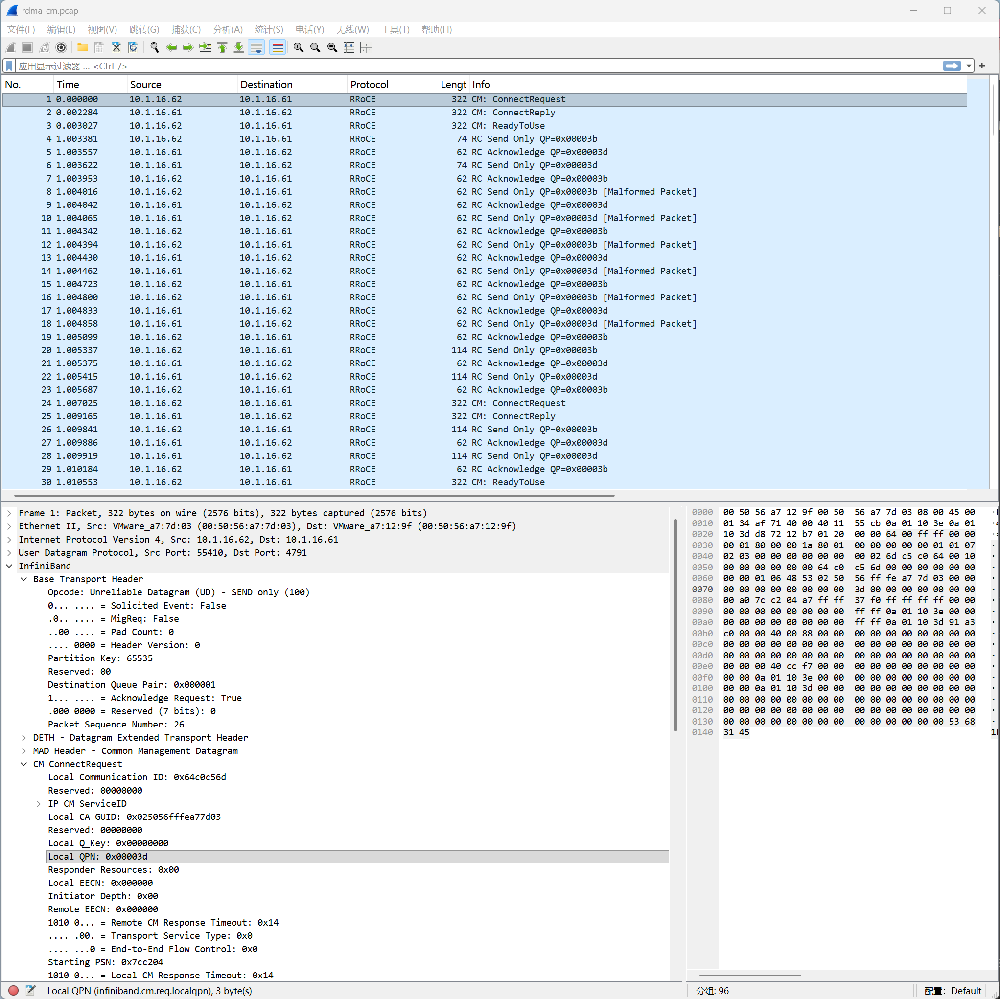
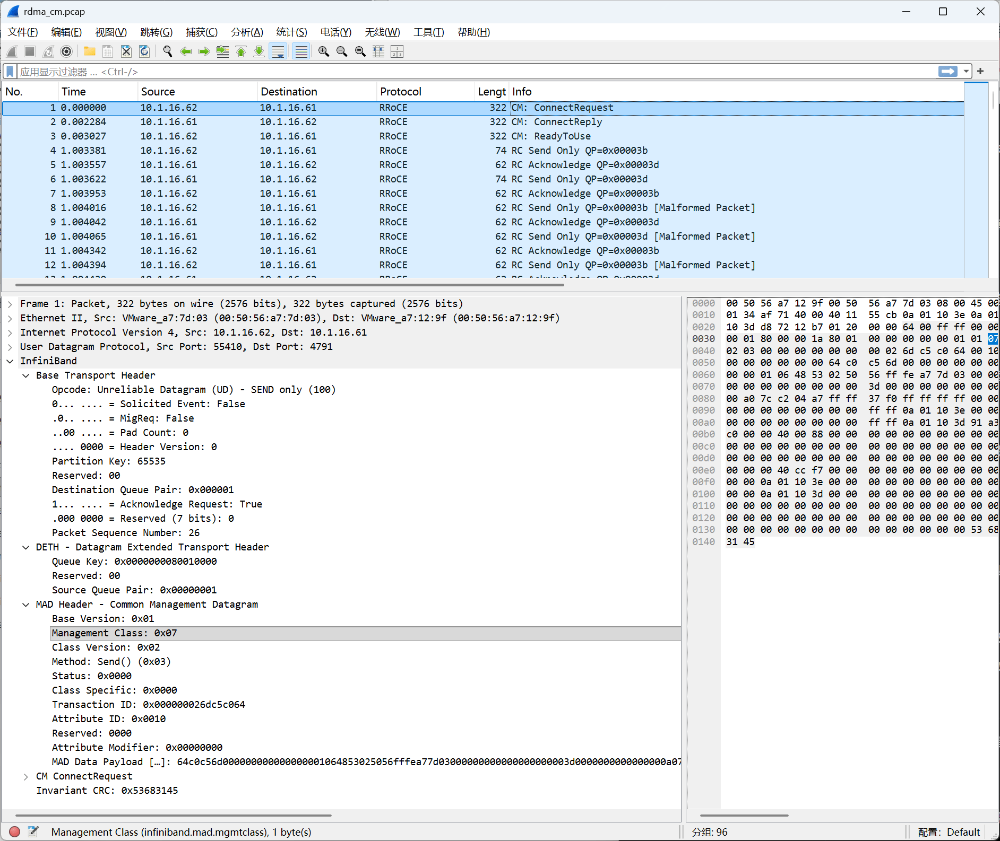

# Chapter 6: Packet Capture Analysis of RDMA CM

rdma_cm (RDMA Connection Manager) is a standardized connection management library that provides a socket-like API for establishing RDMA connections, hiding the low-level details.

The perftest tool uses TCP for connection management by default, but it can be switched to CM mode via the `--rdma_cm` parameter.

Continuing the tests from the previous chapter, the lab environment remains unchanged, with `10.1.16.61` as the server and `10.1.16.62` as the client.

[pcap capture file](../pcap/rdma_cm.pcap)

## 6.1 The Difference Between In-Band CM and Out-of-Band TCP Connection Setup

| Comparison item       | TCP out-of-band approach                            | CM in-band approach                                  |
| --------------------- | --------------------------------------------------- | --------------------------------------------------- |
| Connection setup method | Exchange parameters over a TCP connection         | Standard CM protocol (CM over UDP for RoCEv2, IB CM for IB) |
| Exchanged parameters  | QPN, PSN, RKey, GID, etc.                           | Standardized CM messages, containing metadata such as address and service info |
| QP state transition   | The application calls `ibv_modify_qp()` itself      | Managed automatically by `librdmacm`                |
| State machine flow    | `RESET → INIT → RTR → RTS`                          | Transparent to the application, done inside the library |
| Programming interface | Fully manual, requires writing the handshake code yourself | Socket-like API, only needs `listen/connect/accept` |
| Protocol standardization | Private implementation, format may differ between applications | Standard protocol, RDMA applications can interoperate |
| Typical applications  | perftest, NCCL, some MPI implementations, many HPC/AI frameworks | NVMe-oF, SRP, iSER, some MPI implementations        |
| Message format        | Usually plaintext or a custom binary format         | Structured fields, containing rich metadata such as GUID and Service ID |
| Connection lifecycle  | The TCP connection usually stays alive during data transfer (can also be actively closed) | Supports the standard connection management and disconnection flow |
| Disconnection         | The application decides for itself how to exit and clean up resources | Provides the standard `DREQ/DREP` disconnect handshake |

> The TCP out-of-band approach is essentially a "reinvent the wheel" connection management scheme, whereas `rdma_cm` provides standardized connection setup, address resolution, and disconnection mechanisms, freeing the application from complex QP state management.

---

## 6.2 Test Environment Setup

Swap perftest over to the `--rdma_cm` parameter and directly reuse the previous test framework:

```bash
# Capture on the server (only capture 4791, no need for 18515)
sudo tcpdump -i ens160 -w /tmp/rdma_cm.pcap 'udp port 4791'

# Server
ib_write_bw -d rxe0 --report_gbits -n 5 -s 3000 --rdma_cm

# Client
ib_write_bw -d rxe0 --report_gbits -n 5 -s 3000 --rdma_cm 10.1.16.61
```

## 6.3 The Full Timing Picture of the perftest CM Case



In a RoCEv2 environment, rdma_cm uses **RDMA CM over UDP**, port **4791**, the same port as the RDMA data packets.

By analyzing the Wireshark capture, we can obtain the following full timing picture:

```bash
Packet 01  62→61 [UD CM] ConnectRequest  Local QPN=0x3d    ← set up the control channel
Packet 02  62←61 [UD CM] ConnectReply    Local QPN=0x3b
Packet 03  62→61 [UD CM] ReadyToUse

Packet 04  62→61 [RC] RDMA Send × N                          ← control channel exchanges test parameters (VAddr, RKey...)

Packet 24  62→61 [UD CM] ConnectRequest  Local QPN=0x3e    ← set up the data channel
Packet 25  62←61 [UD CM] ConnectReply    Local QPN=0x3c
Packet 30  62→61 [UD CM] ReadyToUse

Packet 43  62→61 [RC] RDMA Write × N                       ← the actual test begins

Packet 91  62→61 [CM] DisconnectRequest  Remote QPN=0x3c   ← test ends, tear down the data channel first
Packet 92  62←61 [CM] DisconnectRequest  Remote QPN=0x3e   ← tear down the data channel
Packet 95  62←61 [CM] DisconnectRequest  Remote QPN=0x3d   ← then tear down the control channel
```

---

From the capture, we can see two ConnectRequests; they are two **independent connection requests**, setting up two different QPs.

```bash
                   Packet 1 (ConnectRequest)  Packet 24 (ConnectRequest)
Local Comm ID         0x64c0c56d               0x65c0c56d       ← different, each an independent session ID
Local QPN             0x00003d                 0x00003e         ← different! two different QPs
IP CM Source Port     0xccf7                   0xc6be           ← different, two independent CM ports
```

The information for the two QPs is summarized as follows:

```
                  k8s-62 (Client)        k8s-61 (Server)
First connection:   QP 0x00003d  ←────────→  QP 0x00003b   (Send/Recv control channel)
Second connection:  QP 0x00003e  ←────────→  QP 0x00003c   (actual data channel)
```

**First connection (QP 0x3d ↔ 0x3b): the parameter negotiation channel**

Before the actual test begins, perftest needs to exchange test parameters between the two ends, including the MR's VAddr, RKey, message size, iteration count, and so on. This metadata is conveyed through Send messages, which travel over the first connection.

**Second connection (QP 0x3e ↔ 0x3c): the test data channel**

After parameter negotiation completes, perftest then sets up a second connection, used to run the actual RDMA Write test traffic.

## 6.4 Parsing the CM Protocol



From the capture we can see an interesting phenomenon: when CM initiates a ConnectRequest, it uses UD (Unreliable Datagram), the Destination QPN in the BTH is 1, and the packet carries a standard MAD (Management Datagram).

This shows that CM itself is not an application-layer protocol but part of the InfiniBand management plane. A CM message is a special kind of MAD whose `Management Class` is fixed at `0x07`, indicating **Communication Management**.

From the perspective of the protocol stack, the encapsulation relationship of a CM message is as follows:

```text
CM Message
    ↓
MAD (Management Class = 0x07)
    ↓
UD Transport
    ↓
QP1 (General Service Interface)
    ↓
InfiniBand / RoCEv2 Network
```

> QP1 is the InfiniBand management plane's public service channel (reserved and always present), used mainly to carry Management Datagram (MAD) messages such as SA, CM, and PMA, for operations like path queries, connection management, and performance management. Ordinary applications' data communication should not use QP1.

The reason CM uses QP1 and UD transport is that, at this point, the real data QP has not yet been established. The two parties do not yet know each other's connection parameters such as QPN and PSN, so naturally they cannot send data over RC or UC. Therefore, CM must first complete the negotiation of connection parameters by means of the already-existing management channel (QP1) before it can establish the real data channel.

In this sense, the role CM plays is very similar to TCP's three-way handshake: it is responsible for establishing an RDMA connection, but it does not care what data the application actually transfers after the connection is established.

We can make an excerpt of the important information in CM's `ConnectRequest` in packet 1:

```bash
# ConnectRequest (Packet 1)
Local Communication ID: 0x64c0c56d
Local QPN:              0x00003d
Starting PSN:           0x7cc204
Primary Local GID:      10.1.16.62
Primary Remote GID:     10.1.16.61
Local CA GUID:          0x025056fffea77d03
Path MTU:               1024
```

> Translating this ConnectRequest into plain language: "My QPN is 0x3d, my initial PSN is 0x7cc204..., and I'd like to establish an RC connection with you."

Next, let's look at the `ConnectReply` (packet 2) that the server returns after receiving the request:

```bash
# ConnectReply (Packet 2)
Local Communication ID: 0x8988f456
Remote Communication ID: 0x64c0c56d
Local QPN:              0x00003b
Starting PSN:           0x727d6d
Local CA GUID:          0x025056fffea7129f
```

> Translating this ConnectReply into plain language: "I've seen your connection request; my QPN is 0x3b, my initial PSN is 0x727d6d..., and I'd like to establish an RC connection with you."

Finally, the client returns `ReadyToUse` (packet 3):

```bash
# ReadyToUse (Packet 3)
Local Communication ID: 0x64c0c56d
Remote Communication ID: 0x8988f456
```

At this point, the two parties have completed: the exchange of the peer's QPN, the exchange of the initial PSN, and the negotiation of path and capability parameters.

Subsequently, `librdmacm` automatically advances the QP state machine (RESET → INIT → RTR (Ready To Receive) → RTS (Ready To Send)). Once both parties enter the RTS state, CM's mission is declared complete, and the subsequent data transfer is entirely taken over by the newly established RC QP.

Compared with the out-of-band TCP connection setup approach, the information exchanged by the two parties in in-band CM is actually almost exactly the same; the only difference is:

- The TCP approach uses an application-private format to exchange parameters;
- The CM approach uses standardized MAD messages and structured fields.

This is also the fundamental reason why implementations from different storage vendors such as NVMe-oF and iSER can interoperate: they follow the same set of standardized CM protocol, rather than each defining its own private TCP handshake format.
