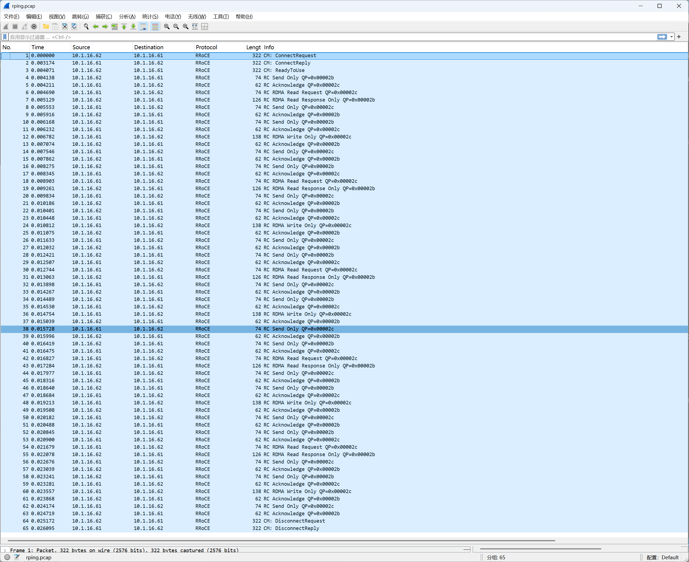

# Chapter 7: Packet Capture Analysis of RDMA IB rping

rping is a tool from the `librdmacm-utils` package, used specifically to test rdma_cm connectivity, similar to the `ping` of the RDMA world.

Continuing the tests from the previous chapter, the lab environment remains unchanged, with `10.1.16.61` as the server and `10.1.16.62` as the client.

[pcap capture file](../pcap/rping.pcap)

## 7.1 Test Environment Setup

```bash
# Capture on the server
sudo tcpdump -i ens160 -w /tmp/rping.pcap 'udp port 4791'

# Server k8s-61
rping -s -d rxe0 -v

# Client k8s-62
rping -c -a 10.1.16.61 -C 5 -v

# `-C 5` means 5 times, `-v` prints the result of each ping, `-d rxe0` specifies the device.
```

The test results are as follows:

```bash
# Test results
expert@k8s-61:~$ rping -s -d rxe0 -v
verbose
created cm_id 0x5617d13d2c20
rdma_bind_addr successful
rdma_listen
cma_event type RDMA_CM_EVENT_CONNECT_REQUEST cma_id 0x71fc24000ce0 (child)
child cma 0x71fc24000ce0
created pd 0x5617d13c7810
created channel 0x5617d13c77d0
created cq 0x5617d13d2fb0
created qp 0x5617d13d3110
rping_setup_buffers called on cb 0x5617d13c67c0
allocated & registered buffers...
accepting client connection request
cq_thread started.
recv completion
Received rkey 2095 addr 5b269382e5e0 len 64 from peer
cma_event type RDMA_CM_EVENT_ESTABLISHED cma_id 0x71fc24000ce0 (child)
ESTABLISHED
server received sink adv
server posted rdma read req
rdma read completion
server received read complete
server ping data: rdma-ping-0: ABCDEFGHIJKLMNOPQRSTUVWXYZ[\]^_`abcdefghijklmnopqr
server posted go ahead
send completion
recv completion
Received rkey 1f86 addr 5b2693822500 len 64 from peer
server received sink adv
rdma write from lkey 1ed5 laddr 5617d13c7780 len 64
rdma write completion
server rdma write complete
server posted go ahead
send completion
recv completion
Received rkey 2095 addr 5b269382e5e0 len 64 from peer
server received sink adv
server posted rdma read req
rdma read completion
server received read complete
server ping data: rdma-ping-1: BCDEFGHIJKLMNOPQRSTUVWXYZ[\]^_`abcdefghijklmnopqrs
server posted go ahead
send completion
recv completion
Received rkey 1f86 addr 5b2693822500 len 64 from peer
server received sink adv
rdma write from lkey 1ed5 laddr 5617d13c7780 len 64
rdma write completion
server rdma write complete
server posted go ahead
send completion
recv completion
Received rkey 2095 addr 5b269382e5e0 len 64 from peer
server received sink adv
server posted rdma read req
rdma read completion
server received read complete
server ping data: rdma-ping-2: CDEFGHIJKLMNOPQRSTUVWXYZ[\]^_`abcdefghijklmnopqrst
server posted go ahead
send completion
recv completion
Received rkey 1f86 addr 5b2693822500 len 64 from peer
server received sink adv
rdma write from lkey 1ed5 laddr 5617d13c7780 len 64
rdma write completion
server rdma write complete
server posted go ahead
send completion
recv completion
Received rkey 2095 addr 5b269382e5e0 len 64 from peer
server received sink adv
server posted rdma read req
rdma read completion
server received read complete
server ping data: rdma-ping-3: DEFGHIJKLMNOPQRSTUVWXYZ[\]^_`abcdefghijklmnopqrstu
server posted go ahead
send completion
recv completion
Received rkey 1f86 addr 5b2693822500 len 64 from peer
server received sink adv
rdma write from lkey 1ed5 laddr 5617d13c7780 len 64
rdma write completion
server rdma write complete
server posted go ahead
send completion
recv completion
Received rkey 2095 addr 5b269382e5e0 len 64 from peer
server received sink adv
server posted rdma read req
rdma read completion
server received read complete
server ping data: rdma-ping-4: EFGHIJKLMNOPQRSTUVWXYZ[\]^_`abcdefghijklmnopqrstuv
server posted go ahead
send completion
recv completion
Received rkey 1f86 addr 5b2693822500 len 64 from peer
server received sink adv
rdma write from lkey 1ed5 laddr 5617d13c7780 len 64
rdma write completion
server rdma write complete
server posted go ahead
send completion
cma_event type RDMA_CM_EVENT_DISCONNECTED cma_id 0x71fc24000ce0 (child)
server DISCONNECT EVENT...
wait for RDMA_READ_ADV state 10
rping_free_buffers called on cb 0x5617d13c67c0
destroy cm_id 0x5617d13d2c20


expert@k8s-62:~$ rping -c -a 10.1.16.61 -C 5 -v
ping data: rdma-ping-0: ABCDEFGHIJKLMNOPQRSTUVWXYZ[\]^_`abcdefghijklmnopqr
ping data: rdma-ping-1: BCDEFGHIJKLMNOPQRSTUVWXYZ[\]^_`abcdefghijklmnopqrs
ping data: rdma-ping-2: CDEFGHIJKLMNOPQRSTUVWXYZ[\]^_`abcdefghijklmnopqrst
ping data: rdma-ping-3: DEFGHIJKLMNOPQRSTUVWXYZ[\]^_`abcdefghijklmnopqrstu
ping data: rdma-ping-4: EFGHIJKLMNOPQRSTUVWXYZ[\]^_`abcdefghijklmnopqrstuv
client DISCONNECT EVENT...
```

---

## 7.2 The Full Timing Picture of the rping Case



```bash
Packets 1-3    CM connection setup   REQ → REP → RTU
Packets 4-63   5 rounds of ping-pong each round has 12 packets
Packets 64-65  CM disconnect         DREQ → DREP (client initiates, server replies, one-way teardown)
```

---

## 7.3 The Complete Flow of One ping Round (Using the ping-0 Round as an Example, Packets 4-15)

This is the most ingenious part of rping: **each round uses three different RDMA operations**:

```bash
Packet 4   Send Only   62→61    client advertises its own RKey/VAddr (the sink advertisement in the log)
Packet 5   ACK         61→62
Packet 6   Read Req    61→62    server actively Reads the client's memory to fetch the ping data
Packet 7   Read Resp   62→61    the client's memory data is returned (containing ping-0's ASCII data)
Packet 8   Send Only   61→62    server notifies the client "Read done, you may continue" (go ahead)
Packet 9   ACK         62→61
Packet 10  Send Only   62→61    client advertises a new sink address to the server
Packet 11  ACK         61→62
Packet 12  Write Only  61→62    server writes data to the client's memory
Packet 13  ACK         62→61
Packet 14  Send Only   61→62    server notifies "write done" (go ahead)
Packet 15  ACK         62→61
```

---

Cross-referencing with the server log:

```bash
Log: "recv completion"
Log: "Received rkey 2095 addr 5b269382e5e0 len 64 from peer"
→ corresponds to packet 4; the client uses Send to send its RKey/VAddr to the server

Log: "server posted rdma read req"
Log: "rdma read completion"
Log: "server ping data: rdma-ping-0: ABCDEF..."
→ corresponds to packets 6-7; the server uses the received RKey/VAddr to initiate an RDMA Read and gets the ping data

Log: "server posted go ahead"
Log: "send completion"
→ corresponds to packet 8; the server uses Send to notify the client "Read done, you may continue"

Log: "Received rkey 1f86 addr 5b2693822500 len 64 from peer"
→ corresponds to packet 10; the client sends a new sink address, ready to receive the server's write

Log: "rdma write from lkey 1ed5 laddr ... len 64"
Log: "rdma write completion"
→ corresponds to packet 12; the server uses Write to write data to the address specified by the client

Log: "server posted go ahead"
→ corresponds to packet 14; the server notifies the client "write done"
```

In the rping example, Send is not used to transfer the ping data but is dedicated to transferring control information (RKey/VAddr/notification signals); this is the typical use of Send in RDMA programming.

- Send makes the peer's CPU aware, suitable for transferring small blocks of control information;
- Write/Read transfer large blocks of data, without the peer's CPU being aware.
