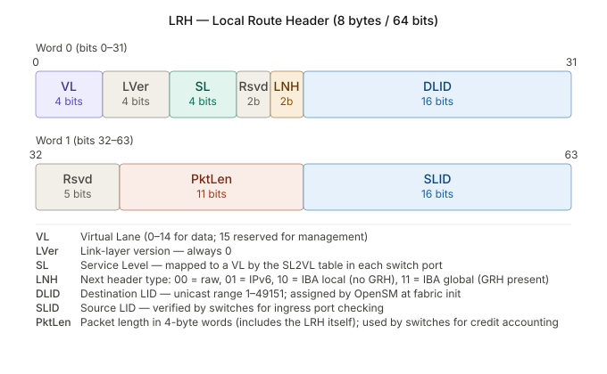
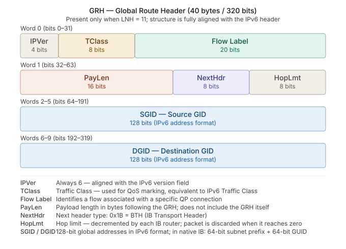
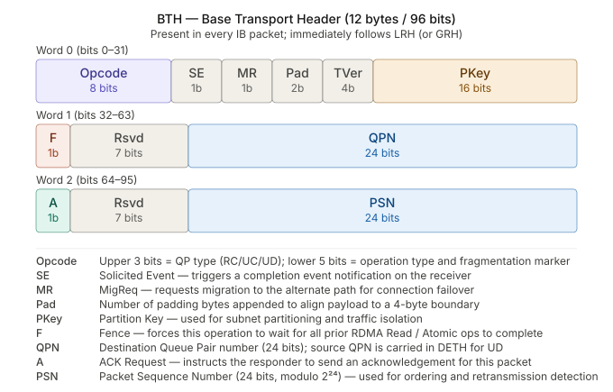

# Chapter 10: The InfiniBand Protocol Stack

InfiniBand divides the network's responsibilities into several layers, each responsible for a particular kind of work and each adding its own header fields to the packet.

The most effective way to understand the IB network architecture is to walk through it layer by layer: what each layer does, which header it adds to the packet, and who processes it.

In this chapter we will walk through four layers: the link layer, the network layer, the transport layer, and the upper layer.

---

## 10.1 The Layered Panorama

Let's first build a map. InfiniBand's layering from bottom to top, along with the packet header fields and processors corresponding to each layer, is roughly as follows:

| Layer               | Responsibility                                | Header fields    | Main processor       |
| ------------------- | --------------------------------------------- | ---------------- | -------------------- |
| Upper Layer         | Application interface, upper-layer protocols, management services | (Payload content) | Application / management entity |
| Transport           | End-to-end communication, segmentation/reassembly, QP semantics | BTH              | NIC hardware         |
| Network             | Cross-subnet routing                          | GRH              | Router               |
| Link                | Intra-subnet forwarding, flow control, QoS    | LRH, VCRC        | Switch               |
| Physical            | Electrical/optical signal transmission        | —                | Cable / transceiver  |


Note: the GRH and ETH are optional, and the ETH (Extended Transport Headers) can also be stacked. Exactly which ETHs are present depends on the operation type:

- RETH (RDMA Extended Transport Header): carried by RDMA Write / Read Request, contains va, rkey, dma_len
- AETH (ACK Extended Transport Header): carried by the ACK of Send/Write and by Read Response, contains syndrome and MSN
- DETH (Datagram Extended Transport Header): carried by UD-type QPs, contains Q_Key and SQPN
- AtomicETH: carried by Atomic operations, contains va, rkey, swap/compare data

One point that needs emphasizing: IB's layering is a **division of responsibilities**, not the TCP/IP-style nesting of an entire upper-layer packet into the lower layer's payload and then delivering it up layer by layer in software (onion-style). The various headers of an IB packet are pieced together side by side, parsed in parallel by the NIC hardware, with each device taking what it needs: the switch reads only the LRH, the router cares about the GRH, and the destination NIC parses the BTH. With this map in hand, let's unfold layer by layer.

---

## 10.2 The Link Layer: Intra-Subnet Forwarding, Flow Control, and Quality of Service

The link layer is responsible for getting data from one node to another within an IB subnet. It is where IB differs most concentratedly from Ethernet.



The LRH is the link-layer header that every IB data packet must carry, fixed at 8 bytes (64 bits), divided into two 32-bit words.

A few key fields are worth special mention:

- VL / SL is the core entry point for IB QoS. The SL is set by the sender, and the switch decides which Virtual Lane the traffic actually travels on according to the SL→VL mapping table, thereby achieving traffic isolation and deadlock avoidance.
- LNH (2 bits) determines what immediately follows the LRH: a value of 10 means the next is the GRH (i.e., global routing is needed), and a value of 00 means the BTH directly follows (pure LID local routing). This field is the sole basis for determining whether there is a GRH when parsing an IB packet.
- DLID / SLID are 16 bits each; the range 1–49151 is for unicast LIDs, assigned by OpenSM during fabric initialization. The SLID is verified by the switch when it performs ingress filtering (source-port check).
- PktLen is measured in units of 4 bytes (i.e., one flit) and includes the LRH itself, so its minimum value is 2 (LRH + BTH = 8 bytes total). The switch uses this field for credit counting (flow control credit).

### LID and Packet Forwarding

Every port within a subnet has a LID, assigned by the Subnet Manager during initialization and topology changes. Link-layer forwarding relies precisely on it: each data packet's LRH (Local Routing Header) carries the destination LID (DLID), and the switch looks at this DLID to decide which port to forward the packet out of.

The forwarding table the switch uses to make this decision is called the **LFT (Linear Forwarding Table)**. Its structure is very simple, a mapping table from DLID to egress port: the switch receives a packet, extracts the DLID, looks up the LFT, gets the corresponding egress port, and forwards it.

Contrasting it with Ethernet makes it clear: an Ethernet switch forwards based on a MAC address table, and that table is built dynamically by the switch itself through "learning" source MACs; IB's LFT is not self-learned by the switch but is uniformly computed by the SM and pushed down to each switch. This is precisely a manifestation of IB's centralized management—the switch does not make forwarding decisions itself; it merely faithfully executes the forwarding table pushed down by the SM.

### Flow Control: The Mechanism That Achieves Losslessness

The most important feature of the IB link layer is losslessness: under normal operation it does not drop packets due to congestion. It achieves this through a **credit-based flow control** mechanism.

The mechanism itself is intuitive: the receiving end of a link continually tells the sending end "how much buffer space I still have to receive," and this amount of space is the "credit." The sending end sends data only when the other side has enough credit; if the receiving end's buffer is nearly full and credit is insufficient, the sending end stops and waits rather than sending the packet out only to have it dropped.

This credit mechanism is **hop-by-hop**, maintained independently for each link segment, unrelated to the end-to-end transport-layer state. After the physical link comes UP, the two parties tell each other the size of the receive buffer for each VL (Virtual Lane), in units of 64-byte blocks. This process happens purely between the two ends of the link, without going through the SM. Runtime credit updates are completed through dedicated **Flow Control Packets (FCP)**, a link-layer control frame independent of data packets.

The FCP is a link-layer control frame independent of data packets, carrying no IB transport-layer headers and completely transparent to the upper layers. So you will never see these credit frames in tools like Wireshark; they also do not exist in Ethernet-borne RoCEv2, which replaces the link layer with Ethernet and shifts the lossless capability to PFC instead.

This forms a sharp contrast with Ethernet's "best-effort." An Ethernet switch simply drops packets when its buffer is full, relying on upper-layer protocols to detect and retransmit. IB, by contrast, eliminates the possibility of congestion-induced packet loss at the link layer, so reliability doesn't need to be patched in by the upper layers. This lossless property brings efficient bandwidth utilization and extremely low end-to-end latency variation, and is one of the fundamental reasons IB is well-suited to high-performance computing.

### QoS: Service Level and Virtual Lane

When discussing IB's QoS, let's first talk about what problem it sets out to solve.

A single physical link often carries multiple kinds of traffic: latency-sensitive ones (such as the small-message synchronization of MPI), throughput-intensive ones (such as large block transfers), and management traffic. If they all crowd into the same queue, **head-of-line blocking** occurs: a large block transfer up front gets stuck there, and the urgent small messages behind it can only wait. Worse, in complex topologies, multiple traffic flows waiting for each other to release buffers can even form a **deadlock**.

IB's solution is the **Virtual Lane (VL)**: on a single physical link, multiple mutually independent virtual lanes are carved out, each VL having its own independent buffer and independent flow-control credit. Physically it's one wire, but logically it's multiple non-interfering lanes. When traffic on one VL is blocked, it doesn't affect the other VLs, so head-of-line blocking is confined to a single lane; and by reasonably planning the use of VLs, circular waits can also be broken and deadlocks avoided.

So what is the **Service Level (SL)**? It is a priority tag stamped onto the data packet, written in the LRH. When sending, the application or upper layer labels the traffic with an SL (indicating "which class and what priority of traffic this is"), and then at each hop, the switch places this SL's traffic into the corresponding VL for transmission according to an **SL-to-VL mapping table**.

Why separate SL and VL instead of using a single number directly? Because different links may support different numbers of VLs (some links support 8, some only 2). The SL is the end-to-end-consistent abstract expression of "what treatment I want," while the VL is the concrete realization of "which physical lane to actually use" on each link. The two are decoupled by the SL-to-VL mapping table—the same SL may map to a dedicated lane on a link with many VLs, and may share a lane with other SLs on a link with few VLs. This mapping table is likewise uniformly configured by the Subnet Manager.

Returning to that perspective: for a developer writing an RDMA program, when they submit a Write request and the data arrives in the peer's memory, they are unaware of the existence of SL and VL throughout the process. But for the person managing the IB network, SL/VL are precisely the core tools they use to isolate traffic, guarantee the latency of critical workloads, and avoid deadlocks. So the QoS here is the network's quality-of-service mechanism, not a programming interface for upper-layer applications.

### VCRC and the Two Kinds of Packets

The link layer attaches a **VCRC (Variant CRC)** to each packet, 16 bits, covering all fields of the entire packet. "Variant" means it is recomputed at every hop—because some fields of the packet change during forwarding (such as hop-by-hop updated content), each link segment re-verifies once with the VCRC to guarantee that this hop's transmission had no errors. It provides **link-level** data integrity (between two directly connected adjacent nodes).

The packets the link layer handles fall into two categories: **link management packets** are used for link configuration and maintenance, and **data packets** carry the actual transaction payload. The former is the network's own management traffic, while the latter is the application data.

---

## 10.3 The Network Layer: Cross-Subnet Routing

The link layer only deals with matters inside a single subnet. When data needs to cross a subnet boundary, going from one IB subnet to another, it is the network layer's turn to step in.

That said, I want to point out here that the vast majority of IB deployments are single-subnet, and cross-subnet routing is quite rare in practice. A subnet's capacity of about 48,000 ports is enough to cover the vast majority of clusters—even a 10,000-GPU-scale AI training cluster is usually managed as a single subnet with a single SM. For true scale-out, the industry more often relies on adopting topologies like Fat-Tree within a single subnet, rather than connecting multiple subnets with IB routers. IB routers are a relatively niche device, used mainly for special scenarios such as interconnecting originally independent IB clusters. So it's enough to just understand the network-layer content; what you deal with day to day is almost always the link layer's intra-subnet forwarding.



### GID and IB Routers

The network layer addresses using the **GID (Global Identifier)**, a 128-bit global address with the same format as IPv6, written in the packet's **GRH (Global Routing Header)** and globally unique. The device responsible for cross-subnet forwarding is the **IB router**.

### LRH Is Rewritten, GRH Stays Unchanged

Cross-subnet forwarding has a key mechanism; understanding it means understanding the division of labor between the link layer and the network layer.

The LID is a subnet-local concept and has no meaning once it leaves its own subnet. So when a packet enters the target subnet from the source subnet via an IB router, **the router rewrites the LRH**—replacing the LID from the source subnet with a new LID valid in the target subnet, so that the packet can continue to be forwarded by the link layer within the new subnet. Meanwhile, **the GID in the GRH remains unchanged end to end**, always identifying the final destination port.

This mechanism is completely isomorphic to the pattern in IP networks: in an IP network, the MAC address changes hop by hop (a new pair of source/destination MACs each time it passes through a router), while the IP address stays unchanged end to end. Here in IB, **the LID is analogous to the MAC (changing per hop / per subnet), and the GID is analogous to the IP (unchanged end to end)**.

For intra-subnet communication, no GRH is needed at all, and the packet has only an LRH; only cross-subnet communication carries a GRH.

### ICRC: End-to-End Checking

The integrity of the network-layer (and above) fields is protected by the **ICRC (Invariant CRC)**, 32 bits. Unlike the VCRC, which is recomputed hop by hop, the ICRC covers those fields of the packet that **do not change end to end** from source to destination, and is never recomputed along the way.

The division of labor between VCRC and ICRC is now complete:

- **VCRC**: 16 bits, covers the whole packet, recomputed hop by hop, guarantees the correct transmission of **each link segment** (link-level integrity).
- **ICRC**: 32 bits, covers the end-to-end invariant fields, unchanged throughout, guarantees that the core data was not corrupted **from source to destination** (end-to-end integrity).

---

## 10.4 The Transport Layer: End-to-End Channels and Semantics

If the link layer and network layer solve "how a packet gets from one port to another," then the transport layer solves "how two applications, residing in different address spaces, establish end-to-end communication." It corresponds to the **BTH (Base Transport Header) and ETH (Extended Transport Header)** in the packet and is handled by the NIC hardware.

Let's first review a few basic transport-layer concepts, then introduce the BTH and ETH in detail:

### QP (Queue Pair)

The communication endpoint of the transport layer is the **QP**. A QP represents one end of a channel and contains two work queues: the send queue and the receive queue. Two applications residing on different machines, in different address spaces, each hold a QP, and pairing them forms an end-to-end channel.

### Segmentation (Also Called Fragmentation) and Reassembly

The message an application wants to send may be large, exceeding the size a single network packet can carry (the MTU). The transport layer is responsible for **splitting** a large message into multiple packets to send, and **reassembling** them in order at the receiving end to restore the complete message. This segmentation/reassembly process is transparent to the application and is done by the transport layer (hardware).

Early IB strictly required in-order delivery, so traditionally IB's reliable transport was built on the assumption of in-order arrival.

But modern large-scale scenarios have brought changes; for example, in a 10,000-GPU AI cluster, to fully utilize multi-path bandwidth, adaptive routing was introduced: packets of the same flow may travel different paths, which introduces out-of-order arrival. For this, newer IB hardware and protocols have added the capability to support out-of-order arrival (for example, supporting out-of-order data placement, with the reordering handled by hardware).

### Transport Service Types

As introduced in the RDMA chapter, the transport layer provides different service types, such as RC, UC, and UD. Which one to choose depends on the application's needs for reliability and connection model.

### BTH (Base Transport Header)



Most RDMA semantics ultimately land on the fields of the BTH header. The BTH contains:

- **QPN**: which QP on the peer should this packet be handed to?
- **Opcode**: is this an RDMA Send, Write, or Read?
- **PSN**: used by the receiving end to verify packet order, detect loss, and support retransmission for reliable service.

In short, when the destination NIC parses the BTH, it knows which QP to hand this packet to, what operation to perform, and its position in the sequence.

### ETH (Extended Transport Header)

The BTH is just the "base part" of the transport header; it itself doesn't carry the specific parameters of an operation. What actually makes an RDMA operation happen is the **ETH (Extended Transport Header)** following the BTH, a set of header fields appended on demand according to the operation type (Opcode).

Different operations correspond to different ETHs:

- **RETH (RDMA Extended Transport Header)**: used for RDMA Write and RDMA Read requests. Carries the target virtual address (VA), the R_Key, and the data length (DMALen)—only with these three fields does the NIC know which block of remote memory to write to, whether it has permission to write, and how much to write.
- **AETH (ACK Extended Transport Header)**: used for ACKs and RDMA Read responses. Carries the sequence number and the credit amount (Credit), and is the carrier of the reliable-transport acknowledgment mechanism.
- **DETH (Datagram Extended Transport Header)**: used for the UD (Unreliable Datagram) service, carries the Source QPN and Q_Key, because in UD mode the receiver cannot infer the source from connection context.

These ETH extended header fields have already been amply shown in the earlier packet capture analyses, so we won't belabor their structural content here.

In summary: the BTH tells the NIC "what operation this is and which QP to hand it to," while the ETH tells the NIC "what the specific parameters of this operation are." Together, the two constitute a complete transport-layer instruction.

---

## 10.5 The Upper Layer: Verbs and the Protocol Ecosystem

The topmost layer is where the application truly interacts with the IB fabric. It contains three parts: the application's software interface, the various upper-layer protocols built on top of it, and the management services.

### Verbs: The Application's Software Interface

The application does not operate the hardware directly but requests services through **Verbs**. Verbs describe "what action the application wants the messaging service to perform": open/query/close the HCA (Host Channel Adapter, i.e., the IB NIC), create a QP, query the completion queue, submit a send request, submit a receive request, and so on. It is the framework through which the application invokes IB's capabilities, and the most commonly used set of Verbs API is defined and provided by the OpenFabrics Alliance.

Simply put, Verbs are the "system calls" of application programming in the IB world; all the RDMA programming actions we use are expressed through Verbs.

### The Upper-Layer Protocol Ecosystem

On top of Verbs, IB has grown a protocol ecosystem that lets different types of applications all take advantage of IB. A few representative ones:

- Collective communication libraries (**MPI / NCCL**): this is where IB's value is most concentrated. The communication of distributed computing is rarely simple point-to-point send/receive; it is more often "collective communication" such as all-reduce, all-gather, and broadcast: a group of nodes collectively exchange data in some pattern; efficiently mapping these patterns to underlying RDMA operations is precisely the job of a collective communication library.
  - The veteran in the HPC world is **MPI**, which for decades has been the de facto standard for supercomputer interconnect;
  - The AI training world is dominated by **NCCL** (NVIDIA Collective Communications Library) (the AMD-side counterpart is RCCL). The gradient synchronization in multi-machine, multi-GPU training is essentially one all-reduce after another, and NCCL breaks it into ring or tree communication patterns, which then land on the concrete inter-GPU transfers (see Chapter 19 for details).

- **IPoIB** (IP over InfiniBand): running TCP/IP on top of IB. It lets those traditional socket applications that "don't understand IB" run on an IB network without modification. The price, however, is that it loops back to the whole TCP/IP machinery and can't enjoy all the benefits of RDMA.

- Remote storage protocols (**SRP / iSER**): let one computer access SCSI storage devices mounted on another computer via RDMA, applying IB's low latency to the storage network.

### Management Services

The IB architecture defines a set of management messages and protocols at the upper layer, divided into two categories, each traveling over a special QP:

**Subnet Management**: used for core management tasks such as the Subnet Manager discovering the topology, assigning LIDs, and configuring ports. It uses a special management datagram, the **SMP (Subnet Management Packet)**, travels over the dedicated **QP0**, and is **not subject to flow control**. Why not subject to flow control? Because subnet management is the precondition for the network to operate at all; when the network has just powered on and the flow-control credits have not yet been negotiated, the management packets must be able to pass.

**General Services**: used for management tasks other than subnet management (performance monitoring, device information queries, etc.). It uses the **GMP (General Management Packet)**, travels over another special QP, **QP1**, also called the **GSI (General Service Interface)**, and **is subject to flow control** (because this kind of traffic does not have the "chicken-and-egg" urgency of subnet management and can queue normally).

QP0 and QP1 are two special QPs reserved on every port, dedicated to carrying management traffic, separate from the ordinary QPs used by applications. This way the management plane and the data plane are isolated at the channel level.

---

## Summary

We have walked through the InfiniBand network architecture layer by layer. Now, returning to that complete IB data packet, the ownership and role of each field should be clear:

```
┌─────────┬─────────┬───────────┬─────────────┬──────────────┬────────────┬────────────┐
│   LRH   │   GRH   │    BTH    │     ETH     │   Payload    │    ICRC    │    VCRC    │
├─────────┼─────────┼───────────┼─────────────┼──────────────┼────────────┼────────────┤
│   Link  │ Network │ Transport │  Transport  │ Upper-layer  │ end-to-end │ link-level │
│  layer  │  layer  │   layer   │    layer    │     data     │    CRC     │    CRC     │
│         │         │           │  (optional) │              │            │            │
│         │         │           │             │              │            │            │
│ src/dst │ src/dst │ dst QPN,  │ ext. header │ app data or  │ covers     │ covers the │
│ LID, SL │ GID;    │ opcode,   │ per opcode: │ ULP payload  │ invariant  │ whole      │
│         │ inter-  │ PSN       │ RETH (VA,   │              │ fields     │ packet,    │
│         │ subnet  │           │ R_Key,len), │              │ end-to-end │ per-hop    │
│         │ only    │           │ DETH (UD),  │              │            │            │
│         │         │           │ Atomic,     │              │            │            │
│         │         │           │ ImmDt       │              │            │            │
├─────────┼─────────┼───────────┼─────────────┼──────────────┼────────────┼────────────┤
│ Switch: │ Router: │ Dest HCA: │ Dest HCA:   │ Application/ │ Receiver   │ Each hop   │
│ look up │ route   │ parse,    │ parse per   │ ULP          │ verifies   │ recomputes │
│ LFT,    │ across  │ deliver   │ opcode      │              │            │            │
│ forward │ subnets │ to QP     │             │              │            │            │
└─────────┴─────────┴───────────┴─────────────┴──────────────┴────────────┴────────────┘
```

Stringing the four layers together:

- The link layer forwards within the subnet using the LID, provides quality of service using SL/VL, and achieves losslessness using credit-based flow control;
- The network layer routes across subnets using the GID, rewriting the LRH while keeping the GRH unchanged when crossing subnets;
- The transport layer establishes end-to-end channels using QPs, with the BTH indicating the operation type and target QP, and then the optional ETH (such as the RETH used for RDMA reads/writes) carrying operation-specific information such as the remote virtual address, R_Key, and length;
- The upper layer exposes itself to applications through Verbs, and on top of it grows a protocol ecosystem of IPoIB, MPI, remote storage, and more, while using QP0/QP1 to isolate management traffic from data traffic.
