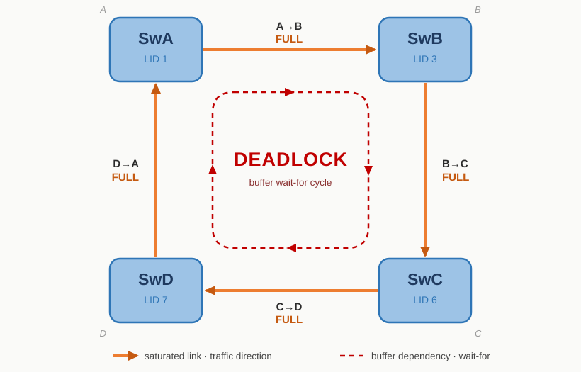
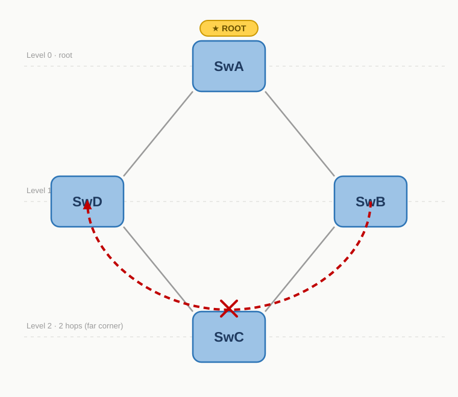

# Chapter 12: The InfiniBand Fabric Routing Engine

## 12.1 First, Clearing Up an Easily Misunderstood Name

This chapter is about the "routing engine," but before we begin, we must correct a misconception that comes from taking the name too literally.

The "routing" mentioned here is **not** routing between IB subnets, but the problem of computing optimal paths within an IB subnet, that is, the optimal-path problem from one LID to another LID.

> **A recap of Chapter 10:**
>
> In the Ethernet + TCP/IP world, cross-network communication relies on IP addresses and hop-by-hop routing; InfiniBand is completely different, using a local identifier called the LID to complete forwarding directly at the link layer.
>
> In TCP/IP we often say "layer 2 switches, layer 3 routes." Ethernet's layer-2 forwarding rules are simple and crude—nothing more than the "flood, learn, forward, age" MAC address table mechanism; the real path selection doesn't appear until the network layer (layer 3), giving rise to various routing algorithms like RIP, EIGRP, OSPF, and BGP, which let packets pick out an optimal path hop by hop. In other words, TCP/IP routing solves communication between subnets, while within a subnet it's simple and crude layer-2 switching.
>
> The InfiniBand world is completely different: the link layer shoulders both the "switching" and "routing" duties—it must quickly deliver data to the correct port, and it must also complete routing/addressing (the forwarding table of each IB switch is pre-computed by the SM using routing algorithms). In other words, path computation has already happened at the link layer, rather than relying on the "brute-force" forwarding of broadcast and flooding. As for cross-subnet communication, that's nothing more than a matter of "making the network bigger"; and in reality, IB networks rarely need multi-subnet interconnect, since the scale of a single subnet is usually already sufficient to cover the vast majority of scenarios.

The part of the SM responsible for path decision logic is the `routing engine`, and its job is: **within an IB subnet, to compute how each switch's forwarding table (LFT) should be filled in.** The same physical topology, fed to different routing engines, will produce different LFTs. OpenSM has multiple routing engines built in (minhop, updn, ftree, torus-2QoS, etc.), selected via the startup parameter `-R <engine>`.

In this chapter we focus on the two most basic and most illustrative routing algorithms: min-hop and up-down, using a carefully designed ring topology to see clearly their differences and their respective trade-offs.

## 12.2 The Experimental Topology: A Ring of Four Switches

We use a topology of four switches connected end to end into a ring, each with one HCA attached. The ibsim topology file is as follows:

```bash
# ib2.net — four-switch ring topology, used to demonstrate min-hop vs UpDn.
#
#        HcaA         HcaB
#         │            │
#        SwA ──────── SwB
#         │            │
#         │            │
#        SwD ──────── SwC
#         │            │
#        HcaD         HcaC
#

Switch  8 "SwA"
[1]     "HcaA"[1]
[2]     "SwB"[3]
[3]     "SwD"[2]

Switch  8 "SwB"
[1]     "HcaB"[1]
[2]     "SwC"[3]
[3]     "SwA"[2]

Switch  8 "SwC"
[1]     "HcaC"[1]
[2]     "SwD"[3]
[3]     "SwB"[2]

Switch  8 "SwD"
[1]     "HcaD"[1]
[2]     "SwA"[3]
[3]     "SwC"[2]

Hca     2 "HcaA"
[1]     "SwA"[1]

Hca     2 "HcaB"
[1]     "SwB"[1]

Hca     2 "HcaC"
[1]     "SwC"[1]

Hca     2 "HcaD"
[1]     "SwD"[1]
```

Why a ring of all things? Because **the ring is the structure that best exposes the risk of a credit loop**. Between any two diagonal nodes on the ring there are two equal-length paths (clockwise and counterclockwise), and the routing engine must make a choice; and once the choice is poor, the buffer dependencies of multiple traffic flows can connect end to end along the ring and form a deadlock. This is precisely the touchstone for testing the quality of a routing engine.

## 12.3 min-hop: It Only Cares About Hop Count

The first routing engine is min-hop, whose idea is the most naive: **for each destination, independently choose the path with the fewest hops.** Whichever path is shortest is the one taken, and that's all.

The problem with min-hop is that it doesn't consider the global picture: it doesn't think about "whether the directions I chose for all these destinations, added together, will cause a problem."

Start the simulator and load this topology:

```bash
rlwrap ibsim -s ./ib2.net
```

Start OpenSM with `-R minhop`:

```bash
sudo bash -c 'LD_PRELOAD=/usr/lib/umad2sim/libumad2sim.so opensm -R minhop -f -'
```

Use `dump` to see the initial topology and the LID assignment of each node:

```bash
expert@net21:~$ rlwrap ibsim -s ./ib2.net
parsing: ./ib2.net
ibwarn: [566649] parse_port_connection_data: cannot parse remote lid and connection type
ibwarn: [566649] parse_port_connection_data: cannot parse remote lid and connection type
ibwarn: [566649] parse_port_connection_data: cannot parse remote lid and connection type
ibwarn: [566649] parse_port_connection_data: cannot parse remote lid and connection type
ibwarn: [566649] parse_port_connection_data: cannot parse remote lid and connection type
ibwarn: [566649] parse_port_connection_data: cannot parse remote lid and connection type
ibwarn: [566649] parse_port_connection_data: cannot parse remote lid and connection type
ibwarn: [566649] parse_port_connection_data: cannot parse remote lid and connection type
ibwarn: [566649] parse_port_connection_data: cannot parse remote lid and connection type
ibwarn: [566649] parse_port_connection_data: cannot parse remote lid and connection type
ibwarn: [566649] parse_port_connection_data: cannot parse remote lid and connection type
ibwarn: [566649] parse_port_connection_data: cannot parse remote lid and connection type
ibwarn: [566649] parse_port_connection_data: cannot parse remote lid and connection type
ibwarn: [566649] parse_port_connection_data: cannot parse remote lid and connection type
ibwarn: [566649] parse_port_connection_data: cannot parse remote lid and connection type
ibwarn: [566649] parse_port_connection_data: cannot parse remote lid and connection type
./ib2.net: parsed 40 lines
########################
Network simulator ready.
MaxNetNodes    = 2048
MaxNetSwitches = 256
MaxNetPorts    = 13312
MaxLinearCap   = 49152
MaxMcastCap    = 1024

sim> dump
# Net status - Thu Jun 18 04:34:53 2026

Switch 8 "SwA"  nodeguid 200000 sysimgguid 200000
#       linearcap 49152 FDBtop 9 portchange 0
#       Forwarding table 0-9: [0]FF [1]0 [2]1 [3]2 [4]FF [5]2 [6]2 [7]3 [8]3 [9]3
200000  [0]     "Sma Port"[0]    lid 1 lmc 0 smlid 1  4x  2.5G Active/LinkUp
200000  [1]     "HcaA"[1]         4x  2.5G Active/LinkUp
200000  [2]     "SwB"[3]          4x  2.5G Active/LinkUp
200000  [3]     "SwD"[2]          4x  2.5G Active/LinkUp
200000  [4]                       4x  2.5G Down/Polling
200000  [5]                       4x  2.5G Down/Polling
200000  [6]                       4x  2.5G Down/Polling
200000  [7]                       4x  2.5G Down/Polling
200000  [8]                       4x  2.5G Down/Polling

Switch 8 "SwB"  nodeguid 200001 sysimgguid 200001
#       linearcap 49152 FDBtop 9 portchange 0
#       Forwarding table 0-9: [0]FF [1]3 [2]3 [3]0 [4]FF [5]1 [6]2 [7]2 [8]2 [9]3
200001  [0]     "Sma Port"[0]    lid 3 lmc 0 smlid 1  4x  2.5G Active/LinkUp
200001  [1]     "HcaB"[1]         4x  2.5G Active/LinkUp
200001  [2]     "SwC"[3]          4x  2.5G Active/LinkUp
200001  [3]     "SwA"[2]          4x  2.5G Active/LinkUp
200001  [4]                       4x  2.5G Down/Polling
200001  [5]                       4x  2.5G Down/Polling
200001  [6]                       4x  2.5G Down/Polling
200001  [7]                       4x  2.5G Down/Polling
200001  [8]                       4x  2.5G Down/Polling

Switch 8 "SwC"  nodeguid 200002 sysimgguid 200002
#       linearcap 49152 FDBtop 9 portchange 0
#       Forwarding table 0-9: [0]FF [1]2 [2]3 [3]3 [4]FF [5]3 [6]0 [7]2 [8]1 [9]2
200002  [0]     "Sma Port"[0]    lid 6 lmc 0 smlid 1  4x  2.5G Active/LinkUp
200002  [1]     "HcaC"[1]         4x  2.5G Active/LinkUp
200002  [2]     "SwD"[3]          4x  2.5G Active/LinkUp
200002  [3]     "SwB"[2]          4x  2.5G Active/LinkUp
200002  [4]                       4x  2.5G Down/Polling
200002  [5]                       4x  2.5G Down/Polling
200002  [6]                       4x  2.5G Down/Polling
200002  [7]                       4x  2.5G Down/Polling
200002  [8]                       4x  2.5G Down/Polling

Switch 8 "SwD"  nodeguid 200003 sysimgguid 200003
#       linearcap 49152 FDBtop 9 portchange 0
#       Forwarding table 0-9: [0]FF [1]2 [2]2 [3]2 [4]FF [5]3 [6]3 [7]0 [8]3 [9]1
200003  [0]     "Sma Port"[0]    lid 7 lmc 0 smlid 1  4x  2.5G Active/LinkUp
200003  [1]     "HcaD"[1]         4x  2.5G Active/LinkUp
200003  [2]     "SwA"[3]          4x  2.5G Active/LinkUp
200003  [3]     "SwC"[2]          4x  2.5G Active/LinkUp
200003  [4]                       4x  2.5G Down/Polling
200003  [5]                       4x  2.5G Down/Polling
200003  [6]                       4x  2.5G Down/Polling
200003  [7]                       4x  2.5G Down/Polling
200003  [8]                       4x  2.5G Down/Polling

Ca 2 "HcaA"     nodeguid 100000 sysimgguid 100000
100001  [1]     "SwA"[1]         lid 2 lmc 0 smlid 1  4x  2.5G Active/LinkUp
100002  [2]                      lid 0 lmc 0 smlid 0  4x  2.5G Down/Polling

Ca 2 "HcaB"     nodeguid 100003 sysimgguid 100003
100004  [1]     "SwB"[1]         lid 5 lmc 0 smlid 1  4x  2.5G Active/LinkUp
100005  [2]                      lid 0 lmc 0 smlid 0  4x  2.5G Down/Polling

Ca 2 "HcaC"     nodeguid 100006 sysimgguid 100006
100007  [1]     "SwC"[1]         lid 8 lmc 0 smlid 1  4x  2.5G Active/LinkUp
100008  [2]                      lid 0 lmc 0 smlid 0  4x  2.5G Down/Polling

Ca 2 "HcaD"     nodeguid 100009 sysimgguid 100009
10000a  [1]     "SwD"[1]         lid 9 lmc 0 smlid 1  4x  2.5G Active/LinkUp
10000b  [2]                      lid 0 lmc 0 smlid 0  4x  2.5G Down/Polling
#  dumped 8 nodes

```

For convenience of later analysis, first note down each node's LID assignment:

| Node | LID |
| ---- | --- |
| SwA  | 1   |
| HcaA | 2   |
| SwB  | 3   |
| HcaB | 5   |
| SwC  | 6   |
| SwD  | 7   |
| HcaC | 8   |
| HcaD | 9   |

At the same time, let's also summarize the four switches' forwarding tables as follows:

```bash
"SwA"  nodeguid 200000
#       Forwarding table 0-9: [0]FF [1]0 [2]1 [3]2 [4]FF [5]2 [6]2 [7]3 [8]3 [9]3
[0]     "Sma Port"[0]    lid 1
[1]     "HcaA"[1]
[2]     "SwB"[3]
[3]     "SwD"[2]

"SwB"  nodeguid 200001
#       Forwarding table 0-9: [0]FF [1]3 [2]3 [3]0 [4]FF [5]1 [6]2 [7]2 [8]2 [9]3
[0]     "Sma Port"[0]    lid 3
[1]     "HcaB"[1]
[2]     "SwC"[3]
[3]     "SwA"[2]

"SwC"  nodeguid 200002
#       Forwarding table 0-9: [0]FF [1]2 [2]3 [3]3 [4]FF [5]3 [6]0 [7]2 [8]1 [9]2
[0]     "Sma Port"[0]    lid 6
[1]     "HcaC"[1]
[2]     "SwD"[3]
[3]     "SwB"[2]

"SwD"  nodeguid 200003
#       Forwarding table 0-9: [0]FF [1]2 [2]2 [3]2 [4]FF [5]3 [6]3 [7]0 [8]3 [9]1
[0]     "Sma Port"[0]    lid 7
[1]     "HcaD"[1]
[2]     "SwA"[3]
[3]     "SwC"[2]
```

In this set of forwarding tables, each switch chose the shortest path for every destination LID; on the surface everything looks reasonable.

The main thread of the SM startup log is the same as in the previous chapter (DISCOVERING → HEAVY SWEEP → MASTER → SUBNET UP), where you can see the routing engine's marker "minhop tables configured on all switches":

```bash
expert@net21:~$ sudo bash -c 'LD_PRELOAD=/usr/lib/umad2sim/libumad2sim.so opensm -R minhop -f -'
...
******************************************************************
*********************** HEAVY SWEEP START ************************
******************************************************************


Jun 18 04:34:30 730600 [EFC006C0] 0x02 -> do_sweep: Entering heavy sweep with flags: force_heavy_sweep 0, coming out of standby 0, subnet initialization error 0, sm port change 0
Jun 18 04:34:30 755027 [EFC006C0] 0x80 -> Entering MASTER state
Jun 18 04:34:30 769755 [EFC006C0] 0x02 -> osm_ucast_mgr_process: minhop tables configured on all switches
Jun 18 04:34:30 811513 [EFC006C0] 0x02 -> SUBNET UP
```

## 12.4 The Hazard min-hop Plants: A Real Credit Loop

We'll use the real min-hop forwarding tables above to reconstruct a potential deadlock.

### What Exactly Is a credit loop

First, correct an intuitive misconception: a credit loop is **not** the kind of loop where "a packet circles around the route, looping infinitely." It is a **circular wait for buffers**.

Recall IB's lossless flow control: for a switch to send a packet to the next hop, it must wait for the next hop to give a "credit," that is, to confirm that it has a free buffer to receive. Without credit, the packet waits in place in the buffer.

Now imagine several traffic flows whose occupied links and awaited links connect end to end, looping into a circle: the first flow occupies a certain link and waits for the second to release; the second occupies the next and waits for the third; ... and the last one turns back to wait for the first. Each one is waiting for the next to move first, and none can move first, with the result that all buffers are permanently stuck. This is a credit loop, essentially exactly the same as the "A waits for B's lock, B waits for A's lock" deadlock in operating systems, except that here what's awaited is buffer credit.

> **A single path will never deadlock; a credit loop must be formed by the occupation directions of multiple traffic flows stacking up into a ring.**

### Finding This Loop in the min-hop Forwarding Table

To simplify the example, in this case we'll focus only on the traffic between switches for now. The physical structure of the ring is four links: A–B, B–C, C–D, D–A.

```bash
#        SwA ──────── SwB
#         │            │
#         │            │
#        SwD ──────── SwC
```

From the min-hop forwarding table, extract each switch's direction for forwarding to the "diagonal switch":

```bash
"SwA"  nodeguid 200000
#       Forwarding table 0-9: [0]FF [1]0 [2]1 [3]2 [4]FF [5]2 [6]2 [7]3 [8]3 [9]3
[0]     "Sma Port"[0]    lid 1
[1]     "HcaA"[1]
[2]     "SwB"[3]
[3]     "SwD"[2]

"SwB"  nodeguid 200001
#       Forwarding table 0-9: [0]FF [1]3 [2]3 [3]0 [4]FF [5]1 [6]2 [7]2 [8]2 [9]3
[0]     "Sma Port"[0]    lid 3
[1]     "HcaB"[1]
[2]     "SwC"[3]
[3]     "SwA"[2]

"SwC"  nodeguid 200002
#       Forwarding table 0-9: [0]FF [1]2 [2]3 [3]3 [4]FF [5]3 [6]0 [7]2 [8]1 [9]2
[0]     "Sma Port"[0]    lid 6
[1]     "HcaC"[1]
[2]     "SwD"[3]
[3]     "SwB"[2]

"SwD"  nodeguid 200003
#       Forwarding table 0-9: [0]FF [1]2 [2]2 [3]2 [4]FF [5]3 [6]3 [7]0 [8]3 [9]1
[0]     "Sma Port"[0]    lid 7
[1]     "HcaD"[1]
[2]     "SwA"[3]
[3]     "SwC"[2]

# From the table we can see
 SwA to SwC(lid6) → egress port 2 → direction A→B
 SwB to SwD(lid7) → egress port 2 → direction B→C
 SwC to SwA(lid1) → egress port 2 → direction C→D
 SwD to SwB(lid3) → egress port 2 → direction D→A
```

Draw out the occupation directions of these four traffic flows:

```
SwA sends to SwC: A → B → C      occupies A→B, B→C
SwB sends to SwD: B → C → D      occupies B→C, C→D
SwC sends to SwA: C → D → A      occupies C→D, D→A
SwD sends to SwB: D → A → B      occupies D→A, A→B
```

All four flows happen to circle the ring in the same rotational direction (clockwise). Now see how the buffer dependencies form a ring under congestion:



Explaining the loop step by step:

- For the traffic on A→B (SwA→SwC) to advance, it must wait for **B→C** to free up space;
- For the traffic on B→C (SwB→SwD) to advance, it must wait for **C→D** to free up space;
- For the traffic on C→D (SwC→SwA) to advance, it must wait for **D→A** to free up space;
- For the traffic on D→A (SwD→SwB) to advance, it must wait for **A→B** to free up space;
- And A→B is occupied by the first flow...

The four "occupy → wait" relationships connect end to end, going around the ring a full circle, constituting a complete circular wait. Everyone is waiting for the next to release first, and no one can move; the outcome is deadlock.

### Why min-hop Plants This Landmine

Because min-hop only cares about hop count, it **independently** chooses the shortest path for each destination, completely disregarding the global direction these choices stack up into. On this ring, it happened to choose the clockwise direction for all four diagonal flows, so they connect end to end on the ring and add up to a full circle of same-direction dependencies. min-hop has no concept of a "global direction constraint" and can't see this hazard.

That said, this must be made clear: the deadlock above is a **potential risk**, not a claim that these four flows deadlock immediately the moment they appear. Actually triggering it requires critical conditions: the network must be congested to the point where these links' buffers are all filled, and these flows happen to contend simultaneously. When traffic isn't saturated in normal times, packets flow through fine and no problem is visible.

As long as the topology and routing **allow** this circular dependency to exist, it's a time bomb. Under high enough load and a specific traffic combination, it will inevitably go off.

## 12.5 Up-Down: Imposing a Direction on the Network

The up-down (updn) routing engine's approach to solving the credit loop is to **impose a hierarchical direction** on the entire network.

### The Core Idea

updn's method is: first designate one (or a group of) **root node(s)**, and with the root as the reference, define each link's "uplink" (toward the root) and "downlink" (away from the root). Then impose an iron rule: **once a packet starts going downlink, it is not allowed to go uplink again.**

Why can this "no downlink-to-uplink turn" rule eliminate deadlock? Because a credit loop requires traffic to add up to a full circle of same-direction dependencies on the ring, and such a loop must contain a turn of "downlink and then uplink again." By banning this kind of turn altogether, the ring can never close, because the circular dependency cannot physically form, and the deadlock is eradicated at its root. The cost is: some traffic can no longer take its original shortest path and must detour to comply with the "up first, then down" rule.

### updn Can't Do Without a Root Node

updn has a key point that can be illustrated precisely with a real error. If you directly use `-R updn` without specifying a root, OpenSM will error out and give up:

```bash
expert@net21:~$ sudo bash -c 'LD_PRELOAD=/usr/lib/umad2sim/libumad2sim.so opensm -R updn -f -'
...
Jun 18 04:37:25 404440 [49C006C0] 0x80 -> Entering MASTER state
Jun 18 04:37:25 411126 [49C006C0] 0x02 -> updn_lid_matrices: disabling UPDN algorithm, no root nodes were found
Jun 18 04:37:25 411293 [49C006C0] 0x01 -> ucast_mgr_route: updn: cannot build lid matrices.
Jun 18 04:37:25 411819 [49C006C0] 0x02 -> osm_ucast_mgr_process: minhop tables configured on all switches
Jun 18 04:37:25 435693 [49C006C0] 0x02 -> SUBNET UP
```

Note the second-to-last line: after updn fails, it **falls back to minhop**. So if you don't specify a root node to the SM, you think you're running updn, but you're actually still running minhop, with the forwarding table identical to minhop.

> The first principle of the updn algorithm: **without a root, there's no concept of "up" and "down," direction can't be defined, and the algorithm simply can't work.**

### Specify a Root Node to Make updn Actually Run

We manually specify a root when running OpenSM.

```bash
# Choose SwA (GUID 0x200000) as the root, and write a root guid file:
echo "0x200000" > ./updn-root.guids

# Then start with `-R updn -a` specifying this file:
sudo bash -c 'LD_PRELOAD=/usr/lib/umad2sim/libumad2sim.so opensm -R updn -a ./updn-root.guids -f -'
```

This time updn actually takes effect in the log and no longer falls back:

```bash
expert@net21:~$ sudo bash -c 'LD_PRELOAD=/usr/lib/umad2sim/libumad2sim.so opensm -R updn -a ./updn-root.guids -f -'
...

******************************************************************
*********************** HEAVY SWEEP START ************************
******************************************************************


Jun 18 04:49:36 664315 [FB4006C0] 0x02 -> do_sweep: Entering heavy sweep with flags: force_heavy_sweep 0, coming out of standby 0, subnet initialization error 0, sm port change 0
Jun 18 04:49:36 684296 [FB4006C0] 0x80 -> Entering MASTER state
Jun 18 04:49:36 689869 [FB4006C0] 0x02 -> osm_topo_routing: Invalidating ucast cache due to crc files changes
Jun 18 04:49:36 692391 [FB4006C0] 0x02 -> osm_ucast_mgr_process: updn tables configured on all switches
Jun 18 04:49:36 721271 [FB4006C0] 0x02 -> SUBNET UP
```

`dump` to see the forwarding table computed by updn:

```bash
expert@net21:~$ rlwrap ibsim -s ./ib2.net
parsing: ./ib2.net
ibwarn: [566770] parse_port_connection_data: cannot parse remote lid and connection type
ibwarn: [566770] parse_port_connection_data: cannot parse remote lid and connection type
ibwarn: [566770] parse_port_connection_data: cannot parse remote lid and connection type
ibwarn: [566770] parse_port_connection_data: cannot parse remote lid and connection type
ibwarn: [566770] parse_port_connection_data: cannot parse remote lid and connection type
ibwarn: [566770] parse_port_connection_data: cannot parse remote lid and connection type
ibwarn: [566770] parse_port_connection_data: cannot parse remote lid and connection type
ibwarn: [566770] parse_port_connection_data: cannot parse remote lid and connection type
ibwarn: [566770] parse_port_connection_data: cannot parse remote lid and connection type
ibwarn: [566770] parse_port_connection_data: cannot parse remote lid and connection type
ibwarn: [566770] parse_port_connection_data: cannot parse remote lid and connection type
ibwarn: [566770] parse_port_connection_data: cannot parse remote lid and connection type
ibwarn: [566770] parse_port_connection_data: cannot parse remote lid and connection type
ibwarn: [566770] parse_port_connection_data: cannot parse remote lid and connection type
ibwarn: [566770] parse_port_connection_data: cannot parse remote lid and connection type
ibwarn: [566770] parse_port_connection_data: cannot parse remote lid and connection type
./ib2.net: parsed 40 lines
########################
Network simulator ready.
MaxNetNodes    = 2048
MaxNetSwitches = 256
MaxNetPorts    = 13312
MaxLinearCap   = 49152
MaxMcastCap    = 1024

sim> dump
# Net status - Thu Jun 18 04:49:44 2026

Switch 8 "SwA"  nodeguid 200000 sysimgguid 200000
#       linearcap 49152 FDBtop 9 portchange 0
#       Forwarding table 0-9: [0]FF [1]0 [2]1 [3]2 [4]FF [5]2 [6]3 [7]3 [8]3 [9]3
200000  [0]     "Sma Port"[0]    lid 1 lmc 0 smlid 1  4x  2.5G Active/LinkUp
200000  [1]     "HcaA"[1]         4x  2.5G Active/LinkUp
200000  [2]     "SwB"[3]          4x  2.5G Active/LinkUp
200000  [3]     "SwD"[2]          4x  2.5G Active/LinkUp
200000  [4]                       4x  2.5G Down/Polling
200000  [5]                       4x  2.5G Down/Polling
200000  [6]                       4x  2.5G Down/Polling
200000  [7]                       4x  2.5G Down/Polling
200000  [8]                       4x  2.5G Down/Polling

Switch 8 "SwB"  nodeguid 200001 sysimgguid 200001
#       linearcap 49152 FDBtop 9 portchange 0
#       Forwarding table 0-9: [0]FF [1]3 [2]3 [3]0 [4]FF [5]1 [6]2 [7]3 [8]2 [9]3
200001  [0]     "Sma Port"[0]    lid 3 lmc 0 smlid 1  4x  2.5G Active/LinkUp
200001  [1]     "HcaB"[1]         4x  2.5G Active/LinkUp
200001  [2]     "SwC"[3]          4x  2.5G Active/LinkUp
200001  [3]     "SwA"[2]          4x  2.5G Active/LinkUp
200001  [4]                       4x  2.5G Down/Polling
200001  [5]                       4x  2.5G Down/Polling
200001  [6]                       4x  2.5G Down/Polling
200001  [7]                       4x  2.5G Down/Polling
200001  [8]                       4x  2.5G Down/Polling

Switch 8 "SwC"  nodeguid 200002 sysimgguid 200002
#       linearcap 49152 FDBtop 9 portchange 0
#       Forwarding table 0-9: [0]FF [1]2 [2]3 [3]3 [4]FF [5]3 [6]0 [7]2 [8]1 [9]2
200002  [0]     "Sma Port"[0]    lid 6 lmc 0 smlid 1  4x  2.5G Active/LinkUp
200002  [1]     "HcaC"[1]         4x  2.5G Active/LinkUp
200002  [2]     "SwD"[3]          4x  2.5G Active/LinkUp
200002  [3]     "SwB"[2]          4x  2.5G Active/LinkUp
200002  [4]                       4x  2.5G Down/Polling
200002  [5]                       4x  2.5G Down/Polling
200002  [6]                       4x  2.5G Down/Polling
200002  [7]                       4x  2.5G Down/Polling
200002  [8]                       4x  2.5G Down/Polling

Switch 8 "SwD"  nodeguid 200003 sysimgguid 200003
#       linearcap 49152 FDBtop 9 portchange 0
#       Forwarding table 0-9: [0]FF [1]2 [2]2 [3]2 [4]FF [5]2 [6]3 [7]0 [8]3 [9]1
200003  [0]     "Sma Port"[0]    lid 7 lmc 0 smlid 1  4x  2.5G Active/LinkUp
200003  [1]     "HcaD"[1]         4x  2.5G Active/LinkUp
200003  [2]     "SwA"[3]          4x  2.5G Active/LinkUp
200003  [3]     "SwC"[2]          4x  2.5G Active/LinkUp
200003  [4]                       4x  2.5G Down/Polling
200003  [5]                       4x  2.5G Down/Polling
200003  [6]                       4x  2.5G Down/Polling
200003  [7]                       4x  2.5G Down/Polling
200003  [8]                       4x  2.5G Down/Polling

Ca 2 "HcaA"     nodeguid 100000 sysimgguid 100000
100001  [1]     "SwA"[1]         lid 2 lmc 0 smlid 1  4x  2.5G Active/LinkUp
100002  [2]                      lid 0 lmc 0 smlid 0  4x  2.5G Down/Polling

Ca 2 "HcaB"     nodeguid 100003 sysimgguid 100003
100004  [1]     "SwB"[1]         lid 5 lmc 0 smlid 1  4x  2.5G Active/LinkUp
100005  [2]                      lid 0 lmc 0 smlid 0  4x  2.5G Down/Polling

Ca 2 "HcaC"     nodeguid 100006 sysimgguid 100006
100007  [1]     "SwC"[1]         lid 8 lmc 0 smlid 1  4x  2.5G Active/LinkUp
100008  [2]                      lid 0 lmc 0 smlid 0  4x  2.5G Down/Polling

Ca 2 "HcaD"     nodeguid 100009 sysimgguid 100009
10000a  [1]     "SwD"[1]         lid 9 lmc 0 smlid 1  4x  2.5G Active/LinkUp
10000b  [2]                      lid 0 lmc 0 smlid 0  4x  2.5G Down/Polling
#  dumped 8 nodes

```

## 12.6 Comparison: Which Entries updn Changed, and Why They Had to Be Changed

Compare the min-hop and updn forwarding tables switch by switch to find the entries updn changed.

```bash
# --- updn ---
"SwA"  nodeguid 200000
#       Forwarding table 0-9: [0]FF [1]0 [2]1 [3]2 [4]FF [5]2 [6]3 [7]3 [8]3 [9]3
[0]     "Sma Port"[0]    lid 1
[1]     "HcaA"[1]
[2]     "SwB"[3]
[3]     "SwD"[2]


"SwB"  nodeguid 200001
#       Forwarding table 0-9: [0]FF [1]3 [2]3 [3]0 [4]FF [5]1 [6]2 [7]3 [8]2 [9]3
[0]     "Sma Port"[0]    lid 3
[1]     "HcaB"[1]
[2]     "SwC"[3]
[3]     "SwA"[2]

"SwC"  nodeguid 200002
#       Forwarding table 0-9: [0]FF [1]2 [2]3 [3]3 [4]FF [5]3 [6]0 [7]2 [8]1 [9]2
[0]     "Sma Port"[0]    lid 6
[1]     "HcaC"[1]
[2]     "SwD"[3]
[3]     "SwB"[2]

"SwD"  nodeguid 200003
#       Forwarding table 0-9: [0]FF [1]2 [2]2 [3]2 [4]FF [5]2 [6]3 [7]0 [8]3 [9]1
[0]     "Sma Port"[0]    lid 7
[1]     "HcaD"[1]
[2]     "SwA"[3]
[3]     "SwC"[2]

```

From updn's routing table, with SwA as the root, a clear hierarchy is formed on the ring: **SwA is at the top layer (the root), SwB and SwD are the middle layer (each one hop from the root), and SwC is at the bottom layer (two hops from the root, the diagonal point farthest from the root).**



That path along the bottom edge passing through SwC is, in updn's view, the "danger zone," because traversing the bottom edge often means a turn of "downlink and then uplink again."

Let's compare item by item again:

```bash
#  (2, 1) A ──────── B (3, 5)
#         │          │
#         │          │
#  (9, 7) D ──────── C (6, 8)

# --- minhop ---
 SwA to SwC(lid6) → egress port 2 → direction A→B
 SwB to SwD(lid7) → egress port 2 → direction B→C
 SwC to SwA(lid1) → egress port 2 → direction C→D
 SwD to SwB(lid3) → egress port 2 → direction D→A

# In minhop, observe the routing direction of the B/D diagonal:
sim> route 3 7
From node "SwB" port 0 lid 3
[2] -> "SwC"[3]
[2] -> "SwD"[3]
To node "SwD" port 3 lid 7

sim> route 3 9
From node "SwB" port 0 lid 3
[3] -> "SwA"[2]
[3] -> "SwD"[2]
[1] -> "HcaD"[1]
To node "HcaD" port 1 lid 9

sim> route 5 7
From node "HcaB" port 1 lid 5
[1] -> "SwB"[1]
[2] -> "SwC"[3]
[2] -> "SwD"[3]
To node "SwD" port 3 lid 7

sim> route 5 9
From node "HcaB" port 1 lid 5
[1] -> "SwB"[1]
[3] -> "SwA"[2]
[3] -> "SwD"[2]
[1] -> "HcaD"[1]
To node "HcaD" port 1 lid 9

sim> route 7 3
From node "SwD" port 0 lid 7
[2] -> "SwA"[3]
[2] -> "SwB"[3]
To node "SwB" port 3 lid 3

sim> route 9 3
From node "HcaD" port 1 lid 9
[1] -> "SwD"[1]
[2] -> "SwA"[3]
[2] -> "SwB"[3]
To node "SwB" port 3 lid 3

sim> route 7 5
From node "SwD" port 0 lid 7
[3] -> "SwC"[2]
[3] -> "SwB"[2]
[1] -> "HcaB"[1]
To node "HcaB" port 1 lid 5

sim> route 9 5
From node "HcaD" port 1 lid 9
[1] -> "SwD"[1]
[3] -> "SwC"[2]
[3] -> "SwB"[2]
[1] -> "HcaB"[1]
To node "HcaB" port 1 lid 5


#  (2, 1) A ──────── B (3, 5)
#         │          │
#         │          │
#  (9, 7) D ──────── C (6, 8)

# --- updn ---
 SwA to SwC(lid6) → egress port 3 → direction A→D
 SwB to SwD(lid7) → egress port 3 → direction B→A
 SwC to SwA(lid1) → egress port 2 → direction C→D
 SwD to SwB(lid3) → egress port 2 → direction D→A

# In updn, observe the routing direction of the B/D diagonal:
sim> route 3 7
From node "SwB" port 0 lid 3
[3] -> "SwA"[2]
[3] -> "SwD"[2]
To node "SwD" port 2 lid 7

sim> route 3 9
From node "SwB" port 0 lid 3
[3] -> "SwA"[2]
[3] -> "SwD"[2]
[1] -> "HcaD"[1]
To node "HcaD" port 1 lid 9

sim> route 5 7
From node "HcaB" port 1 lid 5
[1] -> "SwB"[1]
[3] -> "SwA"[2]
[3] -> "SwD"[2]
To node "SwD" port 2 lid 7

sim> route 5 9
From node "HcaB" port 1 lid 5
[1] -> "SwB"[1]
[3] -> "SwA"[2]
[3] -> "SwD"[2]
[1] -> "HcaD"[1]
To node "HcaD" port 1 lid 9

sim> route 7 3
From node "SwD" port 0 lid 7
[2] -> "SwA"[3]
[2] -> "SwB"[3]
To node "SwB" port 3 lid 3

sim> route 9 3
From node "HcaD" port 1 lid 9
[1] -> "SwD"[1]
[2] -> "SwA"[3]
[2] -> "SwB"[3]
To node "SwB" port 3 lid 3

sim> route 7 5
From node "SwD" port 0 lid 7
[2] -> "SwA"[3]
[2] -> "SwB"[3]
[1] -> "HcaB"[1]
To node "HcaB" port 1 lid 5

sim> route 9 5
From node "HcaD" port 1 lid 9
[1] -> "SwD"[1]
[2] -> "SwA"[3]
[2] -> "SwB"[3]
[1] -> "HcaB"[1]
To node "HcaB" port 1 lid 5
```

These few changes point to the **same pattern**: wherever min-hop chose a path that "traverses the bottom edge, passing through the diagonal point SwC," updn pulled it back to "passing through the root SwA," for example:

- SwB(3) to SwD(7): min-hop traverses (via SwC), updn returns to the root (via SwA then down to SwD)
- SwD(7) to HcaB(5): min-hop traverses (via SwC), updn returns to the root (via SwA then down to SwB)

Mapping these changes to the credit loop analyzed earlier, it's not hard to see: what updn changed is **precisely the dangerous turns that constituted that circular dependency**. Once all cross-ring traffic obeys "uplink to the root first, then downlink to the destination," the ring can no longer gather a full circle of same-direction dependencies, and the deadlock is eliminated.

> Why doesn't SwC's (the diagonal point, bottom layer) forwarding table change?
>
> Because SwC is at the very bottom layer, going to any node is inherently pure "uplink" for it, with no risk of "downlink then uplink again," so updn has no need to change it.

### Going Further

Here I'd also like to emphasize one more point: on this small ring of only four nodes, the current updn changes **did not lengthen the hop count of any path** (all are still two hops).

From the result, what's currently changed is only the **choice of path direction**, and it seems no shortest-ness was sacrificed. So imagine: if it were a ring of 6 switches, would updn, in order to obey the "up first, then down" rule, make some traffic take a path longer than the shortest path?

This question is left for the reader to write the topology and test it themselves.

## 12.7 Summary

min-hop and up-down represent two orientations in routing engine design:

- **min-hop** pursues path optimality, with every destination taking the shortest path and the highest path efficiency. But it has no global direction constraint, cannot guarantee that no credit loop forms, and plants a potential deadlock hazard on ring topologies.

- **up-down** pursues safety, by specifying a root and imposing the "up first, then down" direction rule, eradicating circular dependencies at their root and guaranteeing freedom from deadlock. The cost is sacrificing some path freedom: some traffic can't take the shortest path and may even detour significantly in large topologies.
