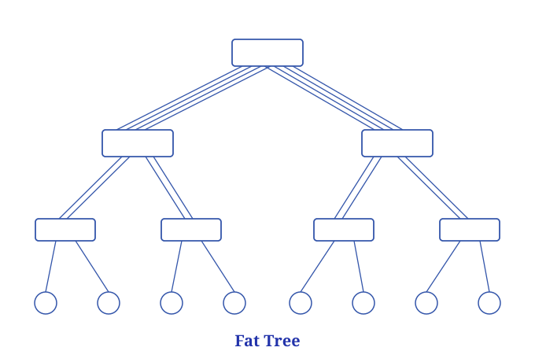
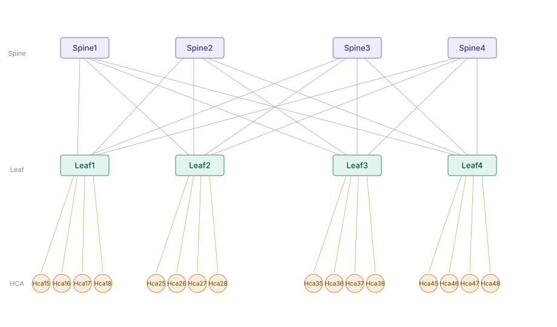

# Chapter 13: The InfiniBand Fabric Routing Engine (Continued)

In this chapter we continue our introduction to the IB routing engine. Before we begin, let me introduce a new concept: Fat-Tree.

Usually, when Fat-Tree is mentioned in IB, it refers to a topology structure. It is the most mainstream network architecture in high-performance computing (HPC) and AI training clusters, and its core design goal is to provide non-blocking or low-blocking full-interconnect capability.

Fat-Tree gets its name from the design intuition that "the closer to the core, the thicker the links," but in modern implementations it usually refers to a variant of the Clos network. Its core goal is: when building a large-scale interconnect network with multiple tiers of ordinary switches, to still provide non-blocking communication paths for any pair of end nodes, that is, no matter how many HCAs initiate communication simultaneously, no convergence bottleneck arises due to insufficient uplink bandwidth.



A standard two-tier Fat-Tree consists of three types of nodes:

- The Spine layer is the core switching layer, responsible for forwarding traffic between different Leaf domains. Each Spine switch connects to all Leaf switches, forming a fully interconnected uplink mesh.
- The Leaf layer is the access layer; on each Leaf switch, half of the ports connect up to the Spines (uplinks) and the other half connect down to host HCAs (downlinks).
- The HCA (Host Channel Adapter) is the IB NIC on the server side, responsible for the hardware offload of RDMA operations.



Take the illustrated topology as an example: 4 Spines × 4 Leaves × 4 HCAs/Leaf = 16 nodes, with 16 uplinks in total between Spine and Leaf. Between any two HCAs there exist 4 equivalent paths (via Spine1/2/3/4), a non-blocking design.

Larger-scale clusters extend to a three-tier structure, adding a layer of Super-Spine (or Core) to support scales of thousands or even tens of thousands of nodes; typical deployments are found in the GPU clusters of major cloud vendors.

OpenSM has a routing algorithm specially designed for Fat-Tree topologies, named ftree. Unlike updn, ftree explicitly perceives the hierarchical structure of the Fat-Tree, distinguishing switches into two roles, Spine (root node) and Leaf (leaf node), and recursively building paths upward starting from each target HCA. When choosing an uplink, for equivalent paths, ftree always prefers the Spine direction currently carrying the fewest routes, ensuring that the paths to all target LIDs are distributed as evenly as possible among the Spines. Under a symmetric topology, this mechanism makes traffic destined to the same target HCA pass through the same Spine no matter which Leaf it sets off from.

Next, we'll borrow the spine-leaf topology diagram above to write an ibsim topology file, have OpenSM run once each with the updn and ftree routing engines, and look at how ftree works by comparing their respective local forwarding tables (LFTs).

## 13.1 The ibsim Topology File

The ibsim topology file is as follows:

```bash
#
Switch  8 "Spine1"
[1]     "Leaf1"[1]
[2]     "Leaf2"[1]
[3]     "Leaf3"[1]
[4]     "Leaf4"[1]

Switch  8 "Spine2"
[1]     "Leaf1"[2]
[2]     "Leaf2"[2]
[3]     "Leaf3"[2]
[4]     "Leaf4"[2]

Switch  8 "Spine3"
[1]     "Leaf1"[3]
[2]     "Leaf2"[3]
[3]     "Leaf3"[3]
[4]     "Leaf4"[3]

Switch  8 "Spine4"
[1]     "Leaf1"[4]
[2]     "Leaf2"[4]
[3]     "Leaf3"[4]
[4]     "Leaf4"[4]

Switch  8 "Leaf1"
[1]     "Spine1"[1]
[2]     "Spine2"[1]
[3]     "Spine3"[1]
[4]     "Spine4"[1]
[5]     "Hca15"[1]
[6]     "Hca16"[1]
[7]     "Hca17"[1]
[8]     "Hca18"[1]

Switch  8 "Leaf2"
[1]     "Spine1"[2]
[2]     "Spine2"[2]
[3]     "Spine3"[2]
[4]     "Spine4"[2]
[5]     "Hca25"[1]
[6]     "Hca26"[1]
[7]     "Hca27"[1]
[8]     "Hca28"[1]

Switch  8 "Leaf3"
[1]     "Spine1"[3]
[2]     "Spine2"[3]
[3]     "Spine3"[3]
[4]     "Spine4"[3]
[5]     "Hca35"[1]
[6]     "Hca36"[1]
[7]     "Hca37"[1]
[8]     "Hca38"[1]

Switch  8 "Leaf4"
[1]     "Spine1"[4]
[2]     "Spine2"[4]
[3]     "Spine3"[4]
[4]     "Spine4"[4]
[5]     "Hca45"[1]
[6]     "Hca46"[1]
[7]     "Hca47"[1]
[8]     "Hca48"[1]

# leaf1
Hca     2 "Hca15"
[1]     "Leaf1"[5]

Hca     2 "Hca16"
[1]     "Leaf1"[6]

Hca     2 "Hca17"
[1]     "Leaf1"[7]

Hca     2 "Hca18"
[1]     "Leaf1"[8]

# leaf2
Hca     2 "Hca25"
[1]     "Leaf2"[5]

Hca     2 "Hca26"
[1]     "Leaf2"[6]

Hca     2 "Hca27"
[1]     "Leaf2"[7]

Hca     2 "Hca28"
[1]     "Leaf2"[8]

# leaf3
Hca     2 "Hca35"
[1]     "Leaf3"[5]

Hca     2 "Hca36"
[1]     "Leaf3"[6]

Hca     2 "Hca37"
[1]     "Leaf3"[7]

Hca     2 "Hca38"
[1]     "Leaf3"[8]

# leaf4
Hca     2 "Hca45"
[1]     "Leaf4"[5]

Hca     2 "Hca46"
[1]     "Leaf4"[6]

Hca     2 "Hca47"
[1]     "Leaf4"[7]

Hca     2 "Hca48"
[1]     "Leaf4"[8]
```

## 13.2 Using the updn Algorithm

```bash
# terminal 1:
expert@net21:~$ rlwrap ibsim -s ./ib3.net

# terminal 2:
# Manually write the root list, taking all spine switches as roots
expert@net21:~$ echo "0x200000" > updn-root.guids
expert@net21:~$ echo "0x200001" >> updn-root.guids
expert@net21:~$ echo "0x200002" >> updn-root.guids
expert@net21:~$ echo "0x200003" >> updn-root.guids
# root list
expert@net21:~$ cat updn-root.guids
0x200000
0x200001
0x200002
0x200003
# Start OpenSM
expert@net21:~$ sudo bash -c 'LD_PRELOAD=/usr/lib/umad2sim/libumad2sim.so rlwrap opensm -q local -R updn -a ./updn-root.guids -f -'
```

The ibsim dump is as follows:

There is quite a lot of output here; this section is just for display, and later we'll do a comparative analysis with the ftree output.

```bash

sim> dump
# Net status - Sun Jun 21 09:33:11 2026

Switch 8 "Spine1"       nodeguid 200000 sysimgguid 200000
#       linearcap 49152 FDBtop 28 portchange 0
#       Forwarding table 0-15: [0]FF [1]0 [2]1 [3]1 [4]FF [5]1 [6]1 [7]1 [8]1 [9]1 [10]FF [11]1 [12]2 [13]FF [14]FF [15]3
#       Forwarding table 16-28: [16]4 [17]2 [18]2 [19]2 [20]2 [21]3 [22]3 [23]3 [24]3 [25]4 [26]4 [27]4 [28]4
200000  [0]     "Sma Port"[0]    lid 1 lmc 0 smlid 1  4x  2.5G Active/LinkUp
200000  [1]     "Leaf1"[1]        4x  2.5G Active/LinkUp
200000  [2]     "Leaf2"[1]        4x  2.5G Active/LinkUp
200000  [3]     "Leaf3"[1]        4x  2.5G Active/LinkUp
200000  [4]     "Leaf4"[1]        4x  2.5G Active/LinkUp
200000  [5]                       4x  2.5G Down/Polling
200000  [6]                       4x  2.5G Down/Polling
200000  [7]                       4x  2.5G Down/Polling
200000  [8]                       4x  2.5G Down/Polling

Switch 8 "Spine2"       nodeguid 200001 sysimgguid 200001
#       linearcap 49152 FDBtop 28 portchange 0
#       Forwarding table 0-15: [0]FF [1]1 [2]1 [3]0 [4]FF [5]1 [6]1 [7]1 [8]1 [9]1 [10]FF [11]1 [12]2 [13]FF [14]FF [15]3
#       Forwarding table 16-28: [16]4 [17]2 [18]2 [19]2 [20]2 [21]3 [22]3 [23]3 [24]3 [25]4 [26]4 [27]4 [28]4
200001  [0]     "Sma Port"[0]    lid 3 lmc 0 smlid 1  4x  2.5G Active/LinkUp
200001  [1]     "Leaf1"[2]        4x  2.5G Active/LinkUp
200001  [2]     "Leaf2"[2]        4x  2.5G Active/LinkUp
200001  [3]     "Leaf3"[2]        4x  2.5G Active/LinkUp
200001  [4]     "Leaf4"[2]        4x  2.5G Active/LinkUp
200001  [5]                       4x  2.5G Down/Polling
200001  [6]                       4x  2.5G Down/Polling
200001  [7]                       4x  2.5G Down/Polling
200001  [8]                       4x  2.5G Down/Polling

Switch 8 "Spine3"       nodeguid 200002 sysimgguid 200002
#       linearcap 49152 FDBtop 28 portchange 0
#       Forwarding table 0-15: [0]FF [1]1 [2]1 [3]1 [4]FF [5]1 [6]0 [7]1 [8]1 [9]1 [10]FF [11]1 [12]2 [13]FF [14]FF [15]3
#       Forwarding table 16-28: [16]4 [17]2 [18]2 [19]2 [20]2 [21]3 [22]3 [23]3 [24]3 [25]4 [26]4 [27]4 [28]4
200002  [0]     "Sma Port"[0]    lid 6 lmc 0 smlid 1  4x  2.5G Active/LinkUp
200002  [1]     "Leaf1"[3]        4x  2.5G Active/LinkUp
200002  [2]     "Leaf2"[3]        4x  2.5G Active/LinkUp
200002  [3]     "Leaf3"[3]        4x  2.5G Active/LinkUp
200002  [4]     "Leaf4"[3]        4x  2.5G Active/LinkUp
200002  [5]                       4x  2.5G Down/Polling
200002  [6]                       4x  2.5G Down/Polling
200002  [7]                       4x  2.5G Down/Polling
200002  [8]                       4x  2.5G Down/Polling

Switch 8 "Spine4"       nodeguid 200003 sysimgguid 200003
#       linearcap 49152 FDBtop 28 portchange 0
#       Forwarding table 0-15: [0]FF [1]1 [2]1 [3]1 [4]FF [5]1 [6]1 [7]0 [8]1 [9]1 [10]FF [11]1 [12]2 [13]FF [14]FF [15]3
#       Forwarding table 16-28: [16]4 [17]2 [18]2 [19]2 [20]2 [21]3 [22]3 [23]3 [24]3 [25]4 [26]4 [27]4 [28]4
200003  [0]     "Sma Port"[0]    lid 7 lmc 0 smlid 1  4x  2.5G Active/LinkUp
200003  [1]     "Leaf1"[4]        4x  2.5G Active/LinkUp
200003  [2]     "Leaf2"[4]        4x  2.5G Active/LinkUp
200003  [3]     "Leaf3"[4]        4x  2.5G Active/LinkUp
200003  [4]     "Leaf4"[4]        4x  2.5G Active/LinkUp
200003  [5]                       4x  2.5G Down/Polling
200003  [6]                       4x  2.5G Down/Polling
200003  [7]                       4x  2.5G Down/Polling
200003  [8]                       4x  2.5G Down/Polling

Switch 8 "Leaf1"        nodeguid 200004 sysimgguid 200004
#       linearcap 49152 FDBtop 28 portchange 0
#       Forwarding table 0-15: [0]FF [1]1 [2]5 [3]2 [4]FF [5]6 [6]3 [7]4 [8]7 [9]8 [10]FF [11]0 [12]1 [13]FF [14]FF [15]1
#       Forwarding table 16-28: [16]1 [17]1 [18]3 [19]4 [20]2 [21]2 [22]3 [23]4 [24]1 [25]1 [26]2 [27]3 [28]4
200004  [0]     "Sma Port"[0]    lid 11 lmc 0 smlid 1  4x  2.5G Active/LinkUp
200004  [1]     "Spine1"[1]       4x  2.5G Active/LinkUp
200004  [2]     "Spine2"[1]       4x  2.5G Active/LinkUp
200004  [3]     "Spine3"[1]       4x  2.5G Active/LinkUp
200004  [4]     "Spine4"[1]       4x  2.5G Active/LinkUp
200004  [5]     "Hca15"[1]        4x  2.5G Active/LinkUp
200004  [6]     "Hca16"[1]        4x  2.5G Active/LinkUp
200004  [7]     "Hca17"[1]        4x  2.5G Active/LinkUp
200004  [8]     "Hca18"[1]        4x  2.5G Active/LinkUp

Switch 8 "Leaf2"        nodeguid 200005 sysimgguid 200005
#       linearcap 49152 FDBtop 28 portchange 0
#       Forwarding table 0-15: [0]FF [1]1 [2]2 [3]2 [4]FF [5]1 [6]3 [7]4 [8]3 [9]4 [10]FF [11]1 [12]0 [13]FF [14]FF [15]1
#       Forwarding table 16-28: [16]1 [17]5 [18]6 [19]7 [20]8 [21]2 [22]4 [23]3 [24]1 [25]4 [26]3 [27]1 [28]2
200005  [0]     "Sma Port"[0]    lid 12 lmc 0 smlid 1  4x  2.5G Active/LinkUp
200005  [1]     "Spine1"[2]       4x  2.5G Active/LinkUp
200005  [2]     "Spine2"[2]       4x  2.5G Active/LinkUp
200005  [3]     "Spine3"[2]       4x  2.5G Active/LinkUp
200005  [4]     "Spine4"[2]       4x  2.5G Active/LinkUp
200005  [5]     "Hca25"[1]        4x  2.5G Active/LinkUp
200005  [6]     "Hca26"[1]        4x  2.5G Active/LinkUp
200005  [7]     "Hca27"[1]        4x  2.5G Active/LinkUp
200005  [8]     "Hca28"[1]        4x  2.5G Active/LinkUp

Switch 8 "Leaf3"        nodeguid 200006 sysimgguid 200006
#       linearcap 49152 FDBtop 28 portchange 0
#       Forwarding table 0-15: [0]FF [1]1 [2]1 [3]2 [4]FF [5]3 [6]3 [7]4 [8]4 [9]2 [10]FF [11]1 [12]1 [13]FF [14]FF [15]0
#       Forwarding table 16-28: [16]1 [17]1 [18]3 [19]4 [20]2 [21]5 [22]6 [23]7 [24]8 [25]3 [26]4 [27]1 [28]2
200006  [0]     "Sma Port"[0]    lid 15 lmc 0 smlid 1  4x  2.5G Active/LinkUp
200006  [1]     "Spine1"[3]       4x  2.5G Active/LinkUp
200006  [2]     "Spine2"[3]       4x  2.5G Active/LinkUp
200006  [3]     "Spine3"[3]       4x  2.5G Active/LinkUp
200006  [4]     "Spine4"[3]       4x  2.5G Active/LinkUp
200006  [5]     "Hca35"[1]        4x  2.5G Active/LinkUp
200006  [6]     "Hca36"[1]        4x  2.5G Active/LinkUp
200006  [7]     "Hca37"[1]        4x  2.5G Active/LinkUp
200006  [8]     "Hca38"[1]        4x  2.5G Active/LinkUp

Switch 8 "Leaf4"        nodeguid 200007 sysimgguid 200007
#       linearcap 49152 FDBtop 28 portchange 0
#       Forwarding table 0-15: [0]FF [1]1 [2]2 [3]2 [4]FF [5]4 [6]3 [7]4 [8]3 [9]1 [10]FF [11]1 [12]1 [13]FF [14]FF [15]1
#       Forwarding table 16-28: [16]0 [17]4 [18]2 [19]3 [20]1 [21]4 [22]3 [23]1 [24]2 [25]5 [26]6 [27]7 [28]8
200007  [0]     "Sma Port"[0]    lid 16 lmc 0 smlid 1  4x  2.5G Active/LinkUp
200007  [1]     "Spine1"[4]       4x  2.5G Active/LinkUp
200007  [2]     "Spine2"[4]       4x  2.5G Active/LinkUp
200007  [3]     "Spine3"[4]       4x  2.5G Active/LinkUp
200007  [4]     "Spine4"[4]       4x  2.5G Active/LinkUp
200007  [5]     "Hca45"[1]        4x  2.5G Active/LinkUp
200007  [6]     "Hca46"[1]        4x  2.5G Active/LinkUp
200007  [7]     "Hca47"[1]        4x  2.5G Active/LinkUp
200007  [8]     "Hca48"[1]        4x  2.5G Active/LinkUp

Ca 2 "Hca15"    nodeguid 100000 sysimgguid 100000
100001  [1]     "Leaf1"[5]       lid 2 lmc 0 smlid 1  4x  2.5G Active/LinkUp
100002  [2]                      lid 0 lmc 0 smlid 0  4x  2.5G Down/Polling

Ca 2 "Hca16"    nodeguid 100003 sysimgguid 100003
100004  [1]     "Leaf1"[6]       lid 5 lmc 0 smlid 1  4x  2.5G Active/LinkUp
100005  [2]                      lid 0 lmc 0 smlid 0  4x  2.5G Down/Polling

Ca 2 "Hca17"    nodeguid 100006 sysimgguid 100006
100007  [1]     "Leaf1"[7]       lid 8 lmc 0 smlid 1  4x  2.5G Active/LinkUp
100008  [2]                      lid 0 lmc 0 smlid 0  4x  2.5G Down/Polling

Ca 2 "Hca18"    nodeguid 100009 sysimgguid 100009
10000a  [1]     "Leaf1"[8]       lid 9 lmc 0 smlid 1  4x  2.5G Active/LinkUp
10000b  [2]                      lid 0 lmc 0 smlid 0  4x  2.5G Down/Polling

Ca 2 "Hca25"    nodeguid 10000c sysimgguid 10000c
10000d  [1]     "Leaf2"[5]       lid 17 lmc 0 smlid 1  4x  2.5G Active/LinkUp
10000e  [2]                      lid 0 lmc 0 smlid 0  4x  2.5G Down/Polling

Ca 2 "Hca26"    nodeguid 10000f sysimgguid 10000f
100010  [1]     "Leaf2"[6]       lid 18 lmc 0 smlid 1  4x  2.5G Active/LinkUp
100011  [2]                      lid 0 lmc 0 smlid 0  4x  2.5G Down/Polling

Ca 2 "Hca27"    nodeguid 100012 sysimgguid 100012
100013  [1]     "Leaf2"[7]       lid 19 lmc 0 smlid 1  4x  2.5G Active/LinkUp
100014  [2]                      lid 0 lmc 0 smlid 0  4x  2.5G Down/Polling

Ca 2 "Hca28"    nodeguid 100015 sysimgguid 100015
100016  [1]     "Leaf2"[8]       lid 20 lmc 0 smlid 1  4x  2.5G Active/LinkUp
100017  [2]                      lid 0 lmc 0 smlid 0  4x  2.5G Down/Polling

Ca 2 "Hca35"    nodeguid 100018 sysimgguid 100018
100019  [1]     "Leaf3"[5]       lid 21 lmc 0 smlid 1  4x  2.5G Active/LinkUp
10001a  [2]                      lid 0 lmc 0 smlid 0  4x  2.5G Down/Polling

Ca 2 "Hca36"    nodeguid 10001b sysimgguid 10001b
10001c  [1]     "Leaf3"[6]       lid 22 lmc 0 smlid 1  4x  2.5G Active/LinkUp
10001d  [2]                      lid 0 lmc 0 smlid 0  4x  2.5G Down/Polling

Ca 2 "Hca37"    nodeguid 10001e sysimgguid 10001e
10001f  [1]     "Leaf3"[7]       lid 23 lmc 0 smlid 1  4x  2.5G Active/LinkUp
100020  [2]                      lid 0 lmc 0 smlid 0  4x  2.5G Down/Polling

Ca 2 "Hca38"    nodeguid 100021 sysimgguid 100021
100022  [1]     "Leaf3"[8]       lid 24 lmc 0 smlid 1  4x  2.5G Active/LinkUp
100023  [2]                      lid 0 lmc 0 smlid 0  4x  2.5G Down/Polling

Ca 2 "Hca45"    nodeguid 100024 sysimgguid 100024
100025  [1]     "Leaf4"[5]       lid 25 lmc 0 smlid 1  4x  2.5G Active/LinkUp
100026  [2]                      lid 0 lmc 0 smlid 0  4x  2.5G Down/Polling

Ca 2 "Hca46"    nodeguid 100027 sysimgguid 100027
100028  [1]     "Leaf4"[6]       lid 26 lmc 0 smlid 1  4x  2.5G Active/LinkUp
100029  [2]                      lid 0 lmc 0 smlid 0  4x  2.5G Down/Polling

Ca 2 "Hca47"    nodeguid 10002a sysimgguid 10002a
10002b  [1]     "Leaf4"[7]       lid 27 lmc 0 smlid 1  4x  2.5G Active/LinkUp
10002c  [2]                      lid 0 lmc 0 smlid 0  4x  2.5G Down/Polling

Ca 2 "Hca48"    nodeguid 10002d sysimgguid 10002d
10002e  [1]     "Leaf4"[8]       lid 28 lmc 0 smlid 1  4x  2.5G Active/LinkUp
10002f  [2]                      lid 0 lmc 0 smlid 0  4x  2.5G Down/Polling
#  dumped 24 nodes
```

## 13.3 Using the ftree Algorithm

```bash
# terminal 1:
expert@net21:~$ rlwrap ibsim -s ./ib3.net

# terminal 2:
# Start OpenSM
expert@net21:~$ sudo bash -c 'LD_PRELOAD=/usr/lib/umad2sim/libumad2sim.so rlwrap opensm -q local -R ftree -f -'
-------------------------------------------------
OpenSM 5.21.12.MLNX20250617.f74e01b8
Command Line Arguments:
 Activate 'ftree' routing engine(s)
 Log File: -
-------------------------------------------------
Jun 21 09:37:44 183855 [67AFF740] 0x03 -> OpenSM 5.21.12.MLNX20250617.f74e01b8
Jun 21 09:37:44 184100 [67AFF740] 0x80 -> OpenSM 5.21.12.MLNX20250617.f74e01b8
ibwarn: [10494] sim_connect: attached as client 0 at node "Spine1"
Jun 21 09:37:44 202127 [67AFF740] 0x02 -> osm_vendor_init: 1000 pending umads specified
Jun 21 09:37:44 202525 [67AFF740] 0x02 -> osm_vendor_init: 1000 pending umads specified
Jun 21 09:37:44 202875 [67AFF740] 0x02 -> osm_vendor_init: 1000 pending umads specified
Using default GUID 0x200000
Jun 21 09:37:44 216993 [67AFF740] 0x02 -> osm_tenant_mgr_init: tenant mgr is disabled
Jun 21 09:37:44 217837 [67AFF740] 0x02 -> osm_issu_mgr_init: issu_mgr is initialized
Jun 21 09:37:44 218023 [67AFF740] 0x80 -> Entering DISCOVERING state
Jun 21 09:37:44 219887 [67AFF740] 0x02 -> osm_vendor_rebind: Mgmt class 0x81 binding to port GUID 0x200000
Jun 21 09:37:44 232382 [67AFF740] 0x02 -> osm_sm_bind: Bind to port guid 0x200000, port index 0 as main SM port
Jun 21 09:37:44 232506 [67AFF740] 0x02 -> osm_vendor_rebind: Mgmt class 0x03 binding to port GUID 0x200000
Jun 21 09:37:44 242408 [67AFF740] 0x02 -> osm_vendor_rebind: Mgmt class 0x04 binding to port GUID 0x200000
Jun 21 09:37:44 242512 [67AFF740] 0x02 -> osm_vendor_rebind: Mgmt class 0x21 binding to port GUID 0x200000
Jun 21 09:37:44 242589 [67AFF740] 0x02 -> osm_vendor_rebind: Mgmt class 0x0a binding to port GUID 0x200000
Jun 21 09:37:44 242755 [67AFF740] 0x02 -> osm_vendor_rebind: Mgmt class 0x0c binding to port GUID 0x200000
Jun 21 09:37:44 242890 [67AFF740] 0x02 -> osm_opensm_bind: Setting IS_SM on port 0x0000000000200000
OpenSM $ Jun 21 09:37:44 243429 [577FE6C0] 0x02 -> do_sweep:


******************************************************************
*********************** HEAVY SWEEP START ************************
******************************************************************


Jun 21 09:37:44 243554 [577FE6C0] 0x02 -> do_sweep: Entering heavy sweep with flags: force_heavy_sweep 0, coming out of standby 0, subnet initialization error 0, sm port change 0
Jun 21 09:37:44 272294 [577FE6C0] 0x80 -> Entering MASTER state
Jun 21 09:37:44 280294 [577FE6C0] 0x02 -> fabric_dump_general_info: General fabric topology info
Jun 21 09:37:44 280425 [577FE6C0] 0x02 -> fabric_dump_general_info: ============================
Jun 21 09:37:44 280527 [577FE6C0] 0x02 -> fabric_dump_general_info:   - FatTree rank (roots to leaf switches): 2
Jun 21 09:37:44 280618 [577FE6C0] 0x02 -> fabric_dump_general_info:   - FatTree max switch rank: 1
Jun 21 09:37:44 280746 [577FE6C0] 0x02 -> fabric_dump_general_info:   - Fabric has 0 Routers which are considered as IO nodes
Jun 21 09:37:44 280840 [577FE6C0] 0x02 -> fabric_dump_general_info:   - Fabric has 16 CAs, 16 CA ports (16 of them CNs), 8 switches
Jun 21 09:37:44 280941 [577FE6C0] 0x02 -> fabric_dump_general_info:   - Fabric has 4 switches at rank 0 (roots)
Jun 21 09:37:44 281044 [577FE6C0] 0x02 -> fabric_dump_general_info:   - Fabric has 4 switches at rank 1 (4 of them leafs)
Jun 21 09:37:44 283581 [577FE6C0] 0x02 -> osm_ucast_mgr_process: ftree tables configured on all switches
Jun 21 09:37:44 356901 [577FE6C0] 0x02 -> SUBNET UP

OpenSM $
OpenSM $
```

> From the SM's startup log, you can see that **ftree successfully identified the two-tier structure**, knowing that the Spines are rank 0 (roots) and the Leaves are rank 1.
>
> This forms a sharp contrast with updn, which must have its root specified manually, whereas ftree doesn't need it.

The ibsim dump is as follows:

There is quite a lot of output here; this section is just for display, and later we'll do a comparative analysis with the updn output.

```bash
sim> dump
# Net status - Sun Jun 21 09:26:08 2026

Switch 8 "Spine1"       nodeguid 200000 sysimgguid 200000
#       linearcap 49152 FDBtop 28 portchange 0
#       Forwarding table 0-15: [0]FF [1]0 [2]1 [3]1 [4]FF [5]1 [6]1 [7]1 [8]1 [9]1 [10]FF [11]1 [12]2 [13]FF [14]FF [15]3
#       Forwarding table 16-28: [16]4 [17]2 [18]2 [19]2 [20]2 [21]3 [22]3 [23]3 [24]3 [25]4 [26]4 [27]4 [28]4
200000  [0]     "Sma Port"[0]    lid 1 lmc 0 smlid 1  4x  2.5G Active/LinkUp
200000  [1]     "Leaf1"[1]        4x  2.5G Active/LinkUp
200000  [2]     "Leaf2"[1]        4x  2.5G Active/LinkUp
200000  [3]     "Leaf3"[1]        4x  2.5G Active/LinkUp
200000  [4]     "Leaf4"[1]        4x  2.5G Active/LinkUp
200000  [5]                       4x  2.5G Down/Polling
200000  [6]                       4x  2.5G Down/Polling
200000  [7]                       4x  2.5G Down/Polling
200000  [8]                       4x  2.5G Down/Polling

Switch 8 "Spine2"       nodeguid 200001 sysimgguid 200001
#       linearcap 49152 FDBtop 28 portchange 0
#       Forwarding table 0-15: [0]FF [1]1 [2]1 [3]0 [4]FF [5]1 [6]1 [7]1 [8]1 [9]1 [10]FF [11]1 [12]2 [13]FF [14]FF [15]3
#       Forwarding table 16-28: [16]4 [17]2 [18]2 [19]2 [20]2 [21]3 [22]3 [23]3 [24]3 [25]4 [26]4 [27]4 [28]4
200001  [0]     "Sma Port"[0]    lid 3 lmc 0 smlid 1  4x  2.5G Active/LinkUp
200001  [1]     "Leaf1"[2]        4x  2.5G Active/LinkUp
200001  [2]     "Leaf2"[2]        4x  2.5G Active/LinkUp
200001  [3]     "Leaf3"[2]        4x  2.5G Active/LinkUp
200001  [4]     "Leaf4"[2]        4x  2.5G Active/LinkUp
200001  [5]                       4x  2.5G Down/Polling
200001  [6]                       4x  2.5G Down/Polling
200001  [7]                       4x  2.5G Down/Polling
200001  [8]                       4x  2.5G Down/Polling

Switch 8 "Spine3"       nodeguid 200002 sysimgguid 200002
#       linearcap 49152 FDBtop 28 portchange 0
#       Forwarding table 0-15: [0]FF [1]1 [2]1 [3]1 [4]FF [5]1 [6]0 [7]1 [8]1 [9]1 [10]FF [11]1 [12]2 [13]FF [14]FF [15]3
#       Forwarding table 16-28: [16]4 [17]2 [18]2 [19]2 [20]2 [21]3 [22]3 [23]3 [24]3 [25]4 [26]4 [27]4 [28]4
200002  [0]     "Sma Port"[0]    lid 6 lmc 0 smlid 1  4x  2.5G Active/LinkUp
200002  [1]     "Leaf1"[3]        4x  2.5G Active/LinkUp
200002  [2]     "Leaf2"[3]        4x  2.5G Active/LinkUp
200002  [3]     "Leaf3"[3]        4x  2.5G Active/LinkUp
200002  [4]     "Leaf4"[3]        4x  2.5G Active/LinkUp
200002  [5]                       4x  2.5G Down/Polling
200002  [6]                       4x  2.5G Down/Polling
200002  [7]                       4x  2.5G Down/Polling
200002  [8]                       4x  2.5G Down/Polling

Switch 8 "Spine4"       nodeguid 200003 sysimgguid 200003
#       linearcap 49152 FDBtop 28 portchange 0
#       Forwarding table 0-15: [0]FF [1]1 [2]1 [3]1 [4]FF [5]1 [6]1 [7]0 [8]1 [9]1 [10]FF [11]1 [12]2 [13]FF [14]FF [15]3
#       Forwarding table 16-28: [16]4 [17]2 [18]2 [19]2 [20]2 [21]3 [22]3 [23]3 [24]3 [25]4 [26]4 [27]4 [28]4
200003  [0]     "Sma Port"[0]    lid 7 lmc 0 smlid 1  4x  2.5G Active/LinkUp
200003  [1]     "Leaf1"[4]        4x  2.5G Active/LinkUp
200003  [2]     "Leaf2"[4]        4x  2.5G Active/LinkUp
200003  [3]     "Leaf3"[4]        4x  2.5G Active/LinkUp
200003  [4]     "Leaf4"[4]        4x  2.5G Active/LinkUp
200003  [5]                       4x  2.5G Down/Polling
200003  [6]                       4x  2.5G Down/Polling
200003  [7]                       4x  2.5G Down/Polling
200003  [8]                       4x  2.5G Down/Polling

Switch 8 "Leaf1"        nodeguid 200004 sysimgguid 200004
#       linearcap 49152 FDBtop 28 portchange 0
#       Forwarding table 0-15: [0]FF [1]1 [2]5 [3]2 [4]FF [5]6 [6]3 [7]4 [8]7 [9]8 [10]FF [11]0 [12]1 [13]FF [14]FF [15]1
#       Forwarding table 16-28: [16]1 [17]1 [18]2 [19]3 [20]4 [21]1 [22]2 [23]3 [24]4 [25]1 [26]2 [27]3 [28]4
200004  [0]     "Sma Port"[0]    lid 11 lmc 0 smlid 1  4x  2.5G Active/LinkUp
200004  [1]     "Spine1"[1]       4x  2.5G Active/LinkUp
200004  [2]     "Spine2"[1]       4x  2.5G Active/LinkUp
200004  [3]     "Spine3"[1]       4x  2.5G Active/LinkUp
200004  [4]     "Spine4"[1]       4x  2.5G Active/LinkUp
200004  [5]     "Hca15"[1]        4x  2.5G Active/LinkUp
200004  [6]     "Hca16"[1]        4x  2.5G Active/LinkUp
200004  [7]     "Hca17"[1]        4x  2.5G Active/LinkUp
200004  [8]     "Hca18"[1]        4x  2.5G Active/LinkUp

Switch 8 "Leaf2"        nodeguid 200005 sysimgguid 200005
#       linearcap 49152 FDBtop 28 portchange 0
#       Forwarding table 0-15: [0]FF [1]1 [2]1 [3]2 [4]FF [5]2 [6]3 [7]4 [8]3 [9]4 [10]FF [11]1 [12]0 [13]FF [14]FF [15]1
#       Forwarding table 16-28: [16]1 [17]5 [18]6 [19]7 [20]8 [21]1 [22]2 [23]3 [24]4 [25]1 [26]2 [27]3 [28]4
200005  [0]     "Sma Port"[0]    lid 12 lmc 0 smlid 1  4x  2.5G Active/LinkUp
200005  [1]     "Spine1"[2]       4x  2.5G Active/LinkUp
200005  [2]     "Spine2"[2]       4x  2.5G Active/LinkUp
200005  [3]     "Spine3"[2]       4x  2.5G Active/LinkUp
200005  [4]     "Spine4"[2]       4x  2.5G Active/LinkUp
200005  [5]     "Hca25"[1]        4x  2.5G Active/LinkUp
200005  [6]     "Hca26"[1]        4x  2.5G Active/LinkUp
200005  [7]     "Hca27"[1]        4x  2.5G Active/LinkUp
200005  [8]     "Hca28"[1]        4x  2.5G Active/LinkUp

Switch 8 "Leaf3"        nodeguid 200006 sysimgguid 200006
#       linearcap 49152 FDBtop 28 portchange 0
#       Forwarding table 0-15: [0]FF [1]1 [2]1 [3]2 [4]FF [5]2 [6]3 [7]4 [8]3 [9]4 [10]FF [11]1 [12]1 [13]FF [14]FF [15]0
#       Forwarding table 16-28: [16]1 [17]1 [18]2 [19]3 [20]4 [21]5 [22]6 [23]7 [24]8 [25]1 [26]2 [27]3 [28]4
200006  [0]     "Sma Port"[0]    lid 15 lmc 0 smlid 1  4x  2.5G Active/LinkUp
200006  [1]     "Spine1"[3]       4x  2.5G Active/LinkUp
200006  [2]     "Spine2"[3]       4x  2.5G Active/LinkUp
200006  [3]     "Spine3"[3]       4x  2.5G Active/LinkUp
200006  [4]     "Spine4"[3]       4x  2.5G Active/LinkUp
200006  [5]     "Hca35"[1]        4x  2.5G Active/LinkUp
200006  [6]     "Hca36"[1]        4x  2.5G Active/LinkUp
200006  [7]     "Hca37"[1]        4x  2.5G Active/LinkUp
200006  [8]     "Hca38"[1]        4x  2.5G Active/LinkUp

Switch 8 "Leaf4"        nodeguid 200007 sysimgguid 200007
#       linearcap 49152 FDBtop 28 portchange 0
#       Forwarding table 0-15: [0]FF [1]1 [2]1 [3]2 [4]FF [5]2 [6]3 [7]4 [8]3 [9]4 [10]FF [11]1 [12]1 [13]FF [14]FF [15]1
#       Forwarding table 16-28: [16]0 [17]1 [18]2 [19]3 [20]4 [21]1 [22]2 [23]3 [24]4 [25]5 [26]6 [27]7 [28]8
200007  [0]     "Sma Port"[0]    lid 16 lmc 0 smlid 1  4x  2.5G Active/LinkUp
200007  [1]     "Spine1"[4]       4x  2.5G Active/LinkUp
200007  [2]     "Spine2"[4]       4x  2.5G Active/LinkUp
200007  [3]     "Spine3"[4]       4x  2.5G Active/LinkUp
200007  [4]     "Spine4"[4]       4x  2.5G Active/LinkUp
200007  [5]     "Hca45"[1]        4x  2.5G Active/LinkUp
200007  [6]     "Hca46"[1]        4x  2.5G Active/LinkUp
200007  [7]     "Hca47"[1]        4x  2.5G Active/LinkUp
200007  [8]     "Hca48"[1]        4x  2.5G Active/LinkUp

Ca 2 "Hca15"    nodeguid 100000 sysimgguid 100000
100001  [1]     "Leaf1"[5]       lid 2 lmc 0 smlid 1  4x  2.5G Active/LinkUp
100002  [2]                      lid 0 lmc 0 smlid 0  4x  2.5G Down/Polling

Ca 2 "Hca16"    nodeguid 100003 sysimgguid 100003
100004  [1]     "Leaf1"[6]       lid 5 lmc 0 smlid 1  4x  2.5G Active/LinkUp
100005  [2]                      lid 0 lmc 0 smlid 0  4x  2.5G Down/Polling

Ca 2 "Hca17"    nodeguid 100006 sysimgguid 100006
100007  [1]     "Leaf1"[7]       lid 8 lmc 0 smlid 1  4x  2.5G Active/LinkUp
100008  [2]                      lid 0 lmc 0 smlid 0  4x  2.5G Down/Polling

Ca 2 "Hca18"    nodeguid 100009 sysimgguid 100009
10000a  [1]     "Leaf1"[8]       lid 9 lmc 0 smlid 1  4x  2.5G Active/LinkUp
10000b  [2]                      lid 0 lmc 0 smlid 0  4x  2.5G Down/Polling

Ca 2 "Hca25"    nodeguid 10000c sysimgguid 10000c
10000d  [1]     "Leaf2"[5]       lid 17 lmc 0 smlid 1  4x  2.5G Active/LinkUp
10000e  [2]                      lid 0 lmc 0 smlid 0  4x  2.5G Down/Polling

Ca 2 "Hca26"    nodeguid 10000f sysimgguid 10000f
100010  [1]     "Leaf2"[6]       lid 18 lmc 0 smlid 1  4x  2.5G Active/LinkUp
100011  [2]                      lid 0 lmc 0 smlid 0  4x  2.5G Down/Polling

Ca 2 "Hca27"    nodeguid 100012 sysimgguid 100012
100013  [1]     "Leaf2"[7]       lid 19 lmc 0 smlid 1  4x  2.5G Active/LinkUp
100014  [2]                      lid 0 lmc 0 smlid 0  4x  2.5G Down/Polling

Ca 2 "Hca28"    nodeguid 100015 sysimgguid 100015
100016  [1]     "Leaf2"[8]       lid 20 lmc 0 smlid 1  4x  2.5G Active/LinkUp
100017  [2]                      lid 0 lmc 0 smlid 0  4x  2.5G Down/Polling

Ca 2 "Hca35"    nodeguid 100018 sysimgguid 100018
100019  [1]     "Leaf3"[5]       lid 21 lmc 0 smlid 1  4x  2.5G Active/LinkUp
10001a  [2]                      lid 0 lmc 0 smlid 0  4x  2.5G Down/Polling

Ca 2 "Hca36"    nodeguid 10001b sysimgguid 10001b
10001c  [1]     "Leaf3"[6]       lid 22 lmc 0 smlid 1  4x  2.5G Active/LinkUp
10001d  [2]                      lid 0 lmc 0 smlid 0  4x  2.5G Down/Polling

Ca 2 "Hca37"    nodeguid 10001e sysimgguid 10001e
10001f  [1]     "Leaf3"[7]       lid 23 lmc 0 smlid 1  4x  2.5G Active/LinkUp
100020  [2]                      lid 0 lmc 0 smlid 0  4x  2.5G Down/Polling

Ca 2 "Hca38"    nodeguid 100021 sysimgguid 100021
100022  [1]     "Leaf3"[8]       lid 24 lmc 0 smlid 1  4x  2.5G Active/LinkUp
100023  [2]                      lid 0 lmc 0 smlid 0  4x  2.5G Down/Polling

Ca 2 "Hca45"    nodeguid 100024 sysimgguid 100024
100025  [1]     "Leaf4"[5]       lid 25 lmc 0 smlid 1  4x  2.5G Active/LinkUp
100026  [2]                      lid 0 lmc 0 smlid 0  4x  2.5G Down/Polling

Ca 2 "Hca46"    nodeguid 100027 sysimgguid 100027
100028  [1]     "Leaf4"[6]       lid 26 lmc 0 smlid 1  4x  2.5G Active/LinkUp
100029  [2]                      lid 0 lmc 0 smlid 0  4x  2.5G Down/Polling

Ca 2 "Hca47"    nodeguid 10002a sysimgguid 10002a
10002b  [1]     "Leaf4"[7]       lid 27 lmc 0 smlid 1  4x  2.5G Active/LinkUp
10002c  [2]                      lid 0 lmc 0 smlid 0  4x  2.5G Down/Polling

Ca 2 "Hca48"    nodeguid 10002d sysimgguid 10002d
10002e  [1]     "Leaf4"[8]       lid 28 lmc 0 smlid 1  4x  2.5G Active/LinkUp
10002f  [2]                      lid 0 lmc 0 smlid 0  4x  2.5G Down/Polling
#  dumped 24 nodes
```

## 13.3 Comparative Analysis

First, regarding the output of the two routing algorithms, let's summarize the parts that are consistent:

For both algorithms, the LID assignment results are the same, because LID assignment is the work of the discovery stage. Summarized as follows:

```
Leaf1: Hca15=lid2,  Hca16=lid5,  Hca17=lid8,  Hca18=lid9
Leaf2: Hca25=lid17, Hca26=lid18, Hca27=lid19, Hca28=lid20
Leaf3: Hca35=lid21, Hca36=lid22, Hca37=lid23, Hca38=lid24
Leaf4: Hca45=lid25, Hca46=lid26, Hca47=lid27, Hca48=lid28
```

The port mapping of all Leaves connected to the Spines: port1=Spine1, port2=Spine2, port3=Spine3, port4=Spine4

---

### updn LFT

**Leaf1 LFT (updn):**

```
[Hca25]Sp1 [Hca26]Sp3 [Hca27]Sp4 [Hca28]Sp2    ← to Leaf2
[Hca35]Sp2 [Hca36]Sp3 [Hca37]Sp4 [Hca38]Sp1    ← to Leaf3
[Hca45]Sp1 [Hca46]Sp2 [Hca47]Sp3 [Hca48]Sp4    ← to Leaf4
```

**Leaf2 LFT (updn):**

```
[Hca15]Sp2 [Hca16]Sp1 [Hca17]Sp3 [Hca18]Sp4    ← to Leaf1
[Hca35]Sp2 [Hca36]Sp4 [Hca37]Sp3 [Hca38]Sp1    ← to Leaf3
[Hca45]Sp4 [Hca46]Sp3 [Hca47]Sp1 [Hca48]Sp2    ← to Leaf4
```

**Leaf3 LFT (updn):**

```
[Hca15]Sp1 [Hca16]Sp3 [Hca17]Sp4 [Hca18]Sp2    ← to Leaf1
[Hca25]Sp1 [Hca26]Sp3 [Hca27]Sp4 [Hca28]Sp2    ← to Leaf2
[Hca45]Sp3 [Hca46]Sp4 [Hca47]Sp1 [Hca48]Sp2    ← to Leaf4
```

**Leaf4 LFT (updn):**

```
[Hca15]Sp2 [Hca16]Sp4 [Hca17]Sp3 [Hca18]Sp1    ← to Leaf1
[Hca25]Sp4 [Hca26]Sp2 [Hca27]Sp3 [Hca28]Sp1    ← to Leaf2
[Hca35]Sp4 [Hca36]Sp3 [Hca37]Sp1 [Hca38]Sp2    ← to Leaf3
```

### ftree LFT

**Leaf1 LFT (ftree):**

```
[Hca25]Sp1 [Hca26]Sp2 [Hca27]Sp3 [Hca28]Sp4    ← to Leaf2
[Hca35]Sp1 [Hca36]Sp2 [Hca37]Sp3 [Hca38]Sp4    ← to Leaf3
[Hca45]Sp1 [Hca46]Sp2 [Hca47]Sp3 [Hca48]Sp4    ← to Leaf4
```

**Leaf2 LFT (ftree):**

```
[Hca15]Sp1 [Hca16]Sp2 [Hca17]Sp3 [Hca18]Sp4    ← to Leaf1
[Hca35]Sp1 [Hca36]Sp2 [Hca37]Sp3 [Hca38]Sp4    ← to Leaf3
[Hca45]Sp1 [Hca46]Sp2 [Hca47]Sp3 [Hca48]Sp4    ← to Leaf4
```

**Leaf3 LFT (ftree):**

```
[Hca15]Sp1 [Hca16]Sp2 [Hca17]Sp3 [Hca18]Sp4    ← to Leaf1
[Hca25]Sp1 [Hca26]Sp2 [Hca27]Sp3 [Hca28]Sp4    ← to Leaf2
[Hca45]Sp1 [Hca46]Sp2 [Hca47]Sp3 [Hca48]Sp4    ← to Leaf4
```

**Leaf4 LFT (ftree):**

```
[Hca15]Sp1 [Hca16]Sp2 [Hca17]Sp3 [Hca18]Sp4    ← to Leaf1
[Hca25]Sp1 [Hca26]Sp2 [Hca27]Sp3 [Hca28]Sp4    ← to Leaf2
[Hca35]Sp1 [Hca36]Sp2 [Hca37]Sp3 [Hca38]Sp4    ← to Leaf3
```

The difference between the two algorithms can be understood from two dimensions:

**From the perspective of a single Leaf**, both algorithms achieve balance: the 4 HCAs destined to the same target Leaf are spread across 4 different Spines, with each Spine carrying one path. On this point, updn and ftree are not essentially different.

**When comparing across Leaves horizontally, the difference appears.** Take the path to Hca25 as an example:

```
updn:  Leaf1→Sp1, Leaf3→Sp1, Leaf4→Sp4   (inconsistent)
ftree: Leaf1→Sp1, Leaf3→Sp1, Leaf4→Sp1   (fully consistent)
```

The fundamental reason for this difference lies in the different LFT-writing mechanisms of the two algorithms.

updn's LFT is written by OpenSM's generic routing manager. When equivalent paths exist, the basis for choosing a port is "which port currently has the fewest paths assigned to it," while the order of processing LIDs is determined by the numerical magnitude of each node's GUID. Since the HCAs under different Leaves have different GUIDs, the processing order differs, causing each Leaf, when facing the same target, to already have different load states on its available ports, so the Spine ultimately chosen also differs.

ftree, on the other hand, has its own independent LFT-writing logic, recursing upward starting from each target HCA, and when equivalent paths exist, choosing the Spine direction that currently carries the fewest downward routes. In our perfectly symmetric topology, when processing each target HCA the load state of each Spine is completely identical, so the same Spine is chosen each time, presenting a globally consistent mapping. It should be pointed out that this consistency is **the result of the symmetric topology and the balancing algorithm working together**, not a hard-coded rule of ftree; if the topology were asymmetric, ftree's results would likewise vary by Leaf.

## 13.4 A New Problem

Finally, I'd like to raise a question to conclude this chapter. The routing algorithms we've encountered so far all have a **fundamental limitation: the routing table is statically computed and written by the SM at subnet initialization, and never changes thereafter**. So when the actual traffic in the network becomes imbalanced, can they make adjustments at runtime?

This is precisely the problem that the next chapter's adaptive routing needs to solve.
