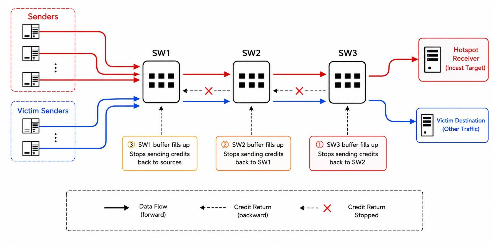
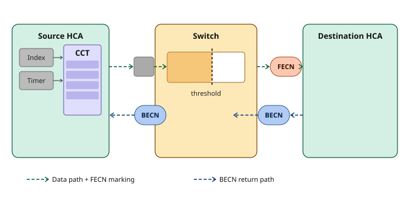

# Chapter 17: InfiniBand Fabric Congestion Control

## 17.1 Why a "Lossless" Network Still Needs Congestion Control

Here we come to touch on a question many peers initially find contradictory: **isn't IB inherently lossless? Doesn't the link-layer credit flow control already guarantee no packet loss? Then what is "Congestion Control (CC)" for?**

If you've worked with SAN networks, you won't find it strange: in SAN network operations, the most headache-inducing problem is congestion (Slow drain). So "congestion" is a common problem of lossless networks.

To understand what "congestion control" is in a lossless network, it's necessary to first clear up a conceptual misconception: flow control ≠ congestion control.

**Link-layer flow control solves "no packet loss."** As we said when introducing the principles of IB switches: for an IB switch to send a packet to the next hop, it must first obtain the other side's credit (confirmation that there is free buffer). Without credit, it doesn't send. So IB packets are never dropped due to buffer overflow. This is a **hop-by-hop, link-level** mechanism.

But "no packet loss" doesn't equal "no congestion." Imagine a classic **incast (many-to-one)** scenario: hundreds or thousands of GPUs simultaneously send gradients to one node during a certain phase of AllReduce. The bandwidth of that link at the destination is limited and can't take in so much traffic, so:

1. The destination port's buffer is quickly filled, and it stops issuing credit to the upstream;
2. The upstream switch's buffer also starts to pile up, so it too stops issuing credit to its upstream;
3. This "buffer filled → credit withdrawn" backpressure **spreads hop by hop toward the source** along the path...



The result is the notorious **congestion spreading / congestion tree** of lossless networks. Worse, it harms the innocent: **those "passing traffic" flows that don't go to the hot spot at all and just happen to share some buffer along the way also get jammed up together**, which is the so-called **victim flow**.

**Link-layer flow control is helpless against congestion**: it only faithfully passes the backpressure back level by level, and instead becomes an "accomplice" of congestion spreading. To solve it at the root, you must do something flow control can't: **make the sources actually creating the congestion slow down proactively.**

This is exactly **Congestion Control (CC)**. It is an **end-to-end**, closed-loop control oriented toward the **source's injection rate**.

> Summary: **flow control manages "no packet loss on the link," congestion control manages "the source not pouring too hard." The two are orthogonal, and neither can be missing.**

---

## 17.2 The Closed Loop of IB CC: Detect—Notify—React

IB's congestion control is a standard closed-loop feedback system, completed by three roles in relay. First, the full picture:


As shown in the figure: the whole mechanism is completed by three roles in collaboration: the switch is responsible for detecting and marking congestion, the destination HCA is responsible for forwarding the notification, and the source HCA is responsible for the slow-down response.

**Step 1: Congestion detection and marking**

When the queue depth of a Virtual Lane (VL) on a switch port exceeds a threshold, the switch marks the passing data packets with FECN (Forward Explicit Congestion Notification), and the packet continues to be forwarded normally toward the destination. The threshold is uniformly configured by the CCM (Congestion Control Manager).

IB CC tries hard to distinguish "the port that is truly the root of congestion (root)" from "a port that is merely affected by backpressure (victim)," trying to mark only the traffic that creates congestion, to avoid harming passing traffic by mistake.

**Step 2: The congestion signal is passed back in reverse**

After the destination HCA receives a data packet with the FECN mark, it sends back to the source a notification packet with a BECN (Backward Explicit Congestion Notification) mark, passing the congestion information back in reverse to the sender of the data.

**Step 3: The source slows down**

After the source HCA receives the BECN, it queries the local CCT (Congestion Control Table). This table is pre-written by the CCM, and each entry in the table corresponds to an inter-packet delay value. Each time it receives a BECN, the HCA increments the CCT index forward by one step (the increment is CCTI_Increase, also set by the CCM), thereby obtaining a larger inter-packet delay, with the actual effect of reducing the injection rate.

**Step 4: Automatic recovery**

The source HCA has a timer inside it. Each time the timer expires, the CCT index steps back by one, the corresponding inter-packet delay decreases accordingly, and the injection rate gradually recovers. If a BECN is received again during the recovery process, the index moves forward again and the rate is reduced again. If no new BECN arrives for a while, the index eventually returns to zero, the extra inter-packet delay is eliminated, and the link recovers to full speed.

**The overall closed-loop logic**

```
Congestion occurs → switch sets FECN → destination returns BECN
    → source queries CCT, adds delay, slows down
        → congestion eases → Timer triggers index rollback, recovers speed
            → if congestion recurs, loop again
```

The CCM, as the global manager, is responsible for writing the CCT content to all HCAs, configuring switch thresholds, and setting various rate parameters; the whole loop runs automatically without the upper-layer application needing to be aware.

The source's injection rate becomes a **closed-loop quantity that continuously rises and falls with congestion feedback**: the worse the jam, the denser the BECN, the larger the CCTI, the larger the packet-sending interval, and the lower the rate; once it eases, it smoothly rises back up.

---

## 17.3 CCM (Congestion Control Manager)

In the IB architecture, the part of OpenSM responsible for CC is the **CCM (Congestion Control Manager)**, which is somewhat special: it uses an independent management class, **management class 0x21 (Congestion Control class)**. So the CC configuration messages use not the SMP (Subnet Management Packet, class 0x01), but a dedicated congestion control management class.

## 17.4 CCM Configuration Options

When we first installed OpenSM we used NVIDIA's apt repo, and the configuration excerpted below comes from this MLNX/NVIDIA version of OpenSM. Note that its title explicitly says **EXPERIMENTAL**, indicating this is still an evolving feature.

CC relies on hardware support, which ibsim's virtual devices do not have. So this chapter can only do a walkthrough of the CCM part's configuration excerpt and official comments, to help everyone build up a concept.

The main configuration excerpt of the CCM part is as follows:

```bash
#
# Congestion Control OPTIONS (EXPERIMENTAL)
#

# Enable Congestion Control Configuration
# 0: Ignore congestion control
# 1: Disable congestion control
# 2: Enable congestion control
mlnx_congestion_control 0

# The file holding the congestion control policy
congestion_control_policy_file (null)

# The directory holding the PPCC algorithm profiles
ppcc_algo_dir /etc/opensm/ppcc_algo_dir

# CCKey to use when configuring congestion control
# note that this does not configure a new CCkey, only the CCkey to use
# This parameter is deprecated.
# Use the parameters below in order to configure CC key per device.
cc_key 0x0000000000000000

# Congestion Control Max outstanding MAD
cc_max_outstanding_mads 500

# Enable Congestion Control Key Configuration. If enabled, CC keys are
# configured using a seed indicated by key_mgr_seed.
# Supported values:
#    0: Ignore CCKey
#    1: Disable CCKey
#    2: Enable CCKey
cc_key_enable 0

# The lease period used for CC Keys in [sec]
cc_key_lease_period 60

# The protection level used for CC Keys. Supported values:
#    0: Protection is provided. However, CC managers are allowed
#	 to read the key by KeyInfo GET.
#    1: Protect subnet ports with CC key.
cc_key_protect_bit 1
```

Stringing the few core items together, NVIDIA's CC configuration is a **three-layer structure**:

```bash
opensm.conf
  ├─ mlnx_congestion_control 2          # master switch (0 ignore / 1 disable / 2 enable)
  ├─ congestion_control_policy_file     # policy file (points to a separate file)
  │                                     #   └─ uses ca_algo_import / algo blocks to associate each algorithm with a profile,
  │                                     #      then uses port-group to delimit which ports it applies to
  └─ ppcc_algo_dir /etc/opensm/ppcc_algo_dir
                                        #   └─ algorithm profile files, containing specific PPCC parameters,
                                        #      such as (BW_G,400), (ALPHA,3932), (AI,36),
                                        #      (HAI,1200) and other "slow-down/recovery curve" coefficients
```

- **Switch**: `mlnx_congestion_control` decides whether to turn it on, and `ppcc_algo_dir` points to the algorithm library directory;
- **Policy**: the policy file pointed to by `congestion_control_policy_file` is responsible for "applying which algorithm, with what parameters, to which ports";
- **Algorithm**: the profiles placed in `ppcc_algo_dir` define the specific behavioral parameters of a certain algorithm.

---

## 17.5 A Mirror: FC SAN's Congestion Management vs IB CC

As said at the start of this chapter: the most headache-inducing slow drain in SAN. **SAN's and IB's congestion spreading are essentially the same disease: congestion propagation and victims caused by lossless + credit backpressure.**

In IB's public materials, the content about CC is rather scattered, with no systematic introduction. Here I'd like to borrow the publicly available information from Cisco MDS SAN switches in this area to make a comparison.

```bash
https://www.cisco.com/c/en/us/td/docs/dcn/mds9000/sw/9x/configuration/interfaces/cisco-mds-9000-nx-os-interfaces-configuration-guide-9x/congestion_avoidance_isolation.html
```

Cisco SAN's CC system can be understood from three layers of **"root cause — detection — response":**

### Root Cause: First Distinguish "Why It's Jammed"

Cisco explicitly divides SAN congestion root causes into three categories, treating each separately:

- **Slow-drain device**: the peer doesn't return BB_credit in time, exhausting the credit on the ISL and dragging down innocent traffic—this is the most classic slow drain;
- **Tx Overutilization**: a device continuously over-occupies bandwidth (not slow, just too gluttonous);
- **Credit Loss**: credit signaling corruption causes the counts at the two ends to be inconsistent (a signaling-level fault).

### Detection: Port Monitor (PMON) Watches the Counters

Detection is handled by the **Port Monitor (PMON, called SMA -- Smart Monitoring and Alerting in newer versions)**. It continuously tallies several key counters (including `tx-wait`, `credit-not-available`, `slowport-delay`, `tx-overutilization`, etc.), and each counter can have **two threshold tiers, warning / alarm**. Once a threshold is triggered, it executes a **portguard action**, which is the interface point for "detection-driven response."

### Response: Four Kinds of Means, Three Routes

- **Avoidance (drop frames to stop the bleeding)**: drop directly after frames pile up or credit-zero times out. Although fairly aggressive, it can immediately stop congestion spreading (on FCoE this corresponds to PFC pause timeout frame dropping).
- **Isolation (isolation protection)**: don't drop frames, but "lock the slow device in a cage." Slice an ISL (Inter Switch Link) into 4 independent VLs (Virtual Lanes), each with an independent credit pool; after PMON triggers, the FPM (Fabric Performance Monitor) moves that device's traffic into a low-priority VL, normal devices are unaffected, and it automatically recovers once conditions are met. (Has a bit of the flavor of IB's virtual lanes, but limited to the ISL link.)
- **Notification + Rate Limiting**:
  - **Fabric Performance Impact Notifications (FPIN)**: the switch sends an ELS (Extended Link Services) notification frame to the HBA, informing it that its peer is congested, and the HBA driver adjusts on its own (**endpoint cooperation**);
  - **Dynamic Ingress Rate Limiting (DIRL)**: the switch dynamically rate-limits directly at the ingress port, reducing proportionally then gradually recovering, **without depending on HBA cooperation** (**network enforcement**);
  - **Static Ingress Port Rate Limiting**: preventive static-configuration rate limiting.

These routes can be combined, all uniformly managed by FPM/SMA.

### FC vs IB Congestion Management

Here's a comparative analysis. But I'd say both are essentially lossless networks and can learn from each other, so over time the two may eventually converge.

| Layer               | Cisco MDS (FC SAN)                                  | InfiniBand CC                                                                              |
| ------------------- | -------------------------------------------------- | ----------------------------------------------------------------------------------------- |
| **Root-cause cognition** | Explicitly divided into three categories, treated separately | Mainly targets incast / over-utilization-type hot spots; while credit consistency is left to the link layer's own credit recovery |
| **Detection**       | PMON multi-counter + dual threshold + portguard hook | Switch queue depth exceeds threshold → set FECN                                            |
| **Drop frames to stop bleeding** | Yes (Avoidance proactively drops)     | Not within the CC system; but IB has port-level "if it really can't move, drop" safety valves like HoQ Lifetime / VLStallCount |
| **Dynamic isolation** | Yes (multiple Virtual Lanes + FPM moves into low-priority VL, auto-recovers) | Uses SL/VL for isolation, but leans toward **static upfront planning**                     |
| **Notification + rate limiting** | FPIN (endpoint cooperation) + DIRL (network enforcement) + static rate limiting | FECN/BECN + CCT (endpoint cooperation); no enforcement by the network seen in public materials |
| **Who hits the brakes** | The network can enforce (DIRL), or the endpoint can cooperate (FPIN) | Only the source endpoint (HCA self-slows-down)                                            |
| **Endpoint dependency** | DIRL zero-dependency; FPIN needs HBA cooperation | The HCA must implement CCT/CCTI                                                            |
| **Management granularity** | pwwn + VSAN, white/black lists, cross-switch | per-QP / per-SL, centrally pushed down by the CCM                                          |

---

## 17.6 Summary

**Congestion control and flow control are two different things**: link-layer credit flow control guarantees "no packet loss," but it makes congestion spread hop by hop along the backpressure, harming passing victim flows. To solve it at the root, the **source creating the congestion must slow down**, which is end-to-end, closed-loop congestion control (CC).

**IB CC's triangular closed loop**: the switch detects congestion and sets **FECN** on passing packets; the destination reflects it as **BECN** (or a dedicated CNP) back to the source; the source, per **CCT/CCTI**, increases the packet-sending interval and reduces the injection rate, then smoothly recovers via the timer after congestion eases. The whole set of parameters is centrally pushed down by OpenSM's CC Manager via the independent management class 0x21.

At this point, the IB control plane's trio of "isolation (P_Key) — classification (SL/VL) — congestion control (CC)" is complete. Their common characteristic is: **the mechanism is vertically integrated by the network and centrally calibrated and pushed down by the Subnet Manager**, which forms a sharp contrast with the device-by-device, distributed-assembly approach in the Ethernet world.
