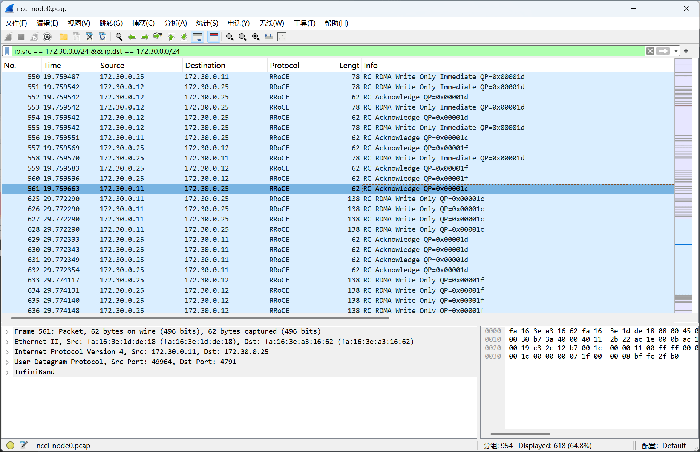
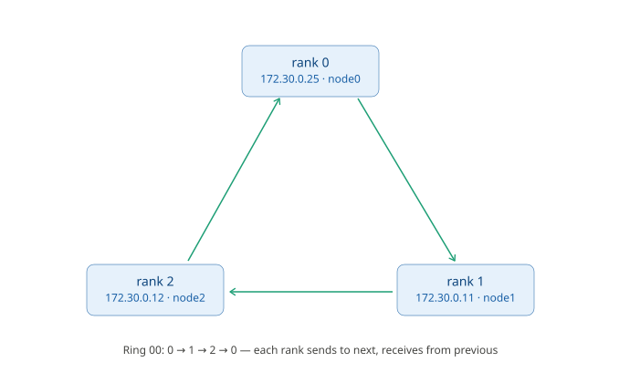
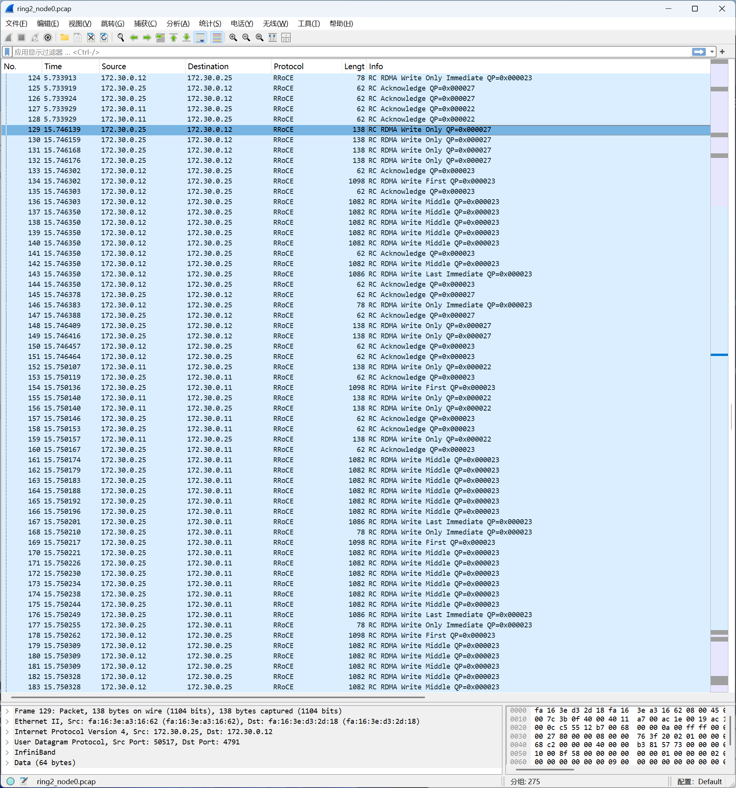
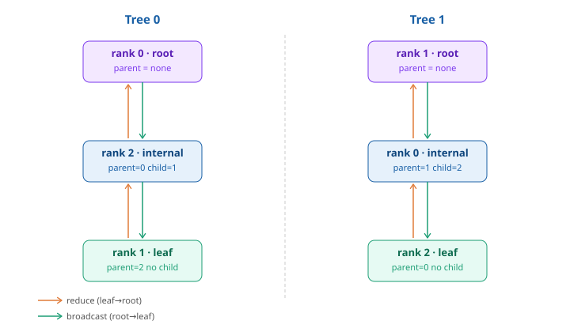

# Chapter 19: Seeing How NCCL Uses RDMA Through Packet Captures

Over the previous eighteen chapters, we took RDMA and InfiniBand apart into individual basic components: QP, MR, rkey, Send/Write/Read, out-of-band connection setup, SL/VL, routing, congestion control, and in-network computing. By now, it's time to reassemble these components back into a real machine and see how AllReduce, the most common collective communication operation in AI training, actually happens between three GPU servers.

One thing to note: this chapter is not a NCCL tutorial. Materials on the NCCL API are already very rich, and I believe that after mastering the RDMA and InfiniBand fundamentals from earlier, reading those materials will be much easier. So this chapter still keeps the focus on the network itself: we will, on a three-node GPU cluster, initiate an all_reduce operation via PyTorch and observe the NCCL traffic generated between nodes from a network perspective.

The lab environment uses three GPU servers I temporarily rented on JD Cloud, running RDMA communication via Soft-RoCE. The whole test took about an hour, with a total rental cost of around 100 RMB.

---

## 19.1 Lab Environment and Scripts

The experiment uses three single-GPU servers, placed in the same subnet, directly reachable to one another (permit ip any any):

| Role   | Host  | IP          |
| ------ | ----- | ----------- |
| rank 0 | node0 | 172.30.0.25 |
| rank 1 | node1 | 172.30.0.11 |
| rank 2 | node2 | 172.30.0.12 |

The hardware configuration and software stack of each server are identical:

- GPU: Tesla P40 ×1
- RDMA: Soft-RoCE, `rxe0` bound to `eth0`, GID index 1 (RoCE v2 over IPv4), MTU 1024
- Framework: PyTorch 2.4.1, NCCL 2.20.5
- [node0 environment](../pcap/nccl/env0.txt)
- [node1 environment](../pcap/nccl/env1.txt)
- [node2 environment](../pcap/nccl/env2.txt)

### Driver and Base Environment Preparation

```bash
# Install the driver (the P40 is on the Pascal platform, supporting at most 580)
apt update
apt install -y build-essential dkms linux-headers-$(uname -r)
apt install -y nvidia-driver-580
reboot

# After reconnecting, verify:
nvidia-smi          # should show 1 P40

# Prepare the python environment
apt install -y python3-venv python3-pip
python3 -m venv ~/venv && source ~/venv/bin/activate

# Install PyTorch 2.4.1 (the version supporting the Pascal platform)
pip install numpy "torch==2.4.1" -i https://mirrors.cloud.tencent.com/pypi/simple/

# Verify the GPU kernel can run:
python -c "import torch; print(torch.ones(10,device='cuda').sum().item())"   # should output 10.0

# Start Soft-RoCE
apt install -y rdma-core ibverbs-utils perftest tcpdump
modprobe rdma_rxe
rdma link add rxe0 type rxe netdev eth0

# Confirm rxe0 appears
ibv_devinfo
```

### Preparing the Test Script

The test script `test.py` does just one thing: three processes each occupy one GPU and do one AllReduce. But it is deliberately "stretched out" in time, to make it easy to distinguish the stages when capturing packets:

```python
import os, time, torch, torch.distributed as dist

# Initialize the process group, backend NCCL; automatically reads the env vars injected by torchrun and establishes a TCP connection
dist.init_process_group("nccl")
dev = int(os.environ["LOCAL_RANK"])      # read the local GPU number
torch.cuda.set_device(dev)
ws = dist.get_world_size()               # get the total number of processes

dist.barrier()                           # sync point: continue only after all three processes have arrived
time.sleep(10)                           # stay silent for 10 seconds, to make packet capture easier to observe

x = torch.ones(6 * 1024, device=f"cuda:{dev}")   # 6144 float32 = 24KB
dist.all_reduce(x)                       # sum, result broadcast back to all GPUs
torch.cuda.synchronize()

print(f"rank {dist.get_rank()}/{ws} ok val={x[0].item()} (expect {ws})")
time.sleep(20)                           # stay silent for another 20 seconds, to make packet capture easier to observe
dist.destroy_process_group()             # actively tear down the connection
```

## 19.2 Test One: Viewing the Complete Lifecycle of One AllReduce

### Starting the Test

First open three terminals and start tcpdump on the three machines respectively:

```bash
# Capture all packets on the interface except SSH
tcpdump -i eth0 '(udp port 4791) or (tcp and not port 22)' -w ~/nccl_$(hostname).pcap
```

Then open another three terminals to start the test:

```bash
# node0
source ~/venv/bin/activate

NCCL_IB_HCA=rxe0 NCCL_IB_GID_INDEX=1 NCCL_SOCKET_IFNAME=eth0 \
NCCL_ALGO=Ring NCCL_PROTO=Simple NCCL_MAX_NCHANNELS=1 NCCL_DEBUG=INFO \
torchrun --nnodes=3 --node_rank=0 --nproc_per_node=1 \
  --master_addr=172.30.0.25 --master_port=29500 ~/test.py 2>&1 | tee ~/nccl_$(hostname).log


# node1
source ~/venv/bin/activate

NCCL_IB_HCA=rxe0 NCCL_IB_GID_INDEX=1 NCCL_SOCKET_IFNAME=eth0 \
NCCL_ALGO=Ring NCCL_PROTO=Simple NCCL_MAX_NCHANNELS=1 NCCL_DEBUG=INFO \
torchrun --nnodes=3 --node_rank=1 --nproc_per_node=1 \
  --master_addr=172.30.0.25 --master_port=29500 ~/test.py 2>&1 | tee ~/nccl_$(hostname).log


# node2
source ~/venv/bin/activate

NCCL_IB_HCA=rxe0 NCCL_IB_GID_INDEX=1 NCCL_SOCKET_IFNAME=eth0 \
NCCL_ALGO=Ring NCCL_PROTO=Simple NCCL_MAX_NCHANNELS=1 NCCL_DEBUG=INFO \
torchrun --nnodes=3 --node_rank=2 --nproc_per_node=1 \
  --master_addr=172.30.0.25 --master_port=29500 ~/test.py 2>&1 | tee ~/nccl_$(hostname).log
```

The command consists of three parts: environment variables (NCCL tuning), `torchrun` startup parameters, and output redirection. Explained in groups below.

- NCCL environment variables (controlling the underlying behavior of collective communication)

https://docs.nvidia.com/deeplearning/nccl/user-guide/docs/env.html

| Parameter            | Value    | Meaning                                                                                                          |
| -------------------- | -------- | -------------------------------------------------------------------------------------------------------------- |
| `NCCL_IB_HCA`        | `rxe0`   | Specifies the RDMA device (HCA) to use. Here it's the Soft-RoCE virtual device `rxe0`, telling NCCL to take the IB verbs path rather than pure TCP |
| `NCCL_IB_GID_INDEX`  | `1`      | Specifies the RoCE GID (the GID for IPv4 over UDP)                                                              |
| `NCCL_SOCKET_IFNAME` | `eth0`   | The NIC NCCL's out-of-band communication (bootstrap, rendezvous, handshake) goes over. This is only for control-plane info exchange; the real data goes over `rxe0` |
| `NCCL_ALGO`          | `Ring`   | Force the use of the Ring algorithm for collective communication, disabling automatic selection of Tree/CollNet, etc. |
| `NCCL_PROTO`         | `Simple` | Force the use of the Simple protocol, disabling the low-latency LL/LL128 protocols. The Simple data path is the most straightforward, good for packet capture analysis |
| `NCCL_MAX_NCHANNELS` | `1`      | Limit to only 1 channel. By default NCCL opens multiple parallel rings to drain the bandwidth; setting it to 1 concentrates traffic on a single path, minimizing interference for packet capture and topology verification |
| `NCCL_DEBUG`         | `INFO`   | Turn on INFO-level logging                                                                                      |

- torchrun startup parameters (distributed process orchestration)

| Parameter          | Value         | Meaning                                                                          |
| ------------------ | ------------- | -------------------------------------------------------------------------------- |
| `--nnodes`         | `3`           | The total number of nodes in the cluster.                                       |
| `--node_rank`      | `0`/`1`/`2`   | This node's number in the cluster, determining the global rank offset. rank 0 simultaneously takes on the master role |
| `--nproc_per_node` | `1`           | Start 1 process per node (1 "GPU"). So `world_size = nnodes × nproc_per_node = 3` |
| `--master_addr`    | `172.30.0.25` | The rendezvous coordination address, i.e., node0's IP. All nodes connect to this address to complete the initial handshake |
| `--master_port`    | `29500`       | The rendezvous port                                                             |
| `~/test.py`        | —             | The actual training/test script to run                                          |

- Output redirection

| Fragment                | Meaning                              |
| ----------------------- | ------------------------------------ |
| `2>&1`                  | Merge stderr into stdout             |
| `tee ~/nccl_debugN.log` | Output to both the terminal and a log file |

---

### Test Results

[node 0 log](../pcap/nccl/nccl_node0.log)

[node 1 log](../pcap/nccl/nccl_node1.log)

[node 2 log](../pcap/nccl/nccl_node2.log)

[node 0 pcap](../pcap/nccl/nccl_node0.pcap)

[node 1 pcap](../pcap/nccl/nccl_node1.pcap)

[node 2 pcap](../pcap/nccl/nccl_node2.pcap)

This set of data captures all the TCP, allowing us to see the whole chain from NCCL "finding each other" to "starting to send RDMA."

### Overview of the Full-Process Timing

Open `nccl_node0.pcap` with Wireshark and enter the filter `ip.src == 172.30.0.0/24 && ip.dst == 172.30.0.0/24`. Laid out by time, the whole lifecycle can be divided into a few clearly delimited segments:

```
[1] TCP : rendezvous (port tcp 29500)
[2] TCP : NCCL bootstrap (a batch of temporary tcp ports)
[3] RDMA: a small cluster of udp 4791                  (triggered by barrier)

        …… sleep(10) silence ……

[4] RDMA: a large cluster of udp 4791                  ← the real data of AllReduce

        …… sleep(20) silence ……

[5] TCP : FIN/teardown                          ← destroy_process_group tears down
```

The next three sections will follow this timeline and look clearly at the three steps of connection setup, one by one.

### Connection Setup Step 1: PyTorch rendezvous (TCP 29500)

The first to appear is a TCP connection to port **29500**. This is PyTorch's **rendezvous** mechanism, whose underlying layer is a small key-value service called **TCPStore**:

- `--master_addr=172.30.0.25 --master_port=29500` specifies the rendezvous point, and rank 0 starts a TCPStore server on this port;
- rank 1 and rank 2 connect, and the three parties align basic information here.

What this step solves is "**processes finding each other**." It is still purely the world of PyTorch/TCP, unrelated to RDMA.

The purpose of this step is to obtain a **NCCL unique ID**, which is the "secret handshake" for NCCL's own subsequent connection setup. NCCL's real connection setup happens in the next step.

### Connection Setup Step 2: NCCL bootstrap (a batch of temporary TCP ports)

After obtaining the unique ID, **NCCL** establishes another round of TCP connections among the three nodes, with the source ports being a batch of random temporary ports (such as 55259, 56325, 54989...). This is **NCCL bootstrap**.

What it does is precisely the **out-of-band parameter exchange** discussed in Chapter 2: sending the information each rank needs to build its RDMA QP (**QPN, GID, rkey**, etc.) to everyone via these TCP connections. In other words, **all the "wiring parameters" of the RDMA connection are negotiated here over TCP**.

NCCL uses "**TCP out-of-band**" to establish connections, the same idea as perftest/pingpong. So in Wireshark, the payload of these bootstrap connections is an opaque blob of binary; we can see the connection establishment, the back-and-forth, and the timing, but can't decode the content. Compared with the RDMA CM capture in Chapter 6, the difference is obvious:

|                    | Vehicle                                | Standardized      | Can Wireshark decode |
| ------------------ | -------------------------------------- | ----------------- | -------------------- |
| **RDMA CM**        | Built into the RDMA network (MAD, CM over UDP 4791) | Yes, IBTA standard | Can decode field by field |
| **NCCL bootstrap** | Custom TCP, out-of-band                | No, NCCL private format | Can't see the field meanings |

### Connection Setup Step 3: QPs Come Up, RDMA Begins

Only after the bootstrap negotiation is done do the 4791 RDMA packets begin to appear.

To be able to observe an accurate communication flow, we designed a `barrier + sleep` in the test code:

```python
# ...
dist.barrier()
time.sleep(10)
x = torch.ones(6*1024, device=f"cuda:{dev}")
dist.all_reduce(x)
# ...
```

From the captured RDMA data, you can see an obvious time boundary, with a 10-second pause between second 19 and second 29:



dist.barrier() is a synchronization fence; all processes must execute up to this line before any process is released to continue downward. barrier itself is also a collective operation. NCCL implements it as a tiny, all-reduce-like communication, so it generates a small cluster of 4791 RDMA traffic.

In other words: the processes that arrive earlier will block and wait until the last process also reaches the barrier, and only then are all three released together. It itself transmits no user data; its only role is to "align progress."

Why add this barrier action in this test?

The three torchruns are typed manually, one after another in three terminals, and being a few seconds apart is normal. Without barrier, node0 might already be sleeping or even doing all_reduce while node2 is still doing init_process_group (connection setup). This would mess up the packet capture. barrier guarantees that all three processes have completed connection setup and gathered at the same point before entering the subsequent sleep(10) and all_reduce together; so the AllReduce data is clean both before and after, and can be cleanly separated from the preceding connection-setup traffic, making it easy for us to observe.

---

## 19.3 Test Two: An In-Depth Analysis of NCCL's RDMA

In this next test, let's take a more careful look at NCCL's RDMA, observing and comparing NCCL's network behavior when using different algorithms.

In the previous section's test, there was a NCCL config option `NCCL_ALGO=Ring`, which is the option that controls NCCL's algorithm. Normally NCCL automatically picks a suitable algorithm based on message size and scale (RING or TREE, etc.). Generally speaking, Ring has high bandwidth utilization and suits large messages; Tree has fewer hops, low latency, and suits small messages and large scale. In this section, let's observe and compare the differences in network behavior between the two algorithms.

### Starting the Test

- **The RING part**

First open three terminals and start tcpdump on the three machines respectively:

```bash
# Focus only on TCP 29500 and UDP 4791
tcpdump -i eth0 '(udp port 4791) or (tcp port 29500)' -w ~/ring2_$(hostname).pcap
```

Then open another three terminals to start the test:

```bash
# The NCCL log enables more detailed subsystems, printing the QP numbers and rkeys, making it easy to map packets to QPs
# node0
source ~/venv/bin/activate

NCCL_IB_HCA=rxe0 NCCL_IB_GID_INDEX=1 NCCL_SOCKET_IFNAME=eth0 \
NCCL_ALGO=Ring NCCL_PROTO=Simple NCCL_MAX_NCHANNELS=1 NCCL_DEBUG=INFO NCCL_DEBUG_SUBSYS=INIT,NET,GRAPH \
torchrun --nnodes=3 --node_rank=0 --nproc_per_node=1 \
  --master_addr=172.30.0.25 --master_port=29500 ~/test.py 2>&1 | tee ~/ring2_$(hostname).log


# node1
source ~/venv/bin/activate

NCCL_IB_HCA=rxe0 NCCL_IB_GID_INDEX=1 NCCL_SOCKET_IFNAME=eth0 \
NCCL_ALGO=Ring NCCL_PROTO=Simple NCCL_MAX_NCHANNELS=1 NCCL_DEBUG=INFO NCCL_DEBUG_SUBSYS=INIT,NET,GRAPH \
torchrun --nnodes=3 --node_rank=1 --nproc_per_node=1 \
  --master_addr=172.30.0.25 --master_port=29500 ~/test.py 2>&1 | tee ~/ring2_$(hostname).log


# node2
source ~/venv/bin/activate

NCCL_IB_HCA=rxe0 NCCL_IB_GID_INDEX=1 NCCL_SOCKET_IFNAME=eth0 \
NCCL_ALGO=Ring NCCL_PROTO=Simple NCCL_MAX_NCHANNELS=1 NCCL_DEBUG=INFO NCCL_DEBUG_SUBSYS=INIT,NET,GRAPH \
torchrun --nnodes=3 --node_rank=2 --nproc_per_node=1 \
  --master_addr=172.30.0.25 --master_port=29500 ~/test.py 2>&1 | tee ~/ring2_$(hostname).log
```

- **The TREE part**

First open three terminals and start tcpdump on the three machines respectively:

```bash
# Focus only on TCP 29500 and UDP 4791
tcpdump -i eth0 '(udp port 4791) or (tcp port 29500)' -w ~/tree2_$(hostname).pcap
```

Then open another three terminals to start the test:

```bash
# The NCCL log enables more detailed subsystems, printing the QP numbers and rkeys, making it easy to map packets to QPs
# node0
source ~/venv/bin/activate

NCCL_IB_HCA=rxe0 NCCL_IB_GID_INDEX=1 NCCL_SOCKET_IFNAME=eth0 \
NCCL_ALGO=Tree NCCL_PROTO=Simple NCCL_MAX_NCHANNELS=1 NCCL_DEBUG=INFO NCCL_DEBUG_SUBSYS=INIT,NET,GRAPH \
torchrun --nnodes=3 --node_rank=0 --nproc_per_node=1 \
  --master_addr=172.30.0.25 --master_port=29500 ~/test.py 2>&1 | tee ~/tree2_$(hostname).log


# node1
source ~/venv/bin/activate

NCCL_IB_HCA=rxe0 NCCL_IB_GID_INDEX=1 NCCL_SOCKET_IFNAME=eth0 \
NCCL_ALGO=Tree NCCL_PROTO=Simple NCCL_MAX_NCHANNELS=1 NCCL_DEBUG=INFO NCCL_DEBUG_SUBSYS=INIT,NET,GRAPH \
torchrun --nnodes=3 --node_rank=1 --nproc_per_node=1 \
  --master_addr=172.30.0.25 --master_port=29500 ~/test.py 2>&1 | tee ~/tree2_$(hostname).log


# node2
source ~/venv/bin/activate

NCCL_IB_HCA=rxe0 NCCL_IB_GID_INDEX=1 NCCL_SOCKET_IFNAME=eth0 \
NCCL_ALGO=Tree NCCL_PROTO=Simple NCCL_MAX_NCHANNELS=1 NCCL_DEBUG=INFO NCCL_DEBUG_SUBSYS=INIT,NET,GRAPH \
torchrun --nnodes=3 --node_rank=2 --nproc_per_node=1 \
  --master_addr=172.30.0.25 --master_port=29500 ~/test.py 2>&1 | tee ~/tree2_$(hostname).log
```

The results are as follows:

[nccl result](../pcap/nccl/)

### NCCL Uses RDMA Write

First, observe a fairly obvious phenomenon: the data transport of NCCL captured this time relies on the one-sided **RDMA Write**.

Why Write and not Read? Because Write is "push": after the sender computes a block of data, it directly writes it into the receive buffer the peer has already registered, a single one-way trip, with no need to wait for the peer's response and come back. Read is "pull," requiring an extra network round trip. In a pipeline like AllReduce, where "once I'm done computing, push to the next as soon as possible," Write's one-way semantics are a natural fit.

### Seeing the Initialization Process Through the Log

Below is an excerpt of node0's key log in the RING test part:

```bash
# Phase 1: Bootstrap, pure TCP control plane
node0:4744:4744 [0] NCCL INFO NCCL_SOCKET_IFNAME set to eth0
node0:4744:4744 [0] NCCL INFO Bootstrap : Using eth0:172.30.0.25<0>

# Phase 2: Select the NIC
node0:4744:4763 [0] NCCL INFO NCCL_IB_HCA set to rxe0
node0:4744:4763 [0] NCCL INFO NET/IB : Using [0]rxe0:1/RoCE [RO]; OOB eth0:172.30.0.25<0>
node0:4744:4763 [0] NCCL INFO Using non-device net plugin version 0
node0:4744:4763 [0] NCCL INFO Using network IB

# Phase 3: Topology probing
node0:4744:4763 [0] NCCL INFO comm 0x43dc13b0 rank 0 nranks 3 cudaDev 0 nvmlDev 0 busId 80 commId 0x1f82f8f6b7863cd3 - Init START
# rxe doesn't support GDR, so data has to go GPU→host memory→NIC; between GPU and NET it's marked PHB (crossing the PCI host bridge)
node0:4744:4763 [0] NCCL INFO NET/IB : GPU Direct RDMA Disabled for HCA 0 'rxe0'
# The NET link is estimated at ≈0.3125 GB/s (≈2.5 Gbps, the speed of the Soft-RoCE software path)
node0:4744:4763 [0] NCCL INFO === System : maxBw 0.3 totalBw 12.0 ===
node0:4744:4763 [0] NCCL INFO CPU/FFFFFFFFFFFFFFFF (1/1/1)
node0:4744:4763 [0] NCCL INFO + PCI[5000.0] - NIC/0
node0:4744:4763 [0] NCCL INFO                 + NET[0.3] - NET/0 (6216a3feff3e16f8/1/0.312500)
node0:4744:4763 [0] NCCL INFO + PCI[12.0] - GPU/80 (0)
node0:4744:4763 [0] NCCL INFO ==========================================
node0:4744:4763 [0] NCCL INFO GPU/80 :GPU/80 (0/5000.000000/LOC) CPU/FFFFFFFFFFFFFFFF (1/12.000000/PHB) NET/0 (3/0.312500/PHB)
node0:4744:4763 [0] NCCL INFO NET/0 :GPU/80 (3/0.312500/PHB) CPU/FFFFFFFFFFFFFFFF (2/0.312500/PHB) NET/0 (0/5000.000000/LOC)

# Phase 4: Compute the logical topology
# Pattern 4 is ring search, Pattern 3 is tree search; both ring and tree are computed, though only ring is actually used this time
node0:4744:4763 [0] NCCL INFO Pattern 4, crossNic 0, nChannels 1, bw 0.240000/0.240000, type LOC/PHB, sameChannels 1
# Within a node: net in → GPU compute → net out
node0:4744:4763 [0] NCCL INFO  0 : NET/0 GPU/0 NET/0
node0:4744:4763 [0] NCCL INFO Pattern 3, crossNic 0, nChannels 1, bw 1.200000/0.240000, type LOC/PHB, sameChannels 1
node0:4744:4763 [0] NCCL INFO  0 : NET/0 GPU/0 NET/0
node0:4744:4763 [0] NCCL INFO comm 0x43dc13b0 rank 0 nRanks 3 nNodes 3 localRanks 1 localRank 0 MNNVL 0
node0:4744:4763 [0] NCCL INFO Tree 0 : -1 -> 0 -> 2/-1/-1
node0:4744:4763 [0] NCCL INFO Tree 1 : 1 -> 0 -> 2/-1/-1
node0:4744:4763 [0] NCCL INFO Channel 00/01 :    0   1   2
node0:4744:4763 [0] NCCL INFO Ring 00 : 2 -> 0 -> 1
node0:4744:4763 [0] NCCL INFO Trees [0] 2/-1/-1->0->-1
node0:4744:4763 [0] NCCL INFO P2P Chunksize set to 131072

# Phase 5: Set up connections (proxy + RC QP)
# Transport type: 0 = P2P (intra-node, direct NVLink / PCIe peer-to-peer),
# 1 = SHM (intra-node, shared memory),
# 2 = NET (inter-node, over the NIC)
# Ring 00 : 2 -> 0 -> 1
node0:4744:4765 [0] NCCL INFO New proxy recv connection 0 from local rank 0, transport 2
node0:4744:4763 [0] NCCL INFO Connected to proxy localRank 0 -> connection 0x73576c004fb0
node0:4744:4763 [0] NCCL INFO Channel 00/0 : 2[0] -> 0[0] [receive] via NET/IB/0
node0:4744:4765 [0] NCCL INFO New proxy send connection 1 from local rank 0, transport 2
node0:4744:4763 [0] NCCL INFO Connected to proxy localRank 0 -> connection 0x73576c005028
node0:4744:4763 [0] NCCL INFO Channel 00/0 : 0[0] -> 1[0] [send] via NET/IB/0
node0:4744:4765 [0] NCCL INFO NET/IB: NCCL Dev 0 IbDev 0 Port 1 qpn 34 mtu 3 query_ece={supported=0, vendor_id=0x0, options=0x0, comp_mask=0x0} GID 1 (0/19001EACFFFF0000) fifoRkey=0x4fd5 fifoLkey=0x4fd5
node0:4744:4765 [0] NCCL INFO NET/IB: IbDev 0 Port 1 qpn 35 set_ece={supported=0, vendor_id=0x76ce, options=0x0, comp_mask=0x0}
node0:4744:4763 [0] NCCL INFO Connected all rings   # ring connections ready
node0:4744:4765 [0] NCCL INFO New proxy send connection 2 from local rank 0, transport 2
node0:4744:4763 [0] NCCL INFO Connected to proxy localRank 0 -> connection 0x73576c0050a0
node0:4744:4763 [0] NCCL INFO Channel 00/0 : 0[0] -> 2[0] [send] via NET/IB/0
node0:4744:4765 [0] NCCL INFO NET/IB: NCCL Dev 0 IbDev 0 Port 1 qpn 36 mtu 3 query_ece={supported=0, vendor_id=0x0, options=0x0, comp_mask=0x0} GID 1 (0/19001EACFFFF0000) fifoRkey=0x59b1 fifoLkey=0x59b1
node0:4744:4765 [0] NCCL INFO Call to ibv_set_ece failed with error Operation not supported errno 95
node0:4744:4765 [0] NCCL INFO NET/IB: IbDev 0 Port 1 qpn 42 set_ece={supported=0, vendor_id=0x763f, options=0x20046360, comp_mask=0x763f}
node0:4744:4763 [0] NCCL INFO Connected all trees   # tree connections ready
# The thread thresholds for algorithm-protocol combinations are tuning constants at kernel launch
# Tree(LL/LL128/Simple) | Ring(LL/LL128/Simple) | CollNet | NVLS
#      8 / 8 / 64       |      24 / 8 / 64      |  512    |  512
node0:4744:4763 [0] NCCL INFO threadThresholds 8/8/64 | 24/8/64 | 512 | 512
# 1 coll channels: NCCL_MAX_NCHANNELS=1
node0:4744:4763 [0] NCCL INFO 1 coll channels, 0 collnet channels, 0 nvls channels, 1 p2p channels, 1 p2p channels per peer
node0:4744:4765 [0] NCCL INFO New proxy send connection 3 from local rank 0, transport 2
node0:4744:4763 [0] NCCL INFO Connected to proxy localRank 0 -> connection 0x73576c005118
node0:4744:4763 [0] NCCL INFO comm 0x43dc13b0 rank 0 nranks 3 cudaDev 0 nvmlDev 0 busId 80 commId 0x1f82f8f6b7863cd3 - Init COMPLETE
# Summary:
# conn 0 — recv ← rank2, the ring's predecessor receive (receive from the previous rank);
#          also reused by the tree (in the tree rank0 is the root, needing to "receive from child rank2" to reduce; same peer as the ring's receive from rank2, sharing one connection)
# conn 1 — send → rank1, the ring's successor send (send to the next rank)
# conn 2 — send → rank2, the tree's "root→child" send (broadcast phase)
# conn 3 — send, p2p channel, point-to-point reserved


# Phase 6: Complete → run the test → exit
rank 0/3 ok val=3.0 (expect 3)

node0:4744:4765 [0] NCCL INFO [Service thread] Connection closed by localRank 0
node0:4744:4770 [0] NCCL INFO comm 0x43dc13b0 rank 0 nranks 3 cudaDev 0 busId 80 - Abort COMPLETE
```

### What Ring AllReduce Looks Like at the Network Level

We fixed the ring algorithm with `NCCL_ALGO=Ring`, and the log confirms the shape of the ring:



Take `ring2_node0.pcap` as an example; opening it with Wireshark, you can see that the RDMA Write packets starting from second 15 seem somewhat different from what we imagined (node 0 has write actions to both node 1 and node 2, whereas by expectation node 0 should only write to node 1):



This is because: besides the real AllReduce data flow, NCCL also generates a small amount of reverse, small RDMA Writes. These packets are usually only tens to a hundred-plus bytes and don't carry tensor data; instead they are used to update FIFO state, FIFO credit, sync step, and other control information. After filtering out these control packets, the entire AllReduce data path presents a very clean unidirectional Ring.

To see this RING clearly, we must separate the data packets from the control packets, and we directly use the command-line version of tshark to filter.

> NCCL's data chunks are on the order of KB, while RDMA's control packets and Ack packets are all very small. So by simply cutting at frame length 200, what remains is the real data Write.

```bash
ib_tutorial\pcap\nccl
❯ tshark -r ring2_node0.pcap -Y "udp.port==4791 && frame.len > 200" -T fields -e ip.src -e ip.dst -e frame.len | sort | uniq -c
     24 172.30.0.12     172.30.0.25     1082
      4 172.30.0.12     172.30.0.25     1086
      4 172.30.0.12     172.30.0.25     1098
     24 172.30.0.25     172.30.0.11     1082
      4 172.30.0.25     172.30.0.11     1086
      4 172.30.0.25     172.30.0.11     1098

ib_tutorial\pcap\nccl
❯ tshark -r ring2_node1.pcap -Y "udp.port==4791 && frame.len > 200" -T fields -e ip.src -e ip.dst -e frame.len | sort | uniq -c
     24 172.30.0.11     172.30.0.12     1082
      4 172.30.0.11     172.30.0.12     1086
      4 172.30.0.11     172.30.0.12     1098
     24 172.30.0.25     172.30.0.11     1082
      4 172.30.0.25     172.30.0.11     1086
      4 172.30.0.25     172.30.0.11     1098

ib_tutorial\pcap\nccl
❯ tshark -r ring2_node2.pcap -Y "udp.port==4791 && frame.len > 200" -T fields -e ip.src -e ip.dst -e frame.len | sort | uniq -c
     24 172.30.0.11     172.30.0.12     1082
      4 172.30.0.11     172.30.0.12     1086
      4 172.30.0.11     172.30.0.12     1098
     24 172.30.0.12     172.30.0.25     1082
      4 172.30.0.12     172.30.0.25     1086
      4 172.30.0.12     172.30.0.25     1098
```

The result obtained this way is a clean **unidirectional ring**:

| Link          | src → dst                 | Direction |
| ------------- | ------------------------- | --------- |
| rank0 → rank1 | 172.30.0.25 → 172.30.0.11 | clockwise |
| rank1 → rank2 | 172.30.0.11 → 172.30.0.12 | clockwise |
| rank2 → rank0 | 172.30.0.12 → 172.30.0.25 | clockwise |

Each node **only sends to the next neighbor and only receives from the previous neighbor**, connecting end to end into a ring. This is the essence of ring AllReduce: the communication volume is O(N), and each node deals with only two neighbors rather than all-to-all.

The ring is "flattened": there is no center, no one is busier, and every node has the same load.

### NCCL's Credit

The previous section mentioned a term: NCCL FIFO Credit. Reading this, you may find it strange: isn't IB's credit mechanism at the link layer? Why does NCCL also manage Credit?

The answer is: although IB's Credit and NCCL's FIFO Credit have the same name, they solve two completely different problems.

IB's Credit works at the link layer, and what it protects is the receive Buffer of the switch and the HCA. The sender can only continue sending new data when it confirms the peer still has free Buffer. So the question IB Credit actually answers is: **is there still room in the network to put a packet.** Its existence guarantees that the InfiniBand Fabric can achieve lossless transmission—even if the network gets congested, it won't directly drop packets just because the Buffer is filled.

But for an AllReduce, the network not dropping packets is far from enough.

When a node performs an RDMA Write, the data is ultimately written directly into the receive FIFO in the peer GPU's memory. The size of this FIFO is limited; you can think of it as a ring buffer: the sender continuously writes new chunks into it, while the receiver continuously takes data out of it and hands it to the GPU Kernel for the reduce computation. If the receiver processes relatively slowly, all FIFO entries may be occupied. At this point, the network may still be very idle, and IB's Credit may still be ample, but the sender can no longer continue sending, because continuing the RDMA Write would overwrite data that hasn't yet been consumed.

Therefore, **NCCL implements its own flow-control mechanism at the application layer: FIFO Credit**.

Whenever the receiver finishes consuming a FIFO entry, it writes the latest FIFO state back to the sender via a very small RDMA Write, telling it how many entries have been freed and that it can continue sending new chunks. These write-back packets are usually only tens of bytes—precisely those reverse small packets we saw in the capture. They carry no tensor data and are only responsible for syncing the FIFO's state, so they often mix in with the real data flow, giving the impression that the Ring has a "counterflow."

In spirit, NCCL's FIFO Credit is very similar to TCP's Window. TCP's window tells the sender: how many more bytes my Socket Buffer can receive; while NCCL's Credit tells the sender: how many free entries my GPU receive FIFO has left. Both are flow-control mechanisms in a producer-consumer model, just protecting different objects.

So we can put NCCL FIFO Credit alongside IB Credit and TCP Window for comparison:

- IB Credit guarantees the network won't drop packets;
- TCP Window guarantees the receiver's Socket won't be overrun;
- NCCL FIFO Credit guarantees the GPU's receive FIFO won't be overrun.

In a pure IB network, IB Credit and NCCL FIFO Credit each work at a different layer, together ensuring that an AllReduce can run stably and efficiently.

### Comparison: Tree AllReduce

Finally, let's look at the data of Tree AllReduce. First, from the three logs, extract each rank's position in the two trees:

| rank | Tree 0             | Tree 1             |
| ---- | ------------------ | ------------------ |
| 0    | `-1 → 0 → 2/-1/-1` | `1 → 0 → 2/-1/-1`  |
| 1    | `2 → 1 → -1/-1/-1` | `-1 → 1 → 0/-1/-1` |
| 2    | `0 → 2 → 1/-1/-1`  | `0 → 2 → -1/-1/-1` |

> **Note**: NCCL's tree log format - Tree N : <parent> -> <self> -> <child0>/<child1>/<child2>
>
> -1 means "no corresponding rank"; appearing in the parent position means "I am the root," and appearing in a children position means "this child slot is empty"

- **Both trees are degenerate chains**: 3 ranks can't support a real binary tree, so they can only degenerate into a line: Tree 0 is `0→2→1`, Tree 1 is `1→0→2`.

- **Root and leaf swap in the two trees**: This is a double binary tree. The problem with a single tree is that leaf nodes only take on half the communication (only receive without sending, or only send without receiving), underutilizing the links; NCCL constructs two "role-complementary" trees simultaneously, letting each rank be an internal node in one and a leaf in the other (ideally), with each tree running half the data, so the bandwidth is flattened out.

Translated into a topology diagram:



In our test code, because we only did one allreduce, set `NCCL_MAX_NCHANNELS=1`, and the test data volume was fairly small, from the capture the data was completely squeezed onto tree 0, which is normal. In a normal production environment, traffic would run in parallel on the two trees to flatten the bandwidth.

Using the same method to filter with tshark, the statistics of the data Writes are as follows:

```bash
ib_tutorial\pcap\nccl
❯ tshark -r tree2_node0.pcap -Y "udp.port==4791 && frame.len > 200" -T fields -e ip.src -e ip.dst -e frame.len | sort | uniq -c
     22 172.30.0.12     172.30.0.25     1082
      1 172.30.0.12     172.30.0.25     1086
      1 172.30.0.12     172.30.0.25     1098
     22 172.30.0.25     172.30.0.12     1082
      1 172.30.0.25     172.30.0.12     1086
      1 172.30.0.25     172.30.0.12     1098

ib_tutorial\pcap\nccl
❯ tshark -r tree2_node1.pcap -Y "udp.port==4791 && frame.len > 200" -T fields -e ip.src -e ip.dst -e frame.len | sort | uniq -c
     22 172.30.0.11     172.30.0.12     1082
      1 172.30.0.11     172.30.0.12     1086
      1 172.30.0.11     172.30.0.12     1098
     22 172.30.0.12     172.30.0.11     1082
      1 172.30.0.12     172.30.0.11     1086
      1 172.30.0.12     172.30.0.11     1098

ib_tutorial\pcap\nccl
❯ tshark -r tree2_node2.pcap -Y "udp.port==4791 && frame.len > 200" -T fields -e ip.src -e ip.dst -e frame.len | sort | uniq -c
     22 172.30.0.11     172.30.0.12     1082
      1 172.30.0.11     172.30.0.12     1086
      1 172.30.0.11     172.30.0.12     1098
     22 172.30.0.12     172.30.0.11     1082
      1 172.30.0.12     172.30.0.11     1086
      1 172.30.0.12     172.30.0.11     1098
     22 172.30.0.12     172.30.0.25     1082
      1 172.30.0.12     172.30.0.25     1086
      1 172.30.0.12     172.30.0.25     1098
     22 172.30.0.25     172.30.0.12     1082
      1 172.30.0.25     172.30.0.12     1086
      1 172.30.0.25     172.30.0.12     1098
```

The picture obtained from the analysis above is **completely different** from RING:

| Link          | Direction          |
| ------------- | ------------------ |
| rank0 ↔ rank2 | bidirectional      |
| rank1 ↔ rank2 | bidirectional      |
| rank0 ↔ rank1 | **no direct communication** |

In Tree 0, **rank2 is the central hub**: it communicates bidirectionally with rank0 and rank1 respectively (uplink does reduce to aggregate data to the tree root, downlink sends the result back), while rank0 and rank1 don't talk directly at all.

## 19.4 GDR (GPU Direct RDMA)

Finally, let's explain a special warning log in this lab environment. All three logs have this line:

```bash
NET/IB : GPU Direct RDMA Disabled for HCA 0 'rxe0'
```

To understand it, first look at the two paths by which the NIC gets data from GPU memory:

- **Without GDR**: the data is first copied **from GPU memory to host memory**, then the NIC sends it out from host memory. One extra copy, going through the CPU/PCIe.
- **With GDR**: the NIC, via PCIe, **directly reads and writes GPU memory peer-to-peer**, without going through host memory at all. This is the "bypass the CPU, straight to GPU memory" that real AI training pursues.

Why don't we have GDR? Because we use **Soft-RoCE (rxe)**, which runs in the kernel and assembles packets in host memory, and there simply is no physical path of "the NIC's hardware DMA engine directly connecting to the GPU." So the `Disabled` in the log is inevitable, and NCCL automatically falls back to CPU relay.

---

## 19.5 This Is a Microscope, Not Real Traffic

Looking back at what we did: we shrank the test data to 24KB, fixed the algorithm to a single RING/TREE, reduced the operation to just once, and stretched out 10/20 seconds of silence before and after, only then obtaining a capture that can be counted packet by packet.

Here, I must emphasize: **the traffic of real AI training simply cannot be viewed this way**.

- Tensors are GB-scale, not 24KB;
- Multi-channel parallelism, multi-QP, even multi-NIC multi-rail;
- Computation and communication continuously overlap, with AllReduce rounds running one after another nonstop;
- Packets are in the millions or tens of millions, and Wireshark freezes the moment you open them.

A real environment can only look at aggregate metrics (bandwidth, counters, latency), not individual packets. And this experiment of ours, deliberately shrunk to the minimum, is essentially a **microscope plus slow motion**: it takes that fleeting communication structure in real training—the one masked by parallelism—and pulls it out alone, slows it down, magnifies it, and lets you see its skeleton clearly.

The key is: **the skeleton is unchanged**. Real training is nothing more than the same set of things seen here (QP connection setup, RDMA Write, RING or TREE), **magnified, parallelized, and repeated nonstop**. Once you understand this clean small version, you understand the mechanism of the large version.

This is roughly what the technology of RDMA and InfiniBand ultimately looks like as it's used in AI training.
