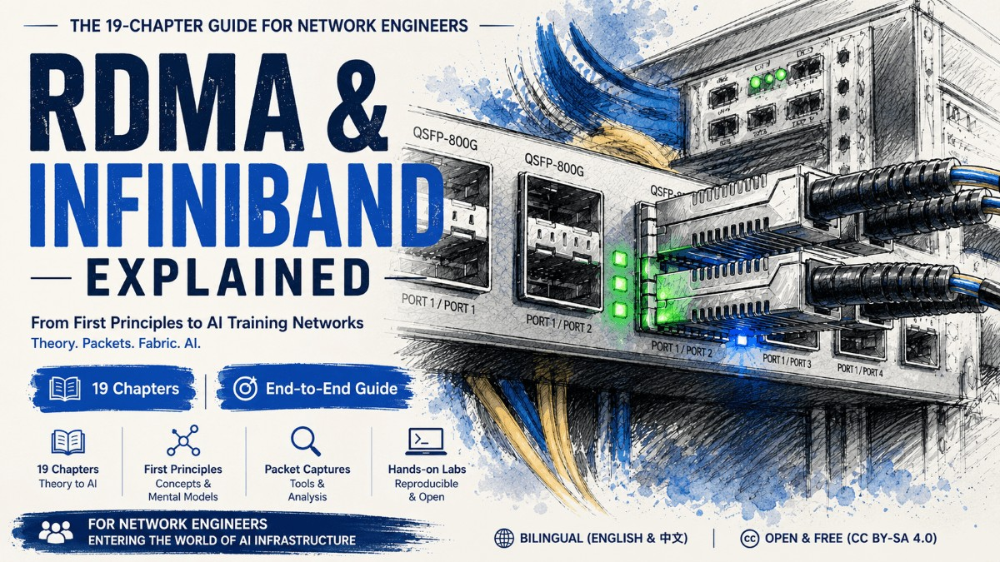

> 中文版本：[readme.md](./README.md)

# A Deep Dive into RDMA and InfiniBand Networking

If the data centers of the past decade belonged to cloud computing, then the data centers of the next decade will very likely belong to AI.

And in discussions of AI infrastructure, two names almost always come up again and again: RDMA and InfiniBand.

Training large models requires thousands of GPUs working in concert, with data transferred between nodes at extremely low latency and extremely high throughput. At this point, the network is no longer merely the infrastructure connecting servers, but has become a key component determining the system's scalability and computational efficiency. For the first time, the cost of moving data has become as important as computation itself.

It is precisely against this backdrop that RDMA and InfiniBand have gradually moved from the field of high-performance computing toward center stage, becoming core technologies that cannot be bypassed in AI Networking, distributed storage, and modern data center design.

However, for most network engineers, the truly difficult problem is not memorizing these new terms, but understanding why they exist in the way they do. Because many of the principles they follow do not belong to the same system of thinking as the TCP/IP world we are familiar with.

So, the greatest difficulty in learning RDMA and InfiniBand has never been mastering new commands and new protocols, but temporarily setting aside old assumptions and rebuilding a mental model for understanding high-performance networks.

---

## Why Write This Guide

When I started writing this guide, there was no grand plan.

Its starting point was merely some scattered notes and thoughts I made while preparing for the NCP-AIN (NVIDIA Certified Professional AI Networking) certification. To truly understand the system of InfiniBand, RDMA, and RoCE, I had to reorganize and repeatedly ponder knowledge scattered across white papers, technical documents, and conference materials, and try to fit it into a self-consistent cognitive framework.

Over these years, with the development of AI infrastructure and high-performance computing, concepts such as RDMA, InfiniBand, RoCE, QP, RC, and LID have appeared more and more frequently in technical discussions, architecture design, and job interviews. For many traditional network engineers, these terms are not unfamiliar, and they can even define them one by one; but once they need to be combined into a complete system, people often feel at a loss.

This confusion is not because there are too many knowledge points, nor because the technology itself is too profound, but because they are built on a design logic completely different from TCP/IP.

For a long time, the networking concepts we have accepted have mostly been built on the experience of Ethernet and TCP/IP. We are used to understanding the network according to the OSI layered model, used to viewing the communication process as the layer-by-layer progression of encapsulation and decapsulation, and used to accepting the basic assumption that "the network is only responsible for best-effort delivery, and reliability is left to upper-layer protocols."

However, the world of RDMA and InfiniBand is not built on this system.

Here, the network is no longer merely a channel that best-effort forwards data, but is endowed with more deterministic responsibilities; many capabilities that rely on software compensation in the TCP/IP world are pushed directly down to the network and hardware level. So when traditional network engineers first encounter these technologies, they often experience a strong sense of discomfort: many of the principles they are familiar with seem to suddenly fail, their original cognitive framework keeps running into exceptions, and they even fall into a kind of dilemma where "every step is understandable, but put together it's completely incomprehensible."

This experience is not unfamiliar to me.

In those years working in the storage networking (SAN) field, I witnessed similar processes many times. Whether it was Fibre Channel, or the various storage protocols later built on lossless/lossy networks, they mostly follow a design philosophy different from traditional TCP/IP networks. Many experienced network engineers, after entering the SAN field, go through a cognitive reconstruction.

Therefore, I increasingly feel that the key to the problem is not the lack of a document introducing RDMA or InfiniBand, but the lack of an "intermediate model" connecting the two worlds.

Without such a model, concepts like the Verbs API, the QP state machine, P_Key, LID, Credit, and VL can only become scattered knowledge points; but once this model is established, many seemingly complex and even counterintuitive mechanisms become perfectly natural.

Based on this consideration, this guide does not intend to start with the RDMA API, commands, and parameter tables, but tries to reorganize this knowledge along a path of thinking more familiar to network engineers:

- First answer: why does such a system exist;
- Then answer: what exactly does it look like on the network;
- Finally answer: how do InfiniBand and RDMA actually work.

If you are already familiar with switches, routers, VLANs, and the TCP/IP stack, yet still feel confused about the following questions:

- Why can RDMA bypass the CPU;
- Why must RoCE depend on a lossless network;
- What is the essential difference between InfiniBand and Ethernet;

then the work this guide hopes to accomplish is precisely to help you build that long-missing "intermediate model," thereby reconnecting these seemingly isolated concepts into a complete system.

---

## Preface

**[Preface: The Historical Cycle of AI Networking](EN/00_preface_AI_Networking.md)**
An essay that, through the battle between Ethernet and ATM thirty years ago, looks back at today's AI networking evolution along its two main story lines: Scale-up (NVLink / NVSwitch / UALink) and Scale-out. It is not prerequisite knowledge for reading the main text, but provides a historical backdrop for the entire document.

---

## Part One — Principles: The Origins of RDMA

This part touches no hardware or commands; it only makes clear what RDMA is, why it's needed, and what concepts its world is made of.

**[Chapter 1: RDMA Fundamentals](EN/01_rdma_basic.md)**
Starting from the cost of kernel space and user space, it looks at how many switches and copies an ordinary Socket send/receive goes through, then how DPDK kicks the kernel out of the data path, and how RDMA frees the CPU completely. The second half builds RDMA's conceptual framework: the three transport types (RC / UC / UD), the Verbs programming interface, the terminology of MR, QP, WQE, and CQ, the essential difference between one-sided and two-sided communication, and the four basic operations: Send / Write / Read / Atomic.

**[Chapter 2: RDMA Connection Management](EN/02_rdma_cm.md)**
Before RDMA communication, the two parties must first exchange parameters such as QPN, GID/LID, PSN, memory address, and rkey. This chapter makes clear which information to exchange and why, as well as the two mainstream solutions: the **out-of-band approach** using a TCP handshake, and the **in-band approach (RDMA CM)** built into the RDMA network.

---

## Part Two — Seeing Through RDMA with tcpdump Packet Captures

This part builds a pure-software environment that can run RDMA Verbs, then uses `tcpdump` to capture the packets, looking tool by tool and operation by operation at what RDMA actually looks like on the wire.

**[Chapter 3: Introduction to Soft-RoCE (RXE)](EN/03_soft-roce.md)**
Soft-RoCE is a pure-software implementation of the RoCEv2 protocol stack that runs on ordinary Ethernet NICs without any RDMA hardware. This chapter introduces its origins, its position in the protocol stack, and the various RDMA testing tools that come with Linux.

**[Chapter 4: Packet Capture Analysis of the perftest Tool](EN/04_rdma_ib_perftest_pcap.md)**
Use performance testing tools such as `ib_write_bw` / `ib_read_bw` / `ib_send_bw` to initiate real traffic, and capture packets to observe the respective packet forms of RDMA Write, Read, and Send.

**[Chapter 5: Packet Capture Analysis of pingpong](EN/05_rdma_pingpong_pcap.md)**
`ibv_rc_pingpong` / `ibv_uc_pingpong` / `ibv_ud_pingpong` are the minimal examples bundled with libibverbs. By comparing the captures of the three, intuitively see the differences among the RC, UC, and UD transport types in connection, reliability, and packets.

**[Chapter 6: Packet Capture Analysis of RDMA CM](EN/06_rdma_cm.md)**
The RDMA Connection Manager is a standardized connection management library. This chapter captures packets to see how RDMA CM uses CM over UDP (port 4791) to complete the handshake and establish an RDMA communication connection.

**[Chapter 7: Packet Capture Analysis of rping](EN/07_rdma_rping.md)**
rping is the `ping` of the RDMA world, specifically verifying rdma_cm connectivity; it strings connection management and data send/receive into one complete, observable end-to-end communication.

---

## Part Three — InfiniBand: RDMA's Native Network

The RDMA semantics were originally designed for InfiniBand, so RoCE is the port and IB is the original. Only by understanding the original can you truly grasp what those RoCE lossless-network tunings are actually patching.

**[Chapter 8: InfiniBand Fundamentals](EN/08_infiniband_basic.md)**
Why specifically learn an "older" IB that most people don't have hardware for? Because it is vertically integrated from the physical layer to the transport layer, born specifically for RDMA. This chapter thoroughly explains the fundamental differences between IB and Ethernet: inherently lossless vs. best-effort, centralized management (the Subnet Manager) vs. distributed autonomy, link-layer LID addressing vs. IP addressing, and clears up a pile of IB-specific terms.

**[Chapter 9: Setting Up the InfiniBand Lab Environment](EN/09_infiniband_lab.md)**
How do you get hands-on without real IB hardware? This chapter uses **ibsim** (a fabric simulator) + **OpenSM** (the Subnet Manager), intercepting MAD calls via `LD_PRELOAD`, to build a complete and playable IB lab environment, laying the groundwork for the subsequent chapters.

**[Chapter 10: The InfiniBand Protocol Stack](EN/10_infiniband_arch.md)**
Walk through IB layer by layer: what the link layer (LRH, flow control, QoS), the network layer (GRH, cross-subnet routing), and the transport layer (BTH, QP semantics) each do, which header they add to the packet, and who handles it. After reading, look at a complete IB packet and you'll be able to point at every field and tell its origin.

**[Chapter 11: InfiniBand Fabric Initialization](EN/11_infiniband_Fabric_init.md)**
From "cables plugged in" to "able to communicate," it's OpenSM doing the work in between. This chapter uses ibsim + OpenSM to slow down the process that completes automatically within a second or two after power-on, seeing clearly the SM's complete loop of "discover topology → number → compute routes → push down → continuously monitor."

**[Chapter 12: The InfiniBand Fabric Routing Engine](EN/12_infiniband_Fabric_re.md)**
The same physical topology, fed to different routing engines, produces different forwarding tables (LFTs). This chapter uses a four-switch ring topology to compare the most basic min-hop and up-down routing engines, seeing clearly their trade-offs.

**[Chapter 13: The InfiniBand Fabric Routing Engine (Continued)](EN/13_infiniband_fabric_re2.md)**
Continuing the previous chapter, it introduces the Fat-Tree (spine-leaf) topology most mainstream in HPC / AI clusters. This chapter sets up a spine-leaf ibsim topology, has OpenSM run once each with updn and the ftree routing engine designed specifically for Fat-Tree, and compares their LFTs to see how ftree perceives the hierarchical structure and spreads traffic evenly across the Spines.

**[Chapter 14: InfiniBand Fabric Adaptive Routing](EN/14_infiniband_fabric_ar.md)**
The routing tables in the previous chapters are all computed once by the SM at subnet initialization and fixed thereafter; but traffic in AI training (such as AllReduce) is inherently uneven, and static routing makes some Spines instantly become hot spots. This chapter covers adaptive routing (AR): the SM only pushes down equivalent-path groups (the AR Group Table), delegating the decision of "which port each packet takes" to the switch, letting it dynamically select the path by real-time load.

**[Chapter 15: InfiniBand Fabric Partitions](EN/15_infiniband_pkey.md)**
Running multiple mutually distrusting tenants on the same physical fabric requires isolation. IB solves this with Partitions, whose vehicle is the 16-bit P_Key. This chapter introduces the structure of the P_Key, the Full/Limited member isolation rule, how the default partition preserves the SM's management channel, and observes the computation and push-down of the partition table with ibsim + OpenSM.

**[Chapter 16: InfiniBand Fabric QoS](EN/16_infiniband_qos.md)**
Isolation solves "who can communicate with whom," while QoS solves "who goes first and who gets how much bandwidth when communicating." This chapter introduces the concepts of IB QoS: SL (the level tag stuck on the packet) and VL (the physical queue with independent buffers and credit), as well as the SL2VL mapping table and VLArb arbitration table that glue them together. With a real-requirement-driven ibsim experiment, it shows how OpenSM computes and pushes down the policy, and along the way clarifies VLCap/OperVLs and the trust problem of SL marking.

**[Chapter 17: InfiniBand Fabric Congestion Control (CC)](EN/17_infiniband_cc.md)**
Why does an inherently lossless IB still need congestion control? Because credit flow control only guarantees no packet loss, but it makes congestion spread hop by hop along the backpressure, harming passing victim flows. This chapter introduces IB CC's "detect, notify, react" triangular closed loop and the CCM (Congestion Control Manager). Limited by hardware resources, this chapter is mainly conceptual.

**[Chapter 18: InfiniBand Fabric In-Network Computing (SHARP)](EN/18_infiniband_sharp.md)**
In the previous chapters, the network's job was always to "move data into place." SHARP steps outside this premise: it offloads the heaviest AllReduce operation in AI training from the GPU to be completed in the switch hardware. This chapter introduces the idea of in-network computing, the working mechanism of the aggregation tree, and the division of labor among components such as AM/sharpd/AN. Limited by hardware resources, this chapter is mainly conceptual.

---

## Part Four — What RDMA Looks Like in AI Training

The previous three parts took RDMA and InfiniBand apart into individual components. Now it's time to reassemble them into a real scenario! In this part, we look at how the most common collective communication in AI training actually uses RDMA between multiple GPU servers.

**[Chapter 19: Seeing How NCCL Uses RDMA Through Packet Captures](EN/19_nccl_rdma.md)**
Using a three-node GPU server setup to capture AllReduce packets, it strings together the earlier QP, out-of-band TCP connection setup, RDMA Write, and collective algorithms into one complete, observable data flow. First it uses a full capture to see clearly the "three steps of connection setup" (rendezvous → NCCL bootstrap exchanging QPN/GID/rkey → RDMA), then uses two sets of captures to compare the differences between Ring and Tree at the data level.

---

## References

The technical content of this document is compiled based on the official materials of the following public standards, documents, and tools. Specific citations and further reading:

**Specifications and Standards**

- [InfiniBand Architecture Specification (IBTA)](https://www.infinibandta.org/)

**Official Documents and Manuals**

- [RDMA Aware Networks Programming User Manual](https://networking-docs.nvidia.com/rdmaawareprogramming/)
- [Linux RDMA](https://github.com/linux-rdma)
- [OpenSM manpages](https://manpages.debian.org/testing/opensm/opensm.8.en.html)
- [OpenFabrics](https://www.openfabrics.org/images/eventpresos/workshops2013/IBUG/2013_UserDay_Fri_1200_SM-SA_Functionality.pdf)
- [Nvidia WP](https://network.nvidia.com/pdf/whitepapers/deploying_qos_wp_10_19_2005.pdf)

**Other References**

- [Liu Wei, _Linux High-Performance Networking Explained: From DPDK, RDMA to XDP_](https://www.epubit.com/bookDetails?id=UBd16b63c7abb7)

---

## Errata and Corrections

This document is compiled from publicly available materials on the internet. Limited by my personal technical level and hardware testing resources, omissions or errors are inevitable in the text; readers are welcome to point them out via Issue or email.

---

## License

This document is licensed under [CC BY-SA 4.0](https://creativecommons.org/licenses/by-sa/4.0/deed.en); for the full terms see [LICENSE](./LICENSE).

You are free to copy, redistribute, modify, and use this content commercially, but you must comply with the following conditions:

- Attribution (BY): retain the original author's information and indicate if changes were made (if any).
- ShareAlike (SA): derivative works created based on the content of this guide must continue to adopt the CC BY-SA 4.0 license when publicly released.

Author: Linlin Wang

Contact: wanglinlin.cn@gmail.com
