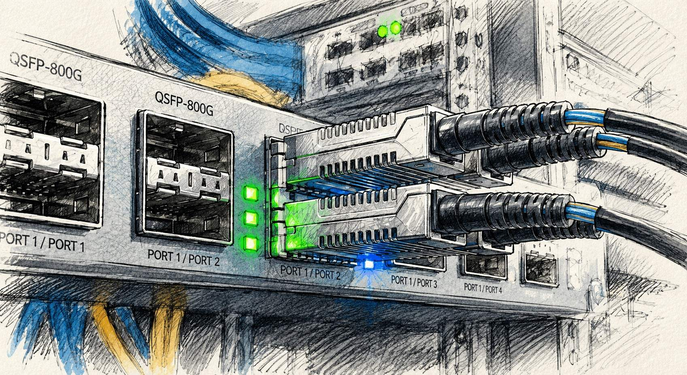

# RDMA 与 InfiniBand 网络详解

如果说过去十年的数据中心属于云计算，那么未来十年的数据中心，很可能属于 AI。

而在 AI 基础设施的讨论中，几乎总会反复出现两个名字：RDMA 与 InfiniBand。

训练大模型需要成千上万块 GPU 协同工作，数据需要以极低的延迟和极高的吞吐在节点之间传输。此时，网络已经不再只是连接服务器的基础设施，而成为决定系统扩展能力和计算效率的关键组成部分。数据搬运的代价，第一次变得与计算本身同样重要。

正是在这样的背景下，RDMA 和 InfiniBand 从高性能计算领域逐渐走向舞台中央，并成为 AI Networking、分布式存储和现代数据中心设计中绕不开的核心技术。

然而，对于大多数网络工程师而言，真正困难的问题并不是记住这些新的名词，而是理解它们为什么会以这样一种方式存在。因为它们所遵循的许多原则，与我们熟悉的 TCP/IP 世界并不属于同一套思维体系。

所以，学习 RDMA 和 InfiniBand，最大的困难从来不是掌握新的命令和新的协议，而是暂时放下旧的假设，并重新建立一套理解高性能网络的心智模型。

---

## 为什么要写这份指南

写这份指南，最初并没有什么宏大的计划。

它的起点，只是我在准备 NCP-AIN（NVIDIA Certified Professional AI Networking）认证时所做的一些零散的笔记和思考。为了真正理解 InfiniBand、RDMA 和 RoCE 这套体系，我不得不把分散在白皮书、技术文档和会议资料中的知识重新整理、反复推敲，并试图把它们纳入一个能够自洽的认知框架之中。

然而，在整理的过程中，我逐渐意识到：自己遇到的困惑，并非个人经验不足所致，而是具有相当的普遍性。

这些年，随着 AI 基础设施和高性能计算的发展，RDMA、InfiniBand、RoCE、QP、RC、LID 等概念已经越来越频繁地出现在技术讨论、架构设计和招聘面试之中。对于许多传统网络工程师而言，这些名词并不陌生，甚至可以逐一定义；但一旦需要把它们组合成一个完整系统，往往又会感到无从下手。

这种困惑并不是因为知识点太多，也不是因为技术本身过于艰深，而是因为它们建立在一套与 TCP/IP 截然不同的设计逻辑之上。

长期以来，我们所接受的网络技术理念，大多建立在以太网和 TCP/IP 的经验之上。我们习惯于按照 OSI 分层模型理解网络，习惯于把通信过程看作封装与解封装的层层递进，也习惯于接受“网络只负责尽力而为，可靠性交给上层协议解决”这样的基本假设。

然而，RDMA 和 InfiniBand 的世界并非构建于这套体系之上。

在这里，网络不再只是一个尽力转发数据的通道，而被赋予了更多确定性的责任；许多在 TCP/IP 世界中依赖软件补偿的能力，被直接下沉到了网络和硬件层面。于是，传统网络工程师第一次接触这些技术时，往往会产生一种强烈的不适感：自己熟悉的许多原则似乎突然失效了，原有的认知框架不断遭遇例外，甚至出现某种“每一步都能理解，但合在一起却完全看不懂”的困境。

这种体验，我并不陌生。

在存储网络（SAN）领域工作的那些年，我曾经多次看到类似的过程。无论是 Fibre Channel，还是后来各种建立在无损/有损网络之上的存储协议，它们大多都遵循着与传统 TCP/IP 网络不同的设计哲学。许多经验丰富的网络工程师，在进入 SAN 领域之后，都会经历一次认知上的重新建构。

因此，我越来越觉得，问题的关键并不在于缺少一份介绍 RDMA 或 InfiniBand 的资料，而在于缺少一个连接两种世界的“中间模型”。

如果没有这样一个模型，那么 Verbs API、QP 状态机、P_Key、LID、Credit、VL 等概念，都只能成为零散的知识点；而一旦建立起这个模型，很多看似复杂甚至反直觉的机制，又会变得顺理成章。

基于这样的考虑，这份指南并不准备从 RDMA API、命令和参数表开始，而是试图按照网络工程师更熟悉的思维路径重新组织这些知识：

- 先回答：为什么会存在这样一套系统；
- 再回答：它在网络上究竟是什么样子；
- 最后回答：InfiniBand 和 RDMA 又是如何工作的。

如果你已经熟悉交换机、路由器、VLAN 和 TCP/IP 协议栈，却依然对下面这些问题感到困惑：

- 为什么 RDMA 能够绕过 CPU；
- 为什么 RoCE 必须依赖无损网络；
- InfiniBand 与以太网究竟有何本质区别；

那么这份指南所希望完成的工作，正是帮助你建立起那块长期缺失的“中间模型”，从而把这些看似彼此孤立的概念重新连接成一个完整的体系。

---

## 序

**[序：AI Networking 的历史轮回](CN/00_preface_AI_Networking.md)**
一篇随笔，借三十年前以太网与 ATM 之争，回望今天 AI 网络在 Scale-up（NVLink / NVSwitch / UALink）与 Scale-out 两条主线上的演进。它不是阅读正文的前置知识，而是为整份文档提供一个时代背景。

---

## 第一部分　原理：RDMA 的来龙去脉

这一部分不碰任何硬件和命令，只讲清楚 RDMA 是什么、为什么需要它、它的世界由哪些概念构成。

**[第 1 章　RDMA 基础理论](CN/01_rdma_basic.md)**
从内核态与用户态的代价讲起，看一个普通 Socket 收发包要经历多少次切换与拷贝，再看 DPDK 如何把内核踢出数据路径、而 RDMA 又如何把 CPU 彻底解放出来。后半章建立起 RDMA 的概念框架：三种传输类型（RC / UC / UD）、编程接口 Verbs，以及 MR、QP、WQE、CQ 这套术语，单边与双边通信的本质区别，和 Send / Write / Read / Atomic 四种基本操作。

**[第 2 章　RDMA 连接管理](CN/02_rdma_cm.md)**
RDMA 通信之前，双方必须先交换 QPN、GID/LID、PSN、内存地址与 rkey 等参数。这一章讲清楚要换哪些信息、为什么换，以及两种主流解法：用 TCP 握手的**带外方式**，和 RDMA 网络自带的**带内方式（RDMA CM）**。

---

## 第二部分　通过 tcpdump 抓包看透 RDMA

这一部分用纯软件搭出可跑 RDMA Verbs 的环境，然后用 `tcpdump` 把报文抓下来，逐个工具、逐种操作地看清 RDMA 在线路上到底长什么样。

**[第 3 章　Soft-RoCE (RXE) 介绍](CN/03_soft-roce.md)**
Soft-RoCE 是纯软件实现的 RoCEv2 协议栈，跑在普通以太网卡上，无需任何 RDMA 硬件。本章介绍它的来历、在协议栈中的位置，以及 Linux 自带的各类 RDMA 测试工具。

**[第 4 章　perftest 工具抓包分析](CN/04_rdma_ib_perftest_pcap.md)**
用 `ib_write_bw` / `ib_read_bw` / `ib_send_bw` 等性能测试工具发起真实流量，抓包观察 RDMA Write、Read、Send 各自的报文形态。

**[第 5 章　pingpong 抓包分析](CN/05_rdma_pingpong_pcap.md)**
`ibv_rc_pingpong` / `ibv_uc_pingpong` / `ibv_ud_pingpong` 是 libibverbs 自带的最小示例。通过对比三者的抓包，直观看出 RC、UC、UD 三种传输类型在连接、可靠性与报文上的差异。

**[第 6 章　RDMA CM 抓包分析](CN/06_rdma_cm.md)**
RDMA Connection Manager 是一个标准化的连接管理库，这一章抓包看 RDMA CM 如何用 CM over UDP（端口 4791）完成握手，建立 RDMA 通信连接。

**[第 7 章　rping 抓包分析](CN/07_rdma_rping.md)**
rping 是 RDMA 世界的 `ping`，专门验证 rdma_cm 连通性，它把连接管理与数据收发串成一次完整、可观测的端到端通信。

---

## 第三部分　InfiniBand：RDMA 的原生网络

RDMA 这套语义最初是为 InfiniBand 设计的，因此 RoCE 是移植，IB 才是原版。看懂原版，才能真正理解 RoCE 那些无损网络调优到底在补什么。

**[第 8 章　InfiniBand 基础理论](CN/08_infiniband_basic.md)**
为什么要专门学一个"更老"、多数人手头没有设备的 IB？因为它从物理层到传输层垂直整合、专为 RDMA 而生。本章讲透 IB 与以太网的根本不同：天生无损 vs 尽力而为、集中管理（子网管理器）vs 分布式自治、链路层 LID 寻址 vs IP 寻址，并扫清一堆 IB 专用名词。

**[第 9 章　InfiniBand 实验环境搭建](CN/09_infiniband_lab.md)**
没有真实 IB 硬件，如何动手？本章用 **ibsim**（fabric 模拟器）+ **OpenSM**（子网管理器），借助 `LD_PRELOAD` 拦截 MAD 调用，搭出一套完整可玩的 IB 实验环境，为后续章节打底。

**[第 10 章　InfiniBand 协议栈](CN/10_infiniband_arch.md)**
逐层走一遍 IB：链路层（LRH、流控、QoS）、网络层（GRH、跨子网路由）、传输层（BTH、QP 语义）各自干什么、往包里加了哪个头、由谁处理。读完再看一个完整 IB 报文，你能指着每个字段说出它的来历。

**[第 11 章　InfiniBand Fabric 初始化](CN/11_infiniband_Fabric_init.md)**
从"插好线"到"能通信"，中间是 OpenSM 在做事。本章借助 ibsim + OpenSM，把上电后一两秒内自动完成的过程慢放下来，看清 SM "发现拓扑 → 编号 → 算路由 → 下发 → 持续监控"的完整循环。

**[第 12 章　InfiniBand Fabric 路由引擎](CN/12_infiniband_Fabric_re.md)**
同一张物理拓扑，喂给不同的路由引擎会算出不同的转发表（LFT）。本章用一个四交换机环形拓扑，对比最基础的 min-hop 与 up-down 两种路由引擎，看清它们的取舍。

**[第 13 章　InfiniBand Fabric 路由引擎（续）](CN/13_infiniband_fabric_re2.md)**
接续上一章，引入 HPC / AI 集群最主流的 Fat-Tree（spine-leaf）拓扑。本章搭一套 spine-leaf 的 ibsim 拓扑，让 OpenSM 分别用 updn 与专为 Fat-Tree 设计的 ftree 路由引擎各跑一遍，对比两者的 LFT，看清 ftree 如何感知层次结构、把流量均匀摊到各 Spine 上。

**[第 14 章　Infiniband Fabric 自适应路由](CN/14_infiniband_fabric_ar.md)**
前面几章的路由表都是子网初始化时由 SM 一次性算好、之后固定不变的；可 AI 训练里的流量（如 AllReduce）天然不均匀，静态路由会让部分 Spine 瞬间成为热点。本章讲自适应路由（AR）：SM 只下发等价路径组（AR Group Table），把"每个包走哪个口"的决策下放给交换机，让它按实时负载动态选路。

**[第 15 章　Infiniband Fabric 的分区（Partition）](CN/15_infiniband_pkey.md)**
同一张物理 fabric 上要跑多个互不信任的租户，就需要隔离。IB 用分区（Partition）解决这个问题，载体是 16 位的 P_Key。本章介绍 P_Key 的结构、Full/Limited 成员隔离规则、默认分区如何保住 SM 的管理通道，并借 ibsim + OpenSM 把分区表的计算与下发观察一遍。

**[第 16 章　Infiniband Fabric 的 QoS](CN/16_infiniband_qos.md)**
隔离解决了"谁能和谁通信"，QoS 要解决的是"通信时谁先走、谁拿多少带宽"。本章介绍 IB QoS 的概念：SL（贴在包上的等级标签）与 VL（拥有独立缓冲和信用的物理队列），以及把它们粘合起来的 SL2VL 映射表和 VLArb 仲裁表。用一个真实需求驱动的 ibsim 实验，看 OpenSM 如何把策略算好、下发，并顺带厘清 VLCap/OperVLs、SL 标记的信任问题。

**[第 17 章　Infiniband Fabric 的拥塞控制（CC）](CN/17_infiniband_cc.md)**
天生无损的 IB 为什么还需要拥塞控制？因为 credit 流控只保证不丢包，却会让拥塞沿背压一跳跳扩散、殃及过路的 victim flow。本章介绍 IB CC 的"检测、通知、反应"三角闭环以及CCM（Congestion Control Manager）。受限于硬件资源，本章以概念介绍为主。

**[第 18 章　Infiniband Fabric 的在网计算（SHARP）](CN/18_infiniband_sharp.md)**
前面各章里，网络的职责始终是"把数据搬到位"。SHARP 跳出了这个前提：它把 AI 训练里最沉重的 AllReduce 操作，从 GPU 卸载到交换机硬件中完成。本章介绍在网计算的思路、聚合树的工作机制、AM/sharpd/AN 等组件分工。受限于硬件资源，本章以概念介绍为主。

---

## 参考来源

本文档的技术内容基于以下公开标准、文档与工具的官方资料整理而成。具体引用与扩展阅读：

**规范与标准**

- [InfiniBand Architecture Specification（IBTA）](https://www.infinibandta.org/)

**官方文档与手册**

- [RDMA Aware Networks Programming User Manual](https://networking-docs.nvidia.com/rdmaawareprogramming/)
- [Linux RDMA](https://github.com/linux-rdma)
- [OpenSM manpages](https://manpages.debian.org/testing/opensm/opensm.8.en.html)
- [OpenFabrics](https://www.openfabrics.org/images/eventpresos/workshops2013/IBUG/2013_UserDay_Fri_1200_SM-SA_Functionality.pdf)
- [Nvidia WP](https://network.nvidia.com/pdf/whitepapers/deploying_qos_wp_10_19_2005.pdf)

**其他参考**

- [刘伟《Linux 高性能网络详解——从 DPDK、RDMA 到 XDP》](https://www.epubit.com/bookDetails?id=UBd16b63c7abb7)

---

## 勘误与指正

本文档基于互联网上的公开资料整理而成。受限于个人的技术水平与硬件测试资源，文中难免存在疏漏或错误，欢迎读者通过 Issue 或邮件指正。

---

## 许可协议

本文档采用 [CC BY-SA 4.0](https://creativecommons.org/licenses/by-sa/4.0/deed.zh) 授权，完整条款见 [LICENSE](./LICENSE) 。

Author: Linlin Wang

Contact: wanglinlin.cn@gmail.com
